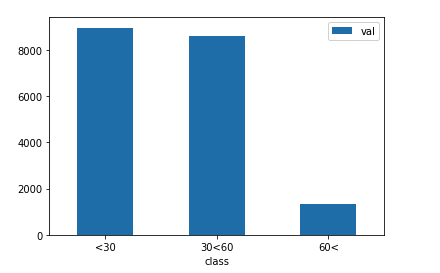

# Day 1 - EDA

## 오늘의 목표

* 각 class 별로 data 분포 살펴보기
* 각 class 별로 학습 data 나누어보기 (k-fold를 위함)
* 이번 과제는 마스크 착용 여부, 나이, 성별을 한번에 inference 해야 함
* 이 세가지를 한번에 하지 않고 따로 따로 수행한 뒤 결과를 합치는 방식으로 하면 accuracy가 더 잘 나올 수 있을 것이라 생각함
* 이를 위해 data를 성별, 마스크 착용 여부, 나이로 나누어 놓자

## 오늘 해본 것

* pandas profiling을 사용하여 데이터를 시각화 해봄
  * 사용하기 쉽고, 보기 좋게 잘 정리해 주지만 나에게 필요한 정보는 별로 나오지 않음
* 각 class 별로 data를 나누어 분포를 살펴봄 (pandas 이용)

  

  총 18개의 class 중 1, 2, 4, 5 class에 data가 집중되어 있는 것을 확인함
* data를 성별을 기준으로 나누어 봄

  

* data를 나이를 기준으로 나누어 봄

  

* data를 마스크 착용 여부를 기준으로 나누어 봄

  

## 앞으로 할일

* 나누어둔 data로 3개의 model을 학습시켜보자