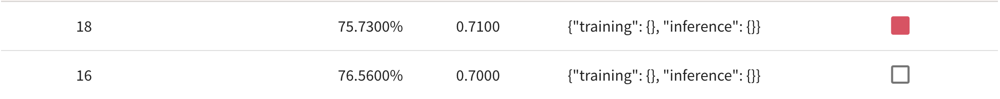

# Day 4 - Training & inference

## 오늘의 목표

* accuracy 높이기
* augmentation 제대로 적용해보기

## 오늘 해본 것

* 일단 center crop만 적용시켜 보았다
  * ```transforms.CenterCrop(300)``` 적용하여 10 epoch을 돌려보았다
  * accuracy와 f1 score 모두 올랐다. accuracy 최댓값은 76%, f1 score 최댓값은 0.71
* 어제 augmentation 했을 때 accuracy가 매우 낮았던 원인을 찾아보기 위해 augmentation된 image들을 화면에 출력하여 눈으로 확인해봤다
  * affine을 적용했을 떄 사진이 일그러지는 것을 확인했다. 이런 사진을 train에 사용하는 것은 별로 좋지 않을 것 같아 affine은 사용하지 않기로 했다
  * rotation은 -10 ~ 10도 사이의 값을 랜덤으로 적용하고 있었는데, 10도 rotation도 좀 큰것 같아서 -5 ~ 5도 사이로 조절했다.
  * CenterCrop(300)으로 하면 몇몇 사진에서는 머리카락 부분이나 턱 부분이 잘려나간 것을 확인했다. CenterCrop(350)으로 범위를 좀 키웠다.
  * 사실 그다지 큰 문제는 확인하지 못했다. 잘 안되는 다른 이유가 있을 듯 하다
* center crop만 사용했을 때는 결과가 좋았으니 다시 resize(256, 256), normalize, random rotation, random horizontal flip을 모두 사용해 보았다
  * 하지만 이번에도 결과는 매우 좋지 않았다 accuracy 8%가 나왔다.
* 어떤게 문제인지 확인하기 위해 horizontal flip과 center crop만 사용해봤는데, 이번에도 결과는 좋지 않았다 accuracy 4%가 나왔다
* augmentation을 사용하는 과정에서 무언가 문제가 있는것은 분명하다. 이걸 해결하는게 우선적으로 해야 할 일인 듯 하다



## 앞으로 할일

* augmentation 왜 안되는지 확인하고 수정하기
* task 3개로 나눠서 학습해보기
* 나만의 baseline code 만들기
