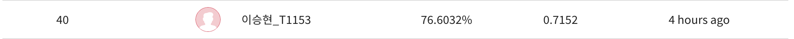

# Day 5 - More...

## 오늘의 목표

(어제랑 동일)

* accuracy 높이기
* augmentation 제대로 적용해보기

## 오늘 해본 것

* 이번 주 피어세션에서 꾸준히 들었던 이야기인데 task 3개로 나누어 학습을 하는 것이 그닥 효과가 좋지 않다고 한다. 일단 모델 3개로 나누어 학습하려던 것은 보류
* augmentation에서 문제가 있던 부분을 찾았다. 그동안 affine, rotation 등을 하기 전에 먼저 normalize를 했는데 이게 문제였다. affine, rotation 등의 augmentation을 한 이후에 normalize를 해야 결과가 정상적으로 나온다(+ ToPILImage() 호출을 안해도 됨). 수정 후 결과가 잘 나오는 것까지 확인함.
* 위의 방법으로 수정해서 augmentation을 적용하고 optimizer를 AdamW로 바꾸어 학습했는데 어제보다 accuracy가 3% 정도 떨어지는 결과가 나왔다 (73% 정도)
* optimizer만 다시 Adam으로 바꾸었더니 어제보다 아주 근소하게 accuracy가 증가했다. 이게 오늘 최고 점수
* 피어세션과 오피스아워에서 AdamW를 써보라는 이야기를 듣고 적용해보았지만, 나는 효과를 보지 못했음

## 앞으로 할일

* label smoothing, focal loss 등 적용해보기
* 더 다양한 augmentation 적용해보기
* k-fold 이용해 학습할 수 있도록 data set, data loader 구성
* k-fold의 결과(k개)를 앙상블하여 결과 확인해보기
* 그동안 소홀히 했던 daily mission을 제대로 해보자
* 오늘 공개된 code 분석하고, 나만의 baseline code 만들기
