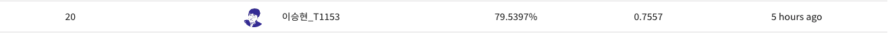

# Day 7

## 오늘의 목표

* accuracy 높이기
* k-fold data set 구성, 학습

## 오늘 해본 것

* 지난 금요일 제공된 base line code를 이용해 학습해 보려고 시도
  * data를 5개의 fold로 나누어 각각 학습하고, 5개의 결과를 앙상블 하는 code를 base line code를 이용하여 작성해봄
  * 각 fold에 대한 dataset과 dataLoader, 그리고 model을 각각 5개씩 생성하는 데 까지만 code를 작성함
* 위의 code를 작성하는 동안 지난 3일 (주말 + 월요일)간 submit을 못했던게 마음에 걸려 새로운 code를 작성하는건 일단 중단하고, 다시 기존에 사용하던 code를 이용해 학습 시킨 뒤 제출해보기로 마음먹었음.
* 오늘 피어세션에서 data를 전처리하는 새로운 방법을 듣게 되어 이 방법을 시도해 보기로 함
  * 지금 문제가 되는 것은 age를 예측하는 부분임 (60세 이상인 data가 매우 적고, 최대 나이 역시 60세이기 때문에 60세 이상인 data를 판별해 내는 것이 매우 어려움)
  * 이 문제를 해결하기 위해 57~59세 정도의 data들의 age를 60으로 취급함
  * 또 54~56세 data는 애매하기 떄문에 아예 제거해버림
* 위의 방법대로 54~56세 data는 제거하고, 57~59세 data의 label을 모두 60세로 바꾼 뒤 학습 진행
* 하지만 이렇게 했을 때의 accuracy는 70% 정도로 별로 좋지 않은 결과가 나옴
* 이렇게 된 이유를 data를 제거해버렸기 때문이라고 추측했음. data는 늘리면 늘렸지, 줄이면 안된다고 생각함.
  * 특히 task를 3가지(마스크 착용, 성별, 나이)로 나누어 해결하는 경우에는 나이에 대해 학습할 떄에만 data를 제거하면 data 부족에 대한 문제가 적을 수 있으나, 지금 내가 하는 18개의 class로 구분하는 방식에서는 data가 줄어든 것이 마스크 착용, 성별 구분에도 영향을 끼치게 되기 때문에 더욱이 문제가 될 것이라 판단함.
* 이런 생각을 바탕으로 58세 이상인 경우 label을 60세로 바꾸고, 데이터 제거는 하지 않고 학습을 진행함. learning rate도 줄이면 성능이 좋아진다는 얘기를 들어 ```lr = 1e-4```로 설정
  * 이렇게 학습을 진행했더니 5 epoch에서 갑자기 accuracy 79%, f1 score 0.75가 나옴
  * 10 epoch, 15 epoch, 20 epoch에서는 5 epoch에서보단 낮았지만 대부분 accuracy 78%의 결과가 나왔음
* 운이 좋게도 갑자기 점수가 확 뛰어 올랐다. 앞으로는 이 상태에서 loss나 augmentation 등을 바꿔가며 대회를 마무리 하려고 한다.
* 가장 좋은 조합들을 찾은 뒤에는 model을 랜덤하게 초기화 해 가며 여러번 학습을 진행하고, 학습 중 나온 여러개의 결과 중 가장 좋은 것을 제출하는 것이 좋을 것이라고 생각함



## 앞으로 할일

* 다른 loss function, augmentation 적용해보기
* 여러번 학습 진행하며 가장 좋은 결과 제출하고 대회 마무리