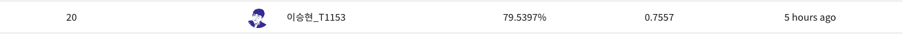

# Day 8 - 여러가지 시도

## 오늘의 목표

* accuracy 높이기

## 오늘 해본 것

* 어제보다 좋은 결과 (accuracy 79% 이상)를 내기 위해 여러가지를 시도
  * focal loss 사용 - cross entropy와 별 차이 없었음
  * AdamP 사용 - Adam과 별 차이 없었음
  * SGD 사용 - 매우 별로였음. 성능 매우 하락함 (accuracy 70%) 확실히 Adam보다 수렴이 안됨. 이게 generalization 측면에서 좋을 수도 있지만, 내 경우에는 아니었음.
  * Data Augmentation 하지 않기 - 성능 하락
  * epoch 수 늘리기 - SGD, Adam으로 20 epoch가지 돌려봤지만 효과는 별로였다. overfitting이 일어난 것일까? 5 epoch 정도에서 가장 성능이 좋은 듯
* 오늘 여러가지 조합들을 시도해 봤지만, 어제의 accuracy를 뛰어넘지는 못했음. 어제는 아주 운이 좋았던 것 같다.
* 그래도 accuracy 78% 정도는 유지하는 것을 보아 age filtering의 효과는 확실한 것 같음.

  
어제 그대로

## 앞으로 할일

* accuracy 높이기
