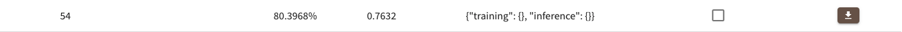
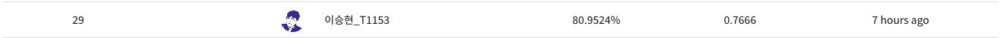

# Day 9 - 대회 마지막 날, 앙상블

## 오늘의 목표

* accuracy, f1 score 높이기

## 오늘 해본 것

* 대회 플랫폼 aistages의 리더보드에 이전 제출물을 다운로드 받을 수 있는 버튼이 생긴 것을 발견
* 적당해 보이는 결과물 5개의 csv 파일을 다운받아, hard voting 방식으로 앙상블함
  * 그 결과 accuracy 80% 돌파, f1 score는 0.7634

  

* 앙상블의 효과가 매우 좋다는 것을 발견하고, 다양한 앙상블 방법을 시도
  * 기존에 나는 efficient net b4만 계속해서 사용했기 떄문에 이 model의 output만 갖고있었음
  * ResNet을 이용하여 학습을 하고, 그 중 괜찮은 결과물을 앙상블에 포함시키기로 함
  * wide ResNet 50과 ResNet 152를 학습시킨 뒤 그 결과물을 efficient net 결과물 3개와 합쳐 앙상블함  
  (AdamP, focal loss, lr = 1e-4, epoch=4~5, centerCrop(350), Horizontal flip 50% 확률로 적용, randomRotation(-5, 5) 30% 확률로 적용, normalization)
* 이렇게 해서 최종 결과물이 나왔음. accuracy 80.9524%, f1 score 0.7666
  * 아쉽게도 오늘 제출 횟수를 다 써버려 난 여기에서 competition을 끝냈음
  * 이후 대회 마감까지 2시간동안 순위가 밀려 최종 public leader board의 등수는 29/224등

  

## 이번 대회에서 느낀 점

* 대회를 마치고 U stage 25조 피어분들과 이야기를 해보니 앙상블 할 때 더 많은 결과물을 합쳐서 앙상블 할 수록 성능이 좋아졌다고 함. 난 적당히 5개만 골라 앙상블 할 생각밖에 못했는데, 그냥 다 쑤셔 넣어버렸으면 어떘을지 아쉬움이 남는다.
* 내가 앙상블이 효과가 아주 좋다는 것을 발견하고 바로 피어분들에게 알려드렸었는데, 도움을 받았다는 분들이 있어 뿌듯헀다.
* 처음 참가해본 대회에서 220여명의 참가자 중에 29등의(아직 정식 등수는 아니지만... private leader board는 내일 오전 10시에 공개된다고 한다) 나쁘지 성적을 받았다는 것에 만족한다
* 다만 처음에 대충 작성헀던 notebook을 대회 끝까지 이용했다는 점은 좀 아쉽다. 멋있는 baseline code를 작성해봤다면 더 좋은 경험이 됐을텐데... (그래도 대회에선 일단 빠르게 train, inference가 가능한 pipeline을 갖춰놓고 여러가지 실험을 하는 것이 천천히 코드를 작성하는 것보다 더 좋은 방법이라고 생각한다)
* 처음에 생각했던 3가지 task로 나누어 학습, inference를 하는 것을 해보지 못해 아쉽다.
* train을 하는 중간 중간 model을 저장해 뒀으면 마지막에 soft voting ensemble을 해볼 수 있었을 텐데, 나는 model은 따로 저장해두지 않아 이를 못해봤다. 다음 competition에선 반드시 model을 저장해 두자.
* 성적이 좋은 캠퍼분들은 다들 여러가지 실험을 체계적이고 논리적으로 진행하는 것 처럼 보였다. 난 그냥 마음이 내키는 방향으로 대충 hyper parameter를 바꿔보는 식으로만 했던 것 같다. 이런 부분을 보완해서 더 체계적으로 실험하고, 결과를 비교하는 것이 좋을 것이다.

## 앞으로 할일

* wrap up report 작성
* 나만의 baseline code 작성
