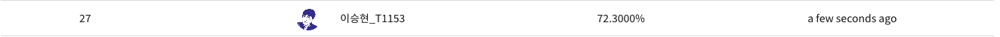

# Day 55 - pre-trained model 사용

## 오늘 해본 것

* pre-trained KoBERT model을 사용하니 Accuracy가 72.3%가 됐다
* random seed를 고정하고 hyper parameter를 이것 저것 바꿔봤다
* 일단 찾아낸 최적의 hyper parameter는 다음과 같다
  * batch size = 32
  * num_train_epochs = 10 (epoch 8 ~ 9 즈음부터 overfitting이 일어나는 것 같다)
  * learning rate = 5e-5
  * warmup_steps=1000 (lr을 조금씩 증가시켜 1000번째 step에서 lr = 5e-5가 되도록 한다)
  * weight_decay=0.01 (lr을 이 값을 이용해 감소시킨다)
* k-fold에 사용할 dataset을 구축했다
  * 9000개의 train data를 6개의 fold로 나누었다 (7500:1500)

  

## 앞으로 할 일

* k-fold dataset 사용해 학습, 각각의 결과를 앙상블 하는 code 작성하기
* 여러 model로 학습해 앙상블 하기 위한 data 확보