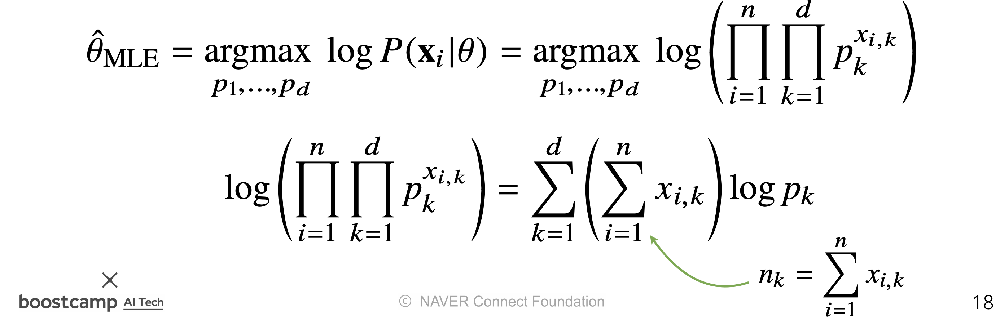

# Day 10 - 시각화 / 통계학

## 시각화

* python의 데이터 시각화 도구 matplotlib와 seaborn 사용법을 배움
* 자세한 학습정리는 [여기](./Graph/Graph.md)

## 통계학

* 통계적 모델링은 적절한 가정 위에서 확률분포를 추정하는 것이 목표이다
* 하지만 일부의 데이터를 관찰해서 모집단의 분포를 정확히 알아내는 것은 불가능함
* 그래서 모집단의 특징을 파악하는데 포본 평균, 표본 분산등을 이용함
* 표본의 결과를 이용하는 방법은 근사적으로 확률분포를 추정하는 수밖에 없다
* 여기에는 두가지 방법론이 있음
  * 모수적(parametric) 방법론은 데이터가 특정 확률분포를 따른다고 선험적으로 가정한 후 그 분포를 결정하는 모수(parameter)를 추정
  * 비모수(nonparametric) 방법론은 특정 확률분포를 가정하지 않고 데이터에 따라 모델의 구조 및 모수의 개수가 유연하게 바뀜
    * 기계학습의 많은 방법론은 이 비모수 방법론에 속함

* 히스토그램을 통해 모양을 관찰한 뒤 확률분포를 가정함. 이때 데이터를 생성하는 원리를 고려해야 함
  * 데이터가 2개의 값(0 or 1)만 가지는 경우 -> 베르누이 분포
  * 데이터가 n개의 이산적인 값을 가지는 경우 -> 카테고리 분포
  * 데이터가 [0, 1] 사이에서 값을 가지는 경우 -> 베타 분포
  * 데이터가 0 이상의 값을 가지는 경우 -> 감마 분포, 로그 정규 분포 등
  * 데이터가 R 전체에서 값을 가지는 경우 -> 정규분포, 라플라스 분포 등

* 통계량의 확률분포를 표집분포라고 한다. 표본 평균의 표집분포(sampling distribution)는 N이 커질수록 정규분포를 따르게 된다
  * 이를 중심 극한 정리라고 부른다.
  * 모집단의 분포가 정규분포를 따르지 않아도 성립한다.
  * 표집분포와 표본분포는 다르다. 표집분포는 표본의 통계량 (표본 평균, 표본 분산)의 확률분포임

* 가장 가능성이 높은 모수를 추정하는 방법 중 하나는 최대가능도 추정법(MLE, maximum, likelihood estimation) 이다
  
* 가능도를 스케일해도 결과는 동일하기 때문에 로그 가능도를 최적화한다
  * 로그 가능도를 사용할 경우 곱셈 연산이 덧셈 연산으로 바뀌기 때문에 계산 복잡도가 줄어든다
* 최대 로그 가능도를 추정하는 것은 크로스 엔트로피(두 분포의 차이)를 최소화하는 것과 동치이다
  

* 정규분포의 최대 가능도 추정 방법
  
  두 미분이 모두 0이 되는 $\mu, \sigma$를 찾으면 가능도를 최대화하게 됨  
  

* 카테고리 분포의 최대 가능도 추정 방법
  
  
  

* 딥러닝에서 최대 가능도 추정 방법
  

* 기계학습에서 사용되는 손실함수들은 모델이 학습하는 확률분포와, 데이터에서관찰되는 확률분포의 거리를 통해 유도됨
* 두 확률분포 사이의 거리는 다음과 같은 함수들을 이용함
  * 총 변동 거리
  * 쿨백-라이블러 발산
  * 바슈타인 거리

* 최대 가능도 추정법은 쿨백-라이블러 발산을 최소화 하는 것과 같음

다음은 cross entropy에 대해 정말 잘 정리된 글이다. 참고해보자
https://hyunw.kim/blog/2017/10/14/Entropy.html  
https://hyunw.kim/blog/2017/10/26/Cross_Entropy.html  
https://hyunw.kim/blog/2017/10/27/KL_divergence.html  