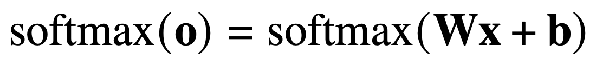
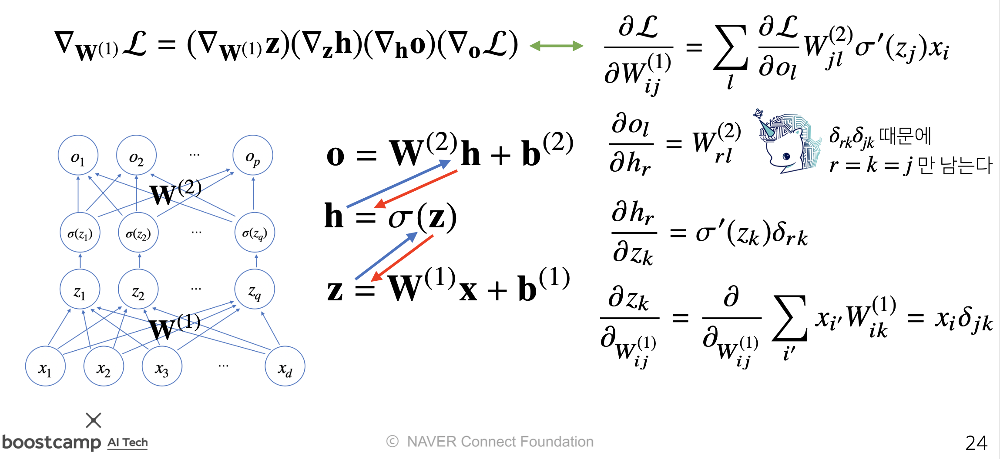

# Day 8 - Pandas / 딥러닝 학습방법 이해하기

- [Day 8 - Pandas / 딥러닝 학습방법 이해하기](#day-8---pandas--딥러닝-학습방법-이해하기)
  - [Pandas](#pandas)
    - [Series](#series)
    - [DataFrame](#dataframe)
  - [딥러닝 학습방법 이해하기](#딥러닝-학습방법-이해하기)
    - [선형모델](#선형모델)
    - [소프트맥스 (softmax)](#소프트맥스-softmax)
    - [신경망](#신경망)
      - [딥러닝](#딥러닝)
      - [왜 층을 여러개로 쌓는가?](#왜-층을-여러개로-쌓는가)
      - [순전파 (forward propagation)](#순전파-forward-propagation)
      - [역전파 (backpropagation)](#역전파-backpropagation)
  - [딥러닝 학습방법 이해하기 Quiz](#딥러닝-학습방법-이해하기-quiz)

## Pandas

* Pandas에 대한 자세한 학습정리는 [여기](./Pandas/Pandas.md)를 참고

* 구조화된 데이터의 처리를 지원하는 Python 라이브러리
* numpy와 통합하여 강력한 스프레드시트 처리 기능을 제공
* 인덱싱, 연산용 함수, 전처리 함수 등을 제공함
* 데이터 처리 및 통계 분석을 위해 사용
* 테이블형 데이터를 다루는데 적함함

### Series

* DataFrame 중 하나의 Column에 해당하는 데이터의 모음 Object (column vector를 표현하는 object)
* ndarray에 데이터를 저장함
* 문자열을 index로 사용할 수 있음

### DataFrame

* Data Table 전체를 포함하는 Object
* pandas의 ```read_csv()``` 함수는 기존의 데이터를 불러와서 DataFrame을 생성함
* row index와 column index를 이용하여 데이터에 접근할 수 있음
* column을 새로 추가하거나, 기존의 column을 삭제할 수 있음
* 인덱스 이용하여 column 선택 시 series를 환함
* 여러 column 선택하려면 선택할 column의 인덱스를 담은 배열을 인덱스로 사용해야 함
* ndarray와 마찬가지로 boolean index 사용 가능

Pandas의 특징, 기능들은 대충 익혀두고 상세한 사용법은 필요할때 찾아보도록 하자

## 딥러닝 학습방법 이해하기

### 선형모델

* 선형모델은 다음과 같이 생겼다

    

* 위 수식을 그림으로 그려보면 다음과 같다

    

* 위 그림을 보면 d개의 변수들 $(x_1, x_2, x_3, ..., x_d)$이 p개의 잠재변수$(o_1, o_2, o_3, ..., o_p)$로 바뀌게 된다
* 이렇게 변환되는 데 변수$(x_i)$ 하나당 p개씩 총 $d \times p$ 개의 화살표가 필요하다
* 위 수식의 가중치 행렬 W의 성분이 이 화살표를 의미한다
* 그렇기 때문에 수식의 가중치 행렬 W의 성분의 개수와 그림의 화살표의 개수가 같다

### 소프트맥스 (softmax)

* 소프트맥스 함수의 수식은 다음과 같다
    

* 소프트맥스 함수는 모델의 출력을 확률로 해석할 수 있게 변환해주는 연산이다
    
* 출력벡터 o에 softmax 함수를 합성하면 확률벡터가 된다
* 분류문제에서 이 확률벡터를 사용해 특정 클래스 k에 속할 확률을 구할 수 있다
* 소프트맥스 함수는 학습할 때 사용한다. 추론할 때에는 원-핫 벡터로 최대값을 가진 주소만 1로 출력하는 연산을 사용한다

### 신경망

* **신경망은 선형모델과 활성함수(activation function)를 합성한 함수이다**
  * 모든 값을 고려하여 결과를 도출하는 소프트맥수 함수와는 달리 활성함수는 일부 데이터만 고려한다
  * 따라서 활성함수는 벡터를 input으로 받지 않고 실수값을 input으로 받는다
* 활성함수를 이용해 선형모델로 나온 출력물을 비선형모델로 변환한다
* **활성함수를 사용하지 않으면 딥러닝은 선형모델과 차이가 없다** 
  * 활성함수를 사용하지 않으면 그저 행렬곱을 여러번 한것에 불과함. 단순 행렬곱의 반복은 선형모델과 다를게 없음
* 선형모델의 결과로 나온 벡터의 각 요소에 활성함수를 적용하여 만든 새로운 벡터를 잠재벡터라고 한다
    
* 전통적으로 딥러닝에서 sigmoid 함수나 tanh 함수를 활성함수로 많이 사용하였다
* 하지만 요즘에는 ReLU 함수를 많이 쓰고있다

#### 딥러닝

* 다층 신경망(MLP)이 딥러닝의 기본적인 모델이다
    

* 위의 그림을 보면 선형모델과 활성함수가 반복돼서 사용되고 있다
* 이 그래프는 두 가중치 $(W^{(1)}, W^{(2)})$를 parameter로 가진 2층 신경망이다
* 이러한 다층(multi-layer) 퍼셉트론(MLP)은 신경망이 여러층 합성된 함수이다
* MLP의 parameter는 L개의 가중치 행렬 $W^{(L)}, ..., W^{(2)}, W^{(1)}$과 $b^{(L)}, ..., b^{(2)}, b^{(1)}$로 이루어져 있다

#### 왜 층을 여러개로 쌓는가?

* 이론적으로는 2층 신경망으로도 어떠한 연속함수든지 근사(approximate)할 수 있다
* 하지만 층이 깊어질수록 목적함수를 근사하는데 필요한 뉴런의 숫자가 훨씬 빨리 줄어들어 더 효율적으로 학습이 가능하다
* 더 효율적으로 학습이 가능해지지만 최적화는 더 어려워진다
  
#### 순전파 (forward propagation)

* 순차적으로 신경망 계산을 해 나가는 것을 순전파 (forward propagation)이라고 부른다
  
    

  위 사진은 아래에서부터 위쪽으로 순차적으로 신경망 계산을 해 나가는 수식이다

#### 역전파 (backpropagation)

* 딥러닝은 역전파(backpropagation) 알고리즘 이용하여 각 층에 사용된 parameter를 학습한다
* 각 층 parameter의 gradient 벡터는 윗층부터 역순으로 계산한다
* 이 때 합성함수 미분법인 연쇄법칙(chain rule) 기반 자동미분을 사용한다
* 이렇게 미분하는 과정에 전 단계의 미분값이 필요(연쇄법칙)하므로 윗층에서 아래층으로 gradient 벡터를 전달해야 한다
* 이 과정에서 많은 양의 메모리를 사용하게 된다
* 활성함수로 sigmoid나 tanh 함수를 사용했을 경우 역전파 과정에서 gradient 값이 매우 작아져 layer를 깊게 쌓을 수 없다
* 이러한 문제를 gradient vanishing problem이라고 한다

    

## 딥러닝 학습방법 이해하기 Quiz

1. ReLU(x) = max(0, x) 일 때, ReLU(-3.14)의 값 구하기
   * $0 > -3.14$이므로 정답은 0
2. $tanh'(0)$ 값 구하기 - 틀림
   * 미분을 잘못해서 틀렸다. tanh 함수의 미분은 [여기](http://taewan.kim/post/tanh_diff/)를 참고하자
3. 역전파 알고리즘의 기반이 되는 것은?
   * 연쇄법칙
4. 신경망에서 활성함수가 필요한 가장 적절한 이유?
   * 수업에서 활성함수를 이용하여 비선형모델로 변환한다고 배웠다
5. 합성함수 미분 문제
   * 수업에 나왔던 연쇄법칙 이용해 풀었다