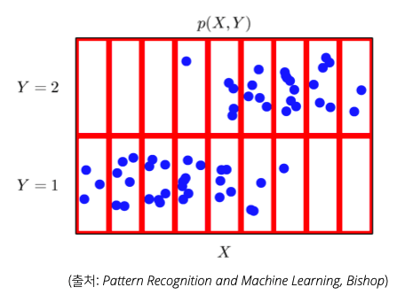
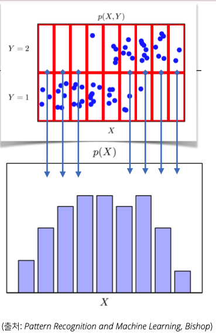
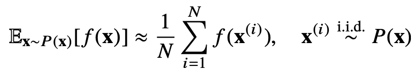

# Day9 - Day 9 - Pandas II / 확률론

## Pandas II

* Pandas에 대한 자세한 학습정리는 [여기](./Pandas/Pandas.md)를 참고
  
### Groupby

* SQL의 GROUP BY와 비슷함
* split -> apply -> combine 과정을 거쳐 연산함
* 한 개 이상의 column을 묶을 수 있음
  * 두 개 이상 묶는 경우에는 인덱스를 배열에 넣어서 groupby()에 전달
  * 두 개 이상 묶는 경우에는 여러 단계의 index가 생김

### Merge & Concat

#### merge()

* SQL의 JOIN과 비슷함
* 합칠 때 기준이 될 column을 설정할 수 있음
* inner join, left join, right join, full join을 지원함
* outer join을 했을 때 데이터가 없는 곳은 NaN으로 채워짐

#### concat()

* 같은 형태의 데이터를 붙이는 연산

### Persistence

* 다양한 형태의 데이터 I/O 기능 제공
* Database connection
* xls
* pickle

## 확률론

* 기계학습에서 사용되는 loss function들의 작동 원리는 데이터 공간을 통계적으로 해석해서 유도하게 된다.
* 예측이 틀릴 위험(risk)을 최소화하도록 데이터를 학습하는 것이 통계적 기계학습의 기본 원리이다
* 회귀분석에서 손실함수로 사용되는 $L_2$ norm은 예측오차의 분산을 가장 최소화 하는 방향으로 학습하도록 유도한다
* 분류문제에서 사용되는 cross-entropy는 모델 예측의 불확실성을 최소화 하는 방향으로 학습하도록 유도한다

### 확률분포

* 데이터공간을 $x \times y$라 표기한다
* $D$는 데이터 공간에서 데이터를 추출하는 분포이다
  * 확률 분포는 확률 변수가 특정한 값을 가질 확률을 나타내는 함수이다
  * 확률 분포는 크게 이산 확률 분포와 연속 확률 분포 중 하나에 속한다. 하지만 둘 중 어디에도 속하지 않는 경우도 존재함  
  * 아래는 이산 확률 분포의 예 (출처 : wikipedia)  
  
  * 아래는 연속 확률 분포의 예 (출처 : wikipedia)  
  

### 이산확률변수와 연속확률변수

* 확률 변수는 확률분포 $D$에 따라 이산형(discrete)과 연속형(continuos) 확률 변수로 구분한다
  * 확률 변수의 종류는 데이터 공간 $x \times y$에 의해 결정되는 것이 아니다  
  ex) 실수 데이터 공간에서 0.5와 -0.5 중 하나를 골라야 하는 경우 - 이 경우 실수 데이터 공간인 것을 보고 연속 확률 변수일 것이라 생각할 수 있지만 이산 확률 변수임

* 이산형 확률 변수는 확률변수가 가질 수 있는 경우의 수를 모두 고려햐여 확률을 더해서 모델링한다
  
* 연속형 확률 변수는 데이터 공간에 정의된 확률변수의 밀도 위에서의 적분을 통해 모델링한다
  

### 여러가지 확률 분포

#### 결합 분포

* 결합분포 $P(x, y)$는 $D$를 모델링한다
  * 결합 분포란 확률 변수가 여러 개일 때 이들을 함께 고려하는 확률 분포를 말한다 (출처 : wikipedia)
* 결합 분포의 종류는 확률 변수들의 종류와는 상관 없이 모델링 할 수 있다
  * 연속 확률 변수를 이산형 결합 분포로 모델링 할 수 있다. 반대의 경우도 가능하다
* 아래의 그림과 같이 연속형으로 생긴 확률 분포를 빨간색 칸으로 나누어 이산확률 분포처럼 생각할 수 있다
  

#### 주변 확률 분포

* 주변 확률 분포 $P(x)$는 결합분포 $P(x, y)$에서 유도할 수 있다
  * 결합분포를 y에 대해서 더하거나 적분해서 유도한다
  * 반대로 x에 대해 더하거나 적분하면 y에 대한 주변 확률 분포를 얻을 수 있다
* $P(x)$는 입력 x에 대한 주변확률분포로 y에 대한 정보를 주진 않는다
* $P(x)$의 그래프를 보면 y에 따른 구분은 없고 y = 1과 y = 2가 합쳐져있다  
  

#### 조건부 확률 분포

* 조건부 확률 분포 $P(x|y)$는 데이터 공간에서 입력 $x$와 출력 $y$ 사이의 관계를 모델링한다
  * 조건부 확률 분포는 특정 클래스가 주어진 조건에서 데이터의 확률 분포를 보여준다
  * $P(x|y)$는 y가 주어진 상황에서 x의 확률 분포를 보여준다  
  
  

* **이렇게 다양한 확률 분포를 이용하여 우리가 원하는 관점에 따라 데이터의 초상화를 그릴 수 있다**

### 조건부 확률과 기계학습

* 기계학습에서 조건부 확률 $P(y|x)$는 입력 변수 x에 대해 정답이 y일 확률을 의미한다
  * 연속 확률 분포일 경우 확률이 아니라 밀도로 해석한다
* 로지스틱 회귀(logistic regression)에서 사용했던 선형모델과 소프트맥스 함수의 결합은 데이터에서 추출된 패턴을 기반으로 확률을 해석하는데 사용된다
* 분류문제에서 $softmax(Wφ + b)$는 데이터 $x$로부터 추출된 특징패턴 $φ(x)$와 가중치행렬 $W$를 통해 조건부확률 $P(y|x)$를 계산한다
* 회귀문제에선 조건부 기대값 E[y|x]를 추정한다
  * 분류문제와 달리 회귀분제는 보통 연속 확률 변수를 다룬다
  * 조건부 기대값은 l2 norm $E|y - f(x)|_2$을 최소화하는 함수 $f(x)$와 일치한다
* 딥러닝은 다층신경망을 사용하여 데이터로부터 특징패턴 φ을 추출한다
  * 특징패턴을 학습하기 위해 어떤 손실함수를 사용할지는 기계학습 문제와 모델에 의해 결정됨

* 확률 분포가 주어지면 데이터를 분석하는 데 사용한 여러 종류의 통계적 범함수를 계산할 수 있다
* 기대값은 데이터를 대표하는 통계량 이면서 동시에 다른 통계적 범함수를 계산하는데 사용된다
  * 기대값을 이용해 분산, 첨도, 공분산 등 여러 통계량을 계산할 수 있다  
  
  
  

### 몬테카를로 샘플링

* 하지만 기계학습의 많은 문제들은 확률 분포를 명시적으로 모를 때가 대부분이다
* 확률 분포를 모를 떄 기대값을 알아내기 위해서는 주어진 데이터를 이용햐여 몬테카를로 샘플링 방법을 사용한다
* 몬테카를로는 이산형이든 연속형이든 상관없이 성립한다
  

* 몬테카를로 방법으로 적분 계산하기

## 확률론 맛보기 Quiz

1. 이산형 확률 변수는 확률변수가 가질 수 있는 경우의 수를 모두 고려하여 확률을 더해서 모델링한다
   * 이산 확률 변수의 수식을 보면 모든 확률을 더해서 값을 구한다
2. 연속 확률 변수의 한 지점에서의 밀도는 그 자체로 확률값을 가진다
   * 밀도를 확률로 해석하면 안된다
3. 몬테카를로 샘플링 방법은 변수 유형에 상관없이 사용할 수 있다
   * 변수 유형에 상관없이 사용할 수 있다
4. 주사위 기대값 구하기
   * 이산확률변수 기대값 구하는 수식 이용해 풀었다
5. 정사면체 주사위 분산 구하기
   * 이산확률변수 분산 구하는 수식 이용해 풀었다
