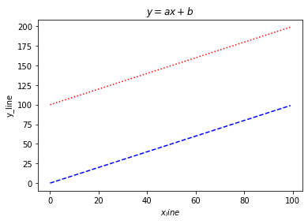

# Graph

## matplotlib

* 파이썬의 대표적인 시각화 도구
* 다양한 종류의 graph를 지원함
* pandas와 연동
* pyplot 이라는 객체를 사용하여 데이터를 표시함
* pyplot 객체에 그래프를 쌓은 뒤 flush하여 화면에 표시함


```python
import matplotlib.pyplot as plt

X = range(100)
Y = range(100)
plt.plot(X, Y)
plt.show()
```


    

    


```python
import numpy as np

X_1 = range(30)
Y_1 = [np.cos(value) for value in X_1]

X_2 = range(30)
Y_2 = [np.sin(value) for value in X_2]

plt.plot(X_1, Y_1)
plt.plot(X_2, Y_2)
plt.show()
```


    

    


### Figure & Subplot

* Matplotlib는 Figure 안에 Axes로 구성되어있음
* Figure 위에 여러개의 Axes를 생성함

사진 출처 https://wikidocs.net/14604


```python
fig = plt.figure() # figure 반환
fig.set_size_inches(10, 10)  # figure size 설정
# plt.style.use("ggplot")    # 스타일적용 - 스타일의 종류가 매우 다양함

ax = []
colors = ["b", "g", "r", "c", "m", "y", "k"]
for i in range(1, 7):
    ax.append(fig.add_subplot(2, 3, i))  # figure에 subplot(axes) 생성. parameter는 (row 개수, column 개수, subplot 위치 index)를 의미
    X_1 = np.arange(50) # ndarray 생성
    Y_1 = np.random.rand(50) # random array 생성
    c = colors[np.random.randint(1, len(colors))] # graph 색 지정

    ax[i - 1].plot(X_1, Y_1, c=c) # 새로운 그래프를 쌓음
```


    

    


```python
fig = plt.figure()  # figure 반환
fig.set_size_inches(10, 10)  # figure 크기지정
ax_1 = fig.add_subplot(1, 2, 1)  # 첫번째 subplot 생성
ax_2 = fig.add_subplot(1, 2, 2)  # 두개의 subplot 생성

ax_1.plot(X_1, Y_1, c="b")  # 첫번째 subplot을 pyplot 객체에 쌓음
ax_2.plot(X_2, Y_2, c="g")  # 두번째 subplot을 pyplot 객체에 쌓음
plt.show()  # show & flush
```


    

    


```python
plt.show() # 위에서 show() 이용하여 모두 flush 했음. 더이상 출력할 것이 남아있지 않아 아무것도 출력되지 않음
```

### Set color
- http://matplotlib.org/2.0.2/api/colors_api.html


```python
X_1 = range(100)
Y_1 = [value for value in X]

X_2 = range(100)
Y_2 = [value + 100 for value in X]

plt.plot(X_1, Y_1, color="#000000") # color code를 이용한 색 지정
plt.plot(X_2, Y_2, c="c") # 미리 정의된 문자열을 이용한 색 지정

plt.show()
```


    

    


### Set linestyle
- https://matplotlib.org/examples/lines_bars_and_markers/linestyles.html
    


```python
plt.plot(X_1, Y_1, c="b", linestyle="dashed")
plt.plot(X_2, Y_2, c="r", ls="dotted")

plt.show()
```


    

    


```python
plt.plot(X_1, Y_1, color="b", linestyle="dashed")
plt.plot(X_2, Y_2, color="r", linestyle="dotted")

plt.title("Two lines") # 제목 지정
plt.show()
```


    

    


```python
plt.plot(X_1, Y_1, color="b", linestyle="dashed")
plt.plot(X_2, Y_2, color="r", linestyle="dotted")

plt.title("$y = \\frac{ax + b}{test}$") # TeX 문법을 이용한 수식 표현도 가능함
plt.show()
```


    

    


```python
plt.plot(X_1, Y_1, color="b", linestyle="dashed")
plt.plot(X_2, Y_2, color="r", linestyle="dotted")

plt.title("$y = ax+b$") # 제목 지정
plt.xlabel("$x_line$") # x축 label 설정
plt.ylabel("y_line") # y축 label 설정

plt.show()
```


    

    


```python
plt.plot(X_1, Y_1, color="b", linestyle="dashed")
plt.plot(X_2, Y_2, color="r", linestyle="dotted")

plt.text(50, 70, "Line_1") # 해당 좌표에 텍스트 표시
plt.annotate(
    "line_2",
    xy=(50, 150), # 이 좌표를 화살표가 가리키게 함
    xytext=(20, 175), # 이 좌표에 텍스트 표시
    arrowprops=dict(facecolor="black", shrink=0.05), # 화살표 스타일 지정
)

plt.title("$y = ax+b$")
plt.xlabel("$x_line$")
plt.ylabel("y_line")

plt.show()
```


    

    


```python
plt.plot(X_1, Y_1, color="b", linestyle="dashed", label="line_1")
plt.plot(X_2, Y_2, color="r", linestyle="dotted", label="line_2")
plt.legend(shadow=True, fancybox=False, loc="upper right") # 범례(legend) 표시, 범례 스타일 지정, 위치지정

plt.title("$y = ax+b$")
plt.xlabel("$x_line$")
plt.ylabel("y_line")


plt.show()
```


    

    


```python
plt.plot(X_1, Y_1, color="b", linestyle="dashed", label="line_1")
plt.plot(X_2, Y_2, color="r", linestyle="dotted", label="line_2")
plt.legend(shadow=True, fancybox=True, loc="lower right")


plt.grid(True, lw=0.4, ls="--", c=".90") # graph 보조선 설정
plt.xlim(-1000, 2000) # x축 범위 지정
plt.ylim(-1000, 2000) # y축 범위 지정

plt.show()
```


    

    


```python
plt.plot(X_1, Y_1, color="b", linestyle="dashed", label="line_1")
plt.plot(X_2, Y_2, color="r", linestyle="dotted", label="line_2")

plt.grid(True, lw=0.4, ls="--", c=".90")
plt.legend(shadow=True, fancybox=True, loc="lower right")
plt.xlim(-100, 200)
plt.ylim(-200, 200)
plt.savefig("test.png") # 그래프를 이미지 파일로 출력
plt.show()
```


    

    


### Line Graph

#### 월별 통화량 데이터 총합 구해보기


```python
import pandas as pd

df = pd.read_csv("./phone_data.csv")
df.head()
```


<div>
<style scoped>
    .dataframe tbody tr th:only-of-type {
        vertical-align: middle;
    }

    .dataframe tbody tr th {
        vertical-align: top;
    }

    .dataframe thead th {
        text-align: right;
    }
</style>
<table border="1" class="dataframe">
  <thead>
    <tr style="text-align: right;">
      <th></th>
      <th>index</th>
      <th>date</th>
      <th>duration</th>
      <th>item</th>
      <th>month</th>
      <th>network</th>
      <th>network_type</th>
    </tr>
  </thead>
  <tbody>
    <tr>
      <th>0</th>
      <td>0</td>
      <td>15/10/14 06:58</td>
      <td>34.429</td>
      <td>data</td>
      <td>2014-11</td>
      <td>data</td>
      <td>data</td>
    </tr>
    <tr>
      <th>1</th>
      <td>1</td>
      <td>15/10/14 06:58</td>
      <td>13.000</td>
      <td>call</td>
      <td>2014-11</td>
      <td>Vodafone</td>
      <td>mobile</td>
    </tr>
    <tr>
      <th>2</th>
      <td>2</td>
      <td>15/10/14 14:46</td>
      <td>23.000</td>
      <td>call</td>
      <td>2014-11</td>
      <td>Meteor</td>
      <td>mobile</td>
    </tr>
    <tr>
      <th>3</th>
      <td>3</td>
      <td>15/10/14 14:48</td>
      <td>4.000</td>
      <td>call</td>
      <td>2014-11</td>
      <td>Tesco</td>
      <td>mobile</td>
    </tr>
    <tr>
      <th>4</th>
      <td>4</td>
      <td>15/10/14 17:27</td>
      <td>4.000</td>
      <td>call</td>
      <td>2014-11</td>
      <td>Tesco</td>
      <td>mobile</td>
    </tr>
  </tbody>
</table>
</div>


```python
result = df.groupby(["month"])["duration"].sum()
result
```


    month
    2014-11    26639.441
    2014-12    14641.870
    2015-01    18223.299
    2015-02    15522.299
    2015-03    22750.441
    Name: duration, dtype: float64


```python
plt.plot(result.index, result, color="b", linestyle="dashed") # pandas와 연동해 그래프를 그린다

plt.title("Durations per month")
plt.show()
```


    

    


#### 일별 네트워크별 데이터의 총량을 다중 plot으로 작성하라


```python
def parsedate(date_info):
    import datetime

    return date_info[:9]
```


```python
df["day"] = df["date"].map(parsedate)
df.head()
```


<div>
<style scoped>
    .dataframe tbody tr th:only-of-type {
        vertical-align: middle;
    }

    .dataframe tbody tr th {
        vertical-align: top;
    }

    .dataframe thead th {
        text-align: right;
    }
</style>
<table border="1" class="dataframe">
  <thead>
    <tr style="text-align: right;">
      <th></th>
      <th>index</th>
      <th>date</th>
      <th>duration</th>
      <th>item</th>
      <th>month</th>
      <th>network</th>
      <th>network_type</th>
      <th>day</th>
    </tr>
  </thead>
  <tbody>
    <tr>
      <th>0</th>
      <td>0</td>
      <td>15/10/14 06:58</td>
      <td>34.429</td>
      <td>data</td>
      <td>2014-11</td>
      <td>data</td>
      <td>data</td>
      <td>15/10/14</td>
    </tr>
    <tr>
      <th>1</th>
      <td>1</td>
      <td>15/10/14 06:58</td>
      <td>13.000</td>
      <td>call</td>
      <td>2014-11</td>
      <td>Vodafone</td>
      <td>mobile</td>
      <td>15/10/14</td>
    </tr>
    <tr>
      <th>2</th>
      <td>2</td>
      <td>15/10/14 14:46</td>
      <td>23.000</td>
      <td>call</td>
      <td>2014-11</td>
      <td>Meteor</td>
      <td>mobile</td>
      <td>15/10/14</td>
    </tr>
    <tr>
      <th>3</th>
      <td>3</td>
      <td>15/10/14 14:48</td>
      <td>4.000</td>
      <td>call</td>
      <td>2014-11</td>
      <td>Tesco</td>
      <td>mobile</td>
      <td>15/10/14</td>
    </tr>
    <tr>
      <th>4</th>
      <td>4</td>
      <td>15/10/14 17:27</td>
      <td>4.000</td>
      <td>call</td>
      <td>2014-11</td>
      <td>Tesco</td>
      <td>mobile</td>
      <td>15/10/14</td>
    </tr>
  </tbody>
</table>
</div>


```python
result = df.groupby(["network", "day"])["duration"].sum().reset_index()
result.head()
```


<div>
<style scoped>
    .dataframe tbody tr th:only-of-type {
        vertical-align: middle;
    }

    .dataframe tbody tr th {
        vertical-align: top;
    }

    .dataframe thead th {
        text-align: right;
    }
</style>
<table border="1" class="dataframe">
  <thead>
    <tr style="text-align: right;">
      <th></th>
      <th>network</th>
      <th>day</th>
      <th>duration</th>
    </tr>
  </thead>
  <tbody>
    <tr>
      <th>0</th>
      <td>Meteor</td>
      <td>01/03/15</td>
      <td>9.0</td>
    </tr>
    <tr>
      <th>1</th>
      <td>Meteor</td>
      <td>02/01/15</td>
      <td>2.0</td>
    </tr>
    <tr>
      <th>2</th>
      <td>Meteor</td>
      <td>02/03/15</td>
      <td>192.0</td>
    </tr>
    <tr>
      <th>3</th>
      <td>Meteor</td>
      <td>02/11/14</td>
      <td>177.0</td>
    </tr>
    <tr>
      <th>4</th>
      <td>Meteor</td>
      <td>02/12/14</td>
      <td>526.0</td>
    </tr>
  </tbody>
</table>
</div>


```python
result["network"].unique().tolist() # "network" column의 value들을 중복 제거해 리스트로 리턴
```


    ['Meteor',
     'Tesco',
     'Three',
     'Vodafone',
     'data',
     'landline',
     'special',
     'voicemail',
     'world']


```python
result[result["network"] == "data"].head() # "network" column이 "data"인 것들만 추출
```


<div>
<style scoped>
    .dataframe tbody tr th:only-of-type {
        vertical-align: middle;
    }

    .dataframe tbody tr th {
        vertical-align: top;
    }

    .dataframe thead th {
        text-align: right;
    }
</style>
<table border="1" class="dataframe">
  <thead>
    <tr style="text-align: right;">
      <th></th>
      <th>network</th>
      <th>day</th>
      <th>duration</th>
    </tr>
  </thead>
  <tbody>
    <tr>
      <th>256</th>
      <td>data</td>
      <td>01/01/15</td>
      <td>34.429</td>
    </tr>
    <tr>
      <th>257</th>
      <td>data</td>
      <td>01/02/15</td>
      <td>34.429</td>
    </tr>
    <tr>
      <th>258</th>
      <td>data</td>
      <td>01/03/15</td>
      <td>34.429</td>
    </tr>
    <tr>
      <th>259</th>
      <td>data</td>
      <td>01/11/14</td>
      <td>34.429</td>
    </tr>
    <tr>
      <th>260</th>
      <td>data</td>
      <td>01/12/14</td>
      <td>34.429</td>
    </tr>
  </tbody>
</table>
</div>


```python
fig = plt.figure()
fig.set_size_inches(10, 10)  # figure 크기 설정
# plt.style.use("ggplot")    # 스타일적용

network_types = result["network"].unique().tolist() # network 종류 리스트 생성
ax = []
for i in range(1, 7):
    ax.append(fig.add_subplot(2, 3, i))  # subplot 생성
    network_name = network_types[i - 1] # subplot에 표시할 network의 이름 가져옴

    plt.title(network_name) # subplot의 title 지정

    X_1 = result[result["network"] == network_name]["day"] # x축 지정
    Y_1 = result[result["network"] == network_name]["duration"] # y축 지정
    ax[i - 1].get_xaxis().set_visible(False) # x축 안보이도록 설정
    ax[i - 1].plot(X_1, Y_1) # 그래프를 출력하기 위해 plot() 호출
```


    

    


### Scatter


```python
data_1 = np.random.rand(512, 2) # 2열로 난수 생성
data_2 = np.random.rand(512, 2)

data_1
```


    array([[0.71747591, 0.95210888],
           [0.07839457, 0.92757841],
           [0.2207508 , 0.45984863],
           ...,
           [0.25276319, 0.79463068],
           [0.51116144, 0.38078019],
           [0.82149679, 0.00599615]])


```python
plt.scatter(data_1[:, 0], data_1[:, 1], c="b", marker="x") # marker로 scatter 모양 지정
plt.scatter(data_2[:, 0], data_2[:, 1], c="r", marker="o")

plt.show()
```


    

    


```python
result = df.groupby(["network", "day"])["duration"].sum().reset_index()
networks = result["network"].unique().tolist()
colors = ["b", "g", "r", "c", "m", "y", "k"]

fig = plt.figure()
ax = fig.add_subplot(1, 1, 1)

for network_name, color in zip(networks, colors):
    X_1 = result[result["network"] == network_name]["day"] # 날짜를 x축으로 지정
    Y_1 = result[result["network"] == network_name]["duration"] # 사용 시간을 y축으로 지정

    ax.scatter(X_1, Y_1, c=color, label=network_name) # scatter 생성
    ax.get_xaxis().set_visible(False) # x축 값 안보이도록 설정

ax.set_xlabel("day")
ax.set_ylabel("duration")

plt.legend(shadow=True, fancybox=True, loc="upper right") # 범례 설정
plt.show()
```


    

    


```python
N = 50
x = np.random.rand(N)
y = np.random.rand(N)
colors = np.random.rand(N)
area = np.pi * (15 * np.random.rand(N)) ** 2 # 난수로 원을 만듦
plt.scatter(x, y, s=area, c=colors, alpha=0.5) # s 매개변수로 데이터의 크기를 설정할 수 있음 -> 데이터의 크기 비굑 가능
plt.show()
```


    

    


### Bar chart


```python
data = [[5.0, 25.0, 50.0, 20.0], [4.0, 23.0, 51.0, 17], [6.0, 22.0, 52.0, 19]]

X = np.arange(0, 8, 2)
```


```python
plt.bar(X + 0.00, data[0], color="b", width=0.50) # 막대의 너비와 출력할 위치 설정
plt.bar(X + 0.50, data[1], color="g", width=0.50)
plt.bar(X + 1.0, data[2], color="r", width=0.50)
plt.xticks(X + 0.50, ("A", "B", "C", "D")) # x축에 표시된 label 출력 위치, 출력할 텍스트 설정
plt.show()
```


    

    


```python
data = np.array([[5.0, 25.0, 50.0, 20.0], [4.0, 23.0, 51.0, 17], [6.0, 22.0, 52.0, 19]])

color_list = ["b", "g", "r"]
data_label = ["A", "B", "C"]
X = np.arange(data.shape[1])
X
```


    array([0, 1, 2, 3])


```python
data = np.array([[5.0, 5.0, 5.0, 5.0], [4.0, 23.0, 51.0, 17], [6.0, 22.0, 52.0, 19]])

for i in range(3):
    plt.bar(
        X,
        data[i],
        bottom=np.sum(data[:i], axis=0),
        color=color_list[i],
        label=data_label[i],
    )
plt.legend()
plt.show()
```


    

    


```python
A = [5.0, 30.0, 45.0, 22.0]
B = [5, 25, 50, 20]

X = range(4)

plt.bar(X, A, color="b")
plt.bar(X, B, color="r", bottom=60)
plt.show()
```


    

    


```python
women_pop = np.array([5, 30, 45, 22])
men_pop = np.array([5, 25, 50, 20])
X = np.arange(4)

plt.barh(X, women_pop, color="r")
plt.barh(X, -men_pop, color="b")
plt.show()
```


    

    


```python
X = np.arange(100)
plt.hist(X, bins=5)
plt.show()
```


    

    


```python
data = np.random.randn(100, 5)
plt.boxplot(data) # box plot도 그릴 수 있다
plt.show()
```


    

    

