# Graph

## Seaborn

* matplotlib를 그냥 이용하는 것은 복잡하고 번거로움
* seaborn은 matplotlib를 쉽게 사용할 수 있게 해주는 matplotlib의 wrapper module임
* 간단한 코드로 그래프를 그릴 수 있음
* 튜토리얼이 잘 되어있어 참고하기 좋음 (https://seaborn.pydata.org/tutorial.html)


```
import numpy as np
import pandas as pd
import matplotlib.pyplot as plt
import seaborn as sns 
```


```
sns.set(style="darkgrid") # graph style 설정
```


```
tips = pd.read_csv("./tips.csv")
fmri = pd.read_csv("./fmri.csv")
fmri
```


<div>
<style scoped>
    .dataframe tbody tr th:only-of-type {
        vertical-align: middle;
    }

    .dataframe tbody tr th {
        vertical-align: top;
    }

    .dataframe thead th {
        text-align: right;
    }
</style>
<table border="1" class="dataframe">
  <thead>
    <tr style="text-align: right;">
      <th></th>
      <th>subject</th>
      <th>timepoint</th>
      <th>event</th>
      <th>region</th>
      <th>signal</th>
    </tr>
  </thead>
  <tbody>
    <tr>
      <th>0</th>
      <td>s13</td>
      <td>18</td>
      <td>stim</td>
      <td>parietal</td>
      <td>-0.017552</td>
    </tr>
    <tr>
      <th>1</th>
      <td>s5</td>
      <td>14</td>
      <td>stim</td>
      <td>parietal</td>
      <td>-0.080883</td>
    </tr>
    <tr>
      <th>2</th>
      <td>s12</td>
      <td>18</td>
      <td>stim</td>
      <td>parietal</td>
      <td>-0.081033</td>
    </tr>
    <tr>
      <th>3</th>
      <td>s11</td>
      <td>18</td>
      <td>stim</td>
      <td>parietal</td>
      <td>-0.046134</td>
    </tr>
    <tr>
      <th>4</th>
      <td>s10</td>
      <td>18</td>
      <td>stim</td>
      <td>parietal</td>
      <td>-0.037970</td>
    </tr>
    <tr>
      <th>...</th>
      <td>...</td>
      <td>...</td>
      <td>...</td>
      <td>...</td>
      <td>...</td>
    </tr>
    <tr>
      <th>1059</th>
      <td>s0</td>
      <td>8</td>
      <td>cue</td>
      <td>frontal</td>
      <td>0.018165</td>
    </tr>
    <tr>
      <th>1060</th>
      <td>s13</td>
      <td>7</td>
      <td>cue</td>
      <td>frontal</td>
      <td>-0.029130</td>
    </tr>
    <tr>
      <th>1061</th>
      <td>s12</td>
      <td>7</td>
      <td>cue</td>
      <td>frontal</td>
      <td>-0.004939</td>
    </tr>
    <tr>
      <th>1062</th>
      <td>s11</td>
      <td>7</td>
      <td>cue</td>
      <td>frontal</td>
      <td>-0.025367</td>
    </tr>
    <tr>
      <th>1063</th>
      <td>s0</td>
      <td>0</td>
      <td>cue</td>
      <td>parietal</td>
      <td>-0.006899</td>
    </tr>
  </tbody>
</table>
<p>1064 rows × 5 columns</p>
</div>


### line plot
* 얇은 선은 평균 값
* 두꺼운 선은 분포


```
# Plot the responses for different events and regions
sns.set_style("whitegrid")
sns.lineplot(x="timepoint", y="signal", data=fmri)
```


    <AxesSubplot:xlabel='timepoint', ylabel='signal'>


    
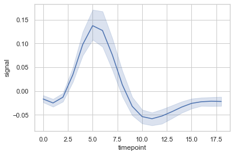
    


```
sns.set_style("ticks")
sns.lineplot(x="timepoint", y="signal", data=fmri)
```


    <AxesSubplot:xlabel='timepoint', ylabel='signal'>


    
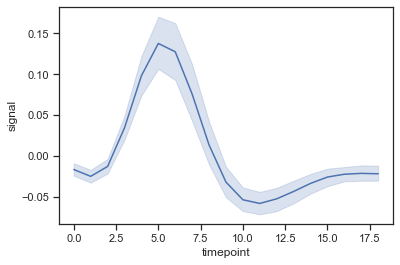
    


```
fmri.sample(n=10, random_state=1) # 랜덤으로 데이터 10개 추출
```


<div>
<style scoped>
    .dataframe tbody tr th:only-of-type {
        vertical-align: middle;
    }

    .dataframe tbody tr th {
        vertical-align: top;
    }

    .dataframe thead th {
        text-align: right;
    }
</style>
<table border="1" class="dataframe">
  <thead>
    <tr style="text-align: right;">
      <th></th>
      <th>subject</th>
      <th>timepoint</th>
      <th>event</th>
      <th>region</th>
      <th>signal</th>
    </tr>
  </thead>
  <tbody>
    <tr>
      <th>806</th>
      <td>s6</td>
      <td>18</td>
      <td>cue</td>
      <td>parietal</td>
      <td>0.019532</td>
    </tr>
    <tr>
      <th>691</th>
      <td>s5</td>
      <td>15</td>
      <td>cue</td>
      <td>frontal</td>
      <td>-0.019507</td>
    </tr>
    <tr>
      <th>148</th>
      <td>s5</td>
      <td>8</td>
      <td>stim</td>
      <td>parietal</td>
      <td>0.006805</td>
    </tr>
    <tr>
      <th>676</th>
      <td>s13</td>
      <td>0</td>
      <td>cue</td>
      <td>parietal</td>
      <td>-0.018394</td>
    </tr>
    <tr>
      <th>156</th>
      <td>s11</td>
      <td>7</td>
      <td>stim</td>
      <td>parietal</td>
      <td>0.254042</td>
    </tr>
    <tr>
      <th>27</th>
      <td>s1</td>
      <td>17</td>
      <td>stim</td>
      <td>parietal</td>
      <td>-0.038021</td>
    </tr>
    <tr>
      <th>200</th>
      <td>s11</td>
      <td>4</td>
      <td>stim</td>
      <td>parietal</td>
      <td>0.087175</td>
    </tr>
    <tr>
      <th>262</th>
      <td>s3</td>
      <td>0</td>
      <td>stim</td>
      <td>parietal</td>
      <td>-0.008576</td>
    </tr>
    <tr>
      <th>94</th>
      <td>s4</td>
      <td>12</td>
      <td>stim</td>
      <td>parietal</td>
      <td>-0.090036</td>
    </tr>
    <tr>
      <th>339</th>
      <td>s4</td>
      <td>5</td>
      <td>stim</td>
      <td>frontal</td>
      <td>0.455575</td>
    </tr>
  </tbody>
</table>
</div>


```
fmri["event"].unique()
```


    array(['stim', 'cue'], dtype=object)


```
sns.lineplot(x="timepoint", y="signal", hue="event", data=fmri) # hue는 categorical data
```


    <AxesSubplot:xlabel='timepoint', ylabel='signal'>


    
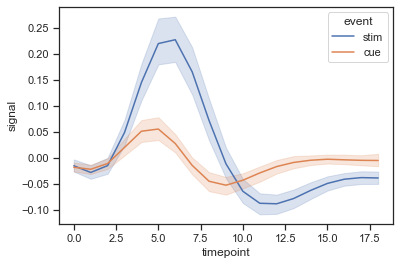
    


### scatter plot


```
tips.head()
```


<div>
<style scoped>
    .dataframe tbody tr th:only-of-type {
        vertical-align: middle;
    }

    .dataframe tbody tr th {
        vertical-align: top;
    }

    .dataframe thead th {
        text-align: right;
    }
</style>
<table border="1" class="dataframe">
  <thead>
    <tr style="text-align: right;">
      <th></th>
      <th>total_bill</th>
      <th>tip</th>
      <th>sex</th>
      <th>smoker</th>
      <th>day</th>
      <th>time</th>
      <th>size</th>
    </tr>
  </thead>
  <tbody>
    <tr>
      <th>0</th>
      <td>16.99</td>
      <td>1.01</td>
      <td>Female</td>
      <td>No</td>
      <td>Sun</td>
      <td>Dinner</td>
      <td>2</td>
    </tr>
    <tr>
      <th>1</th>
      <td>10.34</td>
      <td>1.66</td>
      <td>Male</td>
      <td>No</td>
      <td>Sun</td>
      <td>Dinner</td>
      <td>3</td>
    </tr>
    <tr>
      <th>2</th>
      <td>21.01</td>
      <td>3.50</td>
      <td>Male</td>
      <td>No</td>
      <td>Sun</td>
      <td>Dinner</td>
      <td>3</td>
    </tr>
    <tr>
      <th>3</th>
      <td>23.68</td>
      <td>3.31</td>
      <td>Male</td>
      <td>No</td>
      <td>Sun</td>
      <td>Dinner</td>
      <td>2</td>
    </tr>
    <tr>
      <th>4</th>
      <td>24.59</td>
      <td>3.61</td>
      <td>Female</td>
      <td>No</td>
      <td>Sun</td>
      <td>Dinner</td>
      <td>4</td>
    </tr>
  </tbody>
</table>
</div>


```
sns.scatterplot(x="total_bill", y="tip", data=tips)
```


    <AxesSubplot:xlabel='total_bill', ylabel='tip'>


    
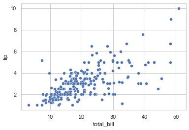
    


```
sns.regplot(x="total_bill", y="tip", data=tips) # regplot은 line plot과 scatte rplot을 한번에 보여줌
```


    <AxesSubplot:xlabel='total_bill', ylabel='tip'>


    
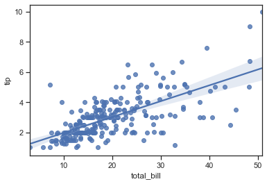
    


```
sns.scatterplot(x="total_bill", y="tip", hue="time", data=tips)
```


    <AxesSubplot:xlabel='total_bill', ylabel='tip'>


    
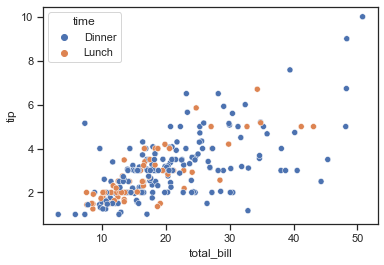
    


### count plot


```
fmri
```


<div>
<style scoped>
    .dataframe tbody tr th:only-of-type {
        vertical-align: middle;
    }

    .dataframe tbody tr th {
        vertical-align: top;
    }

    .dataframe thead th {
        text-align: right;
    }
</style>
<table border="1" class="dataframe">
  <thead>
    <tr style="text-align: right;">
      <th></th>
      <th>subject</th>
      <th>timepoint</th>
      <th>event</th>
      <th>region</th>
      <th>signal</th>
    </tr>
  </thead>
  <tbody>
    <tr>
      <th>0</th>
      <td>s13</td>
      <td>18</td>
      <td>stim</td>
      <td>parietal</td>
      <td>-0.017552</td>
    </tr>
    <tr>
      <th>1</th>
      <td>s5</td>
      <td>14</td>
      <td>stim</td>
      <td>parietal</td>
      <td>-0.080883</td>
    </tr>
    <tr>
      <th>2</th>
      <td>s12</td>
      <td>18</td>
      <td>stim</td>
      <td>parietal</td>
      <td>-0.081033</td>
    </tr>
    <tr>
      <th>3</th>
      <td>s11</td>
      <td>18</td>
      <td>stim</td>
      <td>parietal</td>
      <td>-0.046134</td>
    </tr>
    <tr>
      <th>4</th>
      <td>s10</td>
      <td>18</td>
      <td>stim</td>
      <td>parietal</td>
      <td>-0.037970</td>
    </tr>
    <tr>
      <th>...</th>
      <td>...</td>
      <td>...</td>
      <td>...</td>
      <td>...</td>
      <td>...</td>
    </tr>
    <tr>
      <th>1059</th>
      <td>s0</td>
      <td>8</td>
      <td>cue</td>
      <td>frontal</td>
      <td>0.018165</td>
    </tr>
    <tr>
      <th>1060</th>
      <td>s13</td>
      <td>7</td>
      <td>cue</td>
      <td>frontal</td>
      <td>-0.029130</td>
    </tr>
    <tr>
      <th>1061</th>
      <td>s12</td>
      <td>7</td>
      <td>cue</td>
      <td>frontal</td>
      <td>-0.004939</td>
    </tr>
    <tr>
      <th>1062</th>
      <td>s11</td>
      <td>7</td>
      <td>cue</td>
      <td>frontal</td>
      <td>-0.025367</td>
    </tr>
    <tr>
      <th>1063</th>
      <td>s0</td>
      <td>0</td>
      <td>cue</td>
      <td>parietal</td>
      <td>-0.006899</td>
    </tr>
  </tbody>
</table>
<p>1064 rows × 5 columns</p>
</div>


```
tips["smoker"].value_counts()
```


    No     151
    Yes     93
    Name: smoker, dtype: int64


```
sns.countplot(x="smoker", data=tips)
```


    <AxesSubplot:xlabel='smoker', ylabel='count'>


    
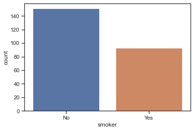
    


```
sns.countplot(x="smoker", hue="time", data=tips)
```


    <AxesSubplot:xlabel='smoker', ylabel='count'>


    
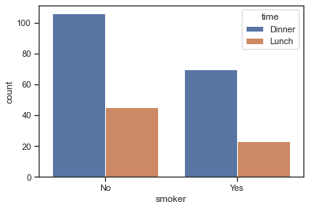
    


### bar plot


```
tips
```


<div>
<style scoped>
    .dataframe tbody tr th:only-of-type {
        vertical-align: middle;
    }

    .dataframe tbody tr th {
        vertical-align: top;
    }

    .dataframe thead th {
        text-align: right;
    }
</style>
<table border="1" class="dataframe">
  <thead>
    <tr style="text-align: right;">
      <th></th>
      <th>total_bill</th>
      <th>tip</th>
      <th>sex</th>
      <th>smoker</th>
      <th>day</th>
      <th>time</th>
      <th>size</th>
    </tr>
  </thead>
  <tbody>
    <tr>
      <th>0</th>
      <td>16.99</td>
      <td>1.01</td>
      <td>Female</td>
      <td>No</td>
      <td>Sun</td>
      <td>Dinner</td>
      <td>2</td>
    </tr>
    <tr>
      <th>1</th>
      <td>10.34</td>
      <td>1.66</td>
      <td>Male</td>
      <td>No</td>
      <td>Sun</td>
      <td>Dinner</td>
      <td>3</td>
    </tr>
    <tr>
      <th>2</th>
      <td>21.01</td>
      <td>3.50</td>
      <td>Male</td>
      <td>No</td>
      <td>Sun</td>
      <td>Dinner</td>
      <td>3</td>
    </tr>
    <tr>
      <th>3</th>
      <td>23.68</td>
      <td>3.31</td>
      <td>Male</td>
      <td>No</td>
      <td>Sun</td>
      <td>Dinner</td>
      <td>2</td>
    </tr>
    <tr>
      <th>4</th>
      <td>24.59</td>
      <td>3.61</td>
      <td>Female</td>
      <td>No</td>
      <td>Sun</td>
      <td>Dinner</td>
      <td>4</td>
    </tr>
    <tr>
      <th>...</th>
      <td>...</td>
      <td>...</td>
      <td>...</td>
      <td>...</td>
      <td>...</td>
      <td>...</td>
      <td>...</td>
    </tr>
    <tr>
      <th>239</th>
      <td>29.03</td>
      <td>5.92</td>
      <td>Male</td>
      <td>No</td>
      <td>Sat</td>
      <td>Dinner</td>
      <td>3</td>
    </tr>
    <tr>
      <th>240</th>
      <td>27.18</td>
      <td>2.00</td>
      <td>Female</td>
      <td>Yes</td>
      <td>Sat</td>
      <td>Dinner</td>
      <td>2</td>
    </tr>
    <tr>
      <th>241</th>
      <td>22.67</td>
      <td>2.00</td>
      <td>Male</td>
      <td>Yes</td>
      <td>Sat</td>
      <td>Dinner</td>
      <td>2</td>
    </tr>
    <tr>
      <th>242</th>
      <td>17.82</td>
      <td>1.75</td>
      <td>Male</td>
      <td>No</td>
      <td>Sat</td>
      <td>Dinner</td>
      <td>2</td>
    </tr>
    <tr>
      <th>243</th>
      <td>18.78</td>
      <td>3.00</td>
      <td>Female</td>
      <td>No</td>
      <td>Thur</td>
      <td>Dinner</td>
      <td>2</td>
    </tr>
  </tbody>
</table>
<p>244 rows × 7 columns</p>
</div>


```
sns.barplot(x="day", y="total_bill", data=tips)
```


    <AxesSubplot:xlabel='day', ylabel='total_bill'>


    
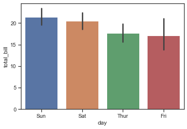
    


### hist plot (히스토그램)


```
tips.groupby("day")["total_bill"].mean()
```


    day
    Thur    17.682742
    Fri     17.151579
    Sat     20.441379
    Sun     21.410000
    Name: total_bill, dtype: float64


```
sns.histplot(tips["total_bill"], bins=10, kde=True) # kde는 분포 곡선
```


    <AxesSubplot:xlabel='total_bill', ylabel='Count'>


    
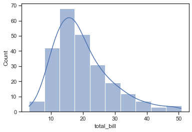
    


### violin plot

* box plot에 분포를 함께 표현


```
 sns.violinplot(x="day", y="total_bill", hue="smoker",
                    data=tips, palette="muted")
```


    <AxesSubplot:xlabel='day', ylabel='total_bill'>


    
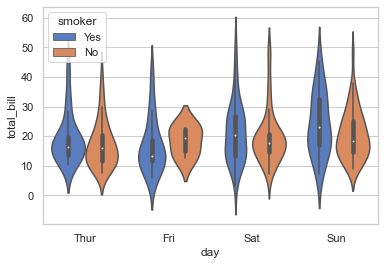
    


### swarm plot

* scatter와 category 정보를 함께 표현


```
 sns.swarmplot(x="day", y="total_bill", hue="smoker",
                    data=tips, palette="muted")
```


    <AxesSubplot:xlabel='day', ylabel='total_bill'>


    
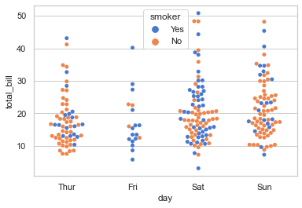
    


### 그외 plot들

* pointplot
    * category별 numeric의 평균, 신뢰구간 표시
* regplot
    * scatter와 line plot을 함께 표시

### multiple plots

* 여러개의 도표를 하나의 plot에 작성
* axes를 사용해 grid를 나눔

* replot - Numeric 데이터 중심의 분포 - 선형으로 표시
* catplot - category 데이터 중심으로 표시
* facetgrid - 특정 조건에 따른 다양한 plot을 grid로 표시
* pair plot - 데이터간의 상관관계 표시
* lmplot - regression 모델과 category 데이터를 함께 표시


```
g = sns.FacetGrid(tips, col="time",  row="sex")
```


    
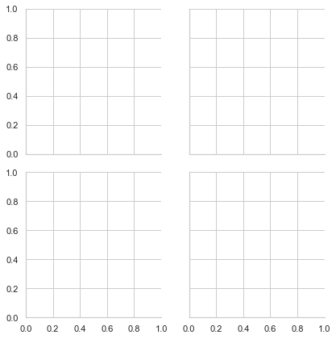
    


```
g = sns.FacetGrid(tips, col="time",  row="sex")
g.map(sns.scatterplot, "total_bill", "tip")
```


    <seaborn.axisgrid.FacetGrid at 0x7fb7912a67c0>


    
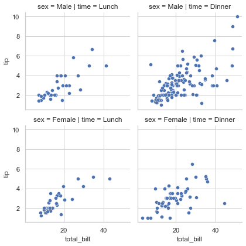
    


```
g = sns.FacetGrid(tips, col="time",  row="sex")
g.map_dataframe(sns.histplot, x="total_bill")
```


    <seaborn.axisgrid.FacetGrid at 0x7fb720f89f40>


    
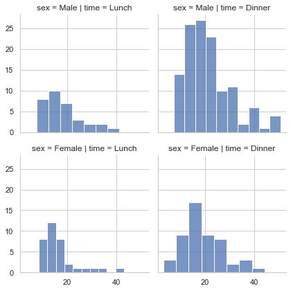
    

