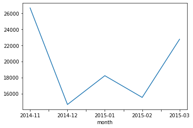
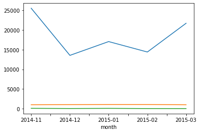
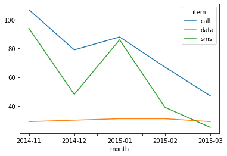

# Pandas

## Group by

### Group by - Basic 

* SQL의 GROUP BY와 비슷함

* groupby()의 결과물은 Series or DataFrame 임


```python
# data from:
ipl_data = {
    "Team": [
        "Riders",
        "Riders",
        "Devils",
        "Devils",
        "Kings",
        "kings",
        "Kings",
        "Kings",
        "Riders",
        "Royals",
        "Royals",
        "Riders",
    ],
    "Rank": [1, 2, 2, 3, 3, 4, 1, 1, 2, 4, 1, 2],
    "Year": [2014, 2015, 2014, 2015, 2014, 2015, 2016, 2017, 2016, 2014, 2015, 2017],
    "Points": [876, 789, 863, 673, 741, 812, 756, 788, 694, 701, 804, 690],
}

df = pd.DataFrame(ipl_data)
df.groupby("Team")["Points"].std() # 팀별로 묶어 표준편차를 리턴 구함
```


    Team
    Devils    134.350288
    Kings      24.006943
    Riders     88.567771
    Royals     72.831998
    kings            NaN
    Name: Points, dtype: float64


### Hierarchical index 


```python
h_index = df.groupby(["Team", "Year"])["Points"].sum() # 여러 Column으로 group을 만듨 수도 있음
print(type(h_index))
h_index
```

    <class 'pandas.core.series.Series'>


    Team    Year
    Devils  2014    863
            2015    673
    Kings   2014    741
            2016    756
            2017    788
    Riders  2014    876
            2015    789
            2016    694
            2017    690
    Royals  2014    701
            2015    804
    kings   2015    812
    Name: Points, dtype: int64


```python
h_index.index # tuple을 index로 hierachical index를 구현했음
```


    MultiIndex([('Devils', 2014),
                ('Devils', 2015),
                ( 'Kings', 2014),
                ( 'Kings', 2016),
                ( 'Kings', 2017),
                ('Riders', 2014),
                ('Riders', 2015),
                ('Riders', 2016),
                ('Riders', 2017),
                ('Royals', 2014),
                ('Royals', 2015),
                ( 'kings', 2015)],
               names=['Team', 'Year'])


```python
h_index["Devils":"Kings"] # indexing 가능
```


    Team    Year
    Devils  2014    863
            2015    673
    Kings   2014    741
            2016    756
            2017    788
    Name: Points, dtype: int64


* unstack()은 Group으로 묶여있는 데이터를 matrix 형태로 변환해줌


```python
h_index.unstack() # 가장 아래쪽 index를 column으로 하는 DataFrame으로 변환한 뒤 리턴
```


<div>
<style scoped>
    .dataframe tbody tr th:only-of-type {
        vertical-align: middle;
    }

    .dataframe tbody tr th {
        vertical-align: top;
    }

    .dataframe thead th {
        text-align: right;
    }
</style>
<table border="1" class="dataframe">
  <thead>
    <tr style="text-align: right;">
      <th>Year</th>
      <th>2014</th>
      <th>2015</th>
      <th>2016</th>
      <th>2017</th>
    </tr>
    <tr>
      <th>Team</th>
      <th></th>
      <th></th>
      <th></th>
      <th></th>
    </tr>
  </thead>
  <tbody>
    <tr>
      <th>Devils</th>
      <td>863.0</td>
      <td>673.0</td>
      <td>NaN</td>
      <td>NaN</td>
    </tr>
    <tr>
      <th>Kings</th>
      <td>741.0</td>
      <td>NaN</td>
      <td>756.0</td>
      <td>788.0</td>
    </tr>
    <tr>
      <th>Riders</th>
      <td>876.0</td>
      <td>789.0</td>
      <td>694.0</td>
      <td>690.0</td>
    </tr>
    <tr>
      <th>Royals</th>
      <td>701.0</td>
      <td>804.0</td>
      <td>NaN</td>
      <td>NaN</td>
    </tr>
    <tr>
      <th>kings</th>
      <td>NaN</td>
      <td>812.0</td>
      <td>NaN</td>
      <td>NaN</td>
    </tr>
  </tbody>
</table>
</div>


```python
h_index.unstack().stack() # column 을 index로 변환해 multi-level index를 가진 데이터로 리턴함
```


    Team    Year
    Devils  2014    863.0
            2015    673.0
    Kings   2014    741.0
            2016    756.0
            2017    788.0
    Riders  2014    876.0
            2015    789.0
            2016    694.0
            2017    690.0
    Royals  2014    701.0
            2015    804.0
    kings   2015    812.0
    dtype: float64


```python
h_index.swaplevel() # index의 계층을 서로 바꿔 리턴
```


    Year  Team  
    2014  Devils    863
    2015  Devils    673
    2014  Kings     741
    2016  Kings     756
    2017  Kings     788
    2014  Riders    876
    2015  Riders    789
    2016  Riders    694
    2017  Riders    690
    2014  Royals    701
    2015  Royals    804
          kings     812
    Name: Points, dtype: int64


```python
h_index.swaplevel().sort_index(level=0) # 지정한 level의 index를 기준으로 정렬하여 리턴
```


    Year  Team  
    2014  Devils    863
          Kings     741
          Riders    876
          Royals    701
    2015  Devils    673
          Riders    789
          Royals    804
          kings     812
    2016  Kings     756
          Riders    694
    2017  Kings     788
          Riders    690
    Name: Points, dtype: int64


```python
h_index.std(level=0) # 지정한 index를 기준으로 표준편차를 구해 리턴
```


    Team
    Devils    134.350288
    Kings      24.006943
    Riders     88.567771
    Royals     72.831998
    kings            NaN
    Name: Points, dtype: float64


```python
h_index.sum(level=1) # 지정한 index를 기준으로 합계를 구해 리턴
```


    Year
    2014    3181
    2015    3078
    2016    1450
    2017    1478
    Name: Points, dtype: int64


### Groupby - gropuped


```python
grouped = df.groupby("Team") # groupby()로 분류한 data를 추출할 수 있다
type(grouped)
```


    pandas.core.groupby.generic.DataFrameGroupBy


```python
for name, group in grouped: # name에는 key값으로 분류 기준 값이, group은 value값으로 해당 값으로 분류한 data가 들어간다
    print(name)
    print(group)
```

    Devils
         Team  Rank  Year  Points
    2  Devils     2  2014     863
    3  Devils     3  2015     673
    Kings
        Team  Rank  Year  Points
    4  Kings     3  2014     741
    6  Kings     1  2016     756
    7  Kings     1  2017     788
    Riders
          Team  Rank  Year  Points
    0   Riders     1  2014     876
    1   Riders     2  2015     789
    8   Riders     2  2016     694
    11  Riders     2  2017     690
    Royals
          Team  Rank  Year  Points
    9   Royals     4  2014     701
    10  Royals     1  2015     804
    kings
        Team  Rank  Year  Points
    5  kings     4  2015     812


```python
grouped.get_group("Devils") # key값을 이용해 해당 group의 data만 가져올 수 있음
```


<div>
<style scoped>
    .dataframe tbody tr th:only-of-type {
        vertical-align: middle;
    }

    .dataframe tbody tr th {
        vertical-align: top;
    }

    .dataframe thead th {
        text-align: right;
    }
</style>
<table border="1" class="dataframe">
  <thead>
    <tr style="text-align: right;">
      <th></th>
      <th>Team</th>
      <th>Rank</th>
      <th>Year</th>
      <th>Points</th>
    </tr>
  </thead>
  <tbody>
    <tr>
      <th>2</th>
      <td>Devils</td>
      <td>2</td>
      <td>2014</td>
      <td>863</td>
    </tr>
    <tr>
      <th>3</th>
      <td>Devils</td>
      <td>3</td>
      <td>2015</td>
      <td>673</td>
    </tr>
  </tbody>
</table>
</div>


### Aggregation


```python
grouped.agg(max) # agg -> aggregation : 그룹별 통계 정보를 추출해줌
```


<div>
<style scoped>
    .dataframe tbody tr th:only-of-type {
        vertical-align: middle;
    }

    .dataframe tbody tr th {
        vertical-align: top;
    }

    .dataframe thead th {
        text-align: right;
    }
</style>
<table border="1" class="dataframe">
  <thead>
    <tr style="text-align: right;">
      <th></th>
      <th>Rank</th>
      <th>Year</th>
      <th>Points</th>
    </tr>
    <tr>
      <th>Team</th>
      <th></th>
      <th></th>
      <th></th>
    </tr>
  </thead>
  <tbody>
    <tr>
      <th>Devils</th>
      <td>3</td>
      <td>2015</td>
      <td>863</td>
    </tr>
    <tr>
      <th>Kings</th>
      <td>3</td>
      <td>2017</td>
      <td>788</td>
    </tr>
    <tr>
      <th>Riders</th>
      <td>2</td>
      <td>2017</td>
      <td>876</td>
    </tr>
    <tr>
      <th>Royals</th>
      <td>4</td>
      <td>2015</td>
      <td>804</td>
    </tr>
    <tr>
      <th>kings</th>
      <td>4</td>
      <td>2015</td>
      <td>812</td>
    </tr>
  </tbody>
</table>
</div>


```python
import numpy as np

grouped.agg(np.mean)
```


<div>
<style scoped>
    .dataframe tbody tr th:only-of-type {
        vertical-align: middle;
    }

    .dataframe tbody tr th {
        vertical-align: top;
    }

    .dataframe thead th {
        text-align: right;
    }
</style>
<table border="1" class="dataframe">
  <thead>
    <tr style="text-align: right;">
      <th></th>
      <th>Rank</th>
      <th>Year</th>
      <th>Points</th>
    </tr>
    <tr>
      <th>Team</th>
      <th></th>
      <th></th>
      <th></th>
    </tr>
  </thead>
  <tbody>
    <tr>
      <th>Devils</th>
      <td>2.500000</td>
      <td>2014.500000</td>
      <td>768.000000</td>
    </tr>
    <tr>
      <th>Kings</th>
      <td>1.666667</td>
      <td>2015.666667</td>
      <td>761.666667</td>
    </tr>
    <tr>
      <th>Riders</th>
      <td>1.750000</td>
      <td>2015.500000</td>
      <td>762.250000</td>
    </tr>
    <tr>
      <th>Royals</th>
      <td>2.500000</td>
      <td>2014.500000</td>
      <td>752.500000</td>
    </tr>
    <tr>
      <th>kings</th>
      <td>4.000000</td>
      <td>2015.000000</td>
      <td>812.000000</td>
    </tr>
  </tbody>
</table>
</div>


```python
df.describe() # 여러 통계를 볼때는 describe() 사용 - DataFrame에 describe() 사용 시
```


<div>
<style scoped>
    .dataframe tbody tr th:only-of-type {
        vertical-align: middle;
    }

    .dataframe tbody tr th {
        vertical-align: top;
    }

    .dataframe thead th {
        text-align: right;
    }
</style>
<table border="1" class="dataframe">
  <thead>
    <tr style="text-align: right;">
      <th></th>
      <th>Rank</th>
      <th>Year</th>
      <th>Points</th>
    </tr>
  </thead>
  <tbody>
    <tr>
      <th>count</th>
      <td>12.000000</td>
      <td>12.000000</td>
      <td>12.000000</td>
    </tr>
    <tr>
      <th>mean</th>
      <td>2.166667</td>
      <td>2015.166667</td>
      <td>765.583333</td>
    </tr>
    <tr>
      <th>std</th>
      <td>1.114641</td>
      <td>1.114641</td>
      <td>67.849376</td>
    </tr>
    <tr>
      <th>min</th>
      <td>1.000000</td>
      <td>2014.000000</td>
      <td>673.000000</td>
    </tr>
    <tr>
      <th>25%</th>
      <td>1.000000</td>
      <td>2014.000000</td>
      <td>699.250000</td>
    </tr>
    <tr>
      <th>50%</th>
      <td>2.000000</td>
      <td>2015.000000</td>
      <td>772.000000</td>
    </tr>
    <tr>
      <th>75%</th>
      <td>3.000000</td>
      <td>2016.000000</td>
      <td>806.000000</td>
    </tr>
    <tr>
      <th>max</th>
      <td>4.000000</td>
      <td>2017.000000</td>
      <td>876.000000</td>
    </tr>
  </tbody>
</table>
</div>


```python
grouped.describe().T # grouped된 data에도 describe()를 사용할 수 있음. group별 통계를 보여줌
```


<div>
<style scoped>
    .dataframe tbody tr th:only-of-type {
        vertical-align: middle;
    }

    .dataframe tbody tr th {
        vertical-align: top;
    }

    .dataframe thead th {
        text-align: right;
    }
</style>
<table border="1" class="dataframe">
  <thead>
    <tr style="text-align: right;">
      <th></th>
      <th>Team</th>
      <th>Devils</th>
      <th>Kings</th>
      <th>Riders</th>
      <th>Royals</th>
      <th>kings</th>
    </tr>
  </thead>
  <tbody>
    <tr>
      <th rowspan="8" valign="top">Rank</th>
      <th>count</th>
      <td>2.000000</td>
      <td>3.000000</td>
      <td>4.000000</td>
      <td>2.000000</td>
      <td>1.0</td>
    </tr>
    <tr>
      <th>mean</th>
      <td>2.500000</td>
      <td>1.666667</td>
      <td>1.750000</td>
      <td>2.500000</td>
      <td>4.0</td>
    </tr>
    <tr>
      <th>std</th>
      <td>0.707107</td>
      <td>1.154701</td>
      <td>0.500000</td>
      <td>2.121320</td>
      <td>NaN</td>
    </tr>
    <tr>
      <th>min</th>
      <td>2.000000</td>
      <td>1.000000</td>
      <td>1.000000</td>
      <td>1.000000</td>
      <td>4.0</td>
    </tr>
    <tr>
      <th>25%</th>
      <td>2.250000</td>
      <td>1.000000</td>
      <td>1.750000</td>
      <td>1.750000</td>
      <td>4.0</td>
    </tr>
    <tr>
      <th>50%</th>
      <td>2.500000</td>
      <td>1.000000</td>
      <td>2.000000</td>
      <td>2.500000</td>
      <td>4.0</td>
    </tr>
    <tr>
      <th>75%</th>
      <td>2.750000</td>
      <td>2.000000</td>
      <td>2.000000</td>
      <td>3.250000</td>
      <td>4.0</td>
    </tr>
    <tr>
      <th>max</th>
      <td>3.000000</td>
      <td>3.000000</td>
      <td>2.000000</td>
      <td>4.000000</td>
      <td>4.0</td>
    </tr>
    <tr>
      <th rowspan="8" valign="top">Year</th>
      <th>count</th>
      <td>2.000000</td>
      <td>3.000000</td>
      <td>4.000000</td>
      <td>2.000000</td>
      <td>1.0</td>
    </tr>
    <tr>
      <th>mean</th>
      <td>2014.500000</td>
      <td>2015.666667</td>
      <td>2015.500000</td>
      <td>2014.500000</td>
      <td>2015.0</td>
    </tr>
    <tr>
      <th>std</th>
      <td>0.707107</td>
      <td>1.527525</td>
      <td>1.290994</td>
      <td>0.707107</td>
      <td>NaN</td>
    </tr>
    <tr>
      <th>min</th>
      <td>2014.000000</td>
      <td>2014.000000</td>
      <td>2014.000000</td>
      <td>2014.000000</td>
      <td>2015.0</td>
    </tr>
    <tr>
      <th>25%</th>
      <td>2014.250000</td>
      <td>2015.000000</td>
      <td>2014.750000</td>
      <td>2014.250000</td>
      <td>2015.0</td>
    </tr>
    <tr>
      <th>50%</th>
      <td>2014.500000</td>
      <td>2016.000000</td>
      <td>2015.500000</td>
      <td>2014.500000</td>
      <td>2015.0</td>
    </tr>
    <tr>
      <th>75%</th>
      <td>2014.750000</td>
      <td>2016.500000</td>
      <td>2016.250000</td>
      <td>2014.750000</td>
      <td>2015.0</td>
    </tr>
    <tr>
      <th>max</th>
      <td>2015.000000</td>
      <td>2017.000000</td>
      <td>2017.000000</td>
      <td>2015.000000</td>
      <td>2015.0</td>
    </tr>
    <tr>
      <th rowspan="8" valign="top">Points</th>
      <th>count</th>
      <td>2.000000</td>
      <td>3.000000</td>
      <td>4.000000</td>
      <td>2.000000</td>
      <td>1.0</td>
    </tr>
    <tr>
      <th>mean</th>
      <td>768.000000</td>
      <td>761.666667</td>
      <td>762.250000</td>
      <td>752.500000</td>
      <td>812.0</td>
    </tr>
    <tr>
      <th>std</th>
      <td>134.350288</td>
      <td>24.006943</td>
      <td>88.567771</td>
      <td>72.831998</td>
      <td>NaN</td>
    </tr>
    <tr>
      <th>min</th>
      <td>673.000000</td>
      <td>741.000000</td>
      <td>690.000000</td>
      <td>701.000000</td>
      <td>812.0</td>
    </tr>
    <tr>
      <th>25%</th>
      <td>720.500000</td>
      <td>748.500000</td>
      <td>693.000000</td>
      <td>726.750000</td>
      <td>812.0</td>
    </tr>
    <tr>
      <th>50%</th>
      <td>768.000000</td>
      <td>756.000000</td>
      <td>741.500000</td>
      <td>752.500000</td>
      <td>812.0</td>
    </tr>
    <tr>
      <th>75%</th>
      <td>815.500000</td>
      <td>772.000000</td>
      <td>810.750000</td>
      <td>778.250000</td>
      <td>812.0</td>
    </tr>
    <tr>
      <th>max</th>
      <td>863.000000</td>
      <td>788.000000</td>
      <td>876.000000</td>
      <td>804.000000</td>
      <td>812.0</td>
    </tr>
  </tbody>
</table>
</div>


```python
grouped["Points"].agg([np.sum, np.mean, np.std]) # 특정 column에 여러 function을 사용해 통계를 구할 수도 있음
```


<div>
<style scoped>
    .dataframe tbody tr th:only-of-type {
        vertical-align: middle;
    }

    .dataframe tbody tr th {
        vertical-align: top;
    }

    .dataframe thead th {
        text-align: right;
    }
</style>
<table border="1" class="dataframe">
  <thead>
    <tr style="text-align: right;">
      <th></th>
      <th>sum</th>
      <th>mean</th>
      <th>std</th>
    </tr>
    <tr>
      <th>Team</th>
      <th></th>
      <th></th>
      <th></th>
    </tr>
  </thead>
  <tbody>
    <tr>
      <th>Devils</th>
      <td>1536</td>
      <td>768.000000</td>
      <td>134.350288</td>
    </tr>
    <tr>
      <th>Kings</th>
      <td>2285</td>
      <td>761.666667</td>
      <td>24.006943</td>
    </tr>
    <tr>
      <th>Riders</th>
      <td>3049</td>
      <td>762.250000</td>
      <td>88.567771</td>
    </tr>
    <tr>
      <th>Royals</th>
      <td>1505</td>
      <td>752.500000</td>
      <td>72.831998</td>
    </tr>
    <tr>
      <th>kings</th>
      <td>812</td>
      <td>812.000000</td>
      <td>NaN</td>
    </tr>
  </tbody>
</table>
</div>


### Transofrmation

* transform()은 group 전체가 아닌 각각의 element에 적용됨
* 개별 데이터를 **그룹의 통계량을 사용해** 변환할 때 사용함


```python
score = lambda x: (x - x.mean()) / x.std() # 전체 데이터를 그룹의 통계량을 이용해 수정할 때 사용
grouped.transform(score)
```


<div>
<style scoped>
    .dataframe tbody tr th:only-of-type {
        vertical-align: middle;
    }

    .dataframe tbody tr th {
        vertical-align: top;
    }

    .dataframe thead th {
        text-align: right;
    }
</style>
<table border="1" class="dataframe">
  <thead>
    <tr style="text-align: right;">
      <th></th>
      <th>Rank</th>
      <th>Year</th>
      <th>Points</th>
    </tr>
  </thead>
  <tbody>
    <tr>
      <th>0</th>
      <td>-1.500000</td>
      <td>-1.161895</td>
      <td>1.284327</td>
    </tr>
    <tr>
      <th>1</th>
      <td>0.500000</td>
      <td>-0.387298</td>
      <td>0.302029</td>
    </tr>
    <tr>
      <th>2</th>
      <td>-0.707107</td>
      <td>-0.707107</td>
      <td>0.707107</td>
    </tr>
    <tr>
      <th>3</th>
      <td>0.707107</td>
      <td>0.707107</td>
      <td>-0.707107</td>
    </tr>
    <tr>
      <th>4</th>
      <td>1.154701</td>
      <td>-1.091089</td>
      <td>-0.860862</td>
    </tr>
    <tr>
      <th>5</th>
      <td>NaN</td>
      <td>NaN</td>
      <td>NaN</td>
    </tr>
    <tr>
      <th>6</th>
      <td>-0.577350</td>
      <td>0.218218</td>
      <td>-0.236043</td>
    </tr>
    <tr>
      <th>7</th>
      <td>-0.577350</td>
      <td>0.872872</td>
      <td>1.096905</td>
    </tr>
    <tr>
      <th>8</th>
      <td>0.500000</td>
      <td>0.387298</td>
      <td>-0.770596</td>
    </tr>
    <tr>
      <th>9</th>
      <td>0.707107</td>
      <td>-0.707107</td>
      <td>-0.707107</td>
    </tr>
    <tr>
      <th>10</th>
      <td>-0.707107</td>
      <td>0.707107</td>
      <td>0.707107</td>
    </tr>
    <tr>
      <th>11</th>
      <td>0.500000</td>
      <td>1.161895</td>
      <td>-0.815759</td>
    </tr>
  </tbody>
</table>
</div>


```python
score = lambda x: (x - x.min()) / (x.max() - x.min()) # 여기서 x.min()이나 x.max()는 그룹 기준 최소, 최대값을 의미함
grouped.transform(score)
```


<div>
<style scoped>
    .dataframe tbody tr th:only-of-type {
        vertical-align: middle;
    }

    .dataframe tbody tr th {
        vertical-align: top;
    }

    .dataframe thead th {
        text-align: right;
    }
</style>
<table border="1" class="dataframe">
  <thead>
    <tr style="text-align: right;">
      <th></th>
      <th>Rank</th>
      <th>Year</th>
      <th>Points</th>
    </tr>
  </thead>
  <tbody>
    <tr>
      <th>0</th>
      <td>0.0</td>
      <td>0.000000</td>
      <td>1.000000</td>
    </tr>
    <tr>
      <th>1</th>
      <td>1.0</td>
      <td>0.333333</td>
      <td>0.532258</td>
    </tr>
    <tr>
      <th>2</th>
      <td>0.0</td>
      <td>0.000000</td>
      <td>1.000000</td>
    </tr>
    <tr>
      <th>3</th>
      <td>1.0</td>
      <td>1.000000</td>
      <td>0.000000</td>
    </tr>
    <tr>
      <th>4</th>
      <td>1.0</td>
      <td>0.000000</td>
      <td>0.000000</td>
    </tr>
    <tr>
      <th>5</th>
      <td>NaN</td>
      <td>NaN</td>
      <td>NaN</td>
    </tr>
    <tr>
      <th>6</th>
      <td>0.0</td>
      <td>0.666667</td>
      <td>0.319149</td>
    </tr>
    <tr>
      <th>7</th>
      <td>0.0</td>
      <td>1.000000</td>
      <td>1.000000</td>
    </tr>
    <tr>
      <th>8</th>
      <td>1.0</td>
      <td>0.666667</td>
      <td>0.021505</td>
    </tr>
    <tr>
      <th>9</th>
      <td>1.0</td>
      <td>0.000000</td>
      <td>0.000000</td>
    </tr>
    <tr>
      <th>10</th>
      <td>0.0</td>
      <td>1.000000</td>
      <td>1.000000</td>
    </tr>
    <tr>
      <th>11</th>
      <td>1.0</td>
      <td>1.000000</td>
      <td>0.000000</td>
    </tr>
  </tbody>
</table>
</div>


```python
df.groupby("Team").filter(lambda x: len(x) >= 3).sort_values(by = "Team") # 특정 조건으로 데이터 검색 - 해당 팀에 대한 데이터가 3개 이상
```


<div>
<style scoped>
    .dataframe tbody tr th:only-of-type {
        vertical-align: middle;
    }

    .dataframe tbody tr th {
        vertical-align: top;
    }

    .dataframe thead th {
        text-align: right;
    }
</style>
<table border="1" class="dataframe">
  <thead>
    <tr style="text-align: right;">
      <th></th>
      <th>Team</th>
      <th>Rank</th>
      <th>Year</th>
      <th>Points</th>
    </tr>
  </thead>
  <tbody>
    <tr>
      <th>4</th>
      <td>Kings</td>
      <td>3</td>
      <td>2014</td>
      <td>741</td>
    </tr>
    <tr>
      <th>6</th>
      <td>Kings</td>
      <td>1</td>
      <td>2016</td>
      <td>756</td>
    </tr>
    <tr>
      <th>7</th>
      <td>Kings</td>
      <td>1</td>
      <td>2017</td>
      <td>788</td>
    </tr>
    <tr>
      <th>0</th>
      <td>Riders</td>
      <td>1</td>
      <td>2014</td>
      <td>876</td>
    </tr>
    <tr>
      <th>1</th>
      <td>Riders</td>
      <td>2</td>
      <td>2015</td>
      <td>789</td>
    </tr>
    <tr>
      <th>8</th>
      <td>Riders</td>
      <td>2</td>
      <td>2016</td>
      <td>694</td>
    </tr>
    <tr>
      <th>11</th>
      <td>Riders</td>
      <td>2</td>
      <td>2017</td>
      <td>690</td>
    </tr>
  </tbody>
</table>
</div>


```python
df.groupby("Team").filter(lambda x: x["Points"].mean() > 700) # 평균 점수가 700보다 큰 팀들의 데이터
```


<div>
<style scoped>
    .dataframe tbody tr th:only-of-type {
        vertical-align: middle;
    }

    .dataframe tbody tr th {
        vertical-align: top;
    }

    .dataframe thead th {
        text-align: right;
    }
</style>
<table border="1" class="dataframe">
  <thead>
    <tr style="text-align: right;">
      <th></th>
      <th>Team</th>
      <th>Rank</th>
      <th>Year</th>
      <th>Points</th>
    </tr>
  </thead>
  <tbody>
    <tr>
      <th>0</th>
      <td>Riders</td>
      <td>1</td>
      <td>2014</td>
      <td>876</td>
    </tr>
    <tr>
      <th>1</th>
      <td>Riders</td>
      <td>2</td>
      <td>2015</td>
      <td>789</td>
    </tr>
    <tr>
      <th>2</th>
      <td>Devils</td>
      <td>2</td>
      <td>2014</td>
      <td>863</td>
    </tr>
    <tr>
      <th>3</th>
      <td>Devils</td>
      <td>3</td>
      <td>2015</td>
      <td>673</td>
    </tr>
    <tr>
      <th>4</th>
      <td>Kings</td>
      <td>3</td>
      <td>2014</td>
      <td>741</td>
    </tr>
    <tr>
      <th>5</th>
      <td>kings</td>
      <td>4</td>
      <td>2015</td>
      <td>812</td>
    </tr>
    <tr>
      <th>6</th>
      <td>Kings</td>
      <td>1</td>
      <td>2016</td>
      <td>756</td>
    </tr>
    <tr>
      <th>7</th>
      <td>Kings</td>
      <td>1</td>
      <td>2017</td>
      <td>788</td>
    </tr>
    <tr>
      <th>8</th>
      <td>Riders</td>
      <td>2</td>
      <td>2016</td>
      <td>694</td>
    </tr>
    <tr>
      <th>9</th>
      <td>Royals</td>
      <td>4</td>
      <td>2014</td>
      <td>701</td>
    </tr>
    <tr>
      <th>10</th>
      <td>Royals</td>
      <td>1</td>
      <td>2015</td>
      <td>804</td>
    </tr>
    <tr>
      <th>11</th>
      <td>Riders</td>
      <td>2</td>
      <td>2017</td>
      <td>690</td>
    </tr>
  </tbody>
</table>
</div>


```python
df.groupby("Team").filter(lambda x: x["Points"].max() > 800) # 최대 점수가 800점보다 큰 팀들의 데이터
```


<div>
<style scoped>
    .dataframe tbody tr th:only-of-type {
        vertical-align: middle;
    }

    .dataframe tbody tr th {
        vertical-align: top;
    }

    .dataframe thead th {
        text-align: right;
    }
</style>
<table border="1" class="dataframe">
  <thead>
    <tr style="text-align: right;">
      <th></th>
      <th>Team</th>
      <th>Rank</th>
      <th>Year</th>
      <th>Points</th>
    </tr>
  </thead>
  <tbody>
    <tr>
      <th>0</th>
      <td>Riders</td>
      <td>1</td>
      <td>2014</td>
      <td>876</td>
    </tr>
    <tr>
      <th>1</th>
      <td>Riders</td>
      <td>2</td>
      <td>2015</td>
      <td>789</td>
    </tr>
    <tr>
      <th>2</th>
      <td>Devils</td>
      <td>2</td>
      <td>2014</td>
      <td>863</td>
    </tr>
    <tr>
      <th>3</th>
      <td>Devils</td>
      <td>3</td>
      <td>2015</td>
      <td>673</td>
    </tr>
    <tr>
      <th>5</th>
      <td>kings</td>
      <td>4</td>
      <td>2015</td>
      <td>812</td>
    </tr>
    <tr>
      <th>8</th>
      <td>Riders</td>
      <td>2</td>
      <td>2016</td>
      <td>694</td>
    </tr>
    <tr>
      <th>9</th>
      <td>Royals</td>
      <td>4</td>
      <td>2014</td>
      <td>701</td>
    </tr>
    <tr>
      <th>10</th>
      <td>Royals</td>
      <td>1</td>
      <td>2015</td>
      <td>804</td>
    </tr>
    <tr>
      <th>11</th>
      <td>Riders</td>
      <td>2</td>
      <td>2017</td>
      <td>690</td>
    </tr>
  </tbody>
</table>
</div>


## Case study


```python
df_phone = pd.read_csv("./phone_data.csv")
df_phone.head()
```


<div>
<style scoped>
    .dataframe tbody tr th:only-of-type {
        vertical-align: middle;
    }

    .dataframe tbody tr th {
        vertical-align: top;
    }

    .dataframe thead th {
        text-align: right;
    }
</style>
<table border="1" class="dataframe">
  <thead>
    <tr style="text-align: right;">
      <th></th>
      <th>index</th>
      <th>date</th>
      <th>duration</th>
      <th>item</th>
      <th>month</th>
      <th>network</th>
      <th>network_type</th>
    </tr>
  </thead>
  <tbody>
    <tr>
      <th>0</th>
      <td>0</td>
      <td>15/10/14 06:58</td>
      <td>34.429</td>
      <td>data</td>
      <td>2014-11</td>
      <td>data</td>
      <td>data</td>
    </tr>
    <tr>
      <th>1</th>
      <td>1</td>
      <td>15/10/14 06:58</td>
      <td>13.000</td>
      <td>call</td>
      <td>2014-11</td>
      <td>Vodafone</td>
      <td>mobile</td>
    </tr>
    <tr>
      <th>2</th>
      <td>2</td>
      <td>15/10/14 14:46</td>
      <td>23.000</td>
      <td>call</td>
      <td>2014-11</td>
      <td>Meteor</td>
      <td>mobile</td>
    </tr>
    <tr>
      <th>3</th>
      <td>3</td>
      <td>15/10/14 14:48</td>
      <td>4.000</td>
      <td>call</td>
      <td>2014-11</td>
      <td>Tesco</td>
      <td>mobile</td>
    </tr>
    <tr>
      <th>4</th>
      <td>4</td>
      <td>15/10/14 17:27</td>
      <td>4.000</td>
      <td>call</td>
      <td>2014-11</td>
      <td>Tesco</td>
      <td>mobile</td>
    </tr>
  </tbody>
</table>
</div>


```python
df_phone.dtypes # 날짜가 그냥 문자열 형태로 저장되어있음 -> 날짜 저장 형식으로 변환 필요
```


    index             int64
    date             object
    duration        float64
    item             object
    month            object
    network          object
    network_type     object
    dtype: object


```python
import dateutil

df_phone["date"] = df_phone["date"].apply(dateutil.parser.parse, dayfirst=True)
df_phone.dtypes
```


    index                    int64
    date            datetime64[ns]
    duration               float64
    item                    object
    month                   object
    network                 object
    network_type            object
    dtype: object


```python
df_phone
```


<div>
<style scoped>
    .dataframe tbody tr th:only-of-type {
        vertical-align: middle;
    }

    .dataframe tbody tr th {
        vertical-align: top;
    }

    .dataframe thead th {
        text-align: right;
    }
</style>
<table border="1" class="dataframe">
  <thead>
    <tr style="text-align: right;">
      <th></th>
      <th>index</th>
      <th>date</th>
      <th>duration</th>
      <th>item</th>
      <th>month</th>
      <th>network</th>
      <th>network_type</th>
    </tr>
  </thead>
  <tbody>
    <tr>
      <th>0</th>
      <td>0</td>
      <td>2014-10-15 06:58:00</td>
      <td>34.429</td>
      <td>data</td>
      <td>2014-11</td>
      <td>data</td>
      <td>data</td>
    </tr>
    <tr>
      <th>1</th>
      <td>1</td>
      <td>2014-10-15 06:58:00</td>
      <td>13.000</td>
      <td>call</td>
      <td>2014-11</td>
      <td>Vodafone</td>
      <td>mobile</td>
    </tr>
    <tr>
      <th>2</th>
      <td>2</td>
      <td>2014-10-15 14:46:00</td>
      <td>23.000</td>
      <td>call</td>
      <td>2014-11</td>
      <td>Meteor</td>
      <td>mobile</td>
    </tr>
    <tr>
      <th>3</th>
      <td>3</td>
      <td>2014-10-15 14:48:00</td>
      <td>4.000</td>
      <td>call</td>
      <td>2014-11</td>
      <td>Tesco</td>
      <td>mobile</td>
    </tr>
    <tr>
      <th>4</th>
      <td>4</td>
      <td>2014-10-15 17:27:00</td>
      <td>4.000</td>
      <td>call</td>
      <td>2014-11</td>
      <td>Tesco</td>
      <td>mobile</td>
    </tr>
    <tr>
      <th>...</th>
      <td>...</td>
      <td>...</td>
      <td>...</td>
      <td>...</td>
      <td>...</td>
      <td>...</td>
      <td>...</td>
    </tr>
    <tr>
      <th>825</th>
      <td>825</td>
      <td>2015-03-13 00:38:00</td>
      <td>1.000</td>
      <td>sms</td>
      <td>2015-03</td>
      <td>world</td>
      <td>world</td>
    </tr>
    <tr>
      <th>826</th>
      <td>826</td>
      <td>2015-03-13 00:39:00</td>
      <td>1.000</td>
      <td>sms</td>
      <td>2015-03</td>
      <td>Vodafone</td>
      <td>mobile</td>
    </tr>
    <tr>
      <th>827</th>
      <td>827</td>
      <td>2015-03-13 06:58:00</td>
      <td>34.429</td>
      <td>data</td>
      <td>2015-03</td>
      <td>data</td>
      <td>data</td>
    </tr>
    <tr>
      <th>828</th>
      <td>828</td>
      <td>2015-03-14 00:13:00</td>
      <td>1.000</td>
      <td>sms</td>
      <td>2015-03</td>
      <td>world</td>
      <td>world</td>
    </tr>
    <tr>
      <th>829</th>
      <td>829</td>
      <td>2015-03-14 00:16:00</td>
      <td>1.000</td>
      <td>sms</td>
      <td>2015-03</td>
      <td>world</td>
      <td>world</td>
    </tr>
  </tbody>
</table>
<p>830 rows × 7 columns</p>
</div>


```python
df_phone.groupby("month")["duration"].sum().plot() # month로 묶은 뒤 duration의 총합을 구해 그래프로 그림
```


    <AxesSubplot:xlabel='month'>


    

    


```python
df_phone[df_phone["item"] == "call"].groupby("month")["duration"].sum().plot() # 전화 사용량만 뽑아서 duration 총합
df_phone[df_phone["item"] == "data"].groupby("month")["duration"].sum().plot() # data 사용량만 뽑아서 duration 총합
df_phone[df_phone["item"] == "sms"].groupby("month")["duration"].sum().plot() # sms 사용량만 뽑아서 duration 총합
```


    <AxesSubplot:xlabel='month'>


    

    


```python
df_phone.groupby(["month", "item"])["duration"].count().unstack().plot() # 월별 item 사용 횟수
```


    <AxesSubplot:xlabel='month'>


    

    


```python
df_phone.groupby(["month", "item"])["duration"].sum() # 월별 각 item 사용시간 총합
```


    month    item
    2014-11  call    25547.000
             data      998.441
             sms        94.000
    2014-12  call    13561.000
             data     1032.870
             sms        48.000
    2015-01  call    17070.000
             data     1067.299
             sms        86.000
    2015-02  call    14416.000
             data     1067.299
             sms        39.000
    2015-03  call    21727.000
             data      998.441
             sms        25.000
    Name: duration, dtype: float64


```python
df_phone.groupby(["month", "item"])["date"].head()
```


    0     2014-10-15 06:58:00
    1     2014-10-15 06:58:00
    2     2014-10-15 14:46:00
    3     2014-10-15 14:48:00
    4     2014-10-15 17:27:00
                  ...        
    747   2015-02-19 18:46:00
    748   2015-02-19 22:00:00
    749   2015-02-19 22:00:00
    750   2015-02-19 22:00:00
    759   2015-02-24 13:32:00
    Name: date, Length: 75, dtype: datetime64[ns]


```python
df_phone.groupby(["month", "item"])["date"].count().unstack()
```


<div>
<style scoped>
    .dataframe tbody tr th:only-of-type {
        vertical-align: middle;
    }

    .dataframe tbody tr th {
        vertical-align: top;
    }

    .dataframe thead th {
        text-align: right;
    }
</style>
<table border="1" class="dataframe">
  <thead>
    <tr style="text-align: right;">
      <th>item</th>
      <th>call</th>
      <th>data</th>
      <th>sms</th>
    </tr>
    <tr>
      <th>month</th>
      <th></th>
      <th></th>
      <th></th>
    </tr>
  </thead>
  <tbody>
    <tr>
      <th>2014-11</th>
      <td>107</td>
      <td>29</td>
      <td>94</td>
    </tr>
    <tr>
      <th>2014-12</th>
      <td>79</td>
      <td>30</td>
      <td>48</td>
    </tr>
    <tr>
      <th>2015-01</th>
      <td>88</td>
      <td>31</td>
      <td>86</td>
    </tr>
    <tr>
      <th>2015-02</th>
      <td>67</td>
      <td>31</td>
      <td>39</td>
    </tr>
    <tr>
      <th>2015-03</th>
      <td>47</td>
      <td>29</td>
      <td>25</td>
    </tr>
  </tbody>
</table>
</div>


```python
df_phone.groupby("month", as_index=False).agg({"duration": "sum"}) # month로 묶되 index로는 사용 안함
```


<div>
<style scoped>
    .dataframe tbody tr th:only-of-type {
        vertical-align: middle;
    }

    .dataframe tbody tr th {
        vertical-align: top;
    }

    .dataframe thead th {
        text-align: right;
    }
</style>
<table border="1" class="dataframe">
  <thead>
    <tr style="text-align: right;">
      <th></th>
      <th>month</th>
      <th>duration</th>
    </tr>
  </thead>
  <tbody>
    <tr>
      <th>0</th>
      <td>2014-11</td>
      <td>26639.441</td>
    </tr>
    <tr>
      <th>1</th>
      <td>2014-12</td>
      <td>14641.870</td>
    </tr>
    <tr>
      <th>2</th>
      <td>2015-01</td>
      <td>18223.299</td>
    </tr>
    <tr>
      <th>3</th>
      <td>2015-02</td>
      <td>15522.299</td>
    </tr>
    <tr>
      <th>4</th>
      <td>2015-03</td>
      <td>22750.441</td>
    </tr>
  </tbody>
</table>
</div>


```python
df_phone.groupby(["month", "item"]).agg(
    {
        "duration": sum,  # find the sum of the durations for each group
        "network_type": "count",  # find the number of network type entries
        "date": "first", # get the first date per group
    }
)
# 이렇게 column별로 다른 연산을 사용할 수 있음
```


<div>
<style scoped>
    .dataframe tbody tr th:only-of-type {
        vertical-align: middle;
    }

    .dataframe tbody tr th {
        vertical-align: top;
    }

    .dataframe thead th {
        text-align: right;
    }
</style>
<table border="1" class="dataframe">
  <thead>
    <tr style="text-align: right;">
      <th></th>
      <th></th>
      <th>duration</th>
      <th>network_type</th>
      <th>date</th>
    </tr>
    <tr>
      <th>month</th>
      <th>item</th>
      <th></th>
      <th></th>
      <th></th>
    </tr>
  </thead>
  <tbody>
    <tr>
      <th rowspan="3" valign="top">2014-11</th>
      <th>call</th>
      <td>25547.000</td>
      <td>107</td>
      <td>2014-10-15 06:58:00</td>
    </tr>
    <tr>
      <th>data</th>
      <td>998.441</td>
      <td>29</td>
      <td>2014-10-15 06:58:00</td>
    </tr>
    <tr>
      <th>sms</th>
      <td>94.000</td>
      <td>94</td>
      <td>2014-10-16 22:18:00</td>
    </tr>
    <tr>
      <th rowspan="3" valign="top">2014-12</th>
      <th>call</th>
      <td>13561.000</td>
      <td>79</td>
      <td>2014-11-14 17:24:00</td>
    </tr>
    <tr>
      <th>data</th>
      <td>1032.870</td>
      <td>30</td>
      <td>2014-11-13 06:58:00</td>
    </tr>
    <tr>
      <th>sms</th>
      <td>48.000</td>
      <td>48</td>
      <td>2014-11-14 17:28:00</td>
    </tr>
    <tr>
      <th rowspan="3" valign="top">2015-01</th>
      <th>call</th>
      <td>17070.000</td>
      <td>88</td>
      <td>2014-12-15 20:03:00</td>
    </tr>
    <tr>
      <th>data</th>
      <td>1067.299</td>
      <td>31</td>
      <td>2014-12-13 06:58:00</td>
    </tr>
    <tr>
      <th>sms</th>
      <td>86.000</td>
      <td>86</td>
      <td>2014-12-15 19:56:00</td>
    </tr>
    <tr>
      <th rowspan="3" valign="top">2015-02</th>
      <th>call</th>
      <td>14416.000</td>
      <td>67</td>
      <td>2015-01-15 10:36:00</td>
    </tr>
    <tr>
      <th>data</th>
      <td>1067.299</td>
      <td>31</td>
      <td>2015-01-13 06:58:00</td>
    </tr>
    <tr>
      <th>sms</th>
      <td>39.000</td>
      <td>39</td>
      <td>2015-01-15 12:23:00</td>
    </tr>
    <tr>
      <th rowspan="3" valign="top">2015-03</th>
      <th>call</th>
      <td>21727.000</td>
      <td>47</td>
      <td>2015-02-12 20:15:00</td>
    </tr>
    <tr>
      <th>data</th>
      <td>998.441</td>
      <td>29</td>
      <td>2015-02-13 06:58:00</td>
    </tr>
    <tr>
      <th>sms</th>
      <td>25.000</td>
      <td>25</td>
      <td>2015-02-19 18:46:00</td>
    </tr>
  </tbody>
</table>
</div>


```python
df_phone.groupby(["month", "item"]).agg(
    {
        "duration": [min],  # find the min, max, and sum of the duration column
        "network_type": "count",  # find the number of network type entries
        "date": [min, "first", "nunique"], # get the min, first, and number of unique dates
    }
)
# 한 column에 대해 여러가지 연산을 할 수도 있음
```


<div>
<style scoped>
    .dataframe tbody tr th:only-of-type {
        vertical-align: middle;
    }

    .dataframe tbody tr th {
        vertical-align: top;
    }

    .dataframe thead tr th {
        text-align: left;
    }

    .dataframe thead tr:last-of-type th {
        text-align: right;
    }
</style>
<table border="1" class="dataframe">
  <thead>
    <tr>
      <th></th>
      <th></th>
      <th>duration</th>
      <th>network_type</th>
      <th colspan="3" halign="left">date</th>
    </tr>
    <tr>
      <th></th>
      <th></th>
      <th>min</th>
      <th>count</th>
      <th>min</th>
      <th>first</th>
      <th>nunique</th>
    </tr>
    <tr>
      <th>month</th>
      <th>item</th>
      <th></th>
      <th></th>
      <th></th>
      <th></th>
      <th></th>
    </tr>
  </thead>
  <tbody>
    <tr>
      <th rowspan="3" valign="top">2014-11</th>
      <th>call</th>
      <td>1.000</td>
      <td>107</td>
      <td>2014-10-15 06:58:00</td>
      <td>2014-10-15 06:58:00</td>
      <td>104</td>
    </tr>
    <tr>
      <th>data</th>
      <td>34.429</td>
      <td>29</td>
      <td>2014-10-15 06:58:00</td>
      <td>2014-10-15 06:58:00</td>
      <td>29</td>
    </tr>
    <tr>
      <th>sms</th>
      <td>1.000</td>
      <td>94</td>
      <td>2014-10-16 22:18:00</td>
      <td>2014-10-16 22:18:00</td>
      <td>79</td>
    </tr>
    <tr>
      <th rowspan="3" valign="top">2014-12</th>
      <th>call</th>
      <td>2.000</td>
      <td>79</td>
      <td>2014-11-14 17:24:00</td>
      <td>2014-11-14 17:24:00</td>
      <td>76</td>
    </tr>
    <tr>
      <th>data</th>
      <td>34.429</td>
      <td>30</td>
      <td>2014-11-13 06:58:00</td>
      <td>2014-11-13 06:58:00</td>
      <td>30</td>
    </tr>
    <tr>
      <th>sms</th>
      <td>1.000</td>
      <td>48</td>
      <td>2014-11-14 17:28:00</td>
      <td>2014-11-14 17:28:00</td>
      <td>41</td>
    </tr>
    <tr>
      <th rowspan="3" valign="top">2015-01</th>
      <th>call</th>
      <td>2.000</td>
      <td>88</td>
      <td>2014-12-15 20:03:00</td>
      <td>2014-12-15 20:03:00</td>
      <td>84</td>
    </tr>
    <tr>
      <th>data</th>
      <td>34.429</td>
      <td>31</td>
      <td>2014-12-13 06:58:00</td>
      <td>2014-12-13 06:58:00</td>
      <td>31</td>
    </tr>
    <tr>
      <th>sms</th>
      <td>1.000</td>
      <td>86</td>
      <td>2014-12-15 19:56:00</td>
      <td>2014-12-15 19:56:00</td>
      <td>58</td>
    </tr>
    <tr>
      <th rowspan="3" valign="top">2015-02</th>
      <th>call</th>
      <td>1.000</td>
      <td>67</td>
      <td>2015-01-15 10:36:00</td>
      <td>2015-01-15 10:36:00</td>
      <td>67</td>
    </tr>
    <tr>
      <th>data</th>
      <td>34.429</td>
      <td>31</td>
      <td>2015-01-13 06:58:00</td>
      <td>2015-01-13 06:58:00</td>
      <td>31</td>
    </tr>
    <tr>
      <th>sms</th>
      <td>1.000</td>
      <td>39</td>
      <td>2015-01-15 12:23:00</td>
      <td>2015-01-15 12:23:00</td>
      <td>27</td>
    </tr>
    <tr>
      <th rowspan="3" valign="top">2015-03</th>
      <th>call</th>
      <td>2.000</td>
      <td>47</td>
      <td>2015-02-12 20:15:00</td>
      <td>2015-02-12 20:15:00</td>
      <td>47</td>
    </tr>
    <tr>
      <th>data</th>
      <td>34.429</td>
      <td>29</td>
      <td>2015-02-13 06:58:00</td>
      <td>2015-02-13 06:58:00</td>
      <td>29</td>
    </tr>
    <tr>
      <th>sms</th>
      <td>1.000</td>
      <td>25</td>
      <td>2015-02-19 18:46:00</td>
      <td>2015-02-19 18:46:00</td>
      <td>17</td>
    </tr>
  </tbody>
</table>
</div>


```python
grouped = df_phone.groupby("month").agg({"duration": [min, max, np.mean]})
grouped
```


<div>
<style scoped>
    .dataframe tbody tr th:only-of-type {
        vertical-align: middle;
    }

    .dataframe tbody tr th {
        vertical-align: top;
    }

    .dataframe thead tr th {
        text-align: left;
    }

    .dataframe thead tr:last-of-type th {
        text-align: right;
    }
</style>
<table border="1" class="dataframe">
  <thead>
    <tr>
      <th></th>
      <th colspan="3" halign="left">duration</th>
    </tr>
    <tr>
      <th></th>
      <th>min</th>
      <th>max</th>
      <th>mean</th>
    </tr>
    <tr>
      <th>month</th>
      <th></th>
      <th></th>
      <th></th>
    </tr>
  </thead>
  <tbody>
    <tr>
      <th>2014-11</th>
      <td>1.0</td>
      <td>1940.0</td>
      <td>115.823657</td>
    </tr>
    <tr>
      <th>2014-12</th>
      <td>1.0</td>
      <td>2120.0</td>
      <td>93.260318</td>
    </tr>
    <tr>
      <th>2015-01</th>
      <td>1.0</td>
      <td>1859.0</td>
      <td>88.894141</td>
    </tr>
    <tr>
      <th>2015-02</th>
      <td>1.0</td>
      <td>1863.0</td>
      <td>113.301453</td>
    </tr>
    <tr>
      <th>2015-03</th>
      <td>1.0</td>
      <td>10528.0</td>
      <td>225.251891</td>
    </tr>
  </tbody>
</table>
</div>


```python
grouped.columns = grouped.columns.droplevel(level=0) # column 삭제
grouped
```


<div>
<style scoped>
    .dataframe tbody tr th:only-of-type {
        vertical-align: middle;
    }

    .dataframe tbody tr th {
        vertical-align: top;
    }

    .dataframe thead th {
        text-align: right;
    }
</style>
<table border="1" class="dataframe">
  <thead>
    <tr style="text-align: right;">
      <th></th>
      <th>min</th>
      <th>max</th>
      <th>mean</th>
    </tr>
    <tr>
      <th>month</th>
      <th></th>
      <th></th>
      <th></th>
    </tr>
  </thead>
  <tbody>
    <tr>
      <th>2014-11</th>
      <td>1.0</td>
      <td>1940.0</td>
      <td>115.823657</td>
    </tr>
    <tr>
      <th>2014-12</th>
      <td>1.0</td>
      <td>2120.0</td>
      <td>93.260318</td>
    </tr>
    <tr>
      <th>2015-01</th>
      <td>1.0</td>
      <td>1859.0</td>
      <td>88.894141</td>
    </tr>
    <tr>
      <th>2015-02</th>
      <td>1.0</td>
      <td>1863.0</td>
      <td>113.301453</td>
    </tr>
    <tr>
      <th>2015-03</th>
      <td>1.0</td>
      <td>10528.0</td>
      <td>225.251891</td>
    </tr>
  </tbody>
</table>
</div>


```python
grouped.rename( # column 이름 변경
    columns={"min": "min_duration", "max": "max_duration", "mean": "mean_duration"}
)
```


<div>
<style scoped>
    .dataframe tbody tr th:only-of-type {
        vertical-align: middle;
    }

    .dataframe tbody tr th {
        vertical-align: top;
    }

    .dataframe thead th {
        text-align: right;
    }
</style>
<table border="1" class="dataframe">
  <thead>
    <tr style="text-align: right;">
      <th></th>
      <th>min_duration</th>
      <th>max_duration</th>
      <th>mean_duration</th>
    </tr>
    <tr>
      <th>month</th>
      <th></th>
      <th></th>
      <th></th>
    </tr>
  </thead>
  <tbody>
    <tr>
      <th>2014-11</th>
      <td>1.0</td>
      <td>1940.0</td>
      <td>115.823657</td>
    </tr>
    <tr>
      <th>2014-12</th>
      <td>1.0</td>
      <td>2120.0</td>
      <td>93.260318</td>
    </tr>
    <tr>
      <th>2015-01</th>
      <td>1.0</td>
      <td>1859.0</td>
      <td>88.894141</td>
    </tr>
    <tr>
      <th>2015-02</th>
      <td>1.0</td>
      <td>1863.0</td>
      <td>113.301453</td>
    </tr>
    <tr>
      <th>2015-03</th>
      <td>1.0</td>
      <td>10528.0</td>
      <td>225.251891</td>
    </tr>
  </tbody>
</table>
</div>


```python
grouped = df_phone.groupby("month").agg({"duration": [min, max, np.mean]})
grouped
```


<div>
<style scoped>
    .dataframe tbody tr th:only-of-type {
        vertical-align: middle;
    }

    .dataframe tbody tr th {
        vertical-align: top;
    }

    .dataframe thead tr th {
        text-align: left;
    }

    .dataframe thead tr:last-of-type th {
        text-align: right;
    }
</style>
<table border="1" class="dataframe">
  <thead>
    <tr>
      <th></th>
      <th colspan="3" halign="left">duration</th>
    </tr>
    <tr>
      <th></th>
      <th>min</th>
      <th>max</th>
      <th>mean</th>
    </tr>
    <tr>
      <th>month</th>
      <th></th>
      <th></th>
      <th></th>
    </tr>
  </thead>
  <tbody>
    <tr>
      <th>2014-11</th>
      <td>1.0</td>
      <td>1940.0</td>
      <td>115.823657</td>
    </tr>
    <tr>
      <th>2014-12</th>
      <td>1.0</td>
      <td>2120.0</td>
      <td>93.260318</td>
    </tr>
    <tr>
      <th>2015-01</th>
      <td>1.0</td>
      <td>1859.0</td>
      <td>88.894141</td>
    </tr>
    <tr>
      <th>2015-02</th>
      <td>1.0</td>
      <td>1863.0</td>
      <td>113.301453</td>
    </tr>
    <tr>
      <th>2015-03</th>
      <td>1.0</td>
      <td>10528.0</td>
      <td>225.251891</td>
    </tr>
  </tbody>
</table>
</div>


```python
grouped.columns = grouped.columns.droplevel(level=0)
grouped
```


<div>
<style scoped>
    .dataframe tbody tr th:only-of-type {
        vertical-align: middle;
    }

    .dataframe tbody tr th {
        vertical-align: top;
    }

    .dataframe thead th {
        text-align: right;
    }
</style>
<table border="1" class="dataframe">
  <thead>
    <tr style="text-align: right;">
      <th></th>
      <th>min</th>
      <th>max</th>
      <th>mean</th>
    </tr>
    <tr>
      <th>month</th>
      <th></th>
      <th></th>
      <th></th>
    </tr>
  </thead>
  <tbody>
    <tr>
      <th>2014-11</th>
      <td>1.0</td>
      <td>1940.0</td>
      <td>115.823657</td>
    </tr>
    <tr>
      <th>2014-12</th>
      <td>1.0</td>
      <td>2120.0</td>
      <td>93.260318</td>
    </tr>
    <tr>
      <th>2015-01</th>
      <td>1.0</td>
      <td>1859.0</td>
      <td>88.894141</td>
    </tr>
    <tr>
      <th>2015-02</th>
      <td>1.0</td>
      <td>1863.0</td>
      <td>113.301453</td>
    </tr>
    <tr>
      <th>2015-03</th>
      <td>1.0</td>
      <td>10528.0</td>
      <td>225.251891</td>
    </tr>
  </tbody>
</table>
</div>


```python
grouped.add_prefix("duration_") # add_prefix()를 이용해 column 이름을 변경할 수도 있음
```


<div>
<style scoped>
    .dataframe tbody tr th:only-of-type {
        vertical-align: middle;
    }

    .dataframe tbody tr th {
        vertical-align: top;
    }

    .dataframe thead th {
        text-align: right;
    }
</style>
<table border="1" class="dataframe">
  <thead>
    <tr style="text-align: right;">
      <th></th>
      <th>duration_min</th>
      <th>duration_max</th>
      <th>duration_mean</th>
    </tr>
    <tr>
      <th>month</th>
      <th></th>
      <th></th>
      <th></th>
    </tr>
  </thead>
  <tbody>
    <tr>
      <th>2014-11</th>
      <td>1.0</td>
      <td>1940.0</td>
      <td>115.823657</td>
    </tr>
    <tr>
      <th>2014-12</th>
      <td>1.0</td>
      <td>2120.0</td>
      <td>93.260318</td>
    </tr>
    <tr>
      <th>2015-01</th>
      <td>1.0</td>
      <td>1859.0</td>
      <td>88.894141</td>
    </tr>
    <tr>
      <th>2015-02</th>
      <td>1.0</td>
      <td>1863.0</td>
      <td>113.301453</td>
    </tr>
    <tr>
      <th>2015-03</th>
      <td>1.0</td>
      <td>10528.0</td>
      <td>225.251891</td>
    </tr>
  </tbody>
</table>
</div>


```python
df_phone # 원본은 변경되지 않음
```


<div>
<style scoped>
    .dataframe tbody tr th:only-of-type {
        vertical-align: middle;
    }

    .dataframe tbody tr th {
        vertical-align: top;
    }

    .dataframe thead th {
        text-align: right;
    }
</style>
<table border="1" class="dataframe">
  <thead>
    <tr style="text-align: right;">
      <th></th>
      <th>index</th>
      <th>date</th>
      <th>duration</th>
      <th>item</th>
      <th>month</th>
      <th>network</th>
      <th>network_type</th>
    </tr>
  </thead>
  <tbody>
    <tr>
      <th>0</th>
      <td>0</td>
      <td>2014-10-15 06:58:00</td>
      <td>34.429</td>
      <td>data</td>
      <td>2014-11</td>
      <td>data</td>
      <td>data</td>
    </tr>
    <tr>
      <th>1</th>
      <td>1</td>
      <td>2014-10-15 06:58:00</td>
      <td>13.000</td>
      <td>call</td>
      <td>2014-11</td>
      <td>Vodafone</td>
      <td>mobile</td>
    </tr>
    <tr>
      <th>2</th>
      <td>2</td>
      <td>2014-10-15 14:46:00</td>
      <td>23.000</td>
      <td>call</td>
      <td>2014-11</td>
      <td>Meteor</td>
      <td>mobile</td>
    </tr>
    <tr>
      <th>3</th>
      <td>3</td>
      <td>2014-10-15 14:48:00</td>
      <td>4.000</td>
      <td>call</td>
      <td>2014-11</td>
      <td>Tesco</td>
      <td>mobile</td>
    </tr>
    <tr>
      <th>4</th>
      <td>4</td>
      <td>2014-10-15 17:27:00</td>
      <td>4.000</td>
      <td>call</td>
      <td>2014-11</td>
      <td>Tesco</td>
      <td>mobile</td>
    </tr>
    <tr>
      <th>...</th>
      <td>...</td>
      <td>...</td>
      <td>...</td>
      <td>...</td>
      <td>...</td>
      <td>...</td>
      <td>...</td>
    </tr>
    <tr>
      <th>825</th>
      <td>825</td>
      <td>2015-03-13 00:38:00</td>
      <td>1.000</td>
      <td>sms</td>
      <td>2015-03</td>
      <td>world</td>
      <td>world</td>
    </tr>
    <tr>
      <th>826</th>
      <td>826</td>
      <td>2015-03-13 00:39:00</td>
      <td>1.000</td>
      <td>sms</td>
      <td>2015-03</td>
      <td>Vodafone</td>
      <td>mobile</td>
    </tr>
    <tr>
      <th>827</th>
      <td>827</td>
      <td>2015-03-13 06:58:00</td>
      <td>34.429</td>
      <td>data</td>
      <td>2015-03</td>
      <td>data</td>
      <td>data</td>
    </tr>
    <tr>
      <th>828</th>
      <td>828</td>
      <td>2015-03-14 00:13:00</td>
      <td>1.000</td>
      <td>sms</td>
      <td>2015-03</td>
      <td>world</td>
      <td>world</td>
    </tr>
    <tr>
      <th>829</th>
      <td>829</td>
      <td>2015-03-14 00:16:00</td>
      <td>1.000</td>
      <td>sms</td>
      <td>2015-03</td>
      <td>world</td>
      <td>world</td>
    </tr>
  </tbody>
</table>
<p>830 rows × 7 columns</p>
</div>


