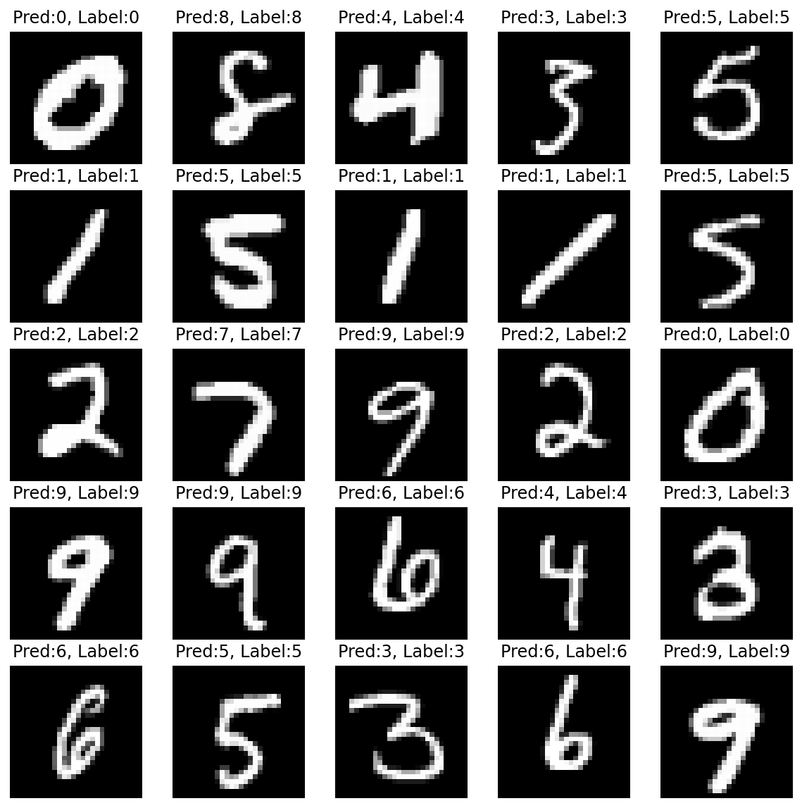

# Convolutional Neural Network (CNN) 실습


```python
import numpy as np
import matplotlib.pyplot as plt
import torch
import torch.nn as nn
import torch.optim as optim
import torch.nn.functional as F
%matplotlib inline
%config InlineBackend.figure_format='retina'
print ("PyTorch version:[%s]."%(torch.__version__))
device = torch.device('cuda:0' if torch.cuda.is_available() else 'cpu')
print ("device:[%s]."%(device))
```

    PyTorch version:[1.7.0+cu101].
    device:[cuda:0].


### Dataset


```python
from torchvision import datasets,transforms
mnist_train = datasets.MNIST(root='./data/',train=True,transform=transforms.ToTensor(),download=True)
mnist_test = datasets.MNIST(root='./data/',train=False,transform=transforms.ToTensor(),download=True)
print ("mnist_train:\n",mnist_train,"\n")
print ("mnist_test:\n",mnist_test,"\n")
print ("Done.")
```

    Downloading http://yann.lecun.com/exdb/mnist/train-images-idx3-ubyte.gz to ./data/MNIST/raw/train-images-idx3-ubyte.gz


    HBox(children=(FloatProgress(value=1.0, bar_style='info', max=1.0), HTML(value='')))


    Extracting ./data/MNIST/raw/train-images-idx3-ubyte.gz to ./data/MNIST/raw
    Downloading http://yann.lecun.com/exdb/mnist/train-labels-idx1-ubyte.gz to ./data/MNIST/raw/train-labels-idx1-ubyte.gz


    HBox(children=(FloatProgress(value=1.0, bar_style='info', max=1.0), HTML(value='')))


    Extracting ./data/MNIST/raw/train-labels-idx1-ubyte.gz to ./data/MNIST/raw
    Downloading http://yann.lecun.com/exdb/mnist/t10k-images-idx3-ubyte.gz to ./data/MNIST/raw/t10k-images-idx3-ubyte.gz


    HBox(children=(FloatProgress(value=1.0, bar_style='info', max=1.0), HTML(value='')))


    Extracting ./data/MNIST/raw/t10k-images-idx3-ubyte.gz to ./data/MNIST/raw
    Downloading http://yann.lecun.com/exdb/mnist/t10k-labels-idx1-ubyte.gz to ./data/MNIST/raw/t10k-labels-idx1-ubyte.gz


    HBox(children=(FloatProgress(value=1.0, bar_style='info', max=1.0), HTML(value='')))


    Extracting ./data/MNIST/raw/t10k-labels-idx1-ubyte.gz to ./data/MNIST/raw
    Processing...
    
    
    
    
    Done!
    mnist_train:
     Dataset MNIST
        Number of datapoints: 60000
        Root location: ./data/
        Split: Train
        StandardTransform
    Transform: ToTensor() 
    
    mnist_test:
     Dataset MNIST
        Number of datapoints: 10000
        Root location: ./data/
        Split: Test
        StandardTransform
    Transform: ToTensor() 
    
    Done.


    /usr/local/lib/python3.6/dist-packages/torchvision/datasets/mnist.py:480: UserWarning: The given NumPy array is not writeable, and PyTorch does not support non-writeable tensors. This means you can write to the underlying (supposedly non-writeable) NumPy array using the tensor. You may want to copy the array to protect its data or make it writeable before converting it to a tensor. This type of warning will be suppressed for the rest of this program. (Triggered internally at  /pytorch/torch/csrc/utils/tensor_numpy.cpp:141.)
      return torch.from_numpy(parsed.astype(m[2], copy=False)).view(*s)


### Data Iterator


```python
BATCH_SIZE = 256
train_iter = torch.utils.data.DataLoader(mnist_train,batch_size=BATCH_SIZE,shuffle=True,num_workers=1)
test_iter = torch.utils.data.DataLoader(mnist_test,batch_size=BATCH_SIZE,shuffle=True,num_workers=1)
print ("Done.")
```

    Done.


### Define Model


```python
class ConvolutionalNeuralNetworkClass(nn.Module):
    """
        Convolutional Neural Network (CNN) Class
    """
    def __init__(self,name='cnn',xdim=[1,28,28], # channel 1개, 28 by 28
                 ksize=3,cdims=[32,64],hdims=[1024,128],ydim=10,
                 USE_BATCHNORM=False):
        super(ConvolutionalNeuralNetworkClass,self).__init__()
        self.name = name
        self.xdim = xdim
        self.ksize = ksize
        self.cdims = cdims
        self.hdims = hdims
        self.ydim = ydim
        self.USE_BATCHNORM = USE_BATCHNORM

        # Convolutional layers
        self.layers = []
        prev_cdim = self.xdim[0] # 입력된 data의 채널 개수
        for cdim in self.cdims: # for each hidden layer
            self.layers.append(
                nn.Conv2d(
                    # FILL IN HERE
                    in_channels = prev_cdim, # 입력 channel 개수
                    out_channels = cdim, # 출력 channel 개수
                    kernel_size = self.ksize,
                    stride = (1, 1),
                    padding = self.ksize // 2 # input의 크기를 유지할 수 있도록 반드시 지정해야 함
                )) # convlution 
            if self.USE_BATCHNORM:
                self.layers.append(nn.BatchNorm2d(cdim)) # batch-norm
            self.layers.append(nn.ReLU(True))  # activation
            self.layers.append(nn.MaxPool2d(kernel_size=(2,2), stride=(2,2))) # max-pooling 
            self.layers.append(nn.Dropout2d(p=0.5))  # dropout
            prev_cdim = cdim

        # Dense layers
        self.layers.append(nn.Flatten()) # 2차원 -> 1차원
        prev_hdim = prev_cdim*(self.xdim[1]//(2**len(self.cdims)))*(self.xdim[2]//(2**len(self.cdims)))
        for hdim in self.hdims:
            self.layers.append(nn.Linear(
                # FILL IN HERE
                prev_hdim,
                hdim
            ))
            self.layers.append(nn.ReLU(True))  # activation
            prev_hdim = hdim
        # Final layer (without activation)
        self.layers.append(nn.Linear(prev_hdim,self.ydim,bias=True))

        # Concatenate all layers 
        self.net = nn.Sequential()
        for l_idx,layer in enumerate(self.layers):
            layer_name = "%s_%02d"%(type(layer).__name__.lower(),l_idx)
            self.net.add_module(layer_name,layer)
        self.init_param() # initialize parameters
        
    def init_param(self):
        for m in self.modules():
            if isinstance(m,nn.Conv2d): # init conv
                nn.init.kaiming_normal_(m.weight)
                nn.init.zeros_(m.bias)
            elif isinstance(m,nn.BatchNorm2d): # init BN
                nn.init.constant_(m.weight,1)
                nn.init.constant_(m.bias,0)
            elif isinstance(m,nn.Linear): # lnit dense
                nn.init.kaiming_normal_(m.weight)
                nn.init.zeros_(m.bias)
            
    def forward(self,x):
        return self.net(x)

C = ConvolutionalNeuralNetworkClass(
    name='cnn',xdim=[1,28,28],ksize=3,cdims=[32,64],
    hdims=[32],ydim=10).to(device)
loss = nn.CrossEntropyLoss()
optm = optim.Adam(C.parameters(),lr=1e-3)
print ("Done.")
```

    Done.


### Check Parameters


```python
np.set_printoptions(precision=3)
n_param = 0
for p_idx,(param_name,param) in enumerate(C.named_parameters()):
    if param.requires_grad:
        param_numpy = param.detach().cpu().numpy() # to numpy array 
        n_param += len(param_numpy.reshape(-1))
        print ("[%d] name:[%s] shape:[%s]."%(p_idx,param_name,param_numpy.shape))
        print ("    val:%s"%(param_numpy.reshape(-1)[:5]))
print ("Total number of parameters:[%s]."%(format(n_param,',d')))
```

    [0] name:[net.conv2d_00.weight] shape:[(32, 1, 3, 3)].
        val:[ 0.072 -0.286 -0.3    0.571  0.241]
    [1] name:[net.conv2d_00.bias] shape:[(32,)].
        val:[0. 0. 0. 0. 0.]
    [2] name:[net.conv2d_04.weight] shape:[(64, 32, 3, 3)].
        val:[-0.062  0.032 -0.141  0.046 -0.072]
    [3] name:[net.conv2d_04.bias] shape:[(64,)].
        val:[0. 0. 0. 0. 0.]
    [4] name:[net.linear_09.weight] shape:[(32, 3136)].
        val:[-0.016 -0.042  0.051 -0.034  0.001]
    [5] name:[net.linear_09.bias] shape:[(32,)].
        val:[0. 0. 0. 0. 0.]
    [6] name:[net.linear_11.weight] shape:[(10, 32)].
        val:[-0.451  0.115 -0.126 -0.238 -0.267]
    [7] name:[net.linear_11.bias] shape:[(10,)].
        val:[0. 0. 0. 0. 0.]
    Total number of parameters:[119,530].


### Simple Forward Path of the CNN Model


```python
np.set_printoptions(precision=3)
torch.set_printoptions(precision=3)
x_numpy = np.random.rand(2,1,28,28)
x_torch = torch.from_numpy(x_numpy).float().to(device)
y_torch = C.forward(x_torch) # forward path
y_numpy = y_torch.detach().cpu().numpy() # torch tensor to numpy array
print ("x_torch:\n",x_torch)
print ("y_torch:\n",y_torch)
print ("\nx_numpy %s:\n"%(x_numpy.shape,),x_numpy)
print ("y_numpy %s:\n"%(y_numpy.shape,),y_numpy)
```

    x_torch:
     tensor([[[[2.326e-01, 2.439e-01, 4.910e-01,  ..., 4.319e-01, 2.932e-01,
               5.933e-01],
              [5.589e-02, 9.257e-01, 5.604e-01,  ..., 2.109e-01, 9.219e-01,
               8.676e-02],
              [4.784e-01, 4.785e-01, 4.877e-01,  ..., 5.464e-01, 6.364e-01,
               1.433e-01],
              ...,
              [7.281e-01, 1.301e-01, 9.357e-01,  ..., 4.666e-01, 7.352e-02,
               1.571e-01],
              [6.681e-01, 6.905e-01, 6.400e-01,  ..., 9.424e-01, 4.573e-01,
               1.215e-01],
              [2.343e-01, 5.673e-01, 4.526e-01,  ..., 5.294e-01, 8.619e-01,
               6.545e-01]]],
    
    
            [[[9.592e-01, 7.656e-01, 8.560e-01,  ..., 7.799e-01, 4.376e-01,
               3.072e-01],
              [7.980e-01, 8.741e-01, 3.119e-01,  ..., 2.683e-01, 6.916e-01,
               8.876e-01],
              [2.653e-01, 3.727e-04, 3.428e-01,  ..., 2.592e-01, 2.753e-01,
               1.683e-01],
              ...,
              [9.444e-01, 7.607e-01, 8.293e-01,  ..., 4.360e-01, 5.233e-02,
               7.157e-01],
              [4.434e-01, 5.999e-01, 8.291e-02,  ..., 2.590e-01, 7.338e-01,
               5.646e-01],
              [7.254e-01, 1.226e-01, 9.340e-01,  ..., 9.362e-01, 9.168e-01,
               7.909e-01]]]], device='cuda:0')
    y_torch:
     tensor([[-2.770, -2.407,  1.414, -3.300,  1.159,  1.484,  0.250,  0.910, -1.126,
              1.239],
            [-5.603, -7.706, -3.076, -1.367, -0.076,  1.821, -0.323, -0.511,  0.864,
              1.094]], device='cuda:0', grad_fn=<AddmmBackward>)
    
    x_numpy (2, 1, 28, 28):
     [[[[2.326e-01 2.439e-01 4.910e-01 ... 4.319e-01 2.932e-01 5.933e-01]
       [5.589e-02 9.257e-01 5.604e-01 ... 2.109e-01 9.219e-01 8.676e-02]
       [4.784e-01 4.785e-01 4.877e-01 ... 5.464e-01 6.364e-01 1.433e-01]
       ...
       [7.281e-01 1.301e-01 9.357e-01 ... 4.666e-01 7.352e-02 1.571e-01]
       [6.681e-01 6.905e-01 6.400e-01 ... 9.424e-01 4.573e-01 1.215e-01]
       [2.343e-01 5.673e-01 4.526e-01 ... 5.294e-01 8.619e-01 6.545e-01]]]
    
    
     [[[9.592e-01 7.656e-01 8.560e-01 ... 7.799e-01 4.376e-01 3.072e-01]
       [7.980e-01 8.741e-01 3.119e-01 ... 2.683e-01 6.916e-01 8.876e-01]
       [2.653e-01 3.727e-04 3.428e-01 ... 2.592e-01 2.753e-01 1.683e-01]
       ...
       [9.444e-01 7.607e-01 8.293e-01 ... 4.360e-01 5.233e-02 7.157e-01]
       [4.434e-01 5.999e-01 8.291e-02 ... 2.590e-01 7.338e-01 5.646e-01]
       [7.254e-01 1.226e-01 9.340e-01 ... 9.362e-01 9.168e-01 7.909e-01]]]]
    y_numpy (2, 10):
     [[-2.77  -2.407  1.414 -3.3    1.159  1.484  0.25   0.91  -1.126  1.239]
     [-5.603 -7.706 -3.076 -1.367 -0.076  1.821 -0.323 -0.511  0.864  1.094]]


### Evaluation Function


```python
def func_eval(model,data_iter,device):
    with torch.no_grad():
        n_total,n_correct = 0,0
        model.eval() # evaluate (affects DropOut and BN)
        for batch_in,batch_out in data_iter:
            y_trgt = batch_out.to(device)
            model_pred = model(batch_in.view(-1,1,28,28).to(device))
            _,y_pred = torch.max(model_pred.data,1)
            n_correct += (y_pred==y_trgt).sum().item()
            n_total += batch_in.size(0)
        val_accr = (n_correct/n_total)
        model.train() # back to train mode 
    return val_accr
print ("Done")
```

    Done


### Initial Evaluation


```python
C.init_param() # initialize parameters
train_accr = func_eval(C,train_iter,device)
test_accr = func_eval(C,test_iter,device)
print ("train_accr:[%.3f] test_accr:[%.3f]."%(train_accr,test_accr))
```

    train_accr:[0.129] test_accr:[0.129].


### Train


```python
print ("Start training.")
C.init_param() # initialize parameters
C.train() # to train mode 
EPOCHS,print_every = 10,1
for epoch in range(EPOCHS):
    loss_val_sum = 0
    for batch_in,batch_out in train_iter:
        # Forward path
        y_pred = C.forward(batch_in.view(-1,1,28,28).to(device))
        loss_out = loss(y_pred,batch_out.to(device))
        # Update
        # FILL IN HERE      # reset gradient 
        optm.zero_grad()
        # FILL IN HERE      # backpropagate
        loss_out.backward()
        # FILL IN HERE      # optimizer update
        optm.step()
        loss_val_sum += loss_out
    loss_val_avg = loss_val_sum/len(train_iter)
    # Print
    if ((epoch%print_every)==0) or (epoch==(EPOCHS-1)):
        train_accr = func_eval(C,train_iter,device)
        test_accr = func_eval(C,test_iter,device)
        print ("epoch:[%d] loss:[%.3f] train_accr:[%.3f] test_accr:[%.3f]."%
               (epoch,loss_val_avg,train_accr,test_accr))
print ("Done")
```

    Start training.
    epoch:[0] loss:[0.580] train_accr:[0.952] test_accr:[0.953].
    epoch:[1] loss:[0.189] train_accr:[0.973] test_accr:[0.973].
    epoch:[2] loss:[0.134] train_accr:[0.979] test_accr:[0.978].
    epoch:[3] loss:[0.110] train_accr:[0.983] test_accr:[0.982].
    epoch:[4] loss:[0.095] train_accr:[0.985] test_accr:[0.982].
    epoch:[5] loss:[0.083] train_accr:[0.987] test_accr:[0.985].
    epoch:[6] loss:[0.076] train_accr:[0.988] test_accr:[0.985].
    epoch:[7] loss:[0.069] train_accr:[0.989] test_accr:[0.987].
    epoch:[8] loss:[0.066] train_accr:[0.990] test_accr:[0.988].
    epoch:[9] loss:[0.062] train_accr:[0.991] test_accr:[0.988].
    Done


### Test


```python
n_sample = 25
sample_indices = np.random.choice(len(mnist_test.targets),n_sample,replace=False)
test_x = mnist_test.data[sample_indices]
test_y = mnist_test.targets[sample_indices]
with torch.no_grad():
    C.eval() # to evaluation mode 
    y_pred = C.forward(test_x.view(-1,1,28,28).type(torch.float).to(device)/255.)
y_pred = y_pred.argmax(axis=1)
plt.figure(figsize=(10,10))
for idx in range(n_sample):
    plt.subplot(5, 5, idx+1)
    plt.imshow(test_x[idx], cmap='gray')
    plt.axis('off')
    plt.title("Pred:%d, Label:%d"%(y_pred[idx],test_y[idx]))
plt.show()    
print ("Done")
```


    

    


    Done


* MLP를 사용했을 때보다 generalization performance가 향상된 것을 확인할 수 있다
