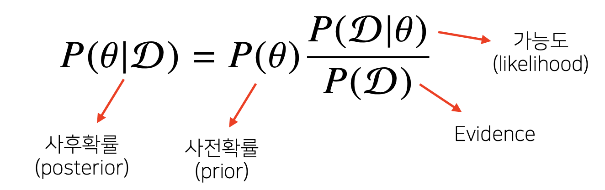
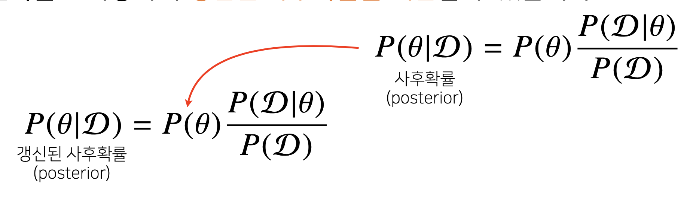
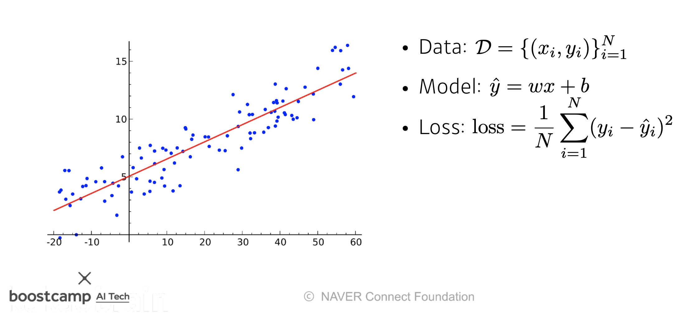
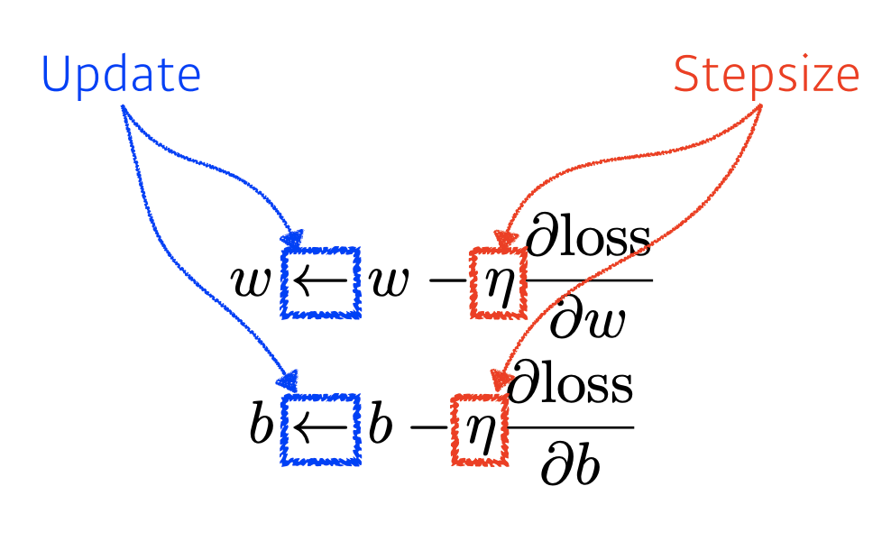
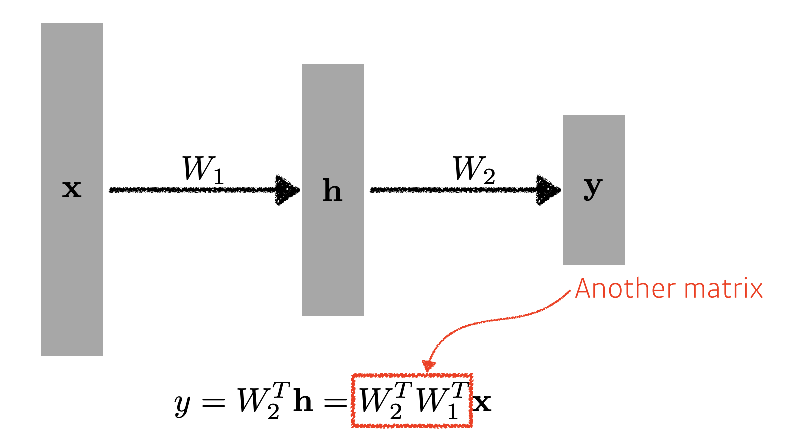
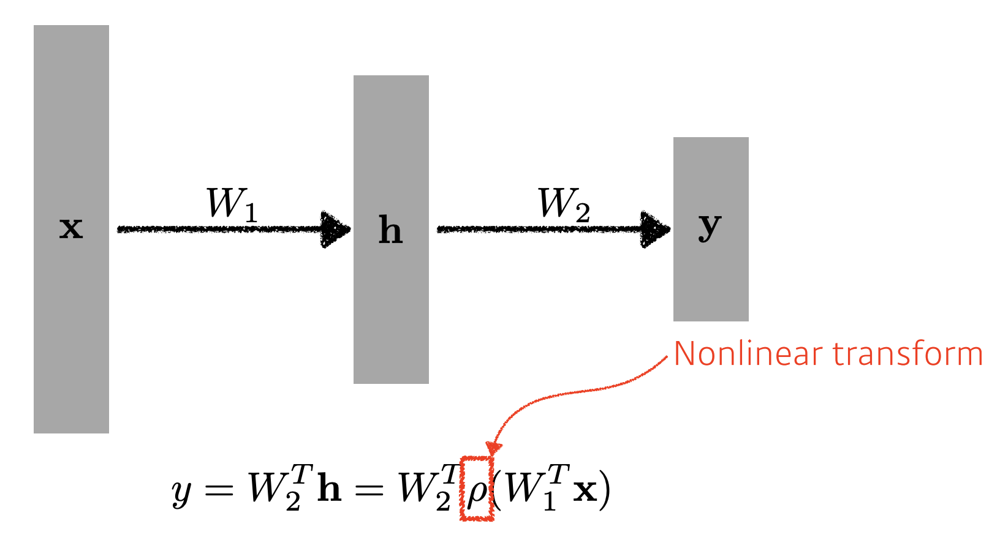
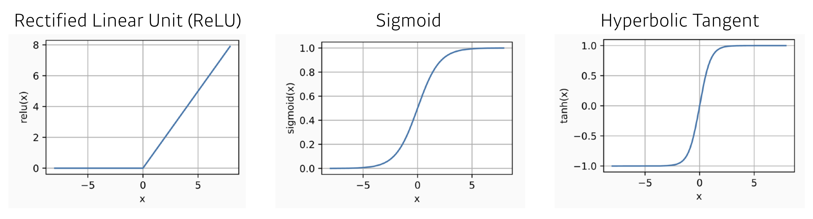
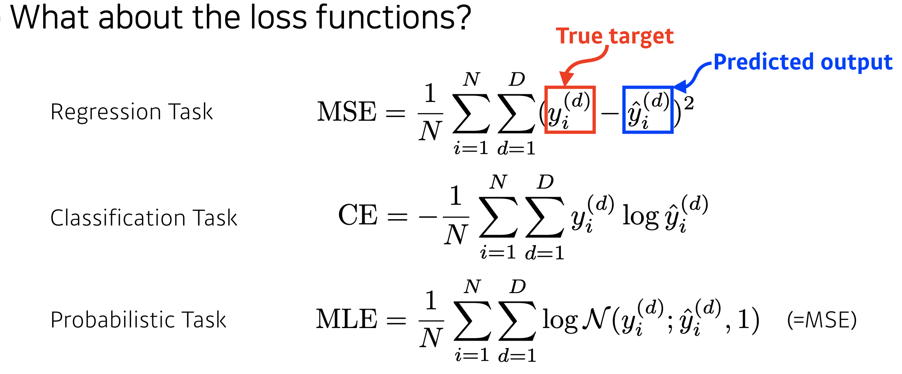

# Day 11 - 베이즈 통계학, Pytorch, Deep learning 기본 용어 설명, MLP

## 베이즈 통계학

### 조건부 확률  

  $P(A|B) = {P(A \cap B)\over{P(B)}}$

### 베이즈 정리

* 위의 조건부 확률을 이용하여 다음과 같이 베이즈 정리를 유도함  
  $P(B \cap A) = P(B|A)P(A)$  
  $P(A \cap B) = P(A|B)P(B)$  
  $P(B|A)P(A) = P(A|B)P(B)$  
  $P(B|A) = {P(A|B)P(B)\over{P(A)}}$  

* $D$ : 관측된 데이터
* $\theta$ : parameter(모수)
* 사후 확률 : 데이터 $D$가 관측되었을 때 parameter가 $\theta$ 였을 확률
* 사전 확률 : 데이터 $D$가 아직 관측되지 않은 단계에서 parameter가 $\theta$ 일 것이라는 확신의 정도 - 지식과 경험 등 다양한 정보를 이용해 추정함
* 가능도 : parameter가 $\theta$ 일 때 $D$ 라는 데이터를 관측할 확신의 정도. 다만 이미 결과는 나와있으므로 확률이 아닌 가능도라고 함.
* evidence : 데이터의 분포

  베이즈 정리를 이용하면 특정 질병에 걸렸다고 검진결과가 나왔을 떄 정말로 그 질병에 걸렸을 확률 등을 구할 수 있음

### 베이즈 갱신

* 새로운 데이터가 관측될 때마다 그것을 반영해 다시 추정함으로써 보다 정확한 사후확률을 계산하는 것
* 이전에 베이즈 정리를 통해 구했던 사후 확률을 사전확률로 해서 다시 추정하면 된다

### 인과관계

* 인과관계를 기반으로 예측하면 데이터 분포의 변화에 강건한 예측 모형을 만들 수 있음
  * 이렇게 만든 모형은 데이터의 분포가 바뀌어도 정확도는 크게 변하지 않음
* 인과관계를 알아내기 위해서는 반드시 중첩요인의 효과를 제거해야 함

## Deep learning 기본 용어 설명

### Deep Learning의 Key Components

* data
* model
* loss function
  * regression task (회귀 문제) - MSE (Mean Squared Error)
  * classification task (분류 문제) - Cross Entropy
  * probabilistic task (확률 문제) - MLE (Maximum Likelihood estimation)  
  
  이 loss function들이 적절하지 않을 때도 있음. 상황과 모델에 맞게 적절한 loss function을 찾아 사용해야함.
* optimization algorithm

## MLP

### Linear Neural Network  
  

* $x$는 data, $y$는 정답, $\hat{y}$은 예측값
* 입력과 출력을 이어주는 직선
* 우리가 원하는 결과를 내는 선을 찾아야 함
* w와 b를 조절해 우리가 원하는 선을 찾는다 - linear regression 이용
  
  
### Multi-Layer Perception

* 위의 Linear Neural Network를 여러 층으로 쌓음
  
  이렇게 단순히 Linear Neural Network를 여러 층으로 쌓는것은 행렬 곱에 불과함.  
  이건 1-layer neural network와 다를게 없음

* 그래서 층마다 Nonlinear transform을 추가함
  
  이렇게 되면 다양한 형태의 함수들을 표현할 수 있게됨.  
  이것을 hidden layer라고 함
  

* Multilayer Feedforward Networks are Universal Approximators
  * hidden layer가 하나만 있는 network로 대부분의 measurable function에 근사할 수 있음.
  * 이론상으로는 가능하지만 우리가 원하는 network를 찾는 것은 어려움 - 여러 층으로 쌓는 이유

* loss functions  
  각 문제별 loss function은 다음과 같음
  
  하지만 항상 이 loss function들을 쓰는 것이 정답은 아니다

## MLP 실습

[여기](./MLP%20실습/MLP%20실습.md)에 따로 정리