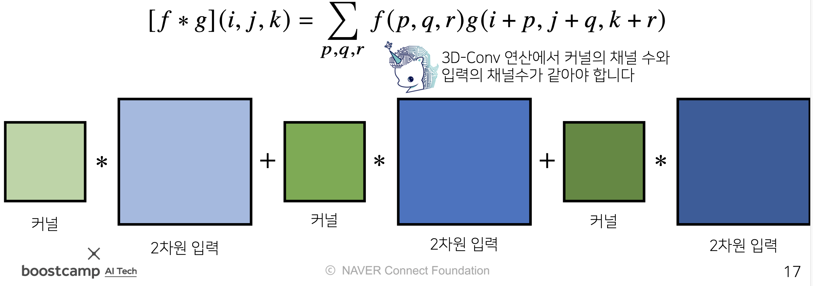
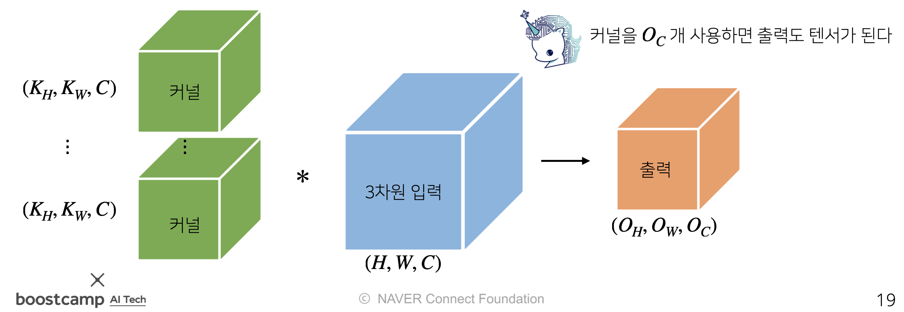

# Day 12 - Optimization, CNN

## CNN (convolutional neural network)

* convolution 연산은 kernel을 입력벡터 상에서 움직여가며 선형모데로가 합성함수가 적용되는 구조
* **kernel의 위치만 바뀔 뿐 값이 달라지지 않음**
    
* convolution 연산의 수학적 의미는 kernel을 이용해 신호를 국소적으로 증폭 또는 감소시켜 정보를 추출, 필터링 하는 것
* 영상처리에서는 convolution을 이용해 필터를 씌우거나 특정 부분이 강조되게 하는 등 보정에 이용 (kernel의 종류에 따라 효과가 달라짐)  
  예시) https://setosa.io/ev/image-kernels/
* convolution 연산은 다양한 1차원뿐 아니라 다양한 차원에서 가능함
* 2차원에서의 convolution 연산은 다음과 같음
    
    element-wise multiplication을 한 뒤 값들을 모두 더함
* 출력 크기는 다음과 같이 계산할 수 있음
    
* 3차원(channel이 여러개인 2차원 입력) convolution 연산은 2차원 convolution 연산을 여러번 적용하고, 그 값을 다 더해준다고 생각하면 됨
* color image에 이 방법을 사용함
    
    
* 이렇게 연산하면 결과는 channel이 1개가 됨
* 결과로 여러개의 channel이 나오길 원한다면 kernel을 여러개 만들면 됨
    
* convolution 연산의 역전파  
  역전파를 계산할 때도 convolution 연산이 나온다
    
    
    
  
  

## Optimization

### important concepts in optimization  

* generalization
  * training data에서의 성능과 test data에서 성능의 차이를 generalization이라고 함
    
* underfitting & overfitting
  * over fitting은 model이 training data에서는 잘 작동하지만 test data에서는 잘 작동하지 않는 것
  * under fitting은 학습 data에서도 잘 작동하지 않는 것
      
* cross validation (k-fold validation)
  * model을 평가하기 위한 validation technique. 
  * 학습 과정에서는 어떠한 이유에서든 test data는 절대로 사용하면 안되기 때문에 validation data를 따로 정해서 이용한다
  * cross validation 방법은 다음과 같다.
    1. train data를 k개로 나눈다
    2. 이 중 k - 1개는 train data로 사용하고 나머지 1개는 validation data로 사용하여 학습하고, 검증한다
    3. validation data를 바꿔가며 1~2번을 k번 반복 
  * 위 과정을 통해 최적의 hyperparameter 값을 찾아낸다
  * 찾아낸 최적의 hyperparameter를 이용해 본격적인 training을 시작한다  
      
* bias-variance tradeoff
  * bias - 얼마나 일관적인 결과를 내는가
  * variance - 얼마나 true target에 접근했는가
    
  * 학습 data에 noise가 끼어있을 경우 bias를 줄이면 variance가 높아질 가능성이 크다, 반대로 variance를 줄이면 bias가 높아질 가능성이 크다
  * bias와 variance를 둘 다 줄이기는 어렵다
    
* bootstrapping
  * test data 중 일부만 뽑아서 test하는 것을 반복하여 여러 model을 만들어 활용하는 것
* bagging and boosting
  * bagging(bootstrapping aggregating) - bootstrapping으로 여러 모델을 만들고, 거기서 나온 결과들을 평균 내는 것
  * 여러개의 weak learner들을 sequential하게 붙여서 사용하는 것
    

## Practical Gradient Descent Methods

### Batch-size Matters

* batch size가 작을수록 flat minimizer가 되는 경향이 있다. flat minimizer는 generalization performance가 높음

위 그림을 보면 sharp minimizer는 약간만 멀어져도 값이 크기 바뀌는 반면, flat minimizer는 값이 별로 변하지 않는 것을 알 수 있다. 이것이 flat minimizer가 generalization performance가 높은 이유.

### Gradient Descent Methods

* stochastic gradient descent
* momentum
* Nesterov accelerated gradient
* Adagrad
* Adadelta
* RMSprop
* Adam

## Regularization

* Regularization은 의도적으로 학습을 방해해 overfitting을 방지하는 것임

### early stopping

* overfitting 되기 전에 학습을 멈춘다 (validation data를 이용함)
    

### parameter norm penalty

* parameter의 크기가 커지지 않도록 하는 것
* 부드러운 함수일수록 generalization performance가 높을 것임
* parameter 크기가 작을수록 부드러운 함수이므로 parameter의 크기를 제한한다

### data augmentation

* data의 개수가 많을수록 학습이 잘 되기 때문에 data를 늘리는 방법
* data의 label이 바뀌지 않을 정도로만 data를 변형시킨다
    

### noise robustness

* data와 weight에 noise를 넣는다
    

### label smoothing

* 데이터 2개를 섞는다
    

### dropout

* neural network의 몇몇 weight을 0으로 바꾼다
    

### batch normalization

* 적용하고자 하는 layer의 statistics를 정규화 한다

## Optimization 실습

[여기](./optimization%20실습/optimization%20실습.md)에 따로 정리