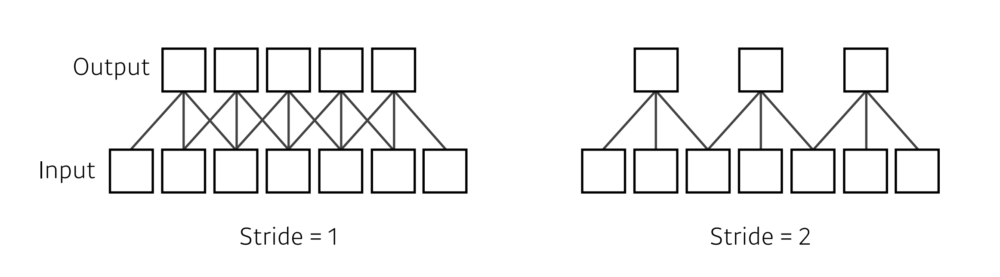
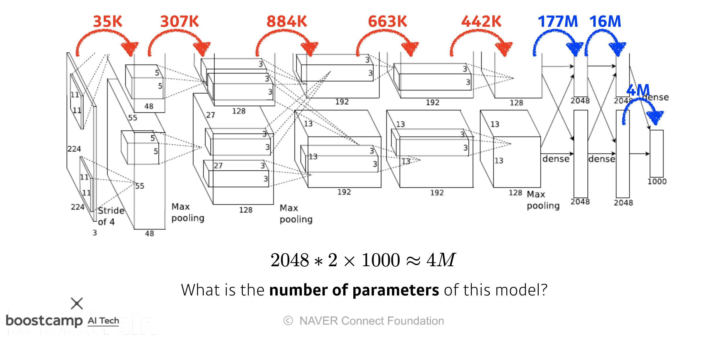

# Day 13 - CNN, Modern CNN, Computer vision applications

## CNN

### stack of convolutions

* convolution 연산을 여러 층으로 쌓는다
* MLP와 마찬가지로 한번 convolution 연산을 한 뒤에는 non-linear activation function을 사용한다

### Convolutional neural networks

#### layer

* CNN은 3가지 layer로 구성되어있다
  * convolution layer
  * pooling layer
  * fully connected layer
* 이 중 convolution layer와 pooling layer는 feature extraction에 사용되고, fully connected layer는 decision making에 사용된다  

#### parameter

* parameter의 개수가 매우 중요하다 - parameter 개수를 파악할 수 있는 능력과 감을 갖춰야 함
* parameter의 개수는 적을수록 좋다
* parameter가 많으면...
  * 학습이 어려워 진다
  * generalization performance가 떨어진다
* fully connected layer는 매우 많은 parameter를 필요로 하기 때문에 점점 없어지는 추세이다
* kernel이 작을수록 parameter 개수가 줄어들기 때문에 크기가 큰 kernel은 잘 사용하지 않음 (커봐야 7 x 7)

#### stride

* 지난 CNN 첫걸음 수업에서 부터 지금까지 봤던 모든 convolution 연산은 다 stride = 1 인 연산이었다
* stride = n 이라면 n칸씩 이동하며 convolution 연산을 수행한다

#### padding

* 그냥 convolution 연산을 하게 되면 tensor의 가장자리에는 convolution 연산을 할 수 없어 size가 점점 줄어들게 된다
* 이를 방지하여 기존의 size를 계속 유지할 수 있도록 padding을 이용한다
* kernel이 커지면 padding도 커져야 한다
  * padding.size = kernel.size // 2

#### parameter 수 계산

* parameter의 수를 계산할 줄 아는 것이 매우 중요하다
* 입/출력 channel의 수와 kernel의 size를 고려하면 된다

#### 1 x 1 convolution

* 한 pixel에 대한 convolution 연산
* channel의 수를 줄일 수 있다
* channel의 수를 줄이면 parameter의 수가 줄어듦
* network의 parameter 수는 줄이고, depth는 늘림

## Modern CNN

### key takeaways

* AlexNet
  * ReLu Activation
    * vanishing gradient problem 해결
  * GPU implementation
  * Overlapping pooling
  * Data Augmentation
  * Dropout
  * 지금 보면 당연한 것들이지만 그 당시엔 아니었음
* VGG
  * 3 x 3 convolution filter
  * 왜 3 x 3 convolution을 사용하는가?
    * parameter 수를 줄일 수 있음   
    
* GoogLeNet
  * 1 x 1 convolution - channel-wise dimension reduction
* ResNet
  * skip connection - 층을 더 깊게 쌓을 수 있게 해줌
* DensNet
  * concatenation

## Computer vision

### semantic segmentation

* 이미지 상의 물체들을 픽셀단위로 분류하는 것
* 자율 주행, ADAS 등에 쓰임

* fully convolutional network
  * CNN 뒷단의 dense layer를 없애고 convolutional layer로 network를 구성한다
  * tensor 형태로 output이 나오게 되기 때문에 heatmap 등의 더 많은 정보를 담은 결과물을 얻을 수 있게 된다
  

* deconvolution
  * fully convolutional network은 input보다 크기가 줄어들은 output을 내놓는다
  * 줄어들었던 output을 다시 키우는데 deconvolution을 사용한다
  * 완전한 복원은 불가능 하다  
  

### detection

* 이미지에서 객체의 타입과 위치를 감지하고 표시한다

* R-CNN
  * boundary box를 여러개 뽑아놓은 뒤 일일이 검사하여 분류함
  * 모든 boundary box를 확인해야 하기 때문에 시간이 매우 오래걸림

* SPPNet
  * 이미지 하나를 통째로 neural network에 돌린 뒤, box의 범위에 해당하는 값들을 추출해서 확인한다
  * R-CNN 보다는 빠르지만, box의 범위에 해당하는 모든 값을 추출해서 확인해야 하기 때문에 여전히 오래걸림

* Fast R-CNN
  * SPPNet과 유사함
  * 뒷단에서 neural network를 통해 classification을 하는 것이 SPPNet과의 차이점

* Faster R-CNN
  * region proposal network 이용해 bounding box를 뽑는다
  * Region proposal network
    * 물체가 있을 것 같은 영역을 뽑아준다
    * bounding box의 크기를 미리 정해둠
    * 필요한 만큼 bounding box를 늘리거나 줄임

* YOLO (v1)
  * boundary box를 따로 뽑지 않음 
  * boundary box를 찾는것과 무엇인지 분류하는 것을 동시에 진행함
  * 속도가 매우 빠름

## CNN 실습

[여기](./CNN%20실습/CNN%20실습.md)에 따로 정리