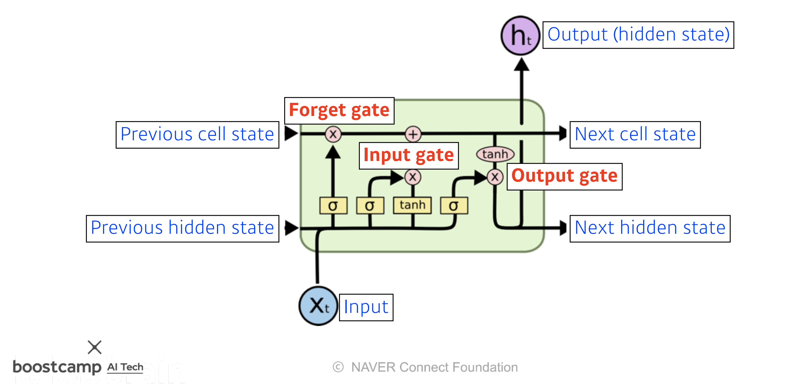

# Day 14 - RNN, Transformer

## Sequential Models, RNN

### Sequential Models

* 소리, 문자열, 주가 등의 시간 순서에 따라 나열된 시계열(time series) 데이터를 sequence data라고 한다
* sequence data는 앞뒤 맥락 없이는 정확히 예측할 수 없다
* 조건부 확률과 베이즈 정리를 이용하면 이전 sequence의 정보를 가지고 앞으로 발생할 데이터의 확률 분포를 구할 수 있다
  

* sequence data는 입력의 차원을 알 수 없음
* 따라서 sequence data를 다루기 위해선 길이가 가변적인 데이터를 다룰 수 있는 model이 필요함
  
* 고정된 길이만큼의 sequence만 사용하는 경우 오래전 data는 고려되지 않는다
  

### RNN (Recurrent Neural Network)

* 다음과 같이 과거의 정보를 한데 묶어 (잠재변수로 인코딩) 가변길이 data를 고정길이 data처럼 사용하는 방법도 있다
* 이렇게 잠재변수(hidden state)를 **반복 사용**하여 시퀀스 데이터의 패턴을 학습하는 모델이 RNN(Recurrent Neural Network)이다
  
  
  
  

* RNN의 역전파는 다음과 같이 이루어지며, 이를 Backpropagation Through Time(BPTT)이라 한다
  
* RNN의 가중치 행렬의 미분을 계산해보면 다음과 같은 식이 나오고, 여기엔 기울기가 소실되거나, 매우 커질 수 있다는 문제점이 있다
* sigmoid, tanh를 activation으로 사용할 경우 gradient가 매우 작아진다
* ReLU를 사용할 경우 gradient가 매우 커진다
* 이러한 문제 때문에 오래 전의 data는 제대로 이용하지 못한다
  
  
* 이 문제점을 해결하기 위해 등장한 것이 LSTM와 GRU이다

### LSTM (Long Short Term Memory)

* 그냥 RNN을 사용했을 때 기울기가 소실되거나, 매우 커질 수 있다는 문제점을 해결하기 위해 등장했다
* 기존의 RNN은 다음과 같이 구성된다
  
* LSTM은 다음과 같이 구성된다
  

* LSTM을 자세히 들여다보면 다음과 같다
  
  * 3개의 입력
    * input
      * 새로운 input. ex) 단어
    * previous cell state
      * 이전 neural network layer에서 넘어오는 cell state
      * cell state는 과거의 정보를 취합해서 가지고 있음
    * previous hidden state
      * 이전 neural network layer의 output
  * 3개의 출력
    * output (hidden state)
      * network 밖으로 나가는 output
    * next cell state
      * 다음 neural network layer로 전달되는 cell state
    * next hidden state
      * 이번 layer의 output을 다음 layer로 전달하는 것
  * 3개의 gate
    * forget gate
      * 현재 layer에 들어온 input과 previous hidden state를 이용하여 previous cell state에서 버릴 정보를 결정한다.
      * sigmoid를 거치기 때문에 0 ~ 1 사이의 값이 된다
      
  
    * input gate
      * $i_t$는 현재 layer에 들어온 새로운 data 중에서 **어떤 것을 cell state에 올릴지 결정**한다. 
      * $\tilde{C}_t$는 **예비 cell state**. 
      * $i_t$와 $\tilde{C}_t$가 곱해져서 cell state에 올라갈 값이 결정됨
      

        cell state에서 버릴것은 버리고, 새 data 중 올릴것은 올리는 연산은 다음과 같이 일어난다.
    

    * output gate
      * cell state를 이용하여 현재 layer의 output을 계산한다
      

### GRU (Gated Recurrent Units)

* 2개의 gate만 있는 심플한 구조
* cell state가 없고, hidden state만 존재함
* 따라서 LSTM보다 parameter 수가 적음
* GRU가 LSTM보다 성능이 좋은 경우가 많다
* 하지만 요즘엔 더 성능이 좋은 Transformer를 많이 사용하는 추세이다

## Transformer

// TODO

## LSTM 실습

// TODO

## Transformer 실습

// TODO
