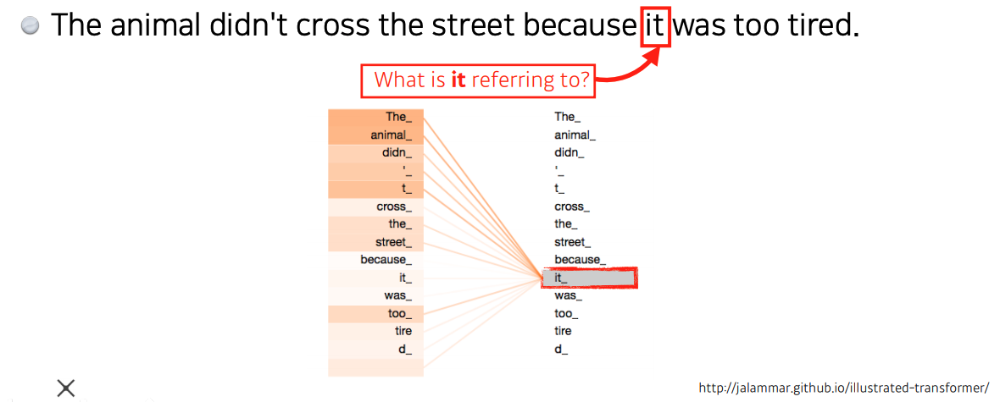

# Day 14 - RNN, Transformer

## Sequential Models, RNN

### Sequential Models

* 소리, 문자열, 주가 등의 시간 순서에 따라 나열된 시계열(time series) 데이터를 sequence data라고 한다
* sequence data는 앞뒤 맥락 없이는 정확히 예측할 수 없다
* 조건부 확률과 베이즈 정리를 이용하면 이전 sequence의 정보를 가지고 앞으로 발생할 데이터의 확률 분포를 구할 수 있다
  

* sequence data는 입력의 차원을 알 수 없음
* 따라서 sequence data를 다루기 위해선 길이가 가변적인 데이터를 다룰 수 있는 model이 필요함
  
* 고정된 길이만큼의 sequence만 사용하는 경우 오래전 data는 고려되지 않는다
  

### RNN (Recurrent Neural Network)

* 다음과 같이 과거의 정보를 한데 묶어 (잠재변수로 인코딩) 가변길이 data를 고정길이 data처럼 사용하는 방법도 있다
* 이렇게 잠재변수(hidden state)를 **반복 사용**하여 시퀀스 데이터의 패턴을 학습하는 모델이 RNN(Recurrent Neural Network)이다
  
  
  
  

* RNN의 역전파는 다음과 같이 이루어지며, 이를 Backpropagation Through Time(BPTT)이라 한다
  
* RNN의 가중치 행렬의 미분을 계산해보면 다음과 같은 식이 나오고, 여기엔 기울기가 소실되거나, 매우 커질 수 있다는 문제점이 있다
* sigmoid, tanh를 activation으로 사용할 경우 gradient가 매우 작아진다
* ReLU를 사용할 경우 gradient가 매우 커진다
* 이러한 문제 때문에 오래 전의 data는 제대로 이용하지 못한다
  
  
* 이 문제점을 해결하기 위해 등장한 것이 LSTM와 GRU이다

### LSTM (Long Short Term Memory)

* 그냥 RNN을 사용했을 때 기울기가 소실되거나, 매우 커질 수 있다는 문제점을 해결하기 위해 등장했다
* 기존의 RNN은 다음과 같이 구성된다
  
* LSTM은 다음과 같이 구성된다
  

* LSTM을 자세히 들여다보면 다음과 같다
  
  * 3개의 입력
    * input
      * 새로운 input. ex) 단어
    * previous cell state
      * 이전 neural network layer에서 넘어오는 cell state
      * cell state는 과거의 정보를 취합해서 가지고 있음
    * previous hidden state
      * 이전 neural network layer의 output
  * 3개의 출력
    * output (hidden state)
      * network 밖으로 나가는 output
    * next cell state
      * 다음 neural network layer로 전달되는 cell state
    * next hidden state
      * 이번 layer의 output을 다음 layer로 전달하는 것
  * 3개의 gate
    * forget gate
      * 현재 layer에 들어온 input과 previous hidden state를 이용하여 previous cell state에서 버릴 정보를 결정한다.
      * sigmoid를 거치기 때문에 0 ~ 1 사이의 값이 된다
      
  
    * input gate
      * $i_t$는 현재 layer에 들어온 새로운 data 중에서 **어떤 것을 cell state에 올릴지 결정**한다. 
      * $\tilde{C}_t$는 **예비 cell state**. 
      * $i_t$와 $\tilde{C}_t$가 곱해져서 cell state에 올라갈 값이 결정됨
      

        cell state에서 버릴것은 버리고, 새 data 중 올릴것은 올리는 연산은 다음과 같이 일어난다.
    

    * output gate
      * cell state를 이용하여 현재 layer의 output을 계산한다
      

### GRU (Gated Recurrent Units)

* 2개의 gate만 있는 심플한 구조
* cell state가 없고, hidden state만 존재함
* 따라서 LSTM보다 parameter 수가 적음
* GRU가 LSTM보다 성능이 좋은 경우가 많다
* 하지만 요즘엔 더 성능이 좋은 Transformer를 많이 사용하는 추세이다

## Transformer

* transformer는 RNN처럼 sequentioal data를 처리하는 model이다
* RNN과는 달리 재귀적 구조로 되어있지 않다
* transformer는 attention 이라는 구조를 활용한다
* RNN처럼 문장을 단어별로 끊어서 입력하는게 아니라, 문장을 통째로 입력한다
  
  

* 여기서 중요한 포인트는 3가지 이다
  1. 어떻게 n개의 단어를 한번에 처리하는가?
  2. encoder와 decoder간에 data를 어떻게 주고 받는가?
  3. decoder가 어떻게 generation 하는가?

* 이번 수업에서는 이 중 첫번째 topic과 attention 구조를 중심으로 다뤘다

### encoding
* encoding 과정은 다음과 같이 이루어진다
* transformer는 우선 각각의 단어를 embedding vector로 변환한다
  
* 변환된 embedding vector들을 Self-Attention에 넣으면 각 단어들간의 관계가 계산된다
  
* 각 단어들간의 관계를 계산하는 과정은 다음과 같다
* embedding vector 하나로 Query, Key, Value 총 3개의 vector를 계산해 낸다  
  (각각을 계산할 때는 3개의 neural network를 이용한다. 각각의 neural network의 가중치 벡터는 $W^Q$, $W^K$, $W^V$)
  
* 해당 단어의 Query vector와 모든 단어들의 Key vector를 곱하여 다른 단어들과 얼마나 관계가 있는지를 나타내는 Score를 계산한다
* 여기에서 중요한 것은 **다른 모든 단어들과 함께 연산을 한다는 것**이다. 이렇게 함으로서 똑같은 단어가 input으로 들어왔더라도, 주변 단어들에 따라 encoding된 값이 달라지게 된다
* 이 attention이라는 구조는 MLP보다 더 flexible한 model이고, 훨씬 많은 것을 표현할 수 있다
* 하지만 더 많은 computation을 필요로 하게 된다
  
  이 방법으로 "it"과 관계있는 단어가 무엇인지 계산된다
* Score를 Key vector의 차원으로 나누고, softmax 함수에 넣는다
* softmax를 취한 값과 Value vector를 곱한다
* 모든 Value vector x softmax의 결과 값들을 더해 해당 단어의 encoding된 vector를 최종적으로 얻는다
  

* 위의 과정은 다음의 사진과 같이 요약된다
  
  

* 지금까지의 설명은 Single-headed attention이었다.
* Multi-headed attention (MHA)은 한 단어에 대해 여러 attention이 위의 과정을 수행한다
* 따라서 결과로 나오는 Z 벡터도 여러개가 된다
  
* 이번 layer의 output을 다음 단계의 layer로 보내야 하기 때문에 여러개의 Z 벡터들을 한개로 합쳐야 한다
* 다음과 같이 행렬곱 연산을 통해 input보다 커져있는 output을 다시 input 크기로 줄인다
  
* 지금까지의 encoding 과정을 모두 요약하면 다음과 같다
  

* 하지만 이렇게 구한 값들에는 순서에 대한 정보가 없다
* 문장에서 단어의 순서를 바꿔도 나오는 결과 값은 동일하다
* 문장에서 단어의 순서는 매우 중요하다
* 그래서 positional encoding으로 특정 값을 더해서 단어의 순서를 만들어 준다
  

* encoder가 중첩된 구조이기 떄문에 위의 연산이 반복적으로 일어나게 된다
* 그 이후에는 encoding 과정에서 생성한 key vector와 value vector를 decoder에 전달한다
* encoding이 끝난 결과물로 나온 z vector도 decoder에 전달한다
* decoder는 번역된 문장을 만들어 낸다

* transformer나 attention 구조는 번역 이외에도 이미지 생성 등 다양한 분야에서 활용되고 있으므로 매우 중요하다

## LSTM 실습

// TODO

## Transformer 실습

// TODO
