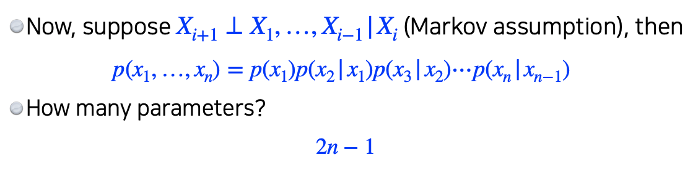
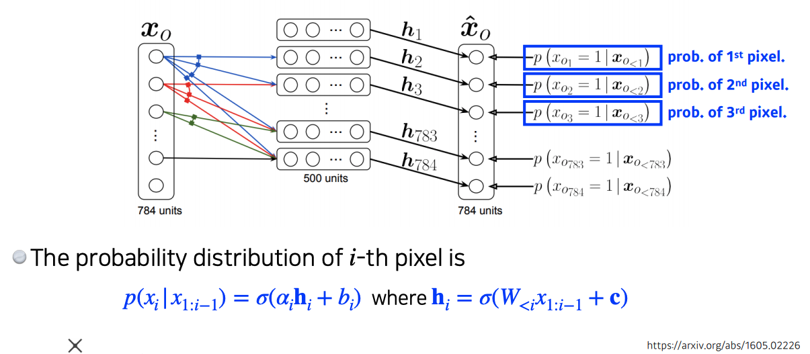
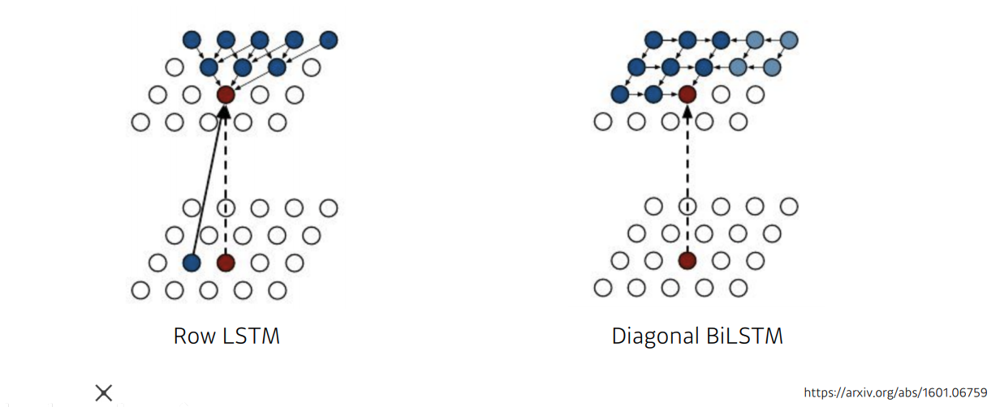

# Day 15 - Generative models

## Generative models

* generative model은 문장이나 그림 등을 만드는 model이다.
* 하지만 그 외에도 density estimation, unsupervised representation learning등을 할 수 있다

### Basic Discrete Distributions

* 베르누이 분포를 표현하는데는 1개의 숫자가 필요하다
  * 한개의 숫자만 있으면 나머지 하나는 유추해낼 수 있기 떄문
* n개의 카테고리가 있는 카테고리 분포는 n - 1개의 숫자로 표현할 수 있다
  * n - 1개를 알면 나머지 하나는 유추해낼 수 있기 때문

* 그럼 RGB 이미지 하나를 표현하는데는 몇개의 parameter가 필요할까?
  * R, G, B 각각은 256개의 값을 가질 수 있다
  * 따라서 한 pixel을 표현하는데 총 256 x 256 x 256 개의 경우의 수가 존재한다
  * 한 RGB pixel을 표현하는데는 255 x 255 x 255개의 parameter가 필요하다
  * RGB 이미지를 표현하는데는 너무 많은 parameter가 필요하다
* 흰색, 검은색 pixel만 존재하는 흑백 사진을 생각해보자
  * 사진이 n개의 pixel로 이루어졌다고 가정해보자
  * 이 사진을 표현하는 데는 $2^n$개의 경우의 수가 존재한다
  * 흑백 사진을 표현하는 데 필요한 parameter의 수는 $2^n - 1$개 이다.
  * 흑백 사진을 표현하는데도 여전히 많은 parameter가 필요하다
* 그러면 어떻게 parameter를 줄일 수 있을까?
* 흑백 사진의 모든 pixel들이 서로 독립적이라고 생각해보자
  * 이 사진을 표현하는데는 여전히 $2^n$개의 경우의 수가 있다
  * 하지만 모두 독립적이기 때문에 각각의 pixel을 따로 따로 생각해도 된다
  * pixel당 1개의 parameter가 필요하다
  * 모든 pixel이 서로 독립적이므로 n개의 parameter만 있으면 흑백사진을 표현할 수 있다
* 하지만 사진의 모든 pixel이 서로 독립적이라는 것은 말이 안되는 가정이다 (인접한 행렬은 유사한 색상일 것이다)
* 따라서 모든 pixel을 연관시켜 생각하는 것과, 독립적으로 생각하는 것 사이의 절충점을 찾아야 한다
* 조건부 독립을 이용하면 절충점을 찾을 수 있다
  
  z가 주어졌을 때 x와 y가 서로 독립적이라면, x와 y는 관계가 없기 때문에 y를 없앨 수 있다
* 이런 식으로 i번째 pixel은 i - 1번째 pixel에만 dependent 하다고 가정하면 다음과 같이 parameter의 개수를 줄일 수 있다
  
* Auto-regressive model들은은 이렇게 조견부 독립을 활용한다

### Auto-regressive Model

* 각각의 정보들이 이전에 나왔던 정보들에 dependent 한 것을 auto-regressive model 이라고 한다
  * $X_i$가 $X_{i - 1}$, $X_{i - 2}$, ..., $X_1$ 모두에 dependent 한것도 auto-regressive model이다
  * $X_i$가 $X_{i - 1}$에만 dependent 한 것도 auto-regressive model이다

#### NADE (Neural Auto-regressive Density Estimator)

* NADE는 확률을 계산하는 auto-regressive model이다
* 다음과 같은 방식으로 확률이 계산된다
  

#### Pixel RNN
* RNN을 이용해서 auto-regressive model을 정의할 수도 있다
* 다음과 같은 두가지 방식의 Pixel RNN model이 있다
  
  Row LSTM은 위쪽에 있는 정보들을 활용한다  
  Diagonal BiLSTM은 이전 정보들을 모두 활용한다

  // TODO