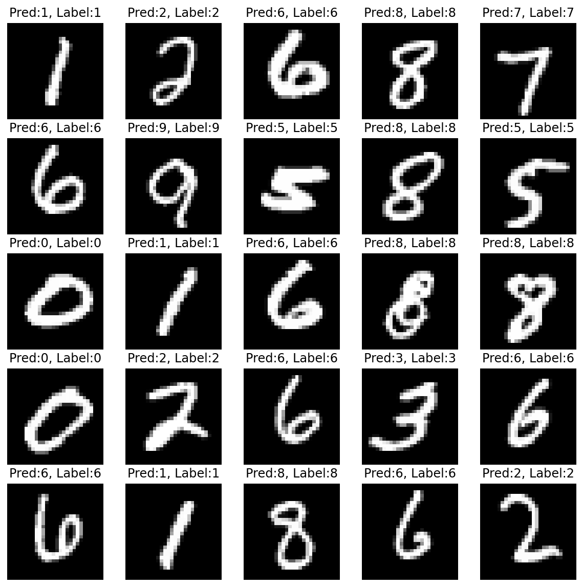

# Multilayer Perceptron (MLP) 실습

```python
import numpy as np
import matplotlib.pyplot as plt
import torch
import torch.nn as nn
import torch.optim as optim
import torch.nn.functional as F
%matplotlib inline
%config InlineBackend.figure_format='retina'
print ("PyTorch version:[%s]."%(torch.__version__))
device = torch.device('cuda:0' if torch.cuda.is_available() else 'cpu') # 사용할 device 설정해줌
print ("device:[%s]."%(device))
```

    PyTorch version:[1.7.0+cu101].
    device:[cuda:0].


### Dataset


```python
from torchvision import datasets,transforms
mnist_train = datasets.MNIST(root='./data/',train=True,transform=transforms.ToTensor(),download=True) # MNIST train data load
mnist_test = datasets.MNIST(root='./data/',train=False,transform=transforms.ToTensor(),download=True) # MNIST test data load
print ("mnist_train:\n",mnist_train,"\n")
print ("mnist_test:\n",mnist_test,"\n")
print ("Done.")
```

    mnist_train:
     Dataset MNIST
        Number of datapoints: 60000
        Root location: ./data/
        Split: Train
        StandardTransform
    Transform: ToTensor() 
    
    mnist_test:
     Dataset MNIST
        Number of datapoints: 10000
        Root location: ./data/
        Split: Test
        StandardTransform
    Transform: ToTensor() 
    
    Done.


### Data Iterator


```python
BATCH_SIZE = 256
train_iter = torch.utils.data.DataLoader(mnist_train,batch_size=BATCH_SIZE,shuffle=True,num_workers=1) # train data iterator 생성
test_iter = torch.utils.data.DataLoader(mnist_test,batch_size=BATCH_SIZE,shuffle=True,num_workers=1) # test data iterator 생성
print ("Done.")
```

    Done.


### Define the MLP model


```python
class MultiLayerPerceptronClass(nn.Module):
    """
        Multilayer Perceptron (MLP) Class
    """
    def __init__(self,name='mlp',xdim=784,hdim=256,ydim=10):
        super(MultiLayerPerceptronClass,self).__init__()
        self.name = name
        self.xdim = xdim
        self.hdim = hdim
        self.ydim = ydim
        self.lin_1 = nn.Linear( # 첫번째 layer 설정
            in_features = xdim,
            out_features = hdim
        )
        self.lin_2 = nn.Linear( # 두번째 layer 설정
            in_features = hdim,
            out_features = ydim
        )
        self.init_param() # initialize parameters
        
    def init_param(self):
        nn.init.kaiming_normal_(self.lin_1.weight) # 첫번째 layer의 weight 초기화
        nn.init.zeros_(self.lin_1.bias) # 첫번째 layer의 bias 초기화
        nn.init.kaiming_normal_(self.lin_2.weight) # 두번째 layer의 weight 초기화
        nn.init.zeros_(self.lin_2.bias) # 두번째 layer의 bias 초기화

    def forward(self,x):
        net = x
        net = self.lin_1(net)
        net = F.relu(net) # ReLU를 activation function으로 사용
        net = self.lin_2(net)
        return net

M = MultiLayerPerceptronClass(name='mlp',xdim=784,hdim=256,ydim=10).to(device) # model 생성
loss = nn.CrossEntropyLoss() # loss function 생성
optm = optim.Adam(M.parameters(),lr=1e-3) # optimizer 생성
print ("Done.")
```

    Done.


### Simple Forward Path of the MLP Model


```python
x_numpy = np.random.rand(2,784) # 랜덤값 채워진 ndarray 생성
x_torch = torch.from_numpy(x_numpy).float().to(device) # numpy array to torch tensor
y_torch = M.forward(x_torch) # forward path
y_numpy = y_torch.detach().cpu().numpy() # torch tensor to numpy array
print ("x_numpy:\n",x_numpy)
print ("x_torch:\n",x_torch)
print ("y_torch:\n",y_torch)
print ("y_numpy:\n",y_numpy)
```

    x_numpy:
     [[0.16403945 0.64120352 0.97012204 ... 0.86642584 0.61618027 0.16838332]
     [0.95883857 0.70132568 0.84103092 ... 0.3067631  0.65947184 0.61433216]]
    x_torch:
     tensor([[0.1640, 0.6412, 0.9701,  ..., 0.8664, 0.6162, 0.1684],
            [0.9588, 0.7013, 0.8410,  ..., 0.3068, 0.6595, 0.6143]],
           device='cuda:0')
    y_torch:
     tensor([[-2.1132, -0.0147, -1.0184,  0.0563, -0.1702,  0.3871, -0.1432,  0.4853,
              0.9681, -0.6296],
            [-1.2131,  0.6900, -1.5147, -0.3350,  0.2044,  0.4132,  0.1062, -0.2377,
              0.4340,  0.1512]], device='cuda:0', grad_fn=<AddmmBackward>)
    y_numpy:
     [[-2.1131978  -0.01471102 -1.0184263   0.0563244  -0.17020565  0.38706213
      -0.14315654  0.48527348  0.9681303  -0.6295892 ]
     [-1.213134    0.6899654  -1.5147303  -0.33496815  0.20440389  0.4131697
       0.10620427 -0.23771927  0.43401882  0.15119417]]


### Check Parameters


```python
np.set_printoptions(precision=3)
n_param = 0
for p_idx,(param_name,param) in enumerate(M.named_parameters()):
    param_numpy = param.detach().cpu().numpy()
    n_param += len(param_numpy.reshape(-1)) # 모든 parameter의 개수 구한다
    print ("[%d] name:[%s] shape:[%s]."%(p_idx,param_name,param_numpy.shape))
    print ("    val:%s"%(param_numpy.reshape(-1)[:5]))
print ("Total number of parameters:[%s]."%(format(n_param,',d')))
```

    [0] name:[lin_1.weight] shape:[(256, 784)].
        val:[ 0.072 -0.113  0.021  0.036 -0.059]
    [1] name:[lin_1.bias] shape:[(256,)].
        val:[0. 0. 0. 0. 0.]
    [2] name:[lin_2.weight] shape:[(10, 256)].
        val:[-0.07  -0.137 -0.004 -0.001 -0.034]
    [3] name:[lin_2.bias] shape:[(10,)].
        val:[0. 0. 0. 0. 0.]
    Total number of parameters:[203,530].


### Evaluation Function


```python
def func_eval(model,data_iter,device):
    with torch.no_grad():
        model.eval() # evaluate (affects DropOut and BN)
        n_total,n_correct = 0,0
        for batch_in,batch_out in data_iter:
            y_trgt = batch_out.to(device)
            model_pred = model( # 예측값 계산
                # FILL IN HERE
                batch_in.view(-1, 28*28).to(device)
            )
            _,y_pred = torch.max(model_pred.data,1) # 예측값 index 구함
            n_correct += (
                # FILL IN HERE
                y_trgt == y_pred # 정답과 예측값이 같은 수만큼 맞은 횟수(n_correct)에 누적
            ).sum().item()
            n_total += batch_in.size(0) # 총 검사 횟수 갱신
        val_accr = (n_correct/n_total) # 정확도 계산
        model.train() # back to train mode 
    return val_accr
print ("Done")
```

    Done


### Initial Evaluation


```python
M.init_param() # initialize parameters
train_accr = func_eval(M,train_iter,device) # 학습 전에 평가해봄
test_accr = func_eval(M,test_iter,device) # 학습 전에 평가해봄
print ("train_accr:[%.3f] test_accr:[%.3f]."%(train_accr,test_accr))
```

    train_accr:[0.099] test_accr:[0.091].


### Train


```python
print ("Start training.")
M.init_param() # initialize parameters
M.train()
EPOCHS,print_every = 10,1
for epoch in range(EPOCHS):
    loss_val_sum = 0
    for batch_in,batch_out in train_iter:
        # Forward path
        y_pred = M.forward(batch_in.view(-1, 28*28).to(device))
        loss_out = loss(y_pred,batch_out.to(device))
        # Update
        # FILL IN HERE      # reset gradient 
        optm.zero_grad()
        # FILL IN HERE      # backpropagate
        loss_out.backward()
        # FILL IN HERE      # optimizer update
        optm.step()

        loss_val_sum += loss_out
    loss_val_avg = loss_val_sum/len(train_iter)
    # Print
    if ((epoch%print_every)==0) or (epoch==(EPOCHS-1)):
        train_accr = func_eval(M,train_iter,device)
        test_accr = func_eval(M,test_iter,device)
        print ("epoch:[%d] loss:[%.3f] train_accr:[%.3f] test_accr:[%.3f]."%
               (epoch,loss_val_avg,train_accr,test_accr))
print ("Done")        
```

    Start training.
    epoch:[0] loss:[0.376] train_accr:[0.945] test_accr:[0.944].
    epoch:[1] loss:[0.165] train_accr:[0.965] test_accr:[0.958].
    epoch:[2] loss:[0.116] train_accr:[0.976] test_accr:[0.968].
    epoch:[3] loss:[0.088] train_accr:[0.981] test_accr:[0.974].
    epoch:[4] loss:[0.071] train_accr:[0.984] test_accr:[0.974].
    epoch:[5] loss:[0.057] train_accr:[0.988] test_accr:[0.977].
    epoch:[6] loss:[0.047] train_accr:[0.990] test_accr:[0.978].
    epoch:[7] loss:[0.039] train_accr:[0.992] test_accr:[0.978].
    epoch:[8] loss:[0.033] train_accr:[0.994] test_accr:[0.979].
    epoch:[9] loss:[0.028] train_accr:[0.994] test_accr:[0.978].
    Done


### Test


```python
n_sample = 25
sample_indices = np.random.choice(len(mnist_test.targets), n_sample, replace=False)
test_x = mnist_test.data[sample_indices]
test_y = mnist_test.targets[sample_indices]
with torch.no_grad():
    y_pred = M.forward(test_x.view(-1, 28*28).type(torch.float).to(device)/255.)
y_pred = y_pred.argmax(axis=1)
plt.figure(figsize=(10,10))
for idx in range(n_sample):
    plt.subplot(5, 5, idx+1)
    plt.imshow(test_x[idx], cmap='gray')
    plt.axis('off')
    plt.title("Pred:%d, Label:%d"%(y_pred[idx],test_y[idx]))
plt.show()    
print ("Done")
```


    

    


    Done


