# Optimization 실습

## Regression with Different Optimizers


```python
!pip install matplotlib==3.3.0
```

    Collecting matplotlib==3.3.0
    [?25l  Downloading https://files.pythonhosted.org/packages/93/ae/81b1c98ae97350711adb021ee12ea678b37f608ec2faa35c3a7db11795fa/matplotlib-3.3.0-1-cp36-cp36m-manylinux1_x86_64.whl (11.5MB)
         |████████████████████████████████| 11.5MB 7.7MB/s 
    [?25hRequirement already satisfied: kiwisolver>=1.0.1 in /usr/local/lib/python3.6/dist-packages (from matplotlib==3.3.0) (1.3.1)
    Requirement already satisfied: python-dateutil>=2.1 in /usr/local/lib/python3.6/dist-packages (from matplotlib==3.3.0) (2.8.1)
    Requirement already satisfied: cycler>=0.10 in /usr/local/lib/python3.6/dist-packages (from matplotlib==3.3.0) (0.10.0)
    Requirement already satisfied: pyparsing!=2.0.4,!=2.1.2,!=2.1.6,>=2.0.3 in /usr/local/lib/python3.6/dist-packages (from matplotlib==3.3.0) (2.4.7)
    Requirement already satisfied: numpy>=1.15 in /usr/local/lib/python3.6/dist-packages (from matplotlib==3.3.0) (1.19.5)
    Requirement already satisfied: pillow>=6.2.0 in /usr/local/lib/python3.6/dist-packages (from matplotlib==3.3.0) (7.0.0)
    Requirement already satisfied: six>=1.5 in /usr/local/lib/python3.6/dist-packages (from python-dateutil>=2.1->matplotlib==3.3.0) (1.15.0)
    ERROR: albumentations 0.1.12 has requirement imgaug<0.2.7,>=0.2.5, but you'll have imgaug 0.2.9 which is incompatible.
    Installing collected packages: matplotlib
      Found existing installation: matplotlib 3.2.2
        Uninstalling matplotlib-3.2.2:
          Successfully uninstalled matplotlib-3.2.2
    Successfully installed matplotlib-3.3.0


```python
import numpy as np
import matplotlib.pyplot as plt
import torch
import torch.nn as nn
import torch.optim as optim
import torch.nn.functional as F
%matplotlib inline
%config InlineBackend.figure_format='retina'
print ("PyTorch version:[%s]."%(torch.__version__))
device = torch.device('cuda:0' if torch.cuda.is_available() else 'cpu') # device setting
print ("device:[%s]."%(device))
```

    PyTorch version:[1.7.0+cu101].
    device:[cuda:0].


### Dataset


```python
n_data = 10000 # data 개수
x_numpy = -3+6*np.random.rand(n_data,1) # data의 x좌표 생성
y_numpy = np.exp(-(x_numpy**2))*np.cos(10*x_numpy) + 3e-2*np.random.randn(n_data,1) # data의 y좌표 생성
plt.figure(figsize=(8,5))
plt.plot(x_numpy,y_numpy,'r.',ms=2)
plt.show()
x_torch = torch.Tensor(x_numpy).to(device) # tensor로 만들어 사용할 device의 memory에 넣음
y_torch = torch.Tensor(y_numpy).to(device)
print ("Done.")
```


    
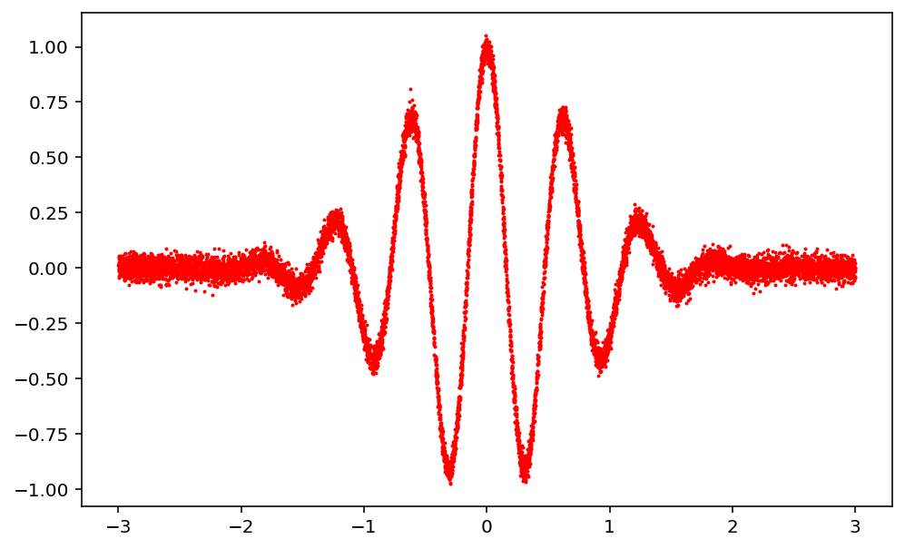
    


    Done.


### Define Model


```python
class Model(nn.Module):
    def __init__(self,name='mlp',xdim=1,hdims=[16,16],ydim=1):
        super(Model, self).__init__()
        self.name = name
        self.xdim = xdim
        self.hdims = hdims
        self.ydim = ydim

        self.layers = [] # layer들 생성해서 저장할 list
        prev_hdim = self.xdim # 여러 layer 초기화를 위해 prev_hdim 변수 사용
        for hdim in self.hdims:
            self.layers.append(nn.Linear( # linear layer 생성
                # FILL IN HERE
                prev_hdim, hdim, bias = True
            ))
            self.layers.append(nn.Tanh())  # activation
            prev_hdim = hdim # hdim이 다음 layer의 prev_hdim이 됨
        # Final layer (without activation)
        self.layers.append(nn.Linear(prev_hdim,self.ydim,bias=True))

        # Concatenate all layers 
        self.net = nn.Sequential() # 이 model의 network
        for l_idx,layer in enumerate(self.layers): # 위에서 생성한 모든 layer를 sequential하게 붙임
            layer_name = "%s_%02d"%(type(layer).__name__.lower(),l_idx) # layer의 이름 생성
            self.net.add_module(layer_name,layer) # network에 추가함

        self.init_param() # initialize parameters
    
    def init_param(self):
        for m in self.modules():
            if isinstance(m,nn.Conv2d): # init conv
                nn.init.kaiming_normal_(m.weight)
                nn.init.zeros_(m.bias)
            elif isinstance(m,nn.Linear): # lnit dense
                nn.init.kaiming_normal_(m.weight)
                nn.init.zeros_(m.bias)
    
    def forward(self,x):
        return self.net(x)

print ("Done.")        
```

    Done.


```python
LEARNING_RATE = 1e-2
# Instantiate models
model_sgd = Model(name='mlp_sgd',xdim=1,hdims=[64,64],ydim=1).to(device)
model_momentum = Model(name='mlp_momentum',xdim=1,hdims=[64,64],ydim=1).to(device)
model_adam = Model(name='mlp_adam',xdim=1,hdims=[64,64],ydim=1).to(device)
# Optimizers
loss = nn.MSELoss()
optm_sgd = optim.SGD(
    # FILL IN HERE
    model_sgd.parameters(), LEARNING_RATE
)
optm_momentum = optim.SGD(
    # FILL IN HERE
    model_momentum.parameters(), LEARNING_RATE, 0.9 # 일반적으로 0.9를 사용함
)
optm_adam = optim.Adam(
    # FILL IN HERE
    model_adam.parameters(), LEARNING_RATE
)
print ("Done.")
```

    Done.


### Check Parameters


```python
np.set_printoptions(precision=3)
n_param = 0
for p_idx,(param_name,param) in enumerate(model_sgd.named_parameters()):
    if param.requires_grad:
        param_numpy = param.detach().cpu().numpy() # to numpy array 
        n_param += len(param_numpy.reshape(-1))
        print ("[%d] name:[%s] shape:[%s]."%(p_idx,param_name,param_numpy.shape))
        print ("    val:%s"%(param_numpy.reshape(-1)[:5]))
print ("Total number of parameters:[%s]."%(format(n_param,',d')))
```

    [0] name:[net.linear_00.weight] shape:[(64, 1)].
        val:[ 0.338 -0.129  1.608  0.262  1.426]
    [1] name:[net.linear_00.bias] shape:[(64,)].
        val:[0. 0. 0. 0. 0.]
    [2] name:[net.linear_02.weight] shape:[(64, 64)].
        val:[ 0.248  0.335 -0.162  0.038 -0.188]
    [3] name:[net.linear_02.bias] shape:[(64,)].
        val:[0. 0. 0. 0. 0.]
    [4] name:[net.linear_04.weight] shape:[(1, 64)].
        val:[ 0.071  0.306  0.013 -0.056 -0.218]
    [5] name:[net.linear_04.bias] shape:[(1,)].
        val:[0.]
    Total number of parameters:[4,353].


### Train


```python
MAX_ITER,BATCH_SIZE,PLOT_EVERY = 1e4,64,500

model_sgd.init_param()
model_momentum.init_param()
model_adam.init_param()

model_sgd.train()
model_momentum.train()
model_adam.train()

for it in range(int(MAX_ITER)):
    r_idx = np.random.permutation(n_data)[:BATCH_SIZE] # == np.random.suffle(np.arrange(n_data)) 한 뒤 BATCH_SIZE만큼 가져온다ㅠ
    batch_x,batch_y = x_torch[r_idx],y_torch[r_idx] # fancy indexing -> suffled data
    
    # Update with Adam
    y_pred_adam = model_adam.forward(batch_x)
    loss_adam = loss(y_pred_adam,batch_y)
    optm_adam.zero_grad()
    loss_adam.backward()
    optm_adam.step()

    # Update with Momentum
    y_pred_momentum = model_momentum.forward(batch_x)
    loss_momentum = loss(y_pred_momentum,batch_y)
    optm_momentum.zero_grad()
    loss_momentum.backward()
    optm_momentum.step()

    # Update with SGD
    y_pred_sgd = model_sgd.forward(batch_x)
    loss_sgd = loss(y_pred_sgd,batch_y)
    optm_sgd.zero_grad()
    loss_sgd.backward()
    optm_sgd.step()
    

    # Plot
    if ((it%PLOT_EVERY)==0) or (it==0) or (it==(MAX_ITER-1)):
        with torch.no_grad():
            y_sgd_numpy = model_sgd.forward(x_torch).cpu().detach().numpy()
            y_momentum_numpy = model_momentum.forward(x_torch).cpu().detach().numpy()
            y_adam_numpy = model_adam.forward(x_torch).cpu().detach().numpy()
            
            plt.figure(figsize=(8,4))
            plt.plot(x_numpy,y_numpy,'r.',ms=4,label='GT')
            plt.plot(x_numpy,y_sgd_numpy,'g.',ms=2,label='SGD')
            plt.plot(x_numpy,y_momentum_numpy,'b.',ms=2,label='Momentum')
            plt.plot(x_numpy,y_adam_numpy,'k.',ms=2,label='ADAM')
            plt.title("[%d/%d]"%(it,MAX_ITER),fontsize=15)
            plt.legend(labelcolor='linecolor',loc='upper right',fontsize=15)
            plt.show()

print ("Done.")
```


    
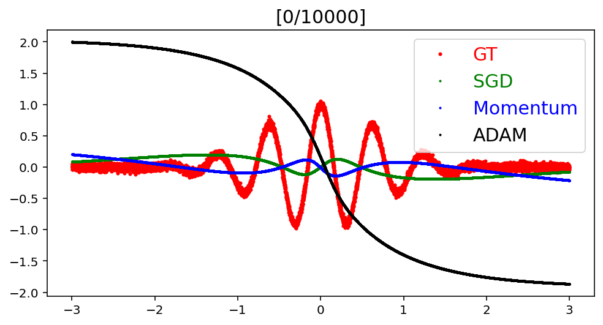
    


    
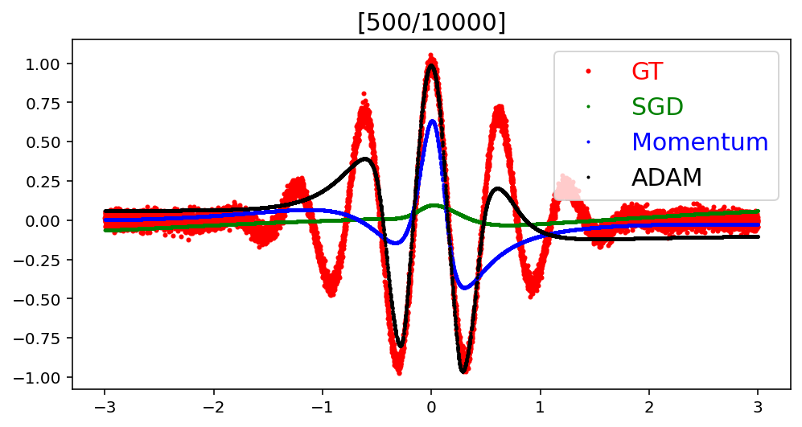
    


    
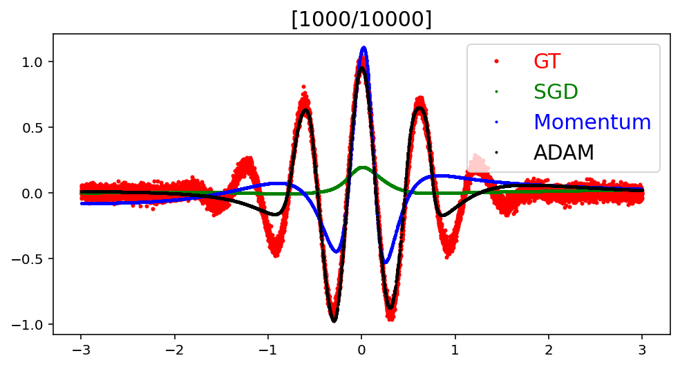
    


    
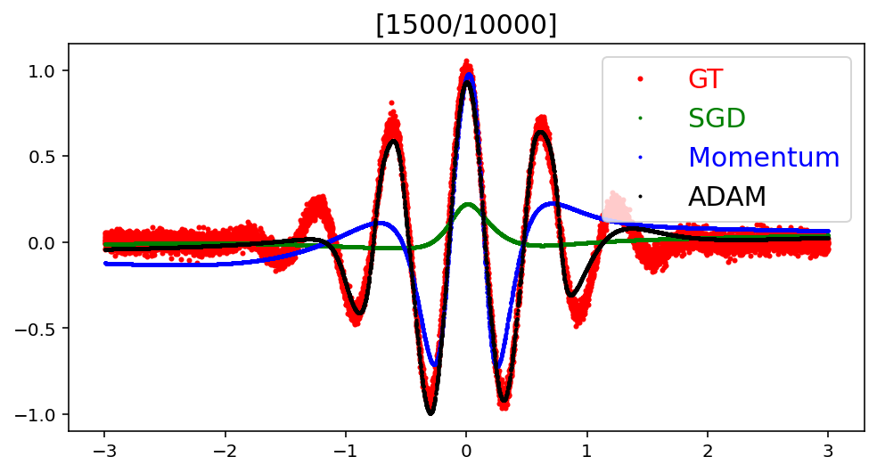
    


    

    


    
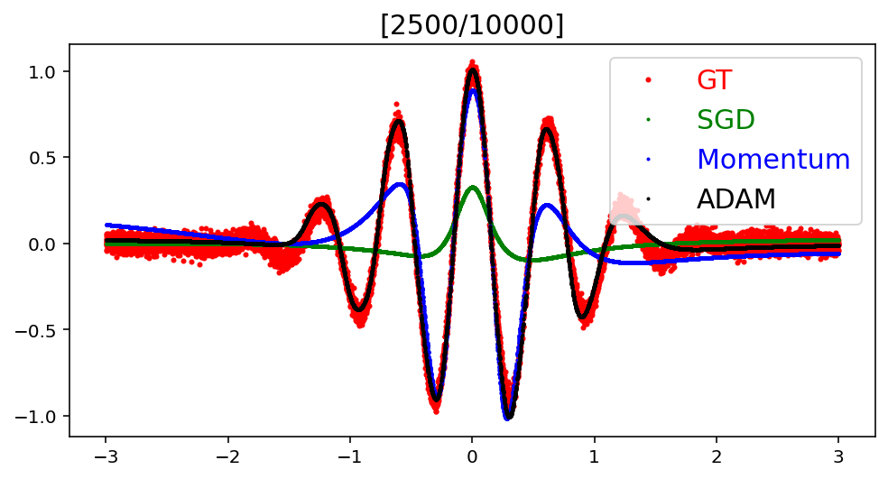
    


    
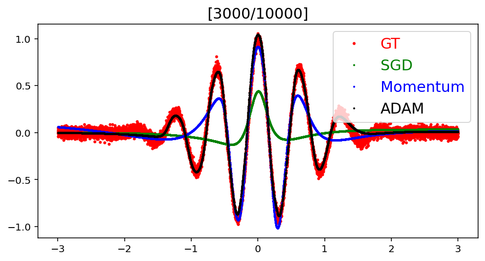
    


    
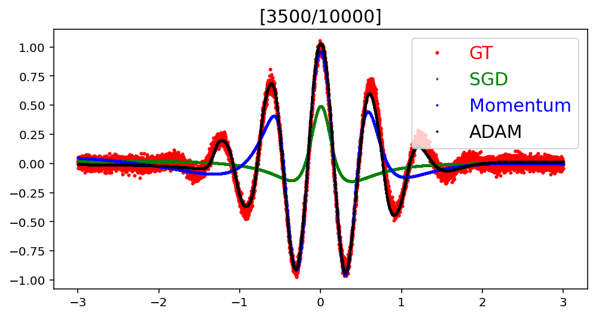
    


    
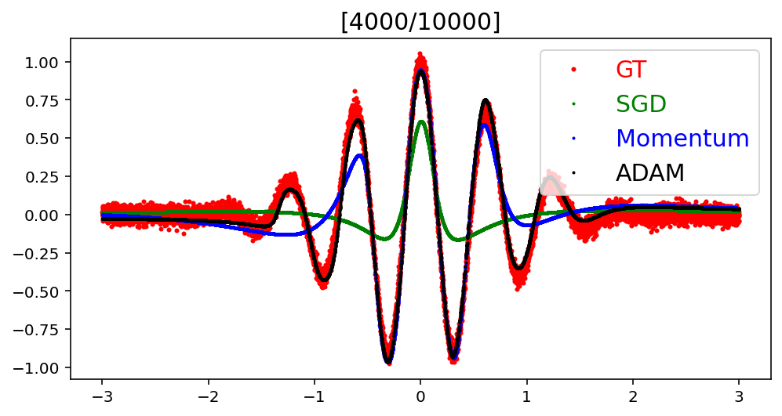
    


    
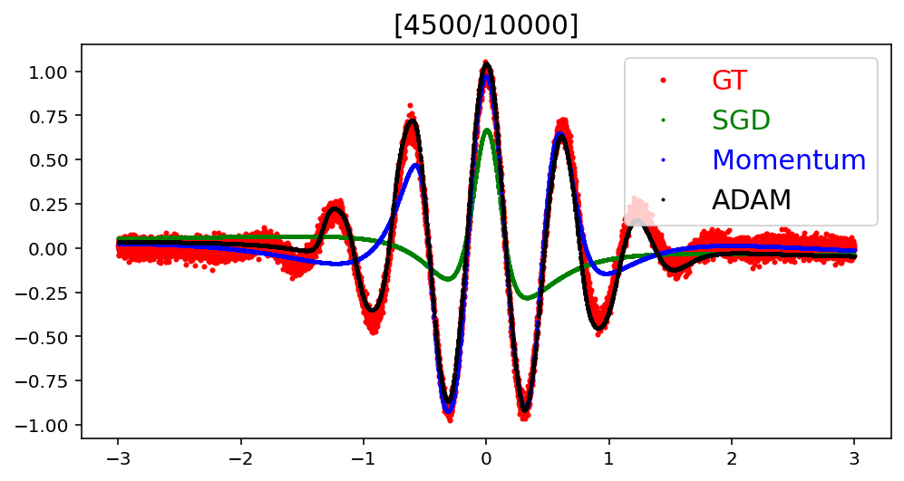
    


    
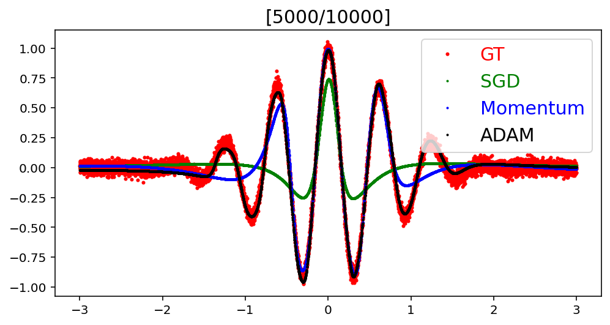
    


    
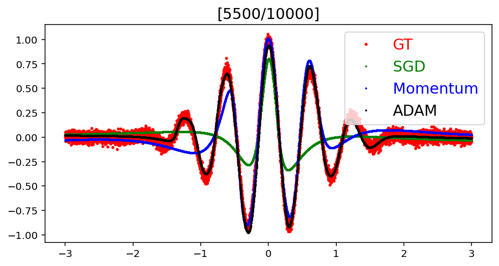
    


    
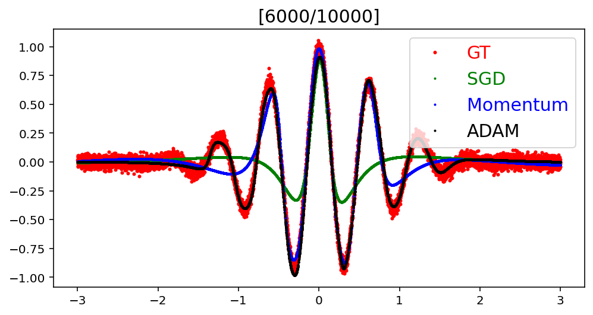
    


    
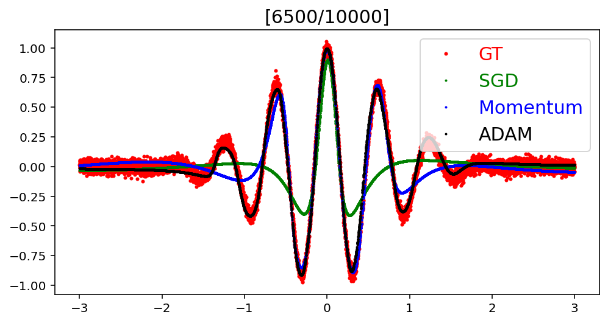
    


    

    


    
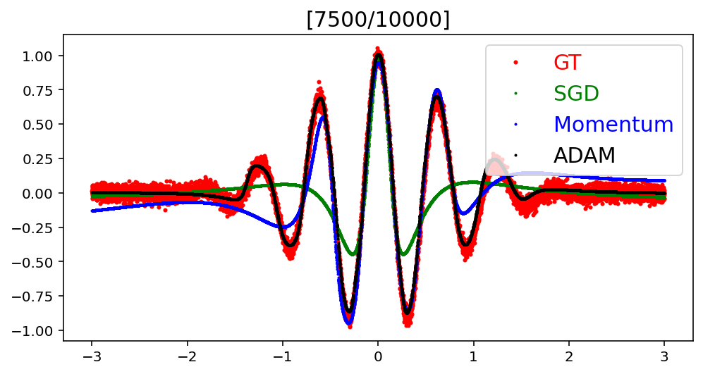
    


    
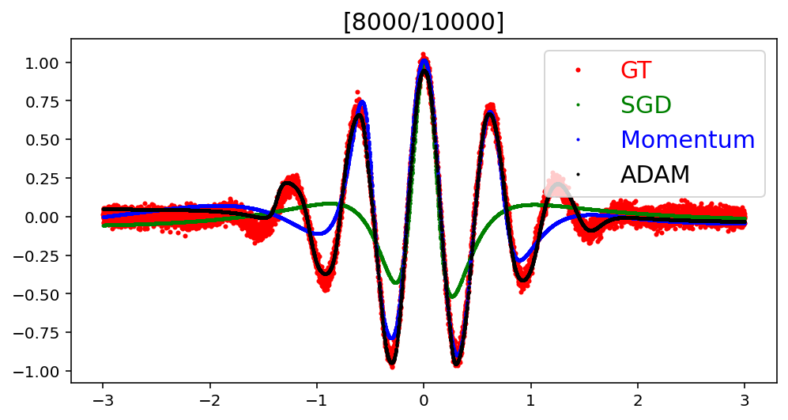
    


    
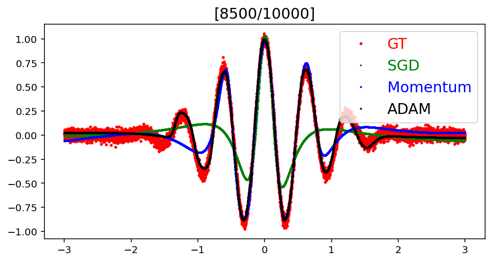
    


    
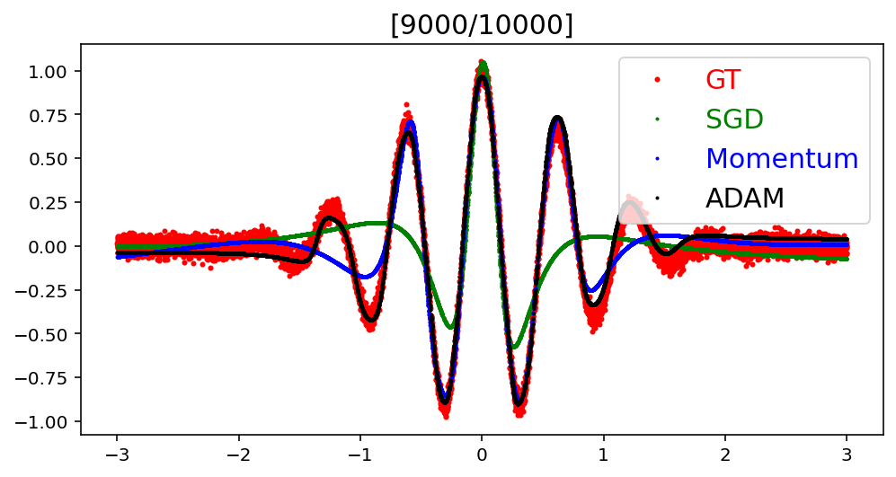
    


    
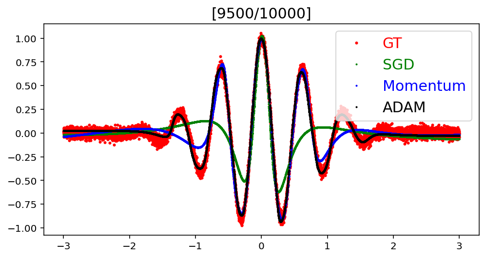
    


    
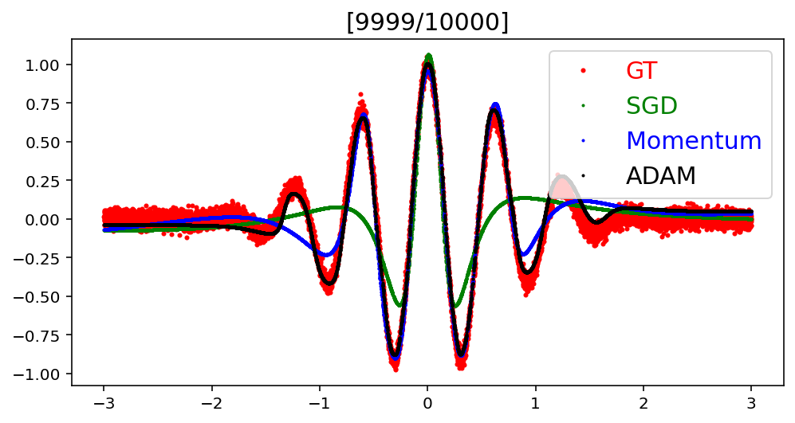
    


    Done.


* 가운데를 더 잘 맞추는 이유는 MSE는 loss가 큰 곳을 더 집중해서 학습하기 때문
* optimizer를 잘 선택하는 것이 중요하다 -> 일단 adam을 써보자
