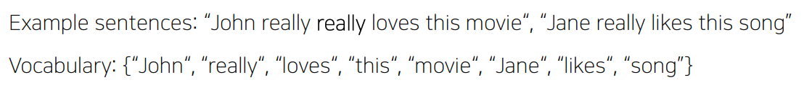
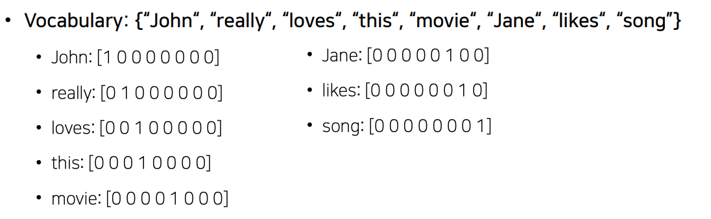
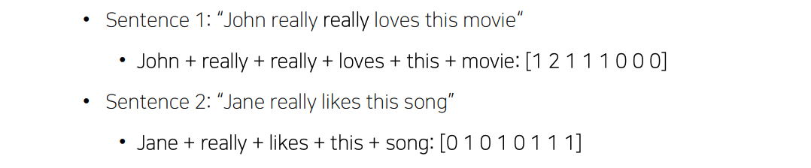
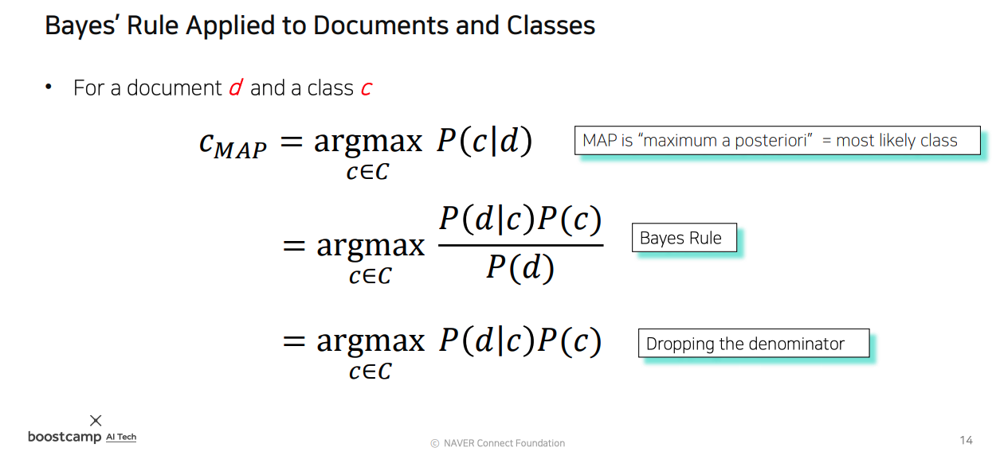
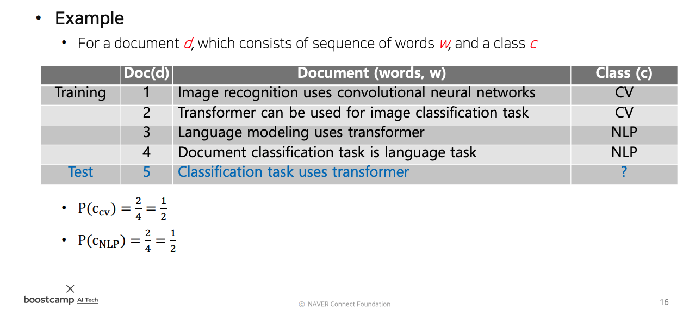
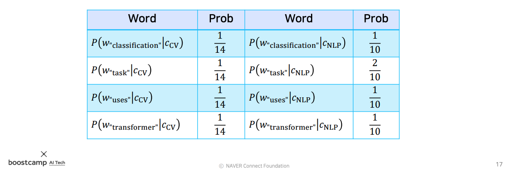
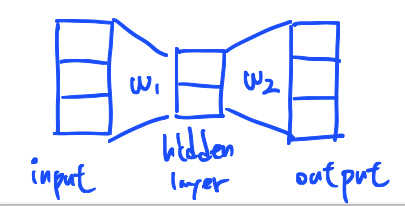
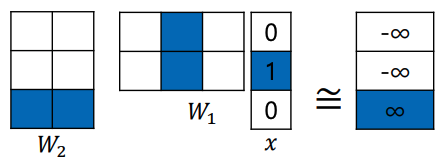
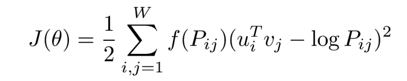

# Day 16 - Bag-of-Words, Word2Vec, GloVe

## Bag-of-Words

* 단어와 문장을 vector로 표현하는 방법
  * deep learning을 이용하려면 문장과 단어를 숫자로 표현해야함
  * 가장 간단한 방법은 다음과 같음
    1. 문장 내의 단어들을 모아 사전을 만든다
    
    2. 사전의 각 단어들을 one-hot vector로 표현한다
    
    3. 문장은 해당 문장에 나타나는 단어들의 one-hot vector를 모두 더해 표현한다
    

* Bag-of-words는 문서를 분류하는 기법으로, 문서에 포함된 단어들의 분포를 이용해 어떤 종류의 문서인지 (ex) 경제 기사, 정치 기사, 스포츠 기사) 판단하는 기법이다.
* 이 수업에서는 NaiveBayes Classifier를 이용해 문서 분류 하는 법을 살펴봤다
* NaiveBayes Classifier는 다음과 같은 원리로 동작한다
  
  * 우리의 목표는 어떤 문서가 특정 class에 속할 확률 $P(c|d)$ 을 구하고, 그 확률이 가장 큰 class를 찾는 것이다 $argmax (P(c|d))$
  * P(c|d)는 베이즈 정리를 이용하여 구할 수 있다
  * $P(d|c)P(c)\over{P(d)}$ 이 베이즈 정리로부터 나온다
  * $P(d|c)P(c)\over{P(d)}$ 에서 분모에 있는 $P(d)$는 특정 문서가 뽑힐 확률인데, 어떤 문서인지는 이미 정해져 있으므로 상수값이 되어 없앨 수 있다
  * 따라서 $argmax(P(d|c)P(c))$ 를 구하면 된다
  
  * $P(d|c)$ 는 특정 카테고리 c에서 문서 d가 나타날 확률이다
  * 문서 d는 해당 문서속의 단어들 $W_1, W_2, ..., W_n$이 동시에 나타나는 동시 사건으로 나타낼 수 있다
  * 따라서 $P(d|c) = P(W_1, W_2, ..., W_n|c)$ 가 된다
  * 여기에서 각 단어가 나타날 확률이 서로 독립이라고 가정하면, 위 사진의 수식처럼 단어가 나타날 확률을 모두 곱한 것으로 나타낼 수 있다
  * $P(d|c) = P(W_1|c) P(W_2|c) ... P(W_n|c)$

* 예제를 갖고 NaiveBayes Classifier의 작동 방법을 살펴보자
  
  * 예제에는 총 4개의 문서가 있고, 이 중 CV 관련 문서가 2개, NLP 관련 문서가 2개이다
  * CV 문서들에는 총 14개의 단어가 등장하고, NLP 문서들에는 총 10개의 단어가 등장한다
  * $P(c_{CV})$는 문서들에서 CV class의 문서가 등장할 확률, $P(c_{NLP})$ 는 문서들에서 NLP class의 문서가 등장할 확률이다
  * $P(c_{CV})$ = $2\over4$ = $1\over2$
  * $P(c_{NLP})$ = $2\over4$ = $1\over2$

  * 위의 사진은 $P(W_1|c) P(W_2|c) ... P(W_n|c)$ 의 계산 결과이다
  * 이 값들을 이용하여 문서의 class를 결정한다
  * test document $d$ = "Classification task uses transformer" 의 class는 다음과 같이 구할 수 있다  
    * $P(c_{CV}|d)$  
    = $P(W_{"classification"}|c_{CV}) \times P(W_{"task"}|c_{CV}) \times P(W_{"uses"}|c_{CV}) \times P(W_{"transformer"}|c_{CV}) \times P(c_{CV})$  
    = ${1\over14} \times {1\over14} \times {1\over14} \times {1\over14} \times {1\over2}$  
    = $0.000013$  
    * $P(c_{NLP}|d)$  
    = $P(W_{"classification"}|c_{NLP}) \times P(W_{"task"}|c_{NLP}) \times P(W_{"uses"}|c_{NLP}) \times P(W_{"transformer"})|c_{NLP} \times P(c_{CV}|c_{NLP})$  
    = ${1\over10} \times {2\over10} \times {1\over10} \times {1\over10} \times {1\over2}$  
    = $0.0001$
    * 따라서 이 문서는 확률이 더 높은 NLP class에 속한다고 예측할 수 있다

    NaiveBayes Classifier에서 해당 class에 포함되지 않은 단어가 있으면 해당 class일 확률이 0이 되버리는 문제가 있다는 걸 발견할 수 있다

## Word Embedding

* word embedding은 deep learning을 위해 단어를 vector로 변환하는 것
* 이것은 단어를 벡터 공간 상의 한 점으로 표현하는 것을 의미함
* 유사한 단어는 서로 가까운 곳에 위치하도록 해야 한다
* deep learning을 이용해 단어의 최적의 좌표값을 구한다

### Word2Vec

* Word2Vec는 같은 문장 내에서 인접한 단어 끼리 의미가 비슷할 것이라고 가정한다
* 입력된 단어의 주변 단어들의 확률 분포를 예측한다

* Word2Vec 알고리즘은 다음과 같이 작동한다
  * "I study math" 라는 문장을 이용해 학습하는 과정을 예로 설명한다
  1. 사전을 만든다  
    {I, study, math} 라는 사전이 생성된다
  2. sliding window 기법으로 입출력 쌍을 구성한다  
    "I"를 입력으로 했을 때의 입출력 쌍은  
    (I, study)  
    "study"를 입력으로 했을 때의 입출력 쌍은  
    (study, I)  
    (study, math)  
    "math"를 입력으로 했을 때의 입출력 쌍은  
    (math, study)  
    총 4개의 입출력 쌍이 구성된다  
    이 입출력 쌍을 neural network의 입력과 출력(정답)으로 사용한다
  3. neural network를 구성한다  
    neural network는 다음과 같이 구성한다  
      * 2 layer
      * 입/출력의 차원은 dictionary의 size 만큼
      * hidden layer의 크기는 word embedding하는 좌표공간의 차원의 수 (hyperparameter)
        * 여기서는 hidden layer의 크기를 2로 한다  
  
      이렇게 하면 다음과 같은 모양의 neural network가 된다
        

      가중치 행렬  w1과 w2의 모양은 다음과 같이 결정된다  
      * w1은 input layer를 hidden layer로 선형 변환하는데 사용되므로  
        (hidden layer 크기) x (input layer 크기) 의 matrix가 되어야한다  
      * w2는 hidden layer를 output layer로 선형 변환하는데 사용되므로  
        (output layer 크기) x (hidden layer 크기) 의 matrix가 되어야한다  

      이 가중치 벡터들을 그림으로 그려보면 다음과 같다  
        

      이렇게 나온 결과에 softmax 함수를 이용해 확률을 구하고, 이렇게 구한 확률과 정답 (입출력 쌍의 output)을 비교하며 network를 학습시킨다

      input vector가 one-hot vector이기 떄문에 input vector와 w1의 inner product는 w1에서 input 단어와 matching되는 column vector를 추출하는 것을 의미함.  
      정답에 해당하는 w2의 row vector와 추출된 column vector의 내적을 최대화 하고, 그 이외의 것들은 최소화 시키는 방향으로 학습해야 함

### GloVe

* 기본 원리는 Word2Vec과 비슷함
* Word2Vec은 자주 등장하는 두 단어 쌍의 내적값을 키우는 방향으로 학습함
* GloVe는 단어 쌍의 등장 횟수를 미리 계산해 중복되는 계산을 줄여 학습 속도를 높이고, 적은 data로도 잘 학습되도록 함

    
    이 수식에서 $P_{ij}$가 두 단어가 하나의 window 내에서 몇번이나 동시에 나왔는지를 나타냄
