# Day 17 - Basics of RNN, LSTM, GRU

## Basics of RNN

* 3주차에 배웠던 대로 RNN은 sequential data를 처리하기 위한 model임
* 이전 time step의 결과인 $h_{t-1}$과 이번 time step의 input $x_t$를 이용해 연산
* 매 time step에서 동일한 parameter를 사용함

    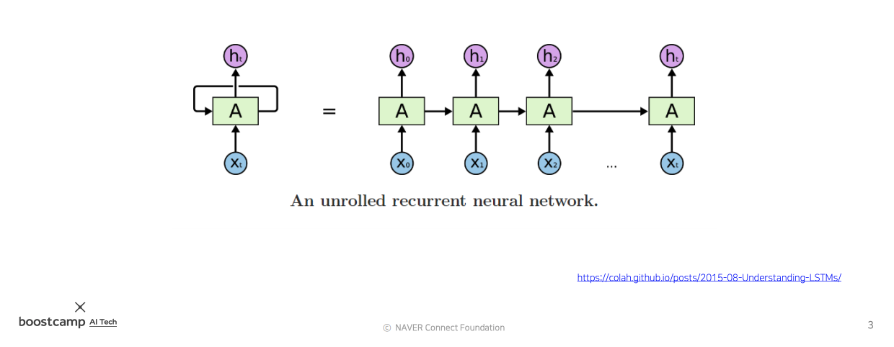

    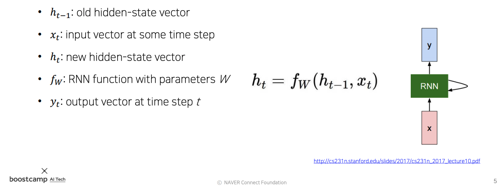
* $y_t$는 $h_t$를 이용해 계산한 출력값. 
* 출력값은 필요할 순간에만 계산함. 매 time step마다 할 수도 있고, 맨 마지막에만 할 수도 있음

    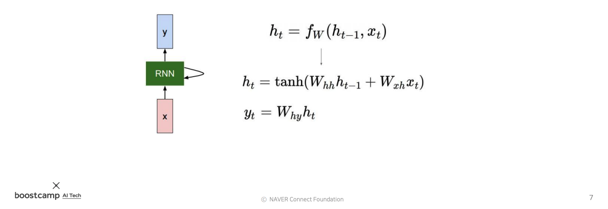
    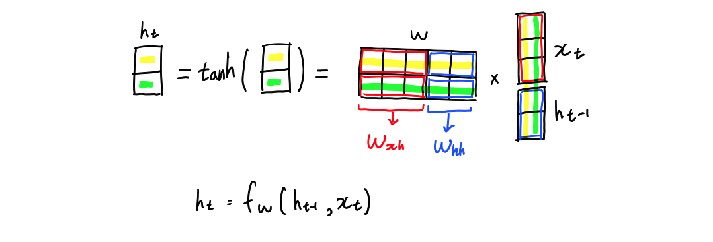

* hidden state를 연산하는 과정은 위와 같음
* $x_t$와 $h_{t-1}$을 가중치 벡터 $W_{xh}$와 $W_{hh}$을 이용해 따로 따로 내적한 후, 그 값들을 더해서 $h_t$로 만드는 것임

### RNN의 종류

* RNN은 다음과 같이 4가지 종류로 구분할 수 있음 (첫번째 one to one은 RNN이 아님)

    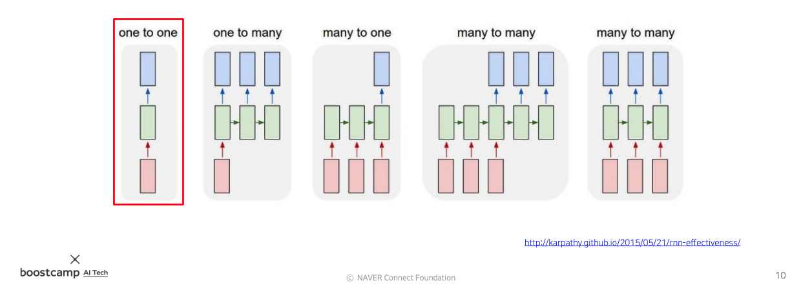

* one to many
  * 출력만 sequence data인 경우
  * 이 경우 두번째 time step 부터는 영벡터를 입력으로 주면 됨
  * ex) image captioning (이미지에 대한 설명 글 생성)
* many to one
  * 입력만 sequence data인 경우
  * ex) 감정 분석
* many to many 1
  * 입력과 출력 모두 sequence data
  * 입력을 끝까지 다 확인한 후에 출력을 시작함
  * ex) 기계 번역
* many to many 2
  * 입력과 출력 모두 sequence data
  * 입력이 주어질 때마다 바로 바로 결과를 출력함
  * 실시간으로 결과가 필요한 경우에 사용
  * ex) video classification on frame level (프레임 단위 영상 분석)

### Character-level Language Model

* character level language model은 다음 글자를 예측하는 model임

    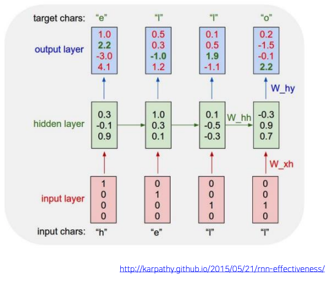

* 매 time step마다 결과를 출력함
* $h_t$에 output layer를 적용해 $y_t$를 만든다
* input으로 "l"이 두번 입력된다. 하지만 동일한 입력임에도 서로 다른 결과를 출력하는 것을 확인할 수 있다. 이렇게 되는 이유는 $h_{t-1}$에 담긴 과거의 정보를 활용해 연산을 하기 때문임

    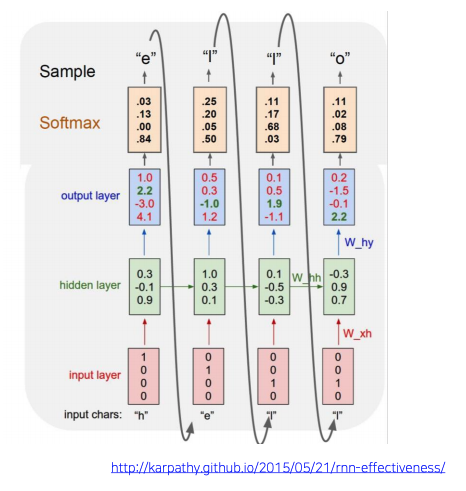

* 이 model은 바로 다음번의 문자만 예측할 수 있도록 학습되었음
* 하지만 예측값을 다시 다음 time step의 input으로 넣으면 먼 미래도 예측할 수 있게 됨
* 무한한 길이의 character sequence를 생성할 수 있게 되는 것임

    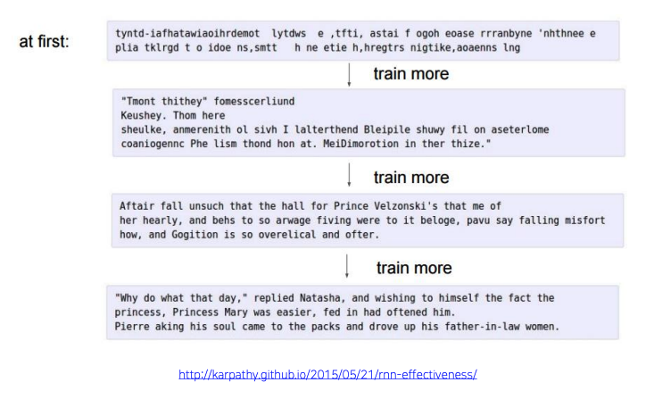

* 위의 사진은 character level language model이 학습하면서 점점 더 글다운 글을 쓰게 되는 모습
* 단순히 단어를 생성하는 것을 넘어서 적절한 위치에서 줄을 바꾸고, 공백, 쉼포, 마침표 등을 쓰고있음
* RNN이 이렇게 어느 위치에 어떤 문자를 써야하는지 등의 정보를 저장하는 곳은 hidden state vector $h_t$임
* time step이 진행됨에 따라 hidden state vector의 각 원소가 어떻게 변하는지를 분석함으로서 해당 원소가 어떤 정보를 저장하고 있는지를 살펴볼 수 있음

    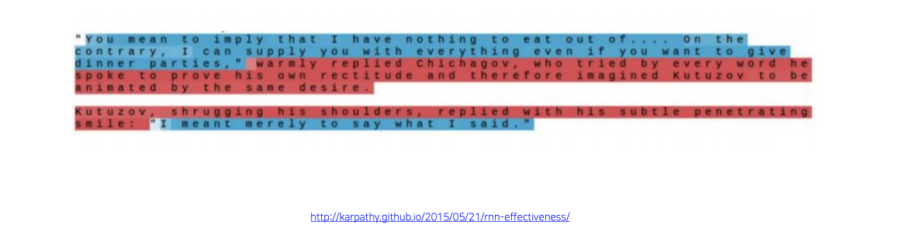

* 위의 사진을 예로 들면 특정 cell은 따옴표가 열리고 닫힘에 따라 값이 변함
* 이 cell에 따옴표가 열려있는 상태라는 것을 저장해 두는 것임

### Vanishing/Exploding Gradient Problem in RNN

* RNN의 $h_t$를 미분하면 chain rule에 의해 $W_{hh}$가 time step의 개수만큼 거듭 제곱됨 (자세한 수식은 [여기](https://curt-park.github.io/2017-04-03/why-is-lstm-strong-on-gradient-vanishing/)를 참고)
* 이 때 $W_{hh}$가 1에서 -1 사이의 값이라면 거듭 제곱되며 0으로 수렴해 사라지는 vanishing gradient problem이 발생함
* 반대로 -1보다 작거나 1보다 큰 값이라면 거듭 제곱되며 값이 매우 커지는 exploding gradient problem이 발생함
* 이 문제들 때문에 vanilla RNN은 잘 사용하지 않음
* 이 문제를 해결한 LSTM과 GRU를 주로 사용함
* LSTM과 GRU에서는 계속해서 변화하는 forget gate를 곱해주고, 새로운 정보는 더하는 방식으로 추가되기 때문에 gradient가 더 잘 전달됨

## LSTM

* 3주차 강의에서 배웠던 대로 LSTM은 vanilla GNN의 exploding/vanishing gradient 문제를 해결하기 위해 고안됨
* LSTM은 이전의 정보들을 저장해두는 cell state를 이용함
* cell state를 관리하고, 이용하는데 다음과 같은 4개의 gate를 사용함

    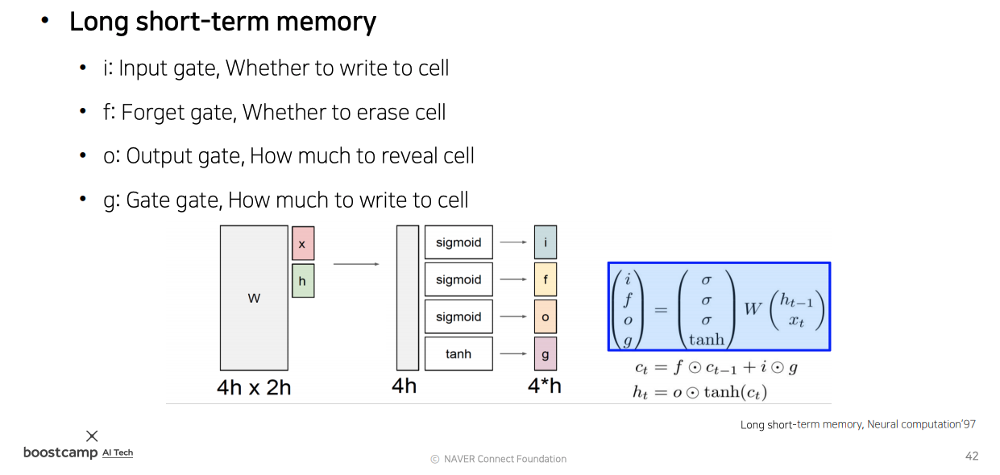

* 각각의 gate들의 역할은 다음과 같음

### Forget Gate

* forget gate는 이전 time step에서 넘어오는 정보의 일부를 잊어버리는(forget) 역할임
* forget gate의 값은 이전 time step의 결과값이라고 할 수 있는 $h_{t-1}$과 이번 time step에 들어온 input을 갖고 연산한 결과에 sigmoid를 취한 0~1 사이의 값임
* $h_{t-1}$과 $x_t$를 이용해 cell state에서 어떤 data를 어느정도 잊어버릴지 결정한다고 생각해볼 수 있음
* forget gate와 cell state 사이에 element-wise 곱을 해서 cell state의 data를 일부 잊어버리도록 함

    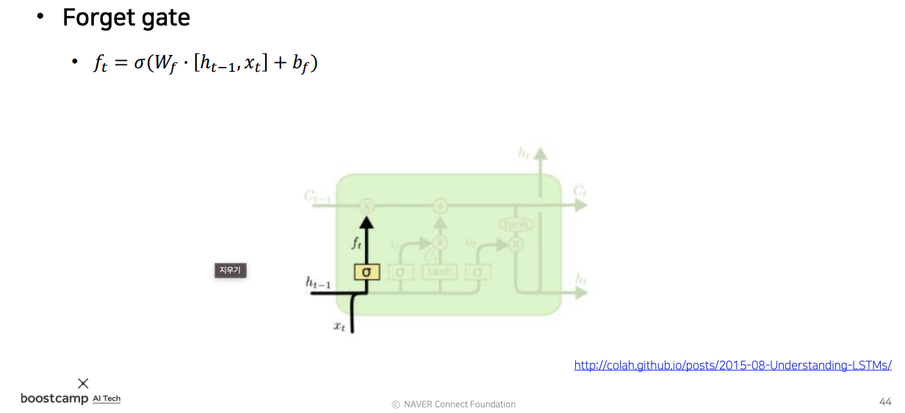

### Input Gate와 Gate Gate

* input gate는 이번 time step에 들어온 새로운 정보를 cell state에 올리는 역할임
* input gate를 이용해 새로운 정보의 어떤 부분을 얼만큼 cell state에 올릴지 결정함
* input gate 역시 forget gate와 마찬가지로 $h_{t-1}$과 $x_t$를 이용해 cell state에 어떤 data를 얼마나 올릴지 결정함
* 새로운 data는 gate gate를 이용해 계산함
* gate gate는 vanilla RNN과 마찬가지로 이전 time step의 결과값이라고 할 수 있는 $h_{t-1}$과 이번 time step에 들어온 input을 갖고 연산한 결과에 tanh를 취해서 구하게 됨
* 이 새로운 data(gate gate)에 input gate를 곱해 cell state에 새로 추가할 만큼만 덜어낸다고 생각할 수 있음
* cell state에 추가할 때는 element-wise 덧셈을 이용함

    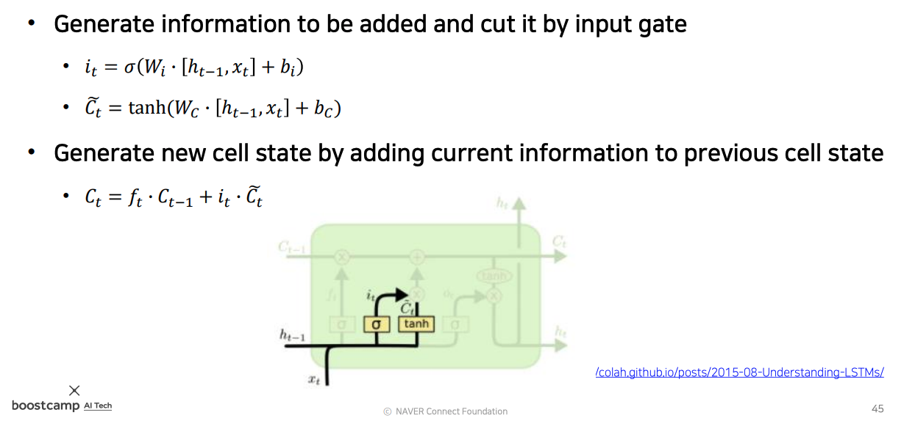

### Output Gate

* output gate는 이번 time step에 들어온 입력값 $h_{t-1}$, $x_t$와 갱신된 cell state를 갖고 time step의 출력 값인 $h_{t}$를 계산하는데 사용됨
* $h_{t}$는 cell state에 tanh를 취하고, sigmoid를 거쳐 0~1 사이의 값을 갖고있는 output gate를 곱해 계산함
* 위의 과정을 통해 cell state의 값이 출력으로 그대로 나가는 것이 아니라, output gate를 거쳐 출력값으로 나가야 할 data만 적절한 비율로 조절돼서 나가게 되는 것임

    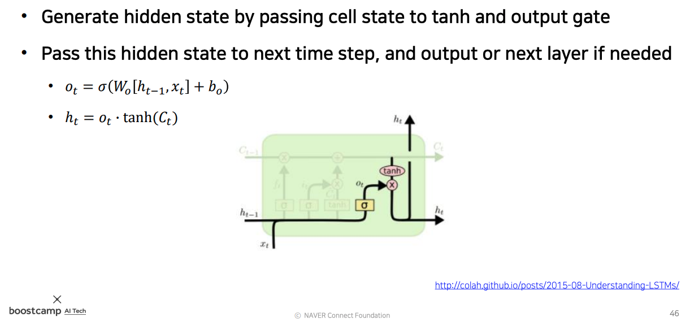

* 여기에서 $c_{t}$와 $h_{t}$의 차이를 확인할 수 있음
  * $c_{t}$는 기억해야 할 과거의 모든 정보를 전부 다 담고있음
  * $h_{t}$는 현재 time step의 예측값에 직접적으로 필요한 정보만을 골라 담게 됨
  * output gate는 지금 당장 필요한 정보만을 filtering 하는데 사용 됨
  * 위의 character level language model을 이용해 다음 글자를 예측하는 중 따옴표 안의 글자를 예측하는 경우를 예로 들 수 있음
    * 따옴표 안의 글자를 예측 시 당장은 따옴표가 열려있다는 정보는 필요하지 않음
    * 다음 글자를 예측하는 것이 더 중요함
    * 하지만 따옴표가 열려있다는 사실을 계속 기억하고 있어야, 적절한 곳에서 따옴표를 닫을 수 있음
    * 따옴표가 열려있다는 정보는 cell state에 저장되어 있고, 출력값을 내보낼 때는 이 따옴표에 대한 정보는 filtering하는 것임 

## GRU

* GRU는 LSTM을 경량화 한 model임
* LSTM과 비교하면 두가지 부분이 경량화 되었음
  1. cell state와 hidden state vector가 일원화 되었음
  2. forget gate를 사용하지 않고 대신 1에서 input gate를 뺀 값(가중 평균)을 사용함
* LSTM과 비교하면 GRU는 더 적은 계산량과, 더 적은 메모리를 요구함
* 하지만 성능은 LSTM에 뒤지지 않음
* 실제로 사용할 때는 주로 LSTM과 GRU를 모두 사용해 본 뒤 더 성능이 좋은 model을 사용함

    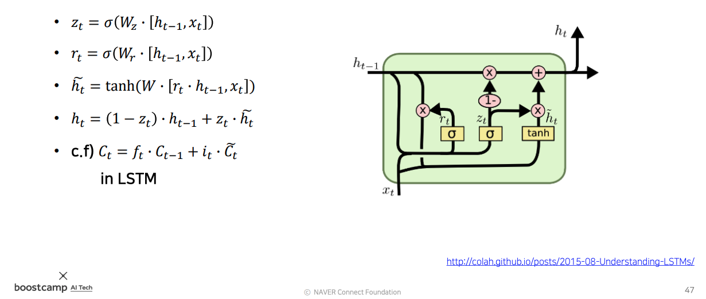