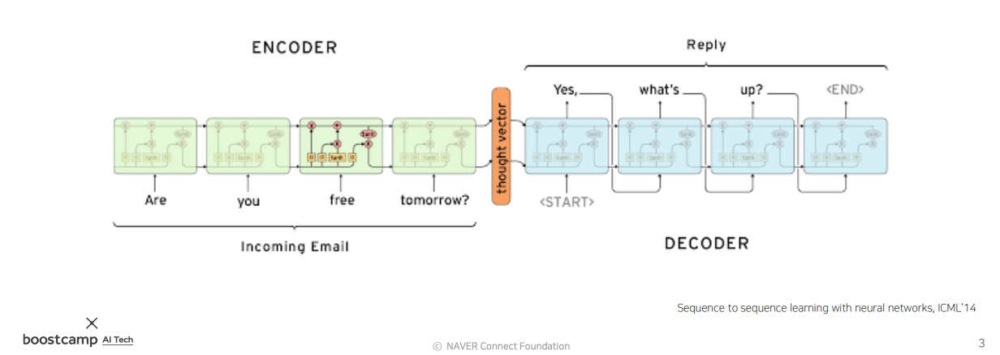
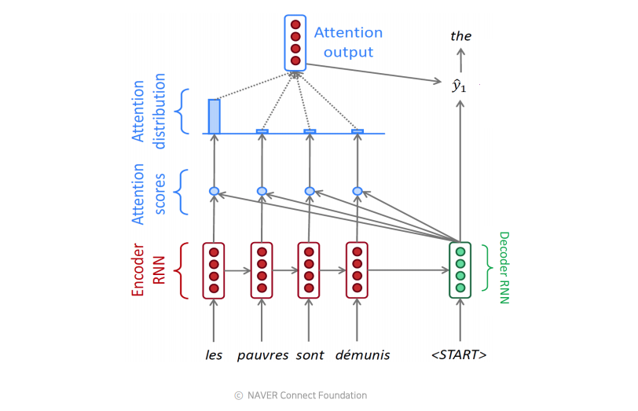
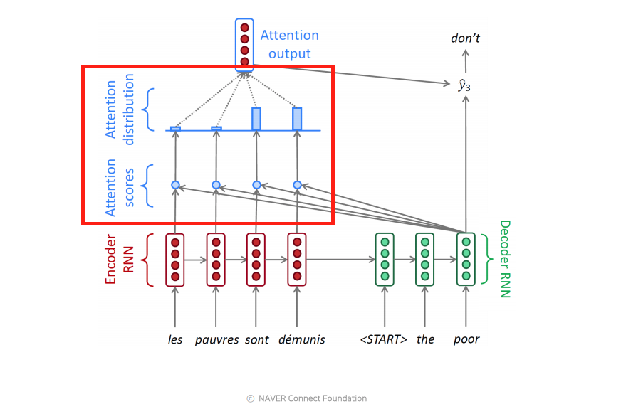
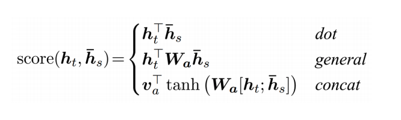

# Day 18 - Sequence to sequence with attention, Beam search and BLEU score

## Seq2Seq Model

* 기본적인 seq2seq model은 RNN의 many to many 형태 model임
* 입력을 처리하는 encoder와 출력을 생성하는 decoder로 구성됨
* encoder의 마지막 time step의 hidden state vector가 decoder의 첫번째 time step으로 전달됨
* encoder와 decoder는 별개의 RNN model을 사용함 -> parameter를 공유하지 않음
* decoder에서는 입력 시작과, 출력 끝을 나타내주기 위해 SOS (start of sentence) token과, EOS (end of sentence) token을 사용함
* 이러한 model에는 몇가지 문제점이 있음
  1. 한정된 크기의 cell state vector (LSTM을 사용할 경우)와 hidden state vector에 모든 정보를 우겨 넣어야 함. (입력 문장의 길이가 길어질수록 문제가 됨)
  2. LSTM에서 어느정도 해결되긴 했지만 그럼에도 불구하고 아주 오래전의 정보가 소실되거나 왜곡됨 (decoder에서 encoder 입력 초반부의 데이터를 잘 확인하지 못함)
   
   

### Attention

* 위의 기본적인 seq2seq 모델에서의 문제를 해결하기 위해 attention을 이용함
* attention의 핵심 아이디어는 decoder의 각 time step에서 encoder의 특정 입력에 집중하여 연산을 하는 것임
* 이를 위해 encoder의 매 time step에서 나오는 hidden state vector를 따로 저장해 두고, decoder에서 사용함
* 기존에 encoder의 마지막 time step에서 나오는 hidden state vector만 이용할 때보다 과거의 정보를 확실하게 보존하고, 이용할 수 있음
* decoder에서는 이 hidden state vector들 중 그때 그때 필요한 것을 골라서 사용함

    
    출처: https://google.github.io/seq2seq/

    위 gif에서 짙은색 선이 현재 decoder가 집중해서 보고있는 encoder의 입력을 의미함

    

* 위 그림은 decoder가 어떻게 encoder의 특정 입력에 집중을 하게 되는지를 보여줌
  1. Attention scores - decoder에서 나온 hidden state vector와 encoder의 각 time step에서 나온 hidden state vector를 내적하여 서로간의 유사도를 계산함 (벡터의 내적은 서로간의 유사도를 계산하는 것 - 2주차 AI Math vector 수업 참고)
  2. Attention distribution - 계산된 유사도 벡터들에 softmax를 취해 확률로 변환함. 이 vector들은 encoder의 hidden state vector들의 가중치로 사용됨. encoder의 각 hidden state vector들을 어느 정도로 집중해서 참고할지를 결정하는데 사용됨. 이것들을 attention vector라고 부름
  3. Attention output - attention vector들의 가중 평균을 구해 하나의 vector로 만듦. 이것을 context module이라고 부름.
  4. context module과 decoder의 hidden state vector를 concat한 뒤 output layer의 입력으로 보냄.

* 위 과정에서 decoder의 hidden state vector가 두가지 역할을 하는 것을 확인할 수 있음
  1. 어떤 단어를 중점적으로 봐야 하는지 결정하는 가중치 역할. (encoder의 hidden vector와의 유사도 계산에 사용)
  2. decoder의 output layer의 input으로 사용

* decoder의 매 time step마다 위 과정을 반복해, 각 time step에서 집중해야할 입력 단어를 결정하고, 연산함

    
    위 그림에서 빨간 박스 부분을 attention model이라고 부름

* 위에서는 유사도를 구할 때 단순히 내적을 이용했지만, 더 다양한 방법들이 있음

    

    * dot은 위에서 봤던 내적을 하는 방법. 그냥 내적을 이용하면 encoder의 hidden state vector와 decoder의 hidden state vector의 같은 위치의 성분끼리의 유사도만 단순하게 확인함
    * general은 내적을 할 때 중간에 weight 행렬을 추가해서 계산하는 방법임. weight을 사용하여 encoder와 decoder의 hidden state vector 사이의 유사도를 계산함. 이렇게 하면 특정 성분에 가중치를 추가해 줄 수 있게되고, 같은 위치의 성분 뿐만 아니라 다른 위치의 성분과의 유사도도 연산할 수 있게 됨. 또한 이 weight 역시 학습이 가능함. 따라서 그냥 내적을 사용했을 때 보다 더 높은 표현력을 갖게 됨. (그냥 내적을 하는 경우엔 weight 행렬이 항등행렬이라고 생각할 수 있음)  
    이 때 다른 위치의 성분끼리도 유사도를 확인하는 것은 hidden state vector에서 서로 다른 위치에 있는 성분이라도 비슷한 유형의 정보를 저장하고 있을 수 있기 때문에 이것까지 모두 고려해주는 것이라고 생각할 수 있음.  
    // TODO: 행렬 이용 내적 설명 추가하기
    * concat은 또 다른 neural network(MLP)를 사용해 유사도를 계산하는 방법임. encoder의 hidden state vector와 decoder의 hidden state vector를 concatenation해서 유사도 계산에 사용하는 MLP에 입력으로 넣기 떄문에 concat이라 부름. 이 방법은 위의 두 방법과는 다르게 내적을 이용하지 않고 유사도 값을 구함. 하지만 별도의 neural network를 이용하여 유사도를 구하는 과정을 학습시킬 수 있다는 것이 general과 유사함.
* general과 concat은 attention model을 학습 가능하게 만든다는 점이 공통점임

### Attention의 장점

* 이렇게 attention은 decoder가 특정 입력에만 집중해 예측할 수 있게 해줌
* encoder의 각 time step에서 나온 모든 hidden state vector를 고려함으로서 기본적인 seq2seq model에서 encoder의 마지막 time step의 hidden state vector만 고려해서 생기던 bottleneck 문제를 해결함
* 번역할 때 decoder가 어느 단어에 집중했는지 확인할 수 있게 됨

### Teacher Forcing

* decoder의 첫번째 입력으로는 문장의 시작임을 알려주는 SOS token을 넣어줌
* decoder가 EOS를 출력해 문장이 끝났음을 알릴 때까지 반복함
* 실사용 시 decoder의 output을 다음 time step의 입력값으로 넣어 sequential하게 예측을 수행함
* 학습 초기에는 decoder의 output을 그대로 다음 time step에 넣으면 이상한 값이 입력으로 들어가게 됨
* 따라서 이전 time step의 output 대신 정답을 입력으로 넣어줌
* 이것을 teacher forcing 이라고 함
* 하지만 이런식으로 학습하면 학습은 빠르게 되지만 실사용시와 괴리감이 생길 수 있음 (over fitting)
* 따라서 학습 초기에믄 teacher forcing을 하는 등의 여러 방법을 사용함

## Beam Search

* 지금까지 우리가 생각했던 model은 Greedy decoding model임
* Greedy decoding 모델은 매 time step마다 그 순간에 가장 확률이 높아보이는 것을 선택함
* 하지만 이 문제는 greedy로 접근했을 때 항상 정답이 나오는 것을 보장하지 않음
* 확률이 조금은 낮지만, 뒷부분까지 고려했을 때 최종적으로 더 높은 확률을 갖게 되는 단어가 있을 수 있음
* Greedy decoding을 한 경우엔 앞에서 잘못 예측을 했을 때 되돌릴 수 없이 계속 잘못된 방향으로 가야만 함
* 이 문제를 완벽하게 해결하려면 완전 탐색을 해야 함
* 완전 탐색을 하는 경우엔 따져야 할 경우의 수가 너무 많아 예측이 불가능함
* 차선책으로 greedy와 완전탐색의 중간점을 사용하는데, 이것이 바로 Beam search임

// TODO

## BLEU score