# Day 19 - Transformer

- [Day 19 - Transformer](#day-19---transformer)
  - [Encoder](#encoder)
    - [Self Attention](#self-attention)
    - [Multi-Head Attention](#multi-head-attention)
    - [Block-Based Model](#block-based-model)
    - [Positional Encoding](#positional-encoding)
    - [Learning Rate Scheduler](#learning-rate-scheduler)
  - [Decoder](#decoder)
    - [Masked Self Attention](#masked-self-attention)

## Encoder

### Self Attention

* RNN은 멀리있는 time step의 정보가 유실되는 구조적 문제점이 있음
* 또한 RNN은 이전의 입력에 대한 정보만 이용할 수 있고, 이후에 입력될 단어들의 정보는 고려할 수 없음
* 이 문제를 해결하기 위해 bi-directional rnn을 사용하지만 먼 time step의 정보가 손실되는 문제는 여전히 남아있음 (bidirectional rnn에 대한 내용은 day17에 정리해 두었음)
* Transformer는 동시에 모든 단어를 고려하는 구조를 통해 이러한 문제들을 근본적으로 해결함

* 위 그림의 오른쪽 부분
  * Transformer는 Query, Key, Value vector를 이용해 단어들간의 가중 평균을 구함
  * Query, Key, Value 벡터는 모두 embedding된 단어의 vector인 embedding vector를 이용해 만들어짐
  * 동일한 embedding vector를 세개의 다른 linear layer에 넣어 Query, Key, Value 벡터를 계산함
  * 이 선형 변환에 쓰이는 가중치를 각각 $W_Q$, $W_K$, $W_V$라고 하고, Query vector, Key vector, Value vector는 Q, K, V라고 부름
  * 이렇게 만들어 진 Q, K, V 벡터를 이용해 단어들 사이의 관계를 계산함
  * Query vector는 입력으로 주어진 단어들 중 어떤 단어를 중점적으로 가져올지를 결정하는데 쓰이는 vector임
  * Key vector는 Query vector와 내적해 단어 사이의 유사도를 계산하는데 사용될 vector임
  * Value vector는 Key vector와 Query vector를 이용해 구한 가중치를 적용할 vector임
* 위 그림의 왼쪽 부분
  * 현재 위 그림은 단어 "I"에 대한 encoding vector를 구하는 모습임
  * 단어 "I"의 embedding vector $x_1$을 이용해 구한 Query vector $q_1$을 이용해 각 단어들과의 유사도를 계산함
  * $q_1$과 각 단어들의 Key vector를 내적해 유사도를 구함
  * 위에서 구한 유사도에 softmax를 취해 각 단어에 대한 가중치를 계산함
  * 가중치를 Value vector에 적용해 Value vector들의 가중 평균을 구함
  * 이 Value vector들의 가중 평균 vector $h_1$이 "I" 라는 단어의 encoding vector임
  * 이 encoding vector에는 문장 내의 모든 단어에 대한 정보가 담겨있음
  * self attention 방식을 사용하면 문장 내의 모든 단어를 한번에 고려할 수 있고, 멀리 있는 단어에 대한 정보도 소실되지 않음
  * 다음 단어 "go"에 대한 가중 평균을 계산할 때는 위의 과정에서 Query vector만 "go"의 Query vector인 $q_2$로 바꿔 계산하면 됨
  * 각 단어에 대한 연산을 수행할 때 달라지는 것은 이 Query vector밖에 없음

* 위 과정을 보면 encoder와 decoder 두 RNN에서 나온 값들을 이용해 단어들의 가중 평균을 구하는 seq2seq with attention model과 달리 embedding vector만을 가지고 가중 평균을 구하고 있음. 이것이 self attention 구조라고 부르는 이유임.

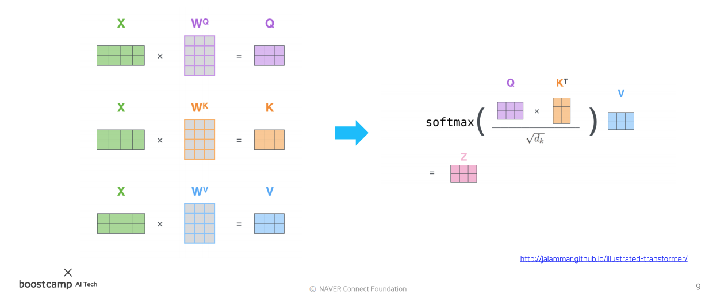

* self attention module의 입력은 Q, K, V vector
* 출력은 V vector들의 가중 평균 
* 가중치는 Q, K vector를 내적해서 구함
* Q와 K vector를 내적해야 하기 때문에, 두 vector의 차원이 동일해야 함
* 출력의 차원은 V vector의 차원임
* Q, K vector의 차원과 V vector의 차원은 서로 달라도 되지만, 보통 편의상 동일하게 함
* 실제로 계산할 때는 각각의 단어 별로 따로따로 계산하는 것이 아니라 행렬곱을 이용해 한번에 계산함
  
// TODO: 행렬곱 그림

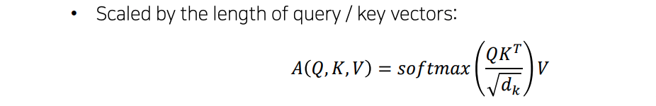

* Q, K vector를 내적한 후에 $\sqrt{d_k}$(Q, K 벡터의 차원의 제곱근)로 나눠준다
  
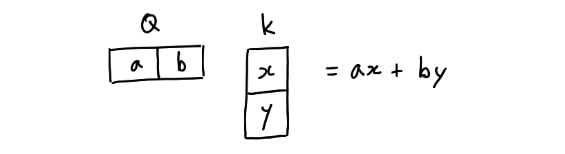

* $\sqrt{d_k}$로 나눠주는 이유는 다음과 같다
  * Q, K vector가 위의 그림과 같이 2 차원 vector라고 가정해보자
  * Q, K vector의 성분 a, b, x, y가 통계적으로 독립이고, 평균이 0이고 분산이 1이라고 가정하자
  * 두 벡터를 내적한 결과 $ax + by$의 평균과 분산은 다음과 같이 계산된다
    * $ax$의 평균 = 0, 분산 = 1
    * $by$의 평균 = 0, 분산 = 1
    * 띠리사 $ax + by$의 평균 = 0, 분산 = 2
  * 여기에서 vector의 차원이 커질수록 분산이 커지는 것을 확인할 수 있다
  * 표준편차(분산의 제곱근)가 클수록 softmax의 결과가 큰 값에 몰리게 되므로, 분산의 크기가 변하는 것이 문제가 된다
  * 표준편차가 작을수록 softmax의 확률 분포가 고르게 된다
  * 따라서 분산을 작고, 일정하게 유지하기 위해서 $\sqrt{d_k}$로 Q, K의 내적값을 나눠주는 것이다

### Multi-Head Attention

* multi head attention은 하나의 입력에 대해 동시에 병렬적으로 여러 version의 attention을 수행하는 것이다
* head별로 $W_Q, W_K, W_V$가 다르다
* 각각의 head에 동일한 input(embedding vectors)을 집어 넣는다
* 여러 head에서 각각의 가중치로 계산된 encoding vector들을 concat한다
* concat하여 늘어난 차원은 linear layer를 거쳐 다시 input의 dimension으로 줄인 뒤 출력한다 (다음 residual connection을 위해 input의 차원과 맞춘다)
* 이렇게 하는 이유는 하나의 입력에 대해서 여러 측면에서 분석하기 위함이다
* 하지만 논문에서는 이런식으로 구현되어있지 않다. 논문에는 다음과 같이 구현되어 있다
  * 입력이 $W_Q, W_K, W_V$을 거쳐 Q, K, V vector로 변환된 후, 각 Q, K, V vector를 잘게 쪼갠다
  * 잘게 나눠진 Q, K, V vector들을 여러개의 attention heads에 나눠서 넣는다. 이후 과정은 동일 (나눠진 것을 concat하면 다시 원래의 크기가 되므로 마지막에 선형 변환으로 크기를 줄이는 과정은 필요 없을 것 같다)
  * embedding vector의 각 성분에는 단어에 대한 서로 다른 측면의 정보들이 담겨있을 것이다
  * 따라서 잘게 쪼갠 embedding vector들은 그 단어에 대해 서로 다른 측면의 정보를 담고있다
  * 따라서 결국엔 서로 다른 측면의 정보들에 서로 다른 가중치를 부여하여 분석을 하는 것이므로, 그 의미는 위의 설명과 크게 다르지 않다

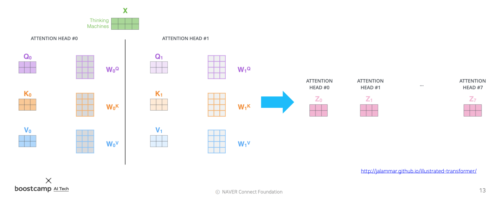  
동일한 입력 X를 여러개의 head에 넣어, 서로 다른 가중치를 가지고 결과를 계산한다  

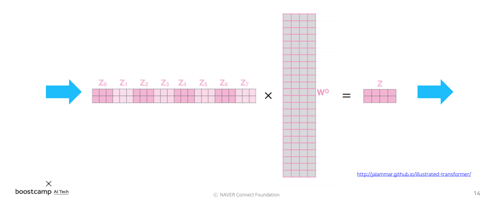  
각각의 head에서 나온 결과들을 모두 concat한 뒤, 늘어난 차원을 선형변환을 통해 우리가 원하는 차원으로 낮춰준다 (보통 입력의 차원과 동일하게)

* transformer의 계산량과 메모리 요구량 등을 살펴보면 다음과 같다

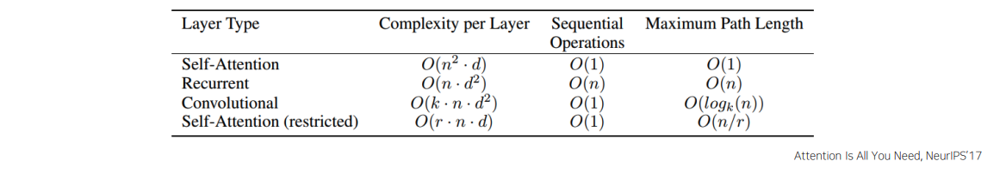

* complexity per layer
  * self attention은 RNN보다 훨씬 많은 메모리를 요구한다
* sequential operations
  * 연산장치의 수가 무한히 많다는 가정 하에 self attention은 한번에 연산이 가능하다
  * RNN은 이전 timestep의 입력을 이용해야 하므로 한번에 연산하는 것이 불가능하다
* maximum path length (long term dependency 관련)
  * self attention은 모든 단어와의 관계를 한번에 고려한다. 따라서 maximum path length는 O(1)
  * RNN은 최대 n번의 layer를 통과해야 다른 단어의 정보를 참고할 수 있다, 따라서 maximum path length는 O(n)

### Block-Based Model

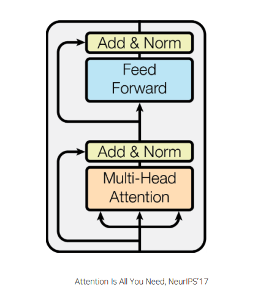

* transformer는 여러 block을 쌓은 형태로 되어있다
* 각각의 block은 2개의 sub-layer를 갖고 있다
  * Multi-head attention
  * Two-layer feed-forward NN (with ReLU)
    * fully connected layer를 통과시켜 긱 단어의 encoding vector를 다시 한번 변환한다

* 이 두 sub-layer는 다음 두가지를 포함하고 있다
  * Residual connection
    * 원래의 입력과 encoding vector(입력값 대비 차이 값)를 더해준다
    * 이 연산을 위해 attention의 입출력 차원이 동일해야 한다
    * 이 과정을 통해 gradient vanishing을 해결하고 학습을 안정화한다
  * layer normalization
    * 주어진 값들의 평균을 0으로, 분산을 1로 만든다 (표준 정규분포로 정규화)
    * 정규화 한 뒤에 affine transformation을 통해 적절한 평균과 분산 값으로 다시 변환한다
    * $y = 2x + 3$ 형태의 affine transformation을 예로 들어보자
      * x에는 앞서 정규화한 값들을 넣는다
      * 2는 새로운 분산이 된다
      * 3은 새로운 평균이 된다
      * 이 2와 3은 학습 가능한 parameter가 된다
    * 이 방법으로 최적의 평균과 분산을 갖도록 학습할 수 있게 된다  
  
    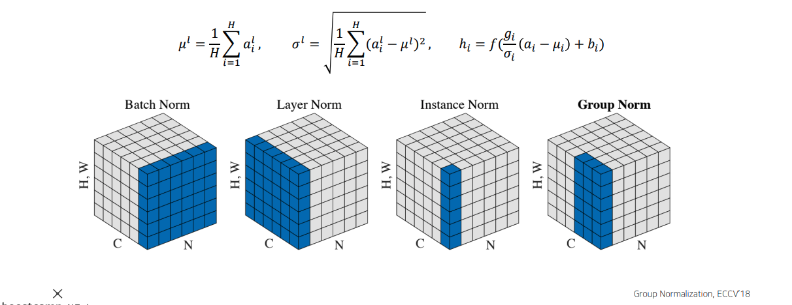
    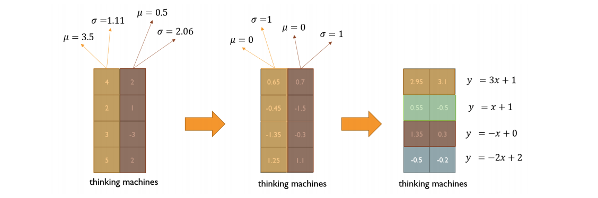

### Positional Encoding

* self attention 구조를 이용한 경우 RNN과 달리 단어의 순서가 고려되지 않는다 (가중 평균을 낼 때 교환법칙이 성립하기 때문)
* 문장 내에서 단어들의 순서가 바뀌어도 출력값은 동일하다
* positional encoding을 통해 순서 정보를 추가해 준다
* 위치별로 unique한 상수 벡터를 더해주는 방식이다
* sin, cos등으로 이루어진 주기함수를 사용한다
* positional encoding을 사용하면 순서에 따라 출력값이 변화하게 된다

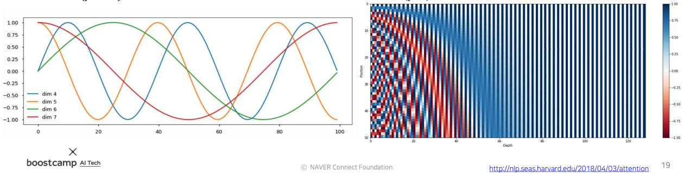

### Learning Rate Scheduler

* learning rate를 가변적으로 바꿔주는 scheduler
  
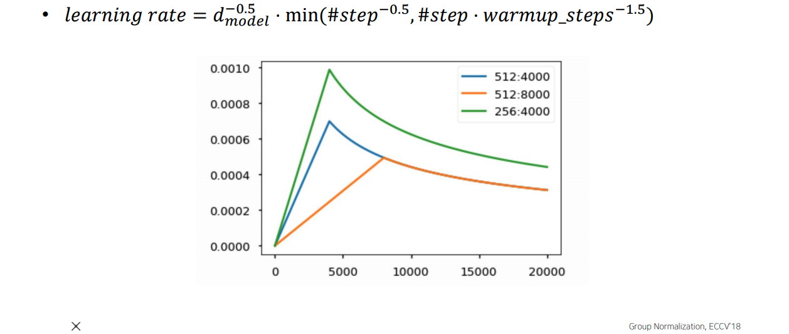

* 학습 초반에는 경사가 가파를 것으로 가정하고, 밖으로 튕겨나가지 않도록 작은 값의 learning rate를 사용함
* 어느정도 학습한 이후에는 완만한 구간에 도달할 것임. 이 때는 global minimum에 다가가기 위해서 (더 빠르게 다가감 + local minimum 탈출) learning rate을 키워가며 학습
* global minimum 근처에 도달했다면 주변을 맴도는 현상을 줄여 minimum에 잘 안착할 수 있도록 learning rate를 점점 줄임

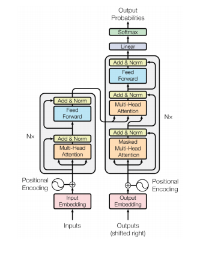  
최종적으로 위와 같은 형태로 encoder가 구성됨

## Decoder

* decoder는 encoder에서 결과물로 나온 encoding vector를 이용해 새로운 문장을 생성한다

  
출처: http://jalammar.github.io/illustrated-transformer/

* decoder는 seq2seq와 유사하게 time step 별로 입력된 단어들 다음에 올 단어를 예측하고, 이전 time step들의 output을 다음 time step의 input으로 넣어 또 다시 다음 단어를 예측하는 과정을 반복한다.
* 이 때 Key, Value vector는 encoder에서 나온 encoding vector를 변환하여 사용하고, Query vector는 decoder의 input을 이용하여 만든다

* 위 사진의 오른쪽이 decoder이다.
* masked multi head attention은 seq2seq with attention model의 decoder에서 hidden state vector를 계산하는 과정에 해당한다. decoder의 input을 이용해 다른 단어들과의 관계의 가중치를 계산할 Query vector를 생성하는 layer이다.
* 다음의 multi-head attention에는 아래의 masked multi head attention에서 나온 결과물이 Query vector로, encoder에서 나온 encoding vector가 Key, Value vector로 들어간다. 이 과정은 seq2seq with attention의 attention module에서 가중치를 구하고, 필요한 정보를 뽑아내는 과정과 동일하다
* 위의 과정을 거쳐 나온 vector로 다음 단어를 예측해내고 다음 time step을 반복한다

* 다음 표는 transformer와 seq2seq with attention model에서 유사한 역할을 하는 vector간에 쌍을 지어 표시한 것이다

|seq2seq with attention|transformer|
|-|-|
|decoder의 hidden state vector|decoder의 Query vector|
|encoder의 hidden state vector|encoder의 encoding vector로 만든 Key, Value vector|

### Masked Self Attention

* 이렇게 decoder에서 단어를 생성할 때에는 첫 time step에는 SOS 토큰만을 input으로 주고, 이후의 time step에서는 예측해낸 단어들을 덧붙여서 다시 input으로 주게 된다
* 학습 시킬 때 역시 아직 예측하지 않은 단어들은 입력으로 주면 안된다
* 이 때 아직 예측하지 않은 부분은 mask하여 가려놓고 학습을 진행한다

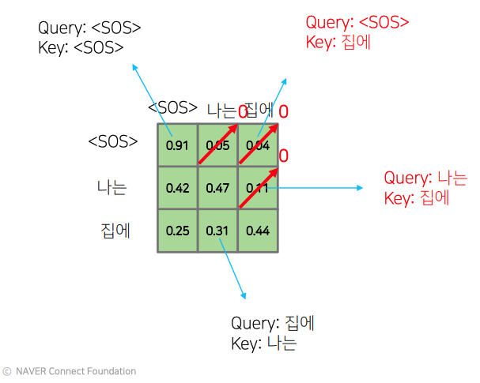

* 첫번째 row는 첫번째 input, 두번째 row는 두번째 input...
* 첫번째 input은 SOS 토큰만 입력으로 전달돼야 하기 때문에 두번째 단어부터는 mask 처리한다
* 두번째 input은 SOS 토큰과 문장의 첫 단어만 입력으로 들어가야 하기 떄문에 세번째 단어는 mask 처리한다
* 이와 같은 방법으로 mask를 이용하여 매 time step의 input을 만든다