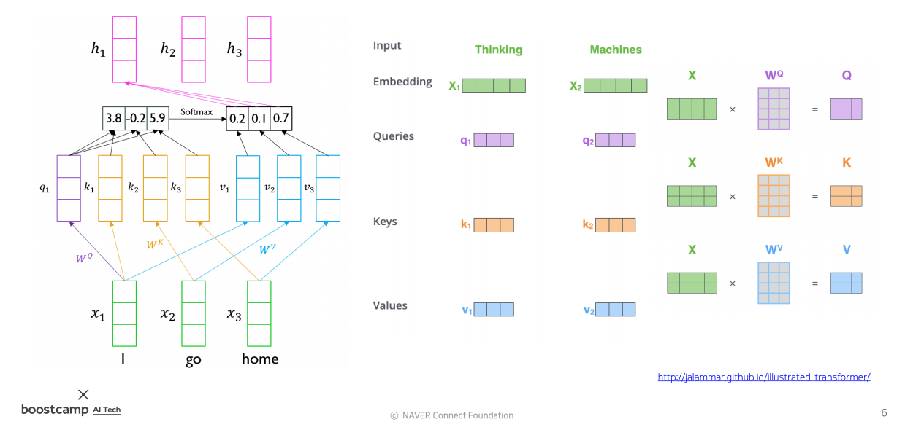

# Day 19 - Transformer

* RNN은 멀리있는 time step의 정보가 유실되는 구조적 문제점이 있음
* 또한 RNN은 이전의 입력에 대한 정보만 이용할 수 있고, 이후에 입력될 단어들의 정보는 고려할 수 없음
* 이 문제를 해결하기 위해 bi-directional rnn을 사용하지만 먼 time step의 정보가 손실되는 문제는 여전히 남아있음 (bidirectional rnn에 대한 내용은 day17에 정리해 두었음)
* Transformer는 동시에 모든 단어를 고려하는 구조를 통해 이러한 문제들을 근본적으로 해결함

    

* 위 그림의 오른쪽 부분
  * Transformer는 Query, Key, Value vector를 이용해 단어들간의 가중 평균을 구함
  * Query, Key, Value 벡터는 모두 embedding된 단어의 vector인 embedding vector를 이용해 만들어짐
  * 동일한 embedding vector를 세개의 다른 linear layer에 넣어 Query, Key, Value 벡터를 계산함
  * 이 선형 변환에 쓰이는 가중치를 각각 $W_Q$, $W_K$, $W_V$라고 하고, Query vector, Key vector, Value vector는 Q, K, V라고 부름
  * 이렇게 만들어 진 Q, K, V 벡터를 이용해 단어들 사이의 관계를 계산함
  * Query vector는 입력으로 주어진 단어들 중 어떤 단어를 중점적으로 가져올지를 결정하는데 쓰이는 vector임
  * Key vector는 Query vector와 내적해 단어 사이의 유사도를 계산하는데 사용될 vector임
  * Value vector는 Key vector와 Query vector를 이용해 구한 가중치를 적용할 vector임
* 위 그림의 왼쪽 부분
  * 현재 위 그림은 단어 "I"에 대한 encoding vector를 구하는 모습임
  * 단어 "I"의 embedding vector $x_1$을 이용해 구한 Query vector $q_1$을 이용해 각 단어들과의 유사도를 계산함
  * $q_1$과 각 단어들의 Key vector를 내적해 유사도를 구함
  * 위에서 구한 유사도에 softmax를 취해 각 단어에 대한 가중치를 계산함
  * 가중치를 Value vector에 적용해 Value vector들의 가중 평균을 구함
  * 이 Value vector들의 가중 평균 vector $h_1$이 "I" 라는 단어의 encoding vector임
  * 이 encoding vector에는 문장 내의 모든 단어에 대한 정보가 담겨있음
  * self attention 방식을 사용하면 문장 내의 모든 단어를 한번에 고려할 수 있고, 멀리 있는 단어에 대한 정보도 소실되지 않음
  * 다음 단어 "go"에 대한 가중 평균을 계산할 때는 위의 과정에서 Query vector만 "go"의 Query vector인 $q_2$로 바꿔 계산하면 됨
  * 각 단어에 대한 연산을 수행할 때 달라지는 것은 이 Query vector밖에 없음

* 위 과정을 보면 encoder와 decoder 두 RNN에서 나온 값들을 이용해 단어들의 가중 평균을 구하는 seq2seq with attention model과 달리 embedding vector만을 가지고 가중 평균을 구하고 있음. 이것이 self attention 구조라고 부르는 이유임.