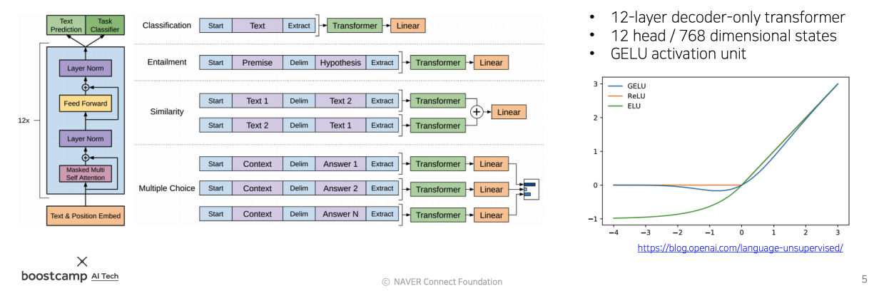
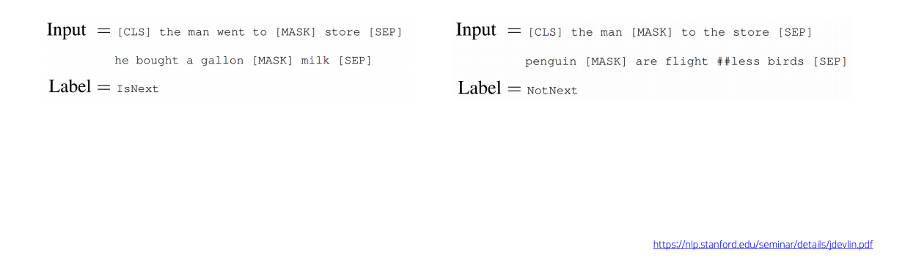
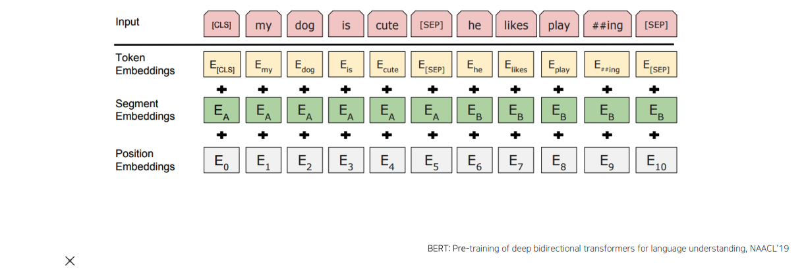
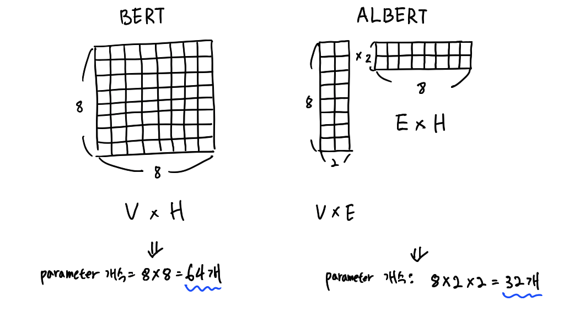
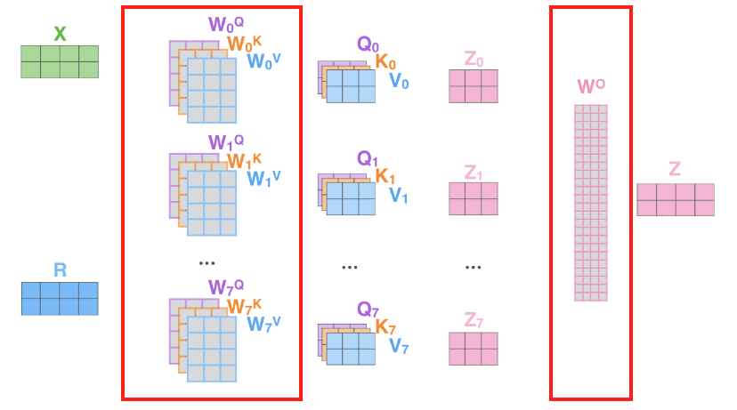
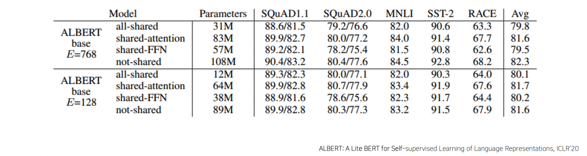
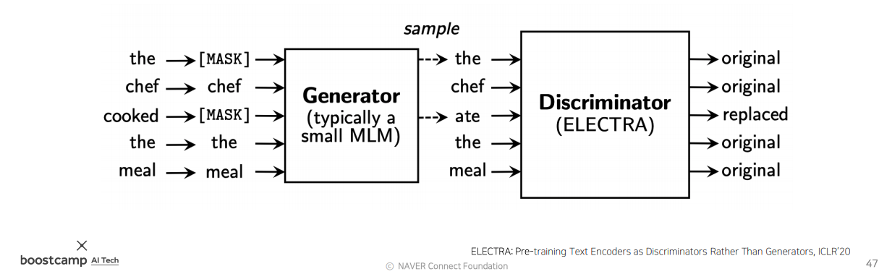

# Day 20 - Self-supervised Pre-training Models, Advanced Self-supervised Pre-training Models

- [Day 20 - Self-supervised Pre-training Models, Advanced Self-supervised Pre-training Models](#day-20---self-supervised-pre-training-models-advanced-self-supervised-pre-training-models)
  - [GPT-1](#gpt-1)
  - [BERT](#bert)
    - [Masked Language Model (MLM)](#masked-language-model-mlm)
    - [Next Sentence Prediction (NSP)](#next-sentence-prediction-nsp)
    - [그 외 BERT의 특징](#그-외-bert의-특징)
  - [GPT-2](#gpt-2)
  - [GPT-3](#gpt-3)
  - [ALBERT](#albert)
    - [기존 BERT model의 문제](#기존-bert-model의-문제)
    - [해결책](#해결책)
      - [Factorized Embedding Parameterization](#factorized-embedding-parameterization)
      - [Cross-layer Parameter Sharing](#cross-layer-parameter-sharing)
      - [(For Performance) Sentence Order Prediction](#for-performance-sentence-order-prediction)
  - [ELECTRA](#electra)
  - [Light-weight Models](#light-weight-models)
  - [Fusing Knowledge Graph into Language Model](#fusing-knowledge-graph-into-language-model)

* Transformer model and its self-attention block has become a general-purpose sequence (or set) encoder and decoder in recent NLP applications as well as in other areas.
* Training deeply stacked Transformer models via a self-supervised learning framework has significantly advanced various NLP tasks through transfer learning, e.g., BERT, GPT-3, XLNet, ALBERT, RoBERTa, Reformer, T5, ELECTRA...

## GPT-1

* 다양한 token을 이용해 하나의 model로 여러가지 task를 수행
* 문장의 끝에는 Extract token을 사용
* 두 문장을 이용하는 task의 경우 두 문장 사이를 Delim token으로 이어줌

* model을 pre-train 할 때에는 다음 단어를 예측하는 task로 학습을 진행함
* pre-train된 모델을 이용해 각각의 task에 맞게 fine-tuning
* inference 할때는 문장 끝의 Extract token의 encoding vector를 각 task에 맞는 output layer에 전달하는 방식으로 하나의 model로 여러가지 task를 수행함
  * Classification의 경우 Extract vector token의 encoding vector를 해당 문장이 긍정인지 부정인지 등을 구분하는데 사용
  * Entailment의 경우 Extract vector token의 encoding vector를 두 문장이 서로 모순되는지를 판단하는데 사용
* 새로운 task를 위한 model이 새롭게 필요하다면 encoder 부분은 기존에 학습된 pre-trained model을 그대로 가져다 쓰고, 위쪽에 새로운 task를 ㅜ이한 추가적인 layer 하나를 붙임
* 새롭게 학습할 때는 새로 추가된 layer를 중점적으로 학습하고, pre-train된 encoder는 learning rate를 작게 해서 fine-tuning만 함
* GPT-1을 이용한 fine-tuned model은 해당 task만을 위해 설계, 학습된 model들보다 더 좋은 성능을 보여줌

## BERT

* GPT-1은 다음 단어를 순차적으로 예측하는 task를 이용해 pre-train 되었다
* 하지만 이런 task는 단어의 전후 문맥을 보지 않고 예측을 하게 됨
* 문장의 앞쪽과 뒤쪽을 모두 고려해야만 더 정확한 예측을 할 수 있음
* BERT는 이러한 문제를 해결하기 위해, 순차적 단어 예측이 아닌, 문장 내 몇몇 단어를 mask한 뒤 앞뒤 문맥을 이용해 이를 예측하도록 설계함
* 이러한 model을 Masked Language Model (MLM) 이라고 함

### Masked Language Model (MLM)

* 문장 내 특정 percentage의 단어들을 mask token으로 치환 후, mask된 단어들이 무엇이었는지 맞추는 방식으로 학습

* GPT-1과 비슷하게 CLS, SEP token을 이용한다
  * CLS token은 문장의 맨 앞에 넣는다, SEP token은 두 문장을 연결할 때 사용한다
* MASK token의 encoding vector는 단어 예측에 사용된다
* CLS token의 encoding vector는 binary classification 등에 사용된다

* 적절한 비율
  * mask된 단어의 비율이 높아지면 예측이 필요한 정보가 충분히 제공되지 않아 문제가 됨
  * mask된 단어의 비율이 작아지면 학습 효율이 좋지 않음
  * BERT에서는 적절한 값으로 15%를 제시함
* 문제점
  * 하지만 여기에도 문제가 있음
  * model이 mask가 끼어있는 문장에 익숙해짐
  * 이런 model은 주제 분류 등의 mask가 등장하지 않는 task에서는 제대로 동작하지 않을 수 있음
* 해결 방안
  * mask 대상인 15%의 단어를 모두 mask하지 않는다
    * 이중 80%만 MASK token으로 바꾼다
    * 10%는 랜덤하게 다른 단어로 바꾼다
      * 다른 단어로 바뀐 것을 찾아서 원래대로 돌려놓는 task
    * 나머지 10%는 그대로 둔다
      * 원래 있던게 맞다고 소신있게 주장하는 능력을 학습

### Next Sentence Prediction (NSP)

* BERT는 word 단위 예측 뿐만 아니라 문장 단위 task에도 대항해야 한다
* 이를 위한 pre-training 기법으로 next sentence prediction을 사용한다
* 문장 2개를 뽑아 SEP 토큰으로 연결한다
* 연결된 문장이 이어지는 문장인지 아닌지를 판별하는 task로 학습한다
* 예측한 결과는 입력 맨 앞의 CLS token에 담기게 된다
* NSP task에도 mask를 적용하여 단어 예측과 함께 학습한다

### 그 외 BERT의 특징

* WordPiece embedding - 단어를 더 잘게 쪼개 subword로 만들어 사용 (Day 19 과제 참고)
* Learned positional embedding - positional encoding에 사용하는 값을 미리 정의해 둔 값이 아니라 학습에 의해 결정된 값을 사용함
* Segment Embedding - 두 문장을 이었을 경우 기존 방식의 positional embedding으로는 정보를 제대로 표현하지 못함.
  
    

    위의 그림의 position embeddings를 보면 두 문장의 position imbedding이 쭉 이어져 있음. 이렇게 되면 이 input에 대한 정보를 온전히 표현하지 못함. 따라서 segment embedding을 이용하여 각 문장을 구분하는 embedding vector를 추가적으로 더해줌

## GPT-2

* GPT-1과 구조는 비슷함. 레이어를 많이 늘림
* Trained on 40GB of text - 매우 많은 data를 사용했음. 특히 quality가 높은 데이터를 주로 사용했음
* Byte pair encoding (BPE) 를 사용함 - 자세한 내용은 [여기(위키독스)](https://wikidocs.net/22592)와 Day 19 과제를 참고

## GPT-3

* 96 Attention layers, Batch size of 3.2M
* 이전 버전들에 비해 모델 구조의 변화보다는 self-attention block을 많이 쌓아 parameter의 개수를 크게 증가시켰음

## ALBERT

* A Lite BERT for Self-supervised Learning of Language Representations
* 경량화된 BERT model
* 
### 기존 BERT model의 문제

* Memory Limitation
* Training Speed
* 
### 해결책

#### Factorized Embedding Parameterization

* 위 그림애서 V, H, E는 다음을 의미함
  * V: vocabulary size
  * H: Hidden-state dimension
  * E: Word embedding dimension
* 위 그림과 같이 word embedding vector의 차원을 줄여주면 parameter의 수를 줄일 수 있음
* word embedding vector의 차원을 다시 늘려주는 layer를 사용하면 더 적은 parameter로 동일한 효과를 낼 수 있음
  
#### Cross-layer Parameter Sharing

* 원래 transformer model은 self attention block마다 각각의 가중치 행렬을 갖고 있음
* 위 그림에서 빨간 박스에 들어있는 부분이 학습해야 할 parameter들임
* encoder layer가 많아질수록 더 많은 parameter들이 필요해짐
* ALBERT에선 self attention block의 가중치 행렬들을 서로 공유함
* 이러한 방법을 사용하면 parameter 수가 많이 줄어들어 메모리 사용량과 학습 속도가 빨라짐
* cross-layer parameter sharing의 종류 3가지
  * shared-FFN: Only sharing feed-forward network parameters across layers
  * shared-attention: Only sharing attention parameters across layers
  * all-shared: Both of them  
  
  
  * all-shared 방식을 사용해 모든 parameter를 공유해도 성능이 크게 떨어지지 않음
  
#### (For Performance) Sentence Order Prediction

* BERT에서는 Next Sentence Prediction을 이용해 model을 학습시켰음
* 하지만 NSP는 너무 쉬운 task여서 학습에 별로 도움이 되지 않았음
* ALBERT에서는 이 문제를 해결하기 위해 Next Sentence Prediction 대신 Sentence Order Prediction를 사용함
* Sentence Order Prediction는 두 문장을 입력으로 주고, 문장이 나열된 순서가 올바른 순서인지 아닌지 맞추는 task임
* Next Sentence Prediction의 오답 (negative sample)은 서로 다른 문서에서 뽑아온 문장의 쌍인 경우가 많았음
* 이 경우 다른 문서에서 가져왔기 때문에 답을 찾기가 쉬웠음
* Sentence Order Prediction에서는 같은 문서 내의 두 문장을 이용해 순서를 맞추는 문제이기 떄문에 Next Sentence Prediction보다 더 어려운 논리적 판단을 요구함

## ELECTRA

* Efficiently Learning an Encoder that Classifies Token Replacements Accurately

* BERT, GPT-1과는 다른 형태로 pre-training을 하는 model
* Generator는 BERT와 흡사함
* Generator는 mask된 단어를 복원해주는 MLM model임
* Discriminator는 transformer model이고, binary classification을 수행함
* Discriminator는 Generator가 생성한 문장을 입력으로 받아 어색한 단어를 찾아서 어떤 단어가 Generator에 의해 생성, 대체된 단어인지를 예측하는 model
* Generator와 Discriminator는 서로 적대적인 관계임 (Generative Adversarial Network - GAN)
* 이렇게 학습된 Generator와 Discriminator 둘 다 pre-trained model로 사용될 수 있음
* ELECTRA에서는 Discriminator를 pre-trained model로 사용함
* BERT와 ELECTRA를 비교하면 ELECTRA가 동일한 계산량에서 더 좋은 결과를 보여줌

## Light-weight Models

* 경량화 모델
* 성능은 유지하고, 계산속도는 빠르게, 크기는 작게 만듦
* DistillBERT (NeurIPS 2019 Workshop)
  * Teacher model(경량화 안된 model)의 결과물의 확률분포를 모사하도록 student model(경량화 모델)을 학습시킴
* TinyBERT (Findings of EMNLP 2020)
  * parameter와 중간 결과물 까지도 Teacher model을 닮도록 student model을 학습시킴

## Fusing Knowledge Graph into Language Model

* 외부적인 정보를 결합시킨 모델
* BERT는 주어진 입력의 문맥을 파악하고, 단어간의 관계를 잘 파악함
* 하지만 주어진 문장 밖의 추가적 정보가 필요한 경우에는 그 정보를 잘 활용하지 못함
  * ex) "꽃을 심기 위해 땅을 팠다", "건물을 짓기 위해 땅을 팠다" 라는 문장을 주고, 질문으로 "무엇으로 땅을 팠을까?" 라고 질문을 했다.  
  사람이라면 상식으로 삽/포크레인을 이용했을 것임을 유추해낸다.  
  BERT는 문장 밖의 정보(상식)를 활용하지 못하기 때문에 제대로 된 답을 하지 못한다.
* 이러한 외부 정보는 knowledge graph의 형태로 표현된다
* knowledge graph와 BERT를 결합해 외부지식을 잘 활용하도록 모델링 해야 한다.