# Day 21 - 그래프란 무엇이고 왜 중요할까?, 실제 그래프는 어떻게 생겼을까?

- [Day 21 - 그래프란 무엇이고 왜 중요할까?, 실제 그래프는 어떻게 생겼을까?](#day-21---그래프란-무엇이고-왜-중요할까-실제-그래프는-어떻게-생겼을까)
  - [그래프란 무엇이고 왜 중요할까?, 그래프 필수 기초 개념](#그래프란-무엇이고-왜-중요할까-그래프-필수-기초-개념)
    - [그래프란 무엇이고 왜 중요할까?](#그래프란-무엇이고-왜-중요할까)
      - [그래프란 무엇일까?](#그래프란-무엇일까)
      - [그래프는 왜 중요할까?](#그래프는-왜-중요할까)
    - [그래프 관련 인공지능 문제](#그래프-관련-인공지능-문제)
    - [그래프 관련 필수 기초 개념](#그래프-관련-필수-기초-개념)
      - [경로, 거리 및 지름](#경로-거리-및-지름)
      - [그래프의 유형 및 분류](#그래프의-유형-및-분류)
      - [그래프를 표현하는데 사용하는 기호들](#그래프를-표현하는데-사용하는-기호들)
    - [실습 - Networkx를 이용한 그래프의 표현 및 저장](#실습---networkx를-이용한-그래프의-표현-및-저장)
  - [실제 그래프는 어떻게 생겼을까?](#실제-그래프는-어떻게-생겼을까)
    - [실제 그래프 vs 랜덤 그래프](#실제-그래프-vs-랜덤-그래프)
    - [작은 세상 효과 (small world effect)](#작은-세상-효과-small-world-effect)
    - [연결성의 두터운 꼬리 분포](#연결성의-두터운-꼬리-분포)
      - [연결성](#연결성)
      - [두터운 꼬리 분포](#두터운-꼬리-분포)
    - [연결 요소와 거대 연결 요소](#연결-요소와-거대-연결-요소)
      - [연결 요소](#연결-요소)
      - [거대 연결 요소](#거대-연결-요소)
    - [군집 구조](#군집-구조)
      - [군집](#군집)
      - [지역적 군집 계수(local clustering coefficient)](#지역적-군집-계수local-clustering-coefficient)
      - [전역 군집 계수(global clustering coefficient)](#전역-군집-계수global-clustering-coefficient)
    - [실제 그래프 vs 랜덤 그래프](#실제-그래프-vs-랜덤-그래프-1)
    - [실습 - Networkx를 이용한 군집 계수 및 지름 분석](#실습---networkx를-이용한-군집-계수-및-지름-분석)

## 그래프란 무엇이고 왜 중요할까?, 그래프 필수 기초 개념

### 그래프란 무엇이고 왜 중요할까?

#### 그래프란 무엇일까?

* 그래프 용어
  * 그래프 -> 그래프(graph), 네트워크(network)
  * 정점 -> 정점(vertex), 노드(node)
  * 간선 -> 간선, 엣지(edge), 링크(link)

#### 그래프는 왜 중요할까?

* 그래프는 복잡계(complex system)를 표현하고 분석하기 위한 언어
  * 복잡계의 예 - 70억 인구로 구성된 사회, 통신 시스템, 지식, 뇌, 신체 등
  * 복잡계의 특성 - 구성 요소가느이 복잡한 상호작용
* 복잡계를 이해하고, 복잡계에 대한 정확한 예측을 하기 위해 그래프에 대한 이해가 반드시 필요
* 그래프를 위한 인공지능 기술은 전산학, 물리학, 생물학, 화학, 사회과학 등 여러 분야에서 활용할 수 있음

### 그래프 관련 인공지능 문제

* 정점 분류(node classification) 문제
  * ex) 트위터에서의 retweet 관계를 분석하여, 각 사용자의 정치적 성향을 알 수 있을까?
* 연결 예측(link prediction) 문제
  * 거시적 관점
    * 그래프가 어떻게 성장할지를 예측
    * ex) 페이스북 소셜네트워크는 어떻게 진화할까?
  * 미시적 관점
    * 각 정점이 앞으로 어떤 정저모가 연결될지를 예측
    * 추천 시스템
    * ex) 각자에게 필요한 물건을 무엇일까? 어떤 물건을 구매해야 만족도가 높을까?
* 군집 분석(community detection) 문제
  * 서로 밀접된 정점들의 집합(군집)을 찾아내는 문제
  * ex) 연결 관계로부터 사회적 무리(social circle)을 찾아낼 수 있을까?
* 랭킹(ranking) 및 정보 검색(information retrieval) 문제
  * ex) 웹(web)이라는 거대한 그래프로부터 어떻게 중요한 웹페이지를 찾아낼 수 있을까?
* 정보 전파(information cascading) 및 바이럴 마케팅(viral marketing) 문제
  * ex) 정보는 네트워크를 통해 어떻게 전파될까? 어떻게 정보 전달을 최대화 할 수 있을까?

### 그래프 관련 필수 기초 개념

#### 경로, 거리 및 지름

* 경로(path)
  * 정점 u와 v 사이의 경로는 아래 조건을 만족하는 정점들의 순열
    1. u에서 시작해서 v에서 끝나야 함
    2. 순열에서 연속된 정점은 간선으로 연결되어 있어야 함
* 경로의 길이
  * 경로의 길이는 해당 경로 상에 놓이는 간선의 수
* 거리(distance)
  * 정점 u와 v 사이의 거리는 u와 v 사이의 최단 경로의 길이
* **지름(diameter)**
  * **그래프의 지름은 정점 간 거리의 최댓값**
  * 아래 예시 그래프의 지름은 4
  
  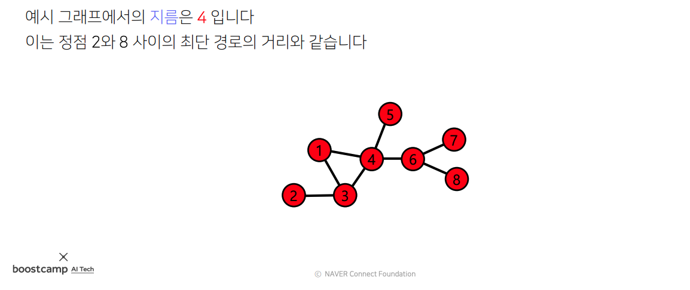

#### 그래프의 유형 및 분류

* 간선의 방향
  * 방향이 없는 그래프
  * 방향이 있는 그래프
* 가중치의 유무
  * 가중치가 없는 그래프
  * 가중치가 있는 그래프
* 노드의 종류
  * 동종 그래프
  * 이종 그래프
    * 이종 그래프는 두 종류의 정점을 갖는다
    * **다른 종류의 정점 사이에만 간선이 연결됨** (같은 종류의 정점 사이엔 간선 생기지 않음)

#### 그래프를 표현하는데 사용하는 기호들

* 그래프는 정점 집합과 간선 집합으로 이루어진 수학적 구조
  * 정점들의 집합을 $V$ 라고 함
  * 간선들의 집합을 $E$ 라고 함
  * 그래프를 $G = (V, E)$ 라고 함
* 정점의 이웃(neighbor)은 그 정점과 연결된 다른 정점을 의미
  * 정점 $v$의 이웃들의 집합을 $N(v)$ 혹은 $N_v$라고 함
* 방향성이 있는 그래프에서는 **나가는 이웃(out-neighbor)**과 **들어오는 이웃(in-neighbor)**을 구분함
  * 정점 $v$에서 간선이 나가는 이웃의 집합을 $N_{out}(v)$라고 함
  * 정점 $v$에서 간선이 들어오는 이웃의 집합을 $N_{in}(v)$라고 함

### 실습 - Networkx를 이용한 그래프의 표현 및 저장

[Lab 1-1 : Graph Basic](./실습/실습1_1/실습1_1.md)
[Lab 1-2 : Graph Representation](./실습/실습1_2.md)

## 실제 그래프는 어떻게 생겼을까?

### 실제 그래프 vs 랜덤 그래프

* 실제 그래프(real graph)란 다양한 복잡계로부터 얻어진 그래프를 의미

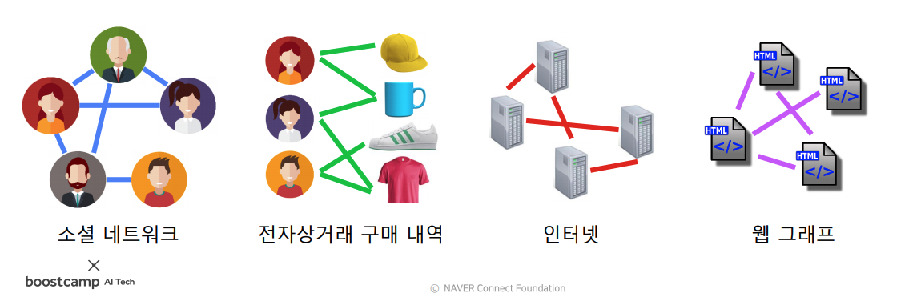

* 랜덤 그래프(random graph)란 확률적 과정을 통해 생성한 그래프를 의미
* 수업에서는 에르되스-레니 랜덤 그래프 모델을 사용
* 에르되스-레니 랜덤 그래프 $G(n, p)$
  * n개의 정점을 갖는다
  * 임의의 두 정점 사이에 간선이 존재할 확률은 p
  * 정점 간의 연결은 서로 독립적
  * ex) G(3, 0.3)에 의해 생성될 수 있는 그래프와 각각의 확률은 다음과 같다

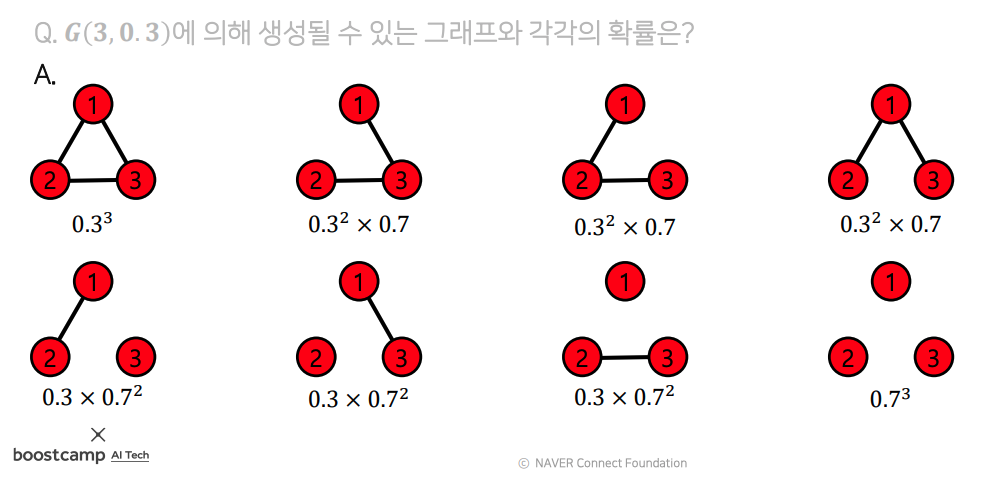

### 작은 세상 효과 (small world effect)

* 임의의 두 사람을 골랐을 때, 몇 단계의 지인을 거쳐 연결되어 있을까?
  * 1960년대에 수행된 여섯 단계 분리(six degrees of separation) 실험 결과 평균 거리는 6
  * MSN 메신저 그래프에서 구한 정점 간의 평균 거리는 7 (거대 연결 구조만 고려)
* 이렇게 실제 그래프에서 멀리 있을 것 같은 두 정점 사이의 거리가 실제로는 작다는 것을 작은 세상 효과라고 부름
* 작은 세상 효과는 높은 확률로 랜덤 그래프에도 존재함
* 하지만 모든 그래프에 작은 세상 효과가 존재하는 것은 아님
  * 체인, 사이클, 격자 그래프에서는 작은 세상 효과가 존재하지 않음  
  
  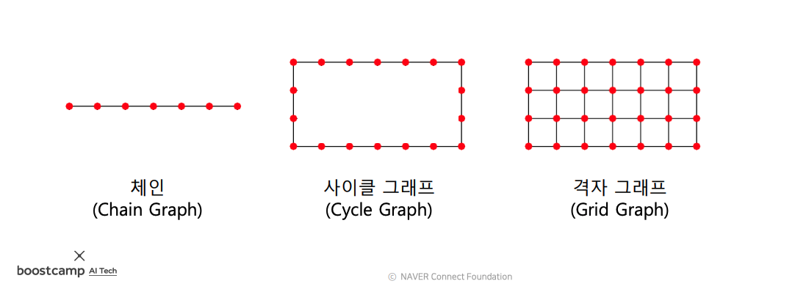

### 연결성의 두터운 꼬리 분포

#### 연결성

* 정점의 연결성(degree)은 그 정점과 연결된 간선의 수를 의미함
  * 정점 v의 연결성 = 해당 정점의 이웃들의 수 = 해당 정점에 연결된 간선의 수
  * 정점 v의 연결성은 $d(v)$, $d_v$ 혹은 $|N(v)|$로 적음

  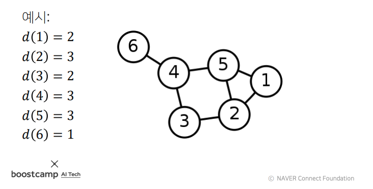

* 정점의 나가는 연결성(out degree)은 그 정점에서 나가는 간선의 수를 의미
  * 정점 v의 나가는 연결성은 $d_{out}(v)$ 혹은 $|N_{out}(v)|$로 표시

* 정점의 들어오는 연결성(in degree)은 그 정점으로 들어오는 간선의 수를 의미
  * 정점 v의 들어오는 연결성은 $d_{in}(v)$ 혹은 $|N_{in}(v)|$로 표시

  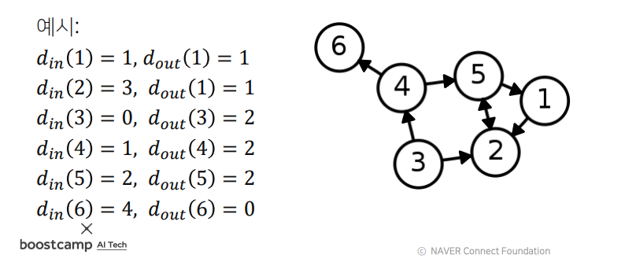

#### 두터운 꼬리 분포

* 실제 그래프의 연결성 분포는 두터운 꼬리(heavy tail)를 갖는다
  * 연결성이 매우 높은 허브(hub) 정점이 존재함을 의미
  * 실제 그래프의 연결성 분포는 다음과 같이 생겼다

  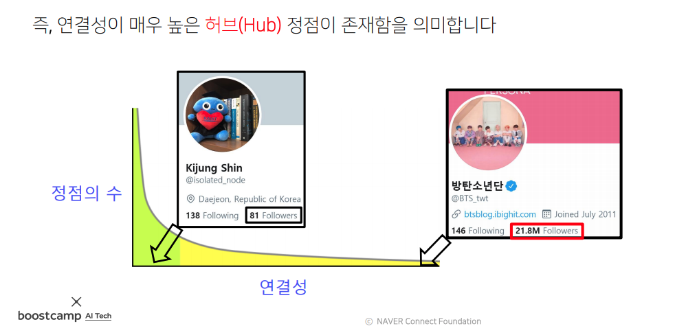

* 랜덤 그래프의 연결성 분포는 정규 분포와 유사함
  * 연결성이 매우 높은 허브 정점이 존재할 가능성은 매우 희박함
  * 랜덤 그래프의 연결성 분포는 다음과 같이 생겼다

  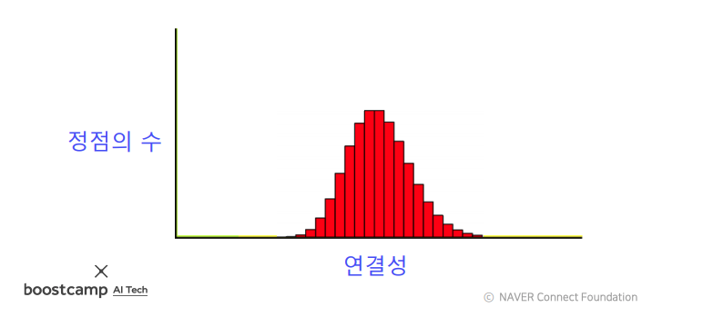

  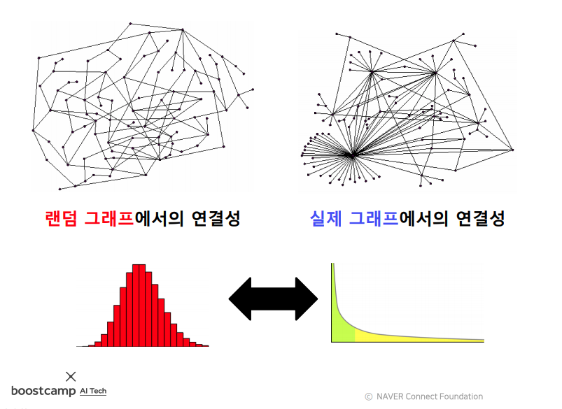

### 연결 요소와 거대 연결 요소

#### 연결 요소

* 연결요소(connected component)는 다음 조건들을 만족하는 정점들의 집합을 의미함
   1. 연결 요소에 속하는 정점들은 경로로 연결될 수 있다
   2. (1)의 조건을 만족하면서 정점을 추가할 수 없다

  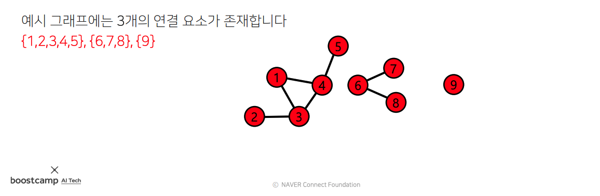
  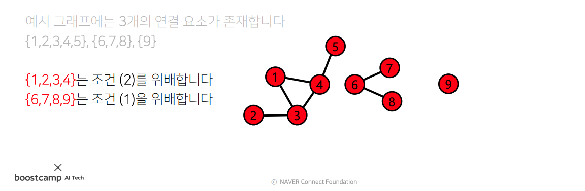

#### 거대 연결 요소

* 거대 연결 요소는 대다수의 정점을 포함하는 연결 요소이다
* 실제 그래프에는 거대 연결 요소(giant connected component)가 존재한다
  * ex) MSN 메신저 그래프에서는 99.9%의 정점이 하나의 거대 연결 요소에 포함된다
* 랜덤 그래프에도 높은 확률로 거대 연결 요소가 존재한다
  * 단, 정점들의 평균 연결성이 1보다 충분히 커야한다 (자세한 이유는 Random Graph Theory를 참고)

### 군집 구조

#### 군집

* 군집이란 다음 조건들을 만족하는 정점들의 집합이다
  1. 집합에 속하는 정점 사이에는 많은 간선이 존재한다
  2. 집합에 속하는 정점과 그렇지 않은 정점 사이에는 적은 수의 간선이 존재한다
* 군집은 수학적으로 엄밀한 정의는 아니다

  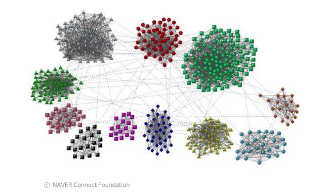

#### 지역적 군집 계수(local clustering coefficient)

* 지역적 군집 계수는 한 정점에서 군집의 형성 정도를 측정함
* 정점 i의 지역적 군집 계수는 정점 i의 이웃 쌍 중 간선으로 직접 연결된 이웃 쌍의 비율을 의미함
* 정점 i의 군집 계수는 $C_i$로 표현

  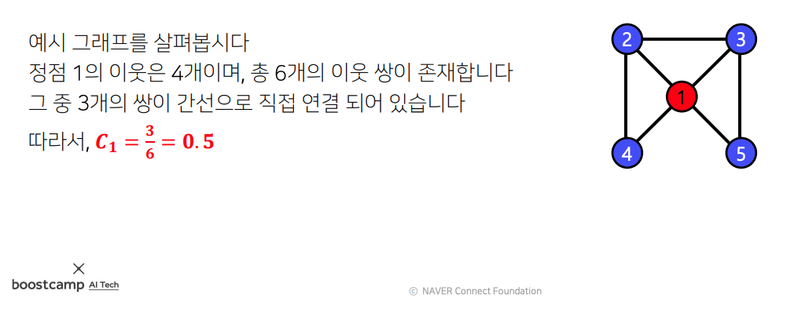

* 위의 그림에서 정점 1의 이웃은 {2, 3, 4, 5} 총 4개
* 이 예제에서 이웃 쌍의 개수는 $_{4} \mathrm{C} _{2}$ = 6
  * 이웃 쌍의 개수는 $_{이웃의 수} \mathrm{C} _{2}$ 로 구할 수 있다
  * 이웃 쌍을 모두 구해보면 다음과 같음
    * (2, 3), (2, 4), (2, 5), (3, 4), (3, 5), (4, 5)
* 이웃 쌍 중 실제로 이웃인 쌍들은 다음과 같음
  * (2, 4), (2, 3), (3, 5) -> 3개
* 따라서 정점 1의 지역적 군집 계수는 $3\over{6}$ = 0.5

  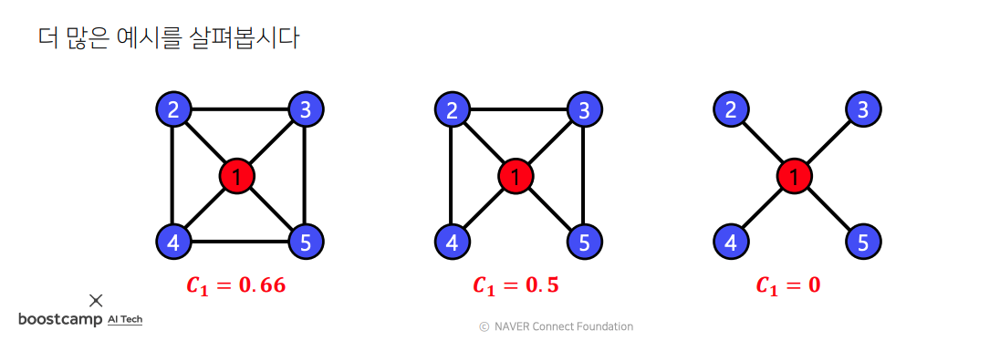

* 이웃 쌍 사이에 간선이 많아질수록 군집 계수가 늘어나고, 줄어들수록 군집 계수가 줄어듦
* 연결성이 0인 정점에서는 (연결된 간선이 없는 정점) 지역적 군집 계수가 정의되지 않음
  * 분모가 0이기 때문
* 특정 정점의 지역적 군집 계수가 매우 높다면, 그 정점의 이웃들도 높은 확률로 서로 간선으로 연결되어 있음. 따라서 그 정점과, 그 이웃들은 높은 확률로 군집을 형성함

#### 전역 군집 계수(global clustering coefficient)

* 전역 군집 계수는 전체 그래프에서 군집의 형성 정도를 측정함
* 그래프 G의 전역 군집 계수는 각 정점에서의 지역적 군집 계수의 평균이다
  * 단, 지역적 군집 계수가 정의되지 않는 정점은 제외한다
* 실제 그래프에서는 군집 계수가 높다. 즉 많은 군집이 존재함. 그 이유는 다음과 같음.
  * 동질성 - 서로 유사한 정점끼리 간선으로 연결될 가능성이 높음
  * 전이성 - 공통 이웃이 있는 경우, 공통 이웃이 매개 역할을 해 줄 가능성이 높음
* 랜덤 그래프에서는 지역적 혹은 전역 군집 계수가 높지 않다
  * 랜덤 그래프 $G(n, p)에서의 군집 계수는 p이다
  * 랜덤 그래프에서 간선의 연결은 서로 독립적이기 떄문
  * 공통 이웃의 존재 여부가 간선 연결 확률에 영향을 미치지 않음

### 실제 그래프 vs 랜덤 그래프

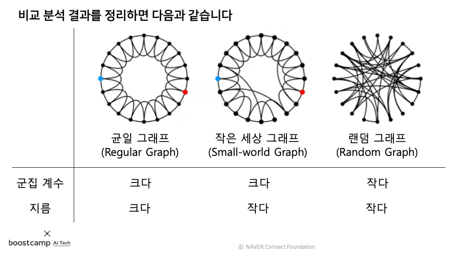

* 실제 그래프에서만 나타나는 특성
  * 연결성의 두터운 꼬리 분포
  * 군집 구조

* 랜덤 그래프와 실제 그래프에서 모두 나타나는 특성
  * 작은 세상 효과
  * 거대 연결 요소

### 실습 - Networkx를 이용한 군집 계수 및 지름 분석

[Lab 2 : Graph Property](./실습/실습2/실습2_solution.md)