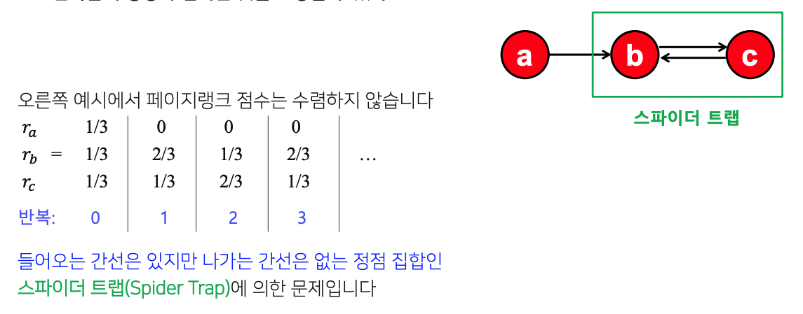

# Day 22 - 그래프의 활용 (검색엔진, 바이럴 마케팅)

- [Day 22 - 그래프의 활용 (검색엔진, 바이럴 마케팅)](#day-22---그래프의-활용-검색엔진-바이럴-마케팅)
  - [검색 엔진에서는 그래프를 어떻게 활용할까?](#검색-엔진에서는-그래프를-어떻게-활용할까)
    - [페이지 랭크(pageRank)의 배경](#페이지-랭크pagerank의-배경)
    - [페이지 랭크의 정의](#페이지-랭크의-정의)
      - [투표 관점](#투표-관점)
      - [임의 보행 관점](#임의-보행-관점)
    - [페이지 랭크의 계산](#페이지-랭크의-계산)
      - [문제점](#문제점)
      - [해결책](#해결책)
    - [실습 - 위키피디아 검색](#실습---위키피디아-검색)
  - [그래프를 바이럴 마케팅에 어떻게 활용할까?](#그래프를-바이럴-마케팅에-어떻게-활용할까)
    - [의사결정 기반의 전파 모형 (선형 임계치 모형)](#의사결정-기반의-전파-모형-선형-임계치-모형)
    - [확률적 전파 모형 (독립 전파 모형)](#확률적-전파-모형-독립-전파-모형)
    - [바이럴 마케팅과 전파 최대화 문제](#바이럴-마케팅과-전파-최대화-문제)
      - [바이럴 마케팅](#바이럴-마케팅)
      - [전파 최대화 문제 (influence maximization problem)](#전파-최대화-문제-influence-maximization-problem)
    - [실습 - 전파 모형 시뮬레이터 구현](#실습---전파-모형-시뮬레이터-구현)

## 검색 엔진에서는 그래프를 어떻게 활용할까?

### 페이지 랭크(pageRank)의 배경

* 웹은 웹페이지와 하이퍼링크로 구성된 거대한 방향성 있는 그래프로 표현할 수 있다
  * 웹페이지는 정점
  * 하이퍼링크는 (방향성 있는) 간선
  * 추가적으로 웹페이지는 키워드 정보를 포함한다
* 구글 이전의 검색 엔진
  * 웹을 거대한 디렉토리로 정리
    * 웹페이지의 수가 증가함에 따라 카테고리의 수와 깊이가 무한정으로 커지는 문제
    * 카테고리 구분이 모호해 저장과 검색에 어려움이 있음
  * 키워드에 의존한 검색 엔진
    * 악의적인 웹페이지에 취약함
    * ex) 키워드와 전혀 상관 없는 웹 페이지에 검색 유입을 위해 키워드들을 숨겨놓음
* 사용자가 입력한 키워드와 관련성이 높고, 신뢰할 수 있는 웹페이지를 찾아야 한다
  * 구글의 창업자인 래리 페이지와 세르게이 브린이 만든 페이지 랭크 알고리즘으로 해결

### 페이지 랭크의 정의

#### 투표 관점

* 페이지 랭크의 핵심 아이디어는 **투표**
* 투표의 주체는 웹페이지
* 웹페이지는 하이퍼링크를 통해 다른 웹페이지에 투표함
* 웹페이지 u가 다른 웹페이지 v로 가는 하이퍼링크를 포함하고 있다면, 웹페이지 u의 작성자는 웹페이지 v가 웹페이지 u와 관련성이 높고, 신뢰하고 있다는 것을 의미함. 따라서 u가 v에 투표했다고 생각할 수 있음
* 즉, 들어오는 간선이 많을수록 신뢰할 수 있음
* 하지만 단순히 들어오는 간선이 많은 것으로 판단하면 악용될 소지가 있음
  * 웹페이지를 여러개 만들어 간선의 수를 부풀리는 방식으로 조작 가능
* 이런 악용에 의한 효과를 줄이기 위해, 페이지 랭크에서는 가중 투표를 함
  * 관련성이 높고, 신뢰할 수 있는 웹사이트의 투표를 더 중요하게 간주함
* 재귀를 이용해 신뢰도를 측정
* 가중치는 ${자신의 페이지랭크 점수}\over{나가는 이웃의 수}$ 가 된다
* 각 웹페이지의 페이지랭크 점수는 받은 투표의 가중치 합으로 정의된다
  
    
  정점 j에 들어오는 이웃들의 투표 가중치를 모두 더함
  

#### 임의 보행 관점

* 웹페이지의 하이퍼링크 중 하나를 균일한 확률로 클릭하는 방식으로 웹서핑
* 웹서퍼가 t번째로 방문한 웹페이지가 웹페이지 i일 확률을 $p_i(t)$라고 하면, $p(t)$는 길이가 웹페이지 수와 같은 확률분포 벡터가 된다
* 그렇게 되면 아래의 식이 성립함
  
    
  t번째에 웹페이지 j에 들어오는 이웃 웹페이지 i에서 t+1번째에 j로 넘어올 확률

* 웹서퍼가 이 과정을 무한히 반복하고 나면 확률 분포 $p(t)$가 수렴하게 됨
* 수렴한 확률 분포 p는 정상 분포(stationary distribution)라고 부름
* 그러면 앞의 수식을 다음과 같이 바꿀 수 있음

    

* 이 식은 투표 관점에서 정의한 페이지 랭크 점수 식과 동일함
  
    

### 페이지 랭크의 계산

* 페이지랭크 점수의 계산에는 반복곱(power iteration)을 사용
* 반복곱은 다음 세단계로 구성됨
  * 각 웹페이지 i의 페이지 랭크 점수 $r^{(0)}_i$를 $1\over{웹페이지의 수}$로 초기화
  * 아래의 식을 이용해 각 웹페이지의 페이지 랭크 점수 $r^{(t+1)}_i$를 갱신
  * 페이지랭크가 수렴될 때 까지 위 과정을 반복
  * $r^{(t)}_i \approx r^{(t+1)}_i$이면 반복 종료

#### 문제점

1. 반복곱이 항상 수렴하는 것이 보장되는가?
    * 그렇지 않다
    * 아래의 예시에서 페이지랭크 점수는 수렴하지 않음
    * 들어가는 간선은 있지만, 나가는 간선은 없는 **정점 집합**인 스파이더 트랩(spider trap)에 의한 문제
  
    
  
2. 반복곱이 항상 합리적인 점수로 수렴하는 것이 보장되는가?
   * 그렇지 않다
   * 아래의 예시에서 페이지랭크 점수는 0이로 수렴. 이는 우리가 원하던 결과가 아님
   * 들어가는 간선은 있지만, 나가는 간선은 없는 **정점**인 막다른 정점(dead end)에 의한 문제

    
  
#### 해결책

* 위의 문제들은 모두 들어가는 간선은 있지만 나가는 간선은 없는 정점 or 정점 집합들 때문에 생긴다
* 이 문제를 해결하기 위해 순간이동(teleport)를 도입
* 웹서퍼의 행동을 다음과 같이 수정함
  * 현재 웹페이지에 하이퍼링크가 없다면 임의의 웹페이지로 순간이동
  * 현재 웹페이지에 하이퍼링크가 있다면, 앞면이 나올 확률이 a인 동전을 던짐
  * 앞면이 나왔다면, 하이퍼링크 중 하나를 균일한확률로 선택해 클릭
  * 뒷면이 나왔다면, 임의의 웹페이지로 순간이동
* 이 때 a를 감폭 비율(damping factor)라고 부르며 보통 0.8 정도의 값을 사용
* 위와 같은 방법으로 스파이더 트랩, 막다른 정점에 갇히는 경우가 사라짐

* 따라서 아래 수식을 사용하여 반복곱을 수행한다
  
    
    

### 실습 - 위키피디아 검색 

// TODO

## 그래프를 바이럴 마케팅에 어떻게 활용할까?

* 질병의 전파
* 정전의 전파
* 소셜 네트워크를 통한 전파
* 이와 같은 다양하고 복잡한 전파 과정을 체계적으로 이해하고 대처하기 위해 전파 과정을 수학적 모형화 한다

### 의사결정 기반의 전파 모형 (선형 임계치 모형)

* 주변 사람들의 의사결정을 고려하여 각자 의사결정을 내리는 경우에 의사결정 기반의 전파 모형을 사용함
* 이 상황을 수학적으로 추상화 해보면 다음과 같다
  * 친구 관계의 두 사람 u와 v가 있다
  * 둘은 두개의 호환되지 않는 기술 A와 B 중에서 하나를 선택한다
  * 둘 모두 A 기술을 사용할 경우, 행복이 a만큼 증가
  * 둘 모두 B 기술을 사용할 경우, 행복이 b만큼 증가
  * 둘이 서로 다른 기술을 사용할 경우 행복이 증가하지 않음
  
  

* 소셜 네트워크에서는 이웃과의 사이에서 발생하는 행복을 고려해야 한다
  * 아래의 예시에서 u가 A를 선택할 경우 행복이 2a만큼 증가함
  * 아래의 예시에서 u가 B를 선택할 경우 행복이 3b만큼 증가함

     
  빨간색: A, 파란색: B

* 각자가 행복이 최대화되는 선택을 한다고 가정해 본다면
  * 2a > 3b 라면 u는 A를 선택
  * 2a < 3b 라면 u는 B를 선택
  * 편의상 2a = 3b 라면 u는 B를 선택한다고 가정

* 일반화 해보면 다음과 같음
  * p 비율의 이웃이 A를 선택
  * 1 - p 비율의 이웃이 B를 선택
  * ap > b(1 - p) 일 때 A를 선택함
  * 정리하면 p > $b \over{a + b}$ 일 때 A를 선택
  * 이 때 $b \over{a + b}$ 를 편의상 임계치 q라고 하자

     

* 각 정점은 이웃 중 A를 선택한 비율이 임계치 q를 넘을 때만 A를 선택하게 된다
* 다음은 얼리 어답터들이 A를 전파시키는 과정임

     
     
     
     
     
     

### 확률적 전파 모형 (독립 전파 모형)

* 전염병의 전파 과정은 의사결정 기반 모형으로 표현하기엔 적절하지 않음
  * 아무도 전염병에 걸리기로 의사결정 하지 않기 때문
* 전염병의 전파는 확률적 과정이기 때문에 확률적 전파 모형을 고려해야 함

* 방향성이 있고 가중치가 있는 그래프를 가정
  * 각 간선 (u, v)의 가중치는 u가 감염되었을 때 v를 감염시킬 확률을 뜻함
  * 서로 다른 이웃이 전염되는 확률은 독립적임
* 전파는 다음과 같은 과정으로 진행됨
  * 모형은 최초 감염자들(시드 집합 - seed set)로부터 시작함
  * 감염자 u는 각 이웃 v에게 $p_{uv}$ 확률로 병을 전파함
  * 위의 과정을 새로운 감염자 각각에게 반복함
  * 더이상 새로운 감염자가 없으면 종료

     

### 바이럴 마케팅과 전파 최대화 문제

#### 바이럴 마케팅

* 바이럴 마케팅은 소비자들로 하여금 상품에 대한 긍정적인 입소문을 내게 하는 기법
* 바이럴 마케팅이 효과적이기 위해서는 소문의 시작점이 중요함
* 시작점(시드 집합)이 어디인지에 따라서 입소문이 전파되는 범위가 달라짐
* 소셜 인플루언서들이 높은 광고비를 받는 이유

     
     

#### 전파 최대화 문제 (influence maximization problem)

* 그래프, 전파 모형, 시드 집합의 크기가 주어졌을 때 전파를 최대화하는 시드 집합을 찾는 문제
* 전파 모형으로는 앞에서 배운 선형 임계치 모혀아, 독립 전파 모형 등 다양한 모형을 고려할 수 있음
* 그래프에 $|V|$개의 정점이 있을 경우, 시드 집합의 크기를 k개로 제한하더라도 고려해야 할 경우의 수는 $_{|V|}\mathrm{C} _k$ 개임
* 정점이 10000개, 시드 집합의 크기를 10이라고 하면 경우의 수는 2,743,355,077,591,282,538,231,819,720,749,000개임
* 많은 전파 모형에 대해 전파 최대화 문제는 NP-hard임이 증명됨
* 따라서 최고의 시드 집합을 찾는 것은 거의 불가능하고, 대략적인 정답을 찾는 방식으로 해결

* 정점 중심성 휴리스틱
  * 시드 집합의 크기가 k개로 고정되어 있을 떄, 정점의 중심성이 높은 순으로 k개 정점을 선택하는 방법
  * 정점의 중심성으로는 페이지랭크 점수, 연결 중심성, 근접 중심성, 매개 중심성 등이 있음
  * 합리적인 방법이지만, 최고의 시드 집합을 찾는다는 보장은 없음
* 탐욕 알고리즘
  * 최초 전파자를 한번에 한명씩 선택
  * 정점의 집합을 {1,2,...,|𝑉𝑉|}라고 할 경우 구체적인 단계는 다음과 같다
    * 집합 {1}, {2}, ... , {|𝑉𝑉|}를 비교하여, 전파를 최대화하는 시드 집합을 찾는다. 확률적 전파 모형의 경우에는 전파의 크기를 비교하기 위해 각 정점을 선택했을 때 감염 시뮬레이션을 반복하여 구한 평균 값을 사용한다
    * 집합 {x, 1}, {x, 2}, ... , {x, |𝑉𝑉|}를 비교하여, 전파를 최대화하는 시드 집합을 찾고, 뽑힌 집합을 {x, y} 라고 한다
    * 집합 {x, y, 1}, {x, y, 2}, ... , {x, y, |𝑉𝑉|}를 비교하여, 전파를 최대화하는 시드 집합을 찾고, 뽑힌 집합을 {x, y, z} 라고 한다
    * 위 과정을 목표하는 크기의 시드 집합에 도달할 때 까지 반복한다
  * 독립 전파 모형의 경우에는 이론적으로 정확도가 일부 보장된다
    * 탐욕 알고리즘으로 찾은 시드 집합에 의한 전파의 크기는 최고의 시드 집합에 의한 전파의 크기의 63.2% 이상임이 수학적으로 보장되어있다

### 실습 - 전파 모형 시뮬레이터 구현

// TODO