# Day 23 - 그래프 구조 분석, 추천 시스템 기초

## 그래프 구조 분석

### 군집 구조와 군집 탐색 문제

* 군집(community)이란 다음 조건들을 만족하는 정점들의 집합
  * 집합에 속하는 정점 사이에는 많은 간선이 존재
  * 집합에 속하는 정점과 그렇지 않은 정점 사이에는 적은 수의 간선이 존재
* 그래프를 여러 군집으로 잘 나누는 문제를 군집 탐색(community detection) 문제라고 한다

### 군집 구조의 통계적 유의성과 군집성

* 배치 모형 (configuration model)
  * 각 정점의 연결성(degree)을 보존한 상태에서
  * 간선들을 무작위로 재배치해서 얻은 그래프

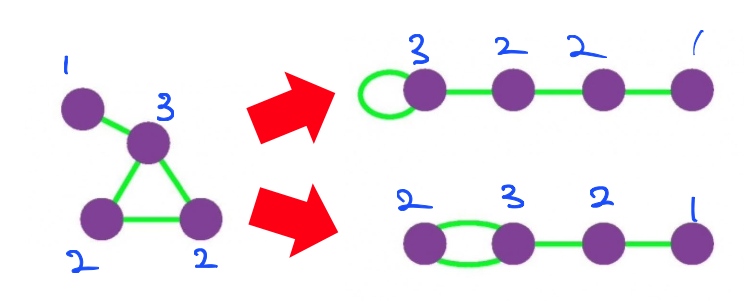

* 군집성(modularity)
  * 군집 탐색의 성공 여부를 판단하기 위해 사용
  * 그래프와 군집들의 집합 $S$가 주어졌을 때
  * 각 군집 $s \in S$가 군집의 성질을 잘 만족하는지 살펴보기 위해 **군집 내부의 간선의 수를 그래프와 배치 모형에서 비교**한다
  * 군집성은 다음 수식으로 계산됨

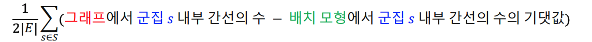  
이 떄 군집 s 내부 간선의 수는 군집 내의 정점들의 차수(degree)를 이용하여 계산한다. 그래서 정규화 할 때 $1\over{2|E|}$를 곱해줌

* 배치 모형과 비교했을 때, 그래프에서 군집 내부 간선의 수가 월등히 많을 수록 성공한 군집 탐색
* 군집성은 무작위로 연결된 배치 모형과의 비교를 통해 통계적 유의성을 판단함
* 군지성은 항상 -1과 +1 사이의 값을 가짐(정규화)
* 보통 군집성이 0.3 ~ 0.7 사이의 값을 가질 때 그래프에 존재하는 통계적으로 유의미한 군집들을 찾아냈다고 할 수 있다

### 군집 탐색 알고리즘

#### Girvan-Newman 알고리즘

* Girvan-Newman 알고리즘은 대포적인 하향식(Top-Down) 군집 탐색 알고리즘
* 전체 그래프에서 탐색을 시작해 군집들이 서로 분리되도록 간선을 제거함
* 서로 다른 군집을 연결하는 다리 역할을 하는 간선을 제거

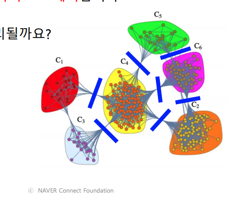  

* 다리 역할을 하는 간선은 간선의 매개 중심성(betweenness centrality)을 사용해 찾는다
* 매개 중심성은 간선이 정점 간의 최단 경로에 놓이는 횟수를 의미한다
* 매개 중심성의 수식은 다음과 같다

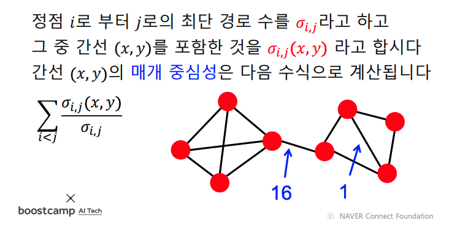  

* Girvan-Newman 알고리즘은 매개 중심성이 높은 간선을 순차적으로 제거한다
* 간선이 제거될 때마다, 매개 중심성을 다시 계산하여 갱신, 군집성도 다시 계산하고 저장해둔다
* 간선을 제거해 생기는 연결 요소를 군집으로 가정한다
* 알고리즘 진행 과정은 다음과 같다

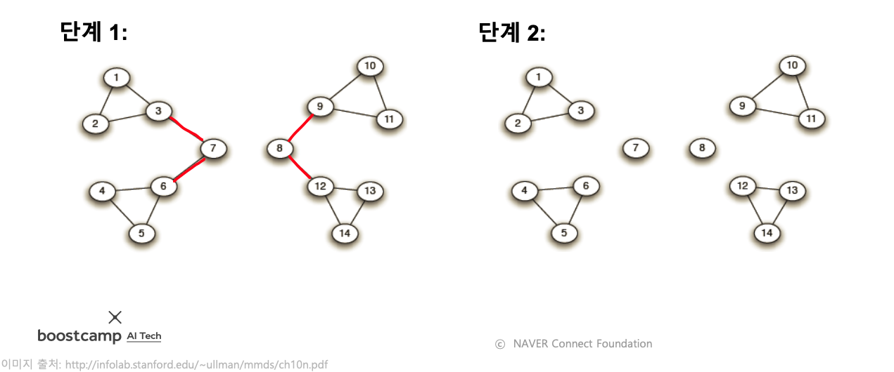  
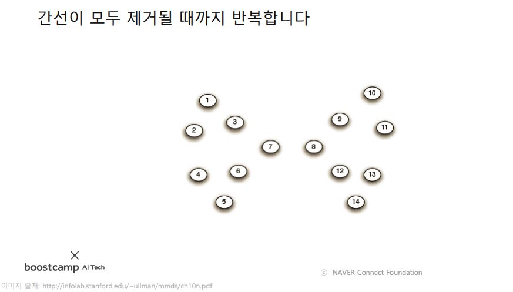  
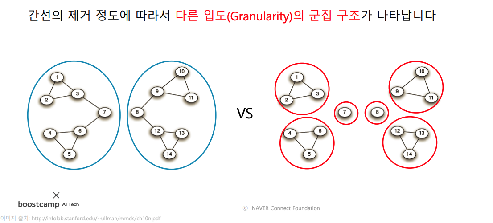  

* 군집성이 최대가 되는 지점까지 간선을 제거한다
* 알고리즘을 수행하며 간선이 제거될 때마가 군집성을 계산해 저장해둔다
* 간선이 제거될 때까지 반복한 후, 군집성이 가장 컸던 지점으로 그래프를 복원한다
* 
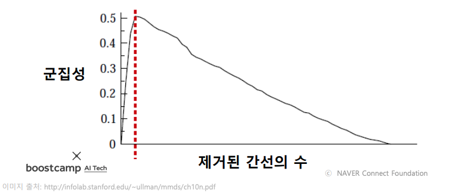  

#### Louvain 알고리즘

* Louvain 알고리즘은 대표적인 상향식(bottom-up) 군집 탐색 알고리즘이다
* Louvain 알고리즘 동작 과정은 다음과 같다
  1. 개별 정점을 각각 하나의 군집이라고 가정하고 시작한다  
   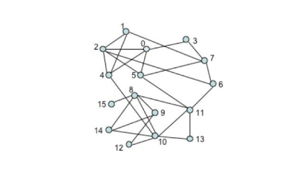  
  2. 각 정점 u를 기존 혹은 새로운 군집으로 이동한다. 이 때, 군집성이 최대화 되도록 군집을 결정한다  
  3. 더이상 군집성이 증가하지 않을 떄까지 (2)을 반복한다  
   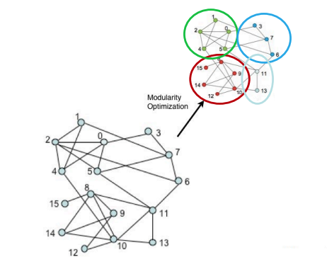  
  4. 각 군집을 하나의 정점으로 하는 군집 레벨의 그래프를 얻은 뒤 다시 (2)를 수행한다  
   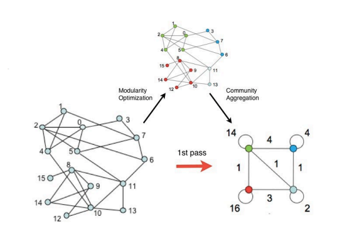  
  5. 한개의 정점이 남을 때까지 (4)를 반복한다
   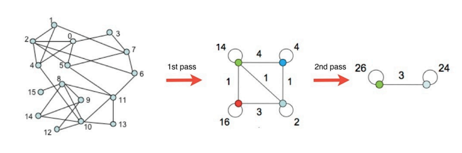  

### 중첩이 있는 군집 탐색

* 앞에서 배웠던 Girvan-Newman 알고리즘, Louvain 알고리즘은 군집 간의 중첩이 없다고 가정함
* 실제 그래프는 중첩되어 있는 경우가 많다
* 소셜 네크워크에서의 개인은 여러 사회적 역할을 수행함. 그 결과 여러 군집에 속하게 됨

   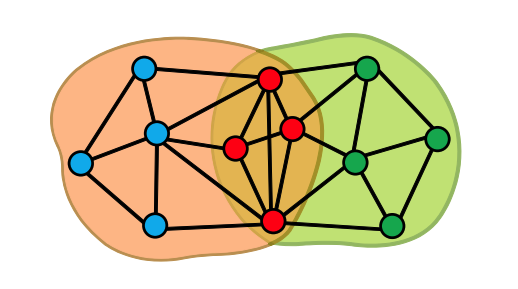  

#### 중첩 군집 모형

* 각 정점은 여러 개의 군집에 속할 수 있다
* 각 군집 A에 대하여, 같은 군집에 속하는 두 정점은 $P_A$ 확률로 간선으로 직접 연결됨
* 두 정점이 여러 군집에 동시에 속할 확률은 독립적이다
  * 예를 들어, 두 정점이 군집 A와 B에 동시에 속할 경우 두 정점이 간선으로 직접 연결될 확률은 1 - (1 - $P_A$)(1 - $P_B$) 이다  
   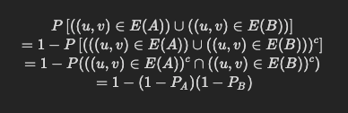  
* 어느 군집에도 함께 속하지 않은 두 정점은 낮은 확률로 직접 연결됨
  
* 중첩 군집 모형이 주어지면, 주어진 그래프의 확률을 계산할 수 있음  
   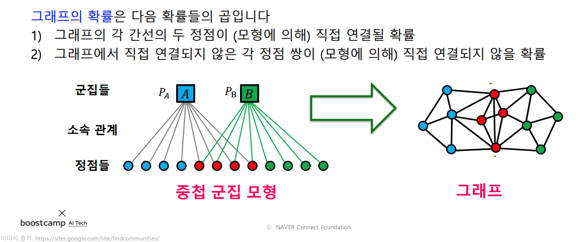  

* 중첩 군집 탐색은 주어진 그래프의 확률을 최대화 하는 중첩 군집 모형을 찾는 과정임  
   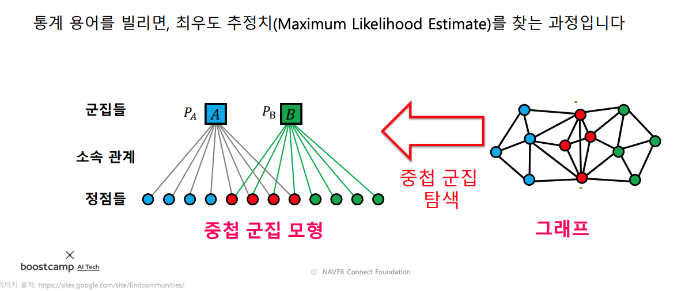  

* 중첩 군집 탐색을 용이하게 하기 위하여 완화된 중첩 군집 모형을 사용함  
   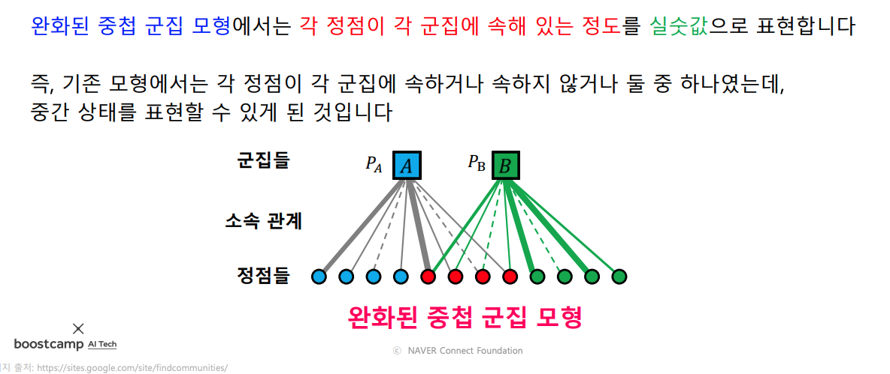  

* 최적화 관점에서는, 모형의 매개변수들이 실수 값을 가지기 때문에 익숙한 최적화 도구(경사 하강법 등)를 사용하여 모형을 탐색할 수 있다는 장점이 있음

### 실습 - Girvan-Newman 알고리즘 구현 및 적용

// TODO

## 추천 시스템 (기본)

### 추천 시스템과 그래프

* 추천 시스템은 사용자 각각이 구매할 만한 혹은 선호할 만한 상품을 추천해줌
* 사용자별 구매 기록은 그래프로 표현 가능
* 구매 기록이라는 암시적인 선호만 있는 경우도 있고
* 평점이라는 명시적 선호가 있는 경우도 있음

   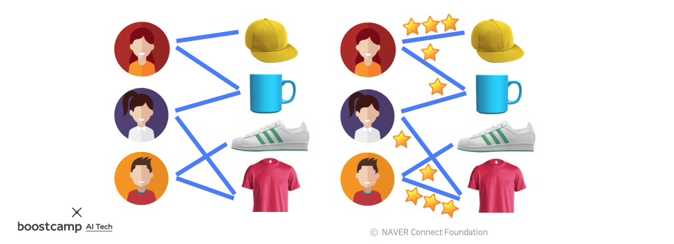  

* 추천 시스템의 핵심은 사용자별 구매를 예측하거나 선호를 추정하는 것
* 그래프 관점에서 추천 시스템은 "미래의 간선을 예측하는 문제" 혹은 "누락된 간선의 가중치를 추정하는 문제"로 해석할 수 있음

   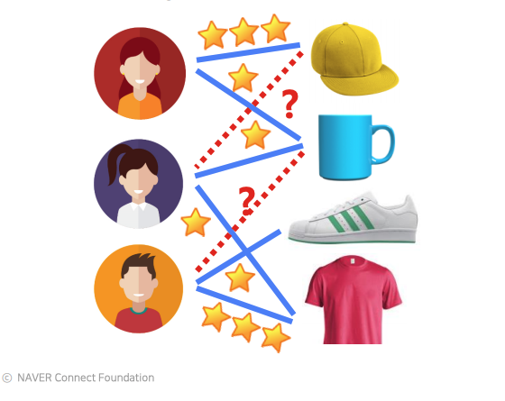  

### 내용 기반 추천시스템

// TODO

### 협업 필터링 추천시스템

// TODO

### 추천 시스템의 평가

// TODO

### 실습 - 협업 필터링 구현

// TODO
