# Day 23 - 그래프 구조 분석, 추천 시스템 기초

## 그래프 구조 분석

### 군집 구조와 군집 탐색 문제

* 군집(community)이란 다음 조건들을 만족하는 정점들의 집합
  * 집합에 속하는 정점 사이에는 많은 간선이 존재
  * 집합에 속하는 정점과 그렇지 않은 정점 사이에는 적은 수의 간선이 존재
* 그래프를 여러 군집으로 잘 나누는 문제를 군집 탐색(community detection) 문제라고 한다

### 군집 구조의 통계적 유의성과 군집성

* 배치 모형 (configuration model)
  * 각 정점의 연결성(degree)을 보존한 상태에서
  * 간선들을 무작위로 재배치해서 얻은 그래프

* 군집성(modularity)
  * 군집 탐색의 성공 여부를 판단하기 위해 사용
  * 그래프와 군집들의 집합 $S$가 주어졌을 때
  * 각 군집 $s \in S$가 군집의 성질을 잘 만족하는지 살펴보기 위해 **군집 내부의 간선의 수를 그래프와 배치 모형에서 비교**한다
  * 군집성은 다음 수식으로 계산됨

  
이 떄 군집 s 내부 간선의 수는 군집 내의 정점들의 차수(degree)를 이용하여 계산한다. 그래서 정규화 할 때 $1\over{2|E|}$를 곱해줌

* 배치 모형과 비교했을 때, 그래프에서 군집 내부 간선의 수가 월등히 많을 수록 성공한 군집 탐색
* 군집성은 무작위로 연결된 배치 모형과의 비교를 통해 통계적 유의성을 판단함
* 군지성은 항상 -1과 +1 사이의 값을 가짐(정규화)
* 보통 군집성이 0.3 ~ 0.7 사이의 값을 가질 때 그래프에 존재하는 통계적으로 유의미한 군집들을 찾아냈다고 할 수 있다

### 군집 탐색 알고리즘

#### Girvan-Newman 알고리즘

* Girvan-Newman 알고리즘은 대포적인 하향식(Top-Down) 군집 탐색 알고리즘
* 전체 그래프에서 탐색을 시작해 군집들이 서로 분리되도록 간선을 제거함
* 서로 다른 군집을 연결하는 다리 역할을 하는 간선을 제거

  

* 다리 역할을 하는 간선은 간선의 매개 중심성(betweenness centrality)을 사용해 찾는다
* 매개 중심성은 간선이 정점 간의 최단 경로에 놓이는 횟수를 의미한다
* 매개 중심성의 수식은 다음과 같다

  

* Girvan-Newman 알고리즘은 매개 중심성이 높은 간선을 순차적으로 제거한다
* 간선이 제거될 때마다, 매개 중심성을 다시 계산하여 갱신, 군집성도 다시 계산하고 저장해둔다
* 간선을 제거해 생기는 연결 요소를 군집으로 가정한다
* 알고리즘 진행 과정은 다음과 같다

  
  
  

* 군집성이 최대가 되는 지점까지 간선을 제거한다
* 알고리즘을 수행하며 간선이 제거될 때마가 군집성을 계산해 저장해둔다
* 간선이 제거될 때까지 반복한 후, 군집성이 가장 컸던 지점으로 그래프를 복원한다

  

#### Louvain 알고리즘

* Louvain 알고리즘은 대표적인 상향식(bottom-up) 군집 탐색 알고리즘이다
* Louvain 알고리즘 동작 과정은 다음과 같다
  1. 개별 정점을 각각 하나의 군집이라고 가정하고 시작한다  
     
  2. 각 정점 u를 기존 혹은 새로운 군집으로 이동한다. 이 때, 군집성이 최대화 되도록 군집을 결정한다  
  3. 더이상 군집성이 증가하지 않을 떄까지 (2)을 반복한다  
     
  4. 각 군집을 하나의 정점으로 하는 군집 레벨의 그래프를 얻은 뒤 다시 (2)를 수행한다  
     
  5. 한개의 정점이 남을 때까지 (4)를 반복한다
     

### 중첩이 있는 군집 탐색

* 앞에서 배웠던 Girvan-Newman 알고리즘, Louvain 알고리즘은 군집 간의 중첩이 없다고 가정함
* 실제 그래프는 중첩되어 있는 경우가 많다
* 소셜 네크워크에서의 개인은 여러 사회적 역할을 수행함. 그 결과 여러 군집에 속하게 됨

     

#### 중첩 군집 모형

* 각 정점은 여러 개의 군집에 속할 수 있다
* 각 군집 A에 대하여, 같은 군집에 속하는 두 정점은 $P_A$ 확률로 간선으로 직접 연결됨
* 두 정점이 여러 군집에 동시에 속할 확률은 독립적이다
  * 예를 들어, 두 정점이 군집 A와 B에 동시에 속할 경우 두 정점이 간선으로 직접 연결될 확률은 1 - (1 - $P_A$)(1 - $P_B$) 이다  
     
* 어느 군집에도 함께 속하지 않은 두 정점은 낮은 확률로 직접 연결됨
  
* 중첩 군집 모형이 주어지면, 주어진 그래프의 확률을 계산할 수 있음  
     

* 중첩 군집 탐색은 주어진 그래프의 확률을 최대화 하는 중첩 군집 모형을 찾는 과정임  
     

* 중첩 군집 탐색을 용이하게 하기 위하여 완화된 중첩 군집 모형을 사용함  
     

* 최적화 관점에서는, 모형의 매개변수들이 실수 값을 가지기 때문에 익숙한 최적화 도구(경사 하강법 등)를 사용하여 모형을 탐색할 수 있다는 장점이 있음

### 실습 - Girvan-Newman 알고리즘 구현 및 적용

// TODO

## 추천 시스템 (기본)

### 추천 시스템과 그래프

* 추천 시스템은 사용자 각각이 구매할 만한 혹은 선호할 만한 상품을 추천해줌
* 사용자별 구매 기록은 그래프로 표현 가능
* 구매 기록이라는 암시적인 선호만 있는 경우도 있고
* 평점이라는 명시적 선호가 있는 경우도 있음

     

* 추천 시스템의 핵심은 사용자별 구매를 예측하거나 선호를 추정하는 것
* 그래프 관점에서 추천 시스템은 "미래의 간선을 예측하는 문제" 혹은 "누락된 간선의 가중치를 추정하는 문제"로 해석할 수 있음

     

### 내용 기반 추천시스템

* 내용 기반(content-based) 추천은 각 사용자가 구매/만족했던 상품과 유사한 것을 추천하는 방법
* 내용 기반 추천은 다음 네가지 단계로 이루어짐
   1. 사용자가 선호했던 상품들의 **상품 프로필 (item profile)**을 수집한다
      * 상품 프로필이란 해당 상품의 특성을 나열한 벡터
      * 영화를 예로 들면 감독, 장르, 배우 등의 원-핫 인코딩이 상품 프로필이 될 수 있다  
      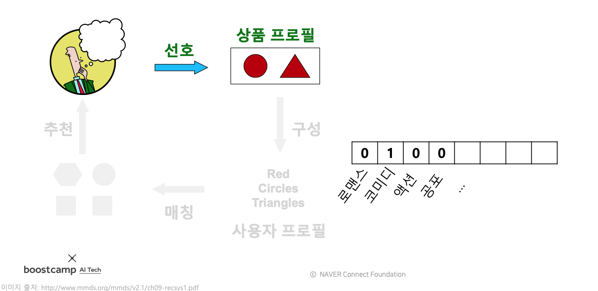  
   2. 사용자 프로필(user profile)을 구성한다
      * 사용자 프로필은 사용자가 선호한 상품의 상품 프로필에 선호도를 사용해 가중 평균하여 계산함  
      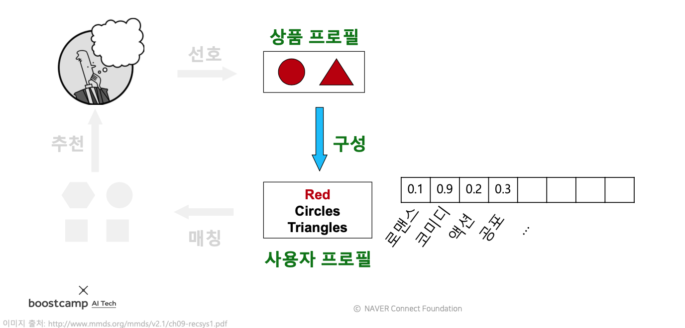  
   3. 사용자 프로필과 다른 상품들의 상품 프로필을 매칭한다
      * 사용자 프로필 벡터와, 다른 상품 프로필 벡터 사이의 코사인 유사도를 계산한다
      * 코사인 유사도가 높을수록 해당 사용자가 선호하는 상품들과 유사한 상품임을 의미한다  
      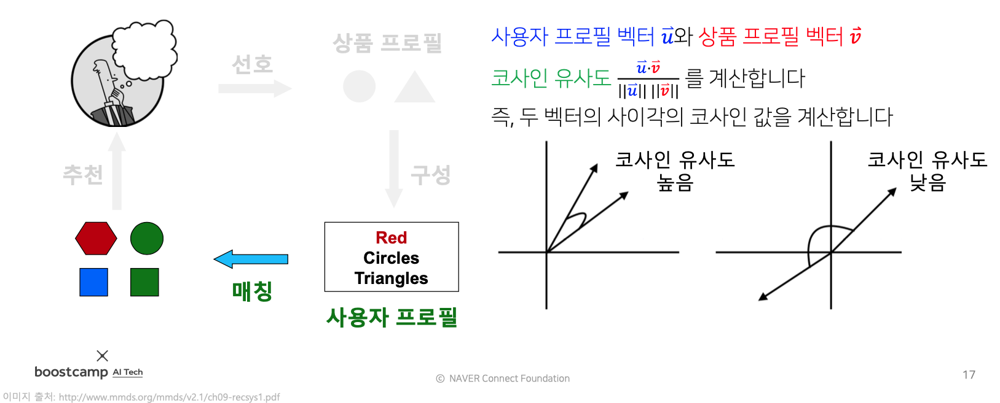  
   4. 사용자에게 상품을 추천한다
      * 계산한 코사인 유사도가 높은 상품들을 추천한다  
      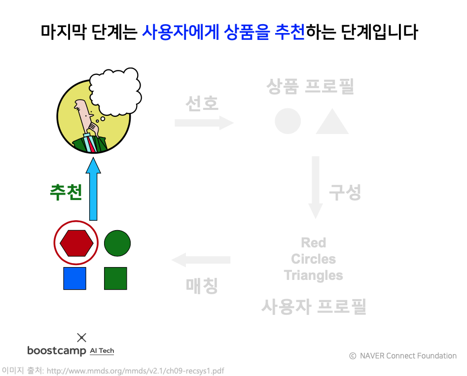

* 내용 기반 추천 시스템의 장점
  * 다른 사용자의 구매 기록이 필요하지 않다
  * 독특한 취향의 사용자(취향이 비슷한 사람이 별로 없는 사람)에게도 추천이 가능하다
  * 새 상품에 대해서도 추천이 가능하다
  * 추천의 이유를 제공할 수 있다 (ex) 당신이 이 상품을 구매했기 떄문에 이 상품도 추천합니다)

* 내용 기반 추천 시스템의 단점
  * 상품에 대한 부가 정보가 없는 경우에는 사용할 수 없다
  * 구매 기록이 없는 사용자에게는 사용할 수 없다
  * 과적합으로 지나치게 협소한 추천을 할 위험이 있다

### 협업 필터링 추천시스템

* 사용자-사용자 협업 필터링은 다음 세 단계로 이루어진다
  1. 추천할 대상이 될 사용자 x와 유사한 취향의 사용자들을 찾는다
  2. 유사한 취향의 사용자들이 선호한 상품을 찾는다
  3. 이 상품을 x에게 추천한다
* 취향의 유사성은 상관 계수(correlation coefficient)를 통해 측정한다  
      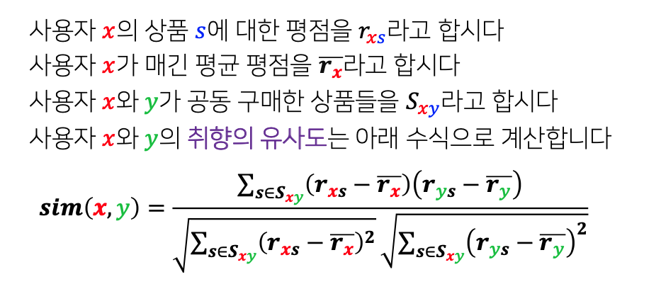
  * 상관 계수는 0과 1 사이의 값으로 정규화 된다
  * 특정 item을 긍정적으로 평가한 사용자들 끼리의 상관계수 값은 양수
  * 특정 item을 부정적으로 평가한 사용자들 끼리의 상관계수 값은 양수
  * 특정 item을 긍정적으로 평가한 사용자와 부정적으로 평가한 사용자 사이의 상관계수 값은 음수
  * 취향이 일치할수록 값이 커진다
* 취향의 유사도를 가중치로 사용한 평점의 가중 평균을 통해 평점을 추정한다  
      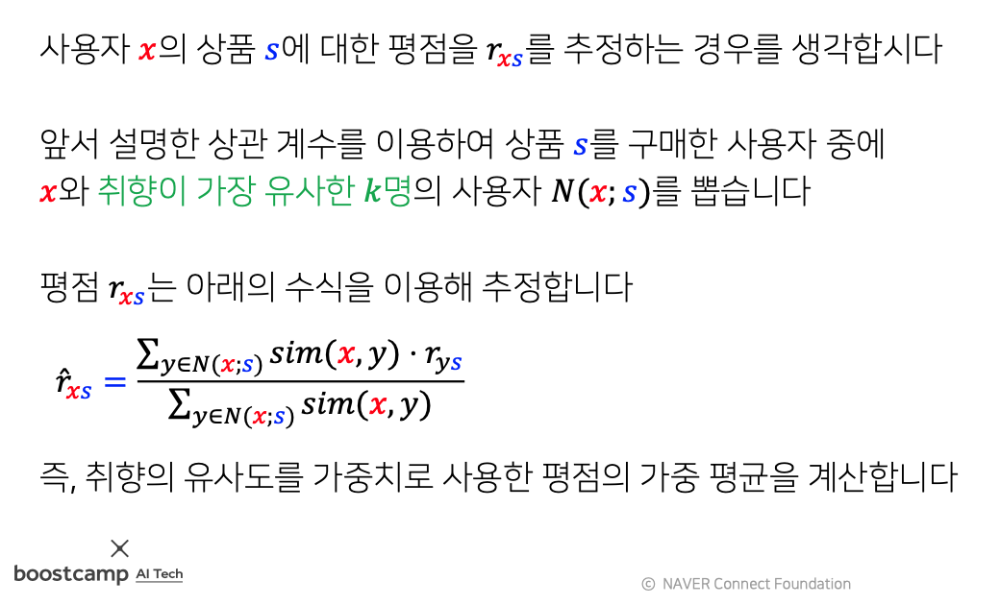
* 위의 수식으로 추정한 평점이 가장 높은 상품을 추천한다

* 협업 필터링의 장점
  * 상품에 대한 부가 정보가 없는 경우에도 사용할 수 있다

* 협업 필터링의 단점
  * 청분한 수의 평점 데이터가 누정되어야 효과적
  * 새 상품, 새로운 사용자에 대한 추천이 불가능
  * 독특한 취향의 사용자에게 추천이 어렵다

### 추천 시스템의 평가

* 추천 시스템의 정확도는 다음과 같은 과정으로 평가한다
   1. training 데이터와 test 데이터로 분리  
      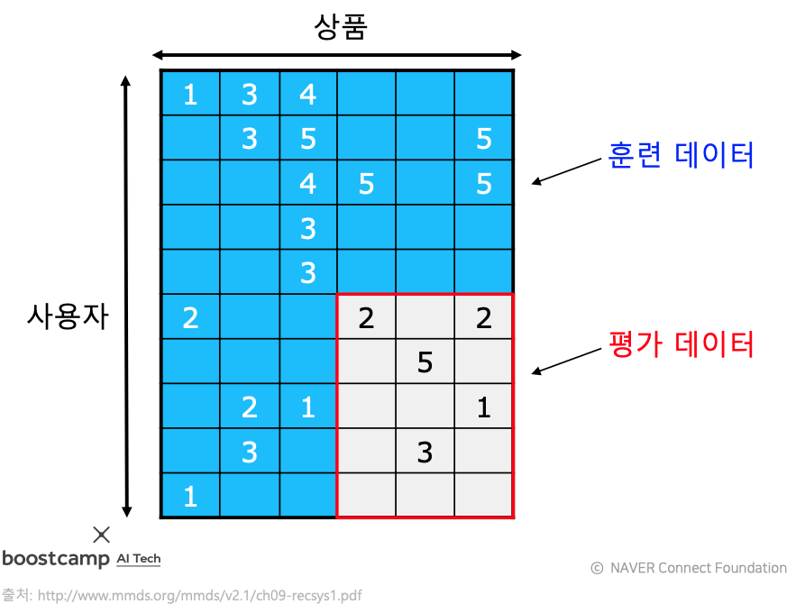
   2. 평가 데이터는 주어지지 않았다고 가정  
      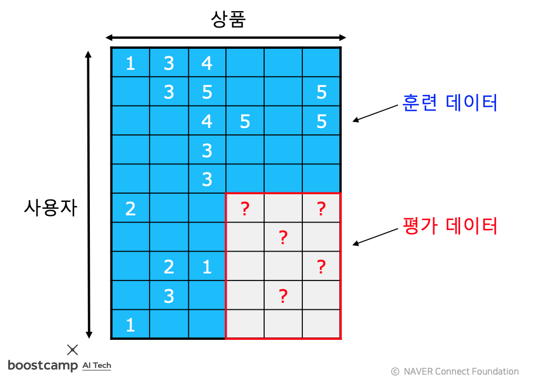
   3. training 데이터를 이용해 가려놓은 평가 데이터의 평점을 추정  
      
   4. 추정한 평점과 실제 평가 데이터를 비교하여 오차를 측정
      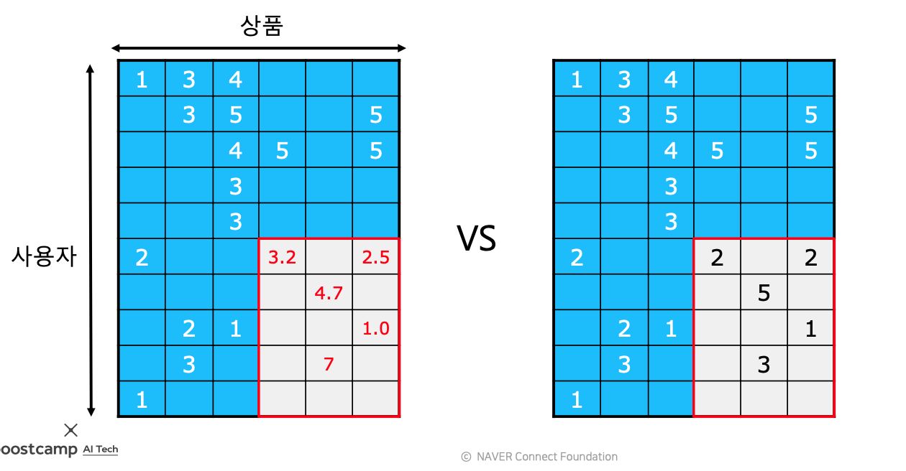
         * 오차를 측정하는 지표로 평균 제곱 오차(MSE)를 주로 사용함
         * 평가 데이터 내의 평점들의 집합을 T라고 하면 MSE는 아래와 같은 수식으로 계산함
            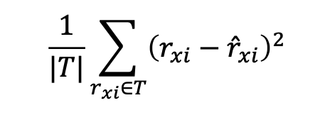
         * 평균 제곱근 오차 (RMSE)도 많이 사용함
            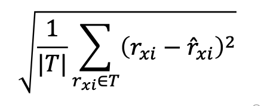
* 이 밖에도 다양한 지표가 사용됨
  * 추정한 평점으로 순위를매긴 후, 실제 평점으로 매긴 순위와의 상관 계수를 계산하기도 함
  * 추천한 상품 중 실제 구매로 이루어진 것의 비율을 측정하기도 함
  * 추천의 순서 혹은 다양성까지 고려하는 지표들도 사용됨

### 실습 - 협업 필터링 구현

// TODO
