# Day 24 - 노드 임베딩, 추천 시스템 심화

- [Day 24 - 노드 임베딩, 추천 시스템 심화](#day-24---노드-임베딩-추천-시스템-심화)
  - [노드 임베딩 (그래프의 정점을 어떻게 백터로 표현할까?)](#노드-임베딩-그래프의-정점을-어떻게-백터로-표현할까)
    - [정점 표현 학습 (node embedding)](#정점-표현-학습-node-embedding)
    - [인접성 기반 접근법](#인접성-기반-접근법)
    - [거리/경로/중첩 기반 접근법](#거리경로중첩-기반-접근법)
    - [임의보행 기반 접근법](#임의보행-기반-접근법)
    - [변환식 정점 표현 학습의 한계](#변환식-정점-표현-학습의-한계)
    - [실습 - Node2Vec을 사용한 군집 분석과 정점 분류](#실습---node2vec을-사용한-군집-분석과-정점-분류)
  - [추천 시스템 (심화)](#추천-시스템-심화)
    - [기본 잠재 인수 모형](#기본-잠재-인수-모형)
    - [고급 잠재 인수 모형](#고급-잠재-인수-모형)
      - [사용자와 상품의 편향을 고려한 잠재 인수 모형](#사용자와-상품의-편향을-고려한-잠재-인수-모형)
      - [시간에 따른 편향을 고려한 잠재 인수 모형](#시간에-따른-편향을-고려한-잠재-인수-모형)
    - [실습 - Surprise 라이브러리와 잠재 인수 모형의 활용](#실습---surprise-라이브러리와-잠재-인수-모형의-활용)

## 노드 임베딩 (그래프의 정점을 어떻게 백터로 표현할까?)

### 정점 표현 학습 (node embedding)

* 정점 표현 학습(정점 임베딩)이란 그래프의 정점들을 벡터의 형태로 표현하는 것이다
* 정점이 표현되는 벡터 공간을 임베딩 공간이라고 부른다  
    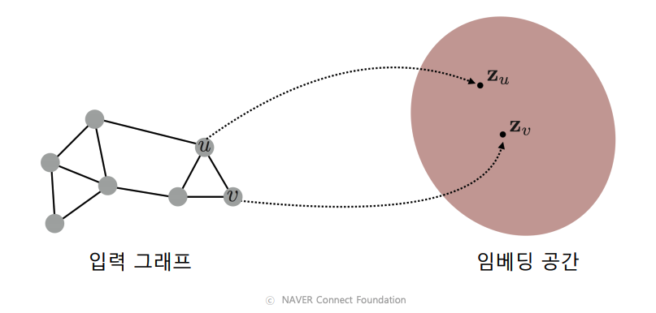
* 정점 표현 학습의 입력은 그래프이다
* 정점 임베딩의 출력은 주어진 그래프의 각 정점 u에 대한 임베딩, 즉 벡터 표현 $Z_u$이다
* 정점 임베딩의 결과로, 벡터 형태의 데이터를 위한 도구들(기계학습 도구들)을 그래프에도 적용할 수 있다
* 정점 임베딩은 **그래프에서 정점간 유사도를 임베딩 공간에서도 보존**하는 것을 목표로한다  
      
* 임베딩 공간에서의 유사도 측정에는 내적(inner product)를 사용한다
* 내적은 두 벡터가 클 수록, 같은 방향을 향할 수록 큰 값(유사도)을 갖는다  
    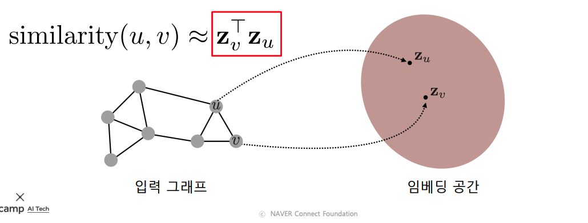

### 인접성 기반 접근법

* 인접성(adjacency) 기반 접근법 에서는 두 정점이 인접할 때 유사하다고 간주함
* 두 정점 u와 v가 인접하다는 것은 둘을 직접 연결하는 간선 (u, v)가 있음을 의미함
* 인접행렬의 u행 v열 원소는 정점 u와 v가 인접한 경우에 1, 아닌 경우 0
* 인접성 기반 접근법의 손실 함수 (loss function)은 다음과 같음  
    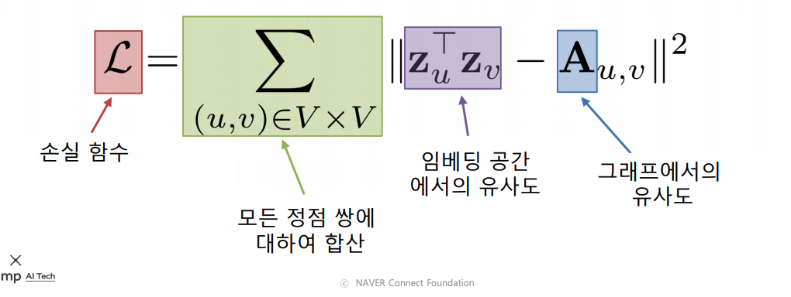
* 인접성 기반 접근법의 한계는 다음과 같음
  1. 거리에 대한 정보가 누락됨
        * 인접성만을 고려할 경우 거리가 2인 정점, 거리가 10인 정점 모두 유사도는 0으로 같음
  2. 군집에 대한 정보가 없음
        * 아래 그림에서 파란 정점과 초록색 정점은 같은 군집에 속함
        * 파란 정점과 빨간 정점은 다른 군집에 속함
        * 하지만 두 경우 모두 유사도는 0으로 동일함  
  
    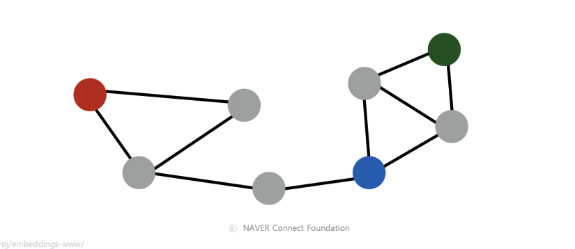

### 거리/경로/중첩 기반 접근법

// TODO

### 임의보행 기반 접근법

// TODO

### 변환식 정점 표현 학습의 한계

// TODO

### 실습 - Node2Vec을 사용한 군집 분석과 정점 분류

// TODO

## 추천 시스템 (심화)

### 기본 잠재 인수 모형

* 잠재 인수 모형 (latent factor model)의 핵심은 사용자와 상품을 벡터로 표현하는 것
* 다음은 예시로 사용자와 영화를 임베딩한 그림이다  
        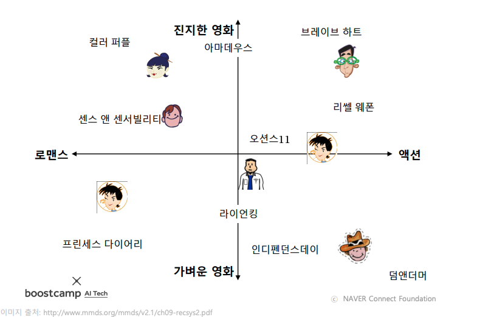
* 잠재 인수 모형에서는 고정된 인수 대신 효과적인 인수를 학습하는 것을 목표로 한다
  * 학습한 인수를 잠재 인수(latent factor)라고 부른다
* 사용자와 상품을 임베딩하는 기준은 **사용자와 상품의 임베딩의 내적(inner product)이 평점과 최대한 유사하도록 하는 것**이다
* 행렬 차원에서 살펴보면 다음과 같다  
        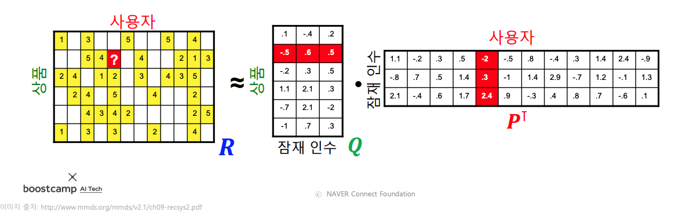
* 잠재 인수 모형의 손실 함수는 다음과 같다  
        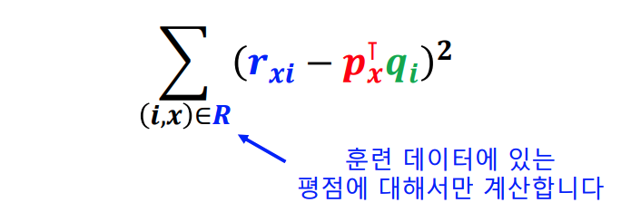
* 하지만 위 손실 함수를 사용할 경우 과적합(overfitting)이 발생할 수 있다
* 때문에 과적합을 방지하기 위하여 정규화 항을 손실 함수에 더해준다  
        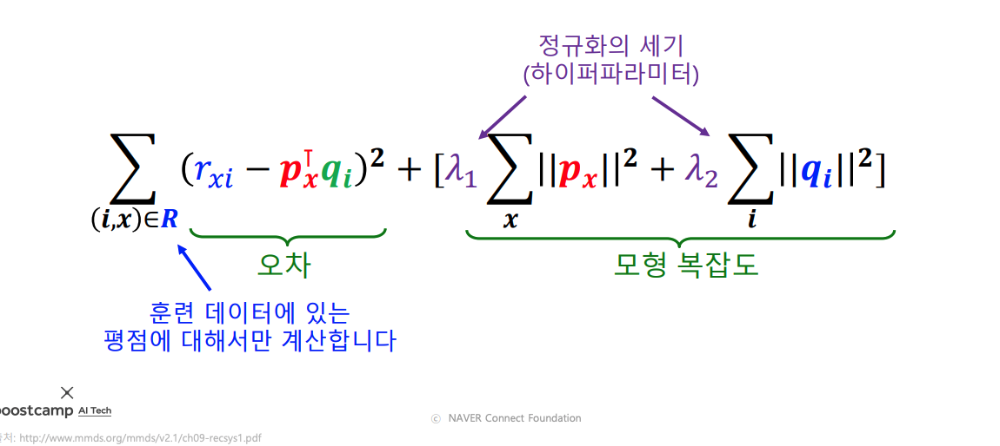
* 정규화는 다음의 그림과 같이 절댓값이 너무 큰 임베딩(벡터)를 방지하는 효과가 있다  
        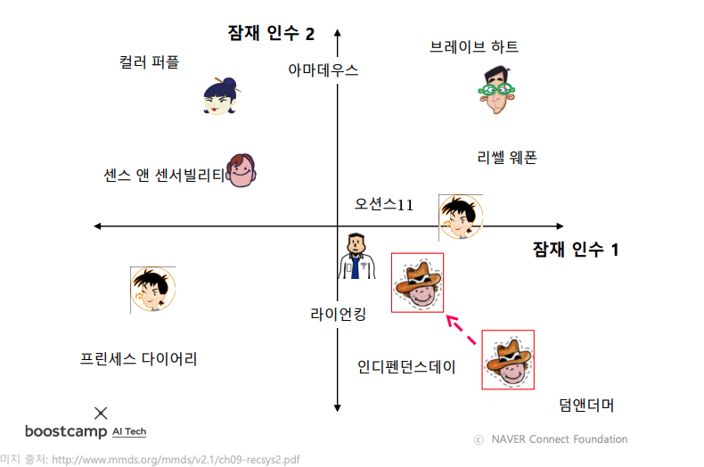
* 손실 함수를 최소화하는 P와 Q를 찾기 위해서는 확률적 경사하강법을 사용

### 고급 잠재 인수 모형

#### 사용자와 상품의 편향을 고려한 잠재 인수 모형

* 각 사용자/상품의 편향은 해당 사용자/상품의 평점 평균과 전체 평점 평균의 차이다  
        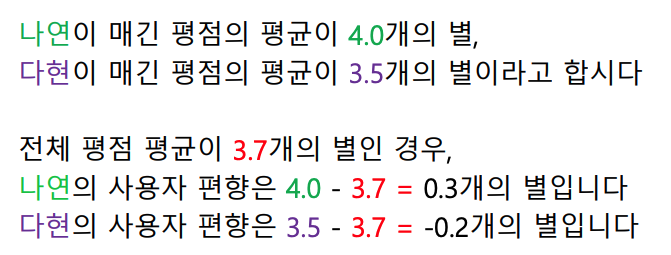
        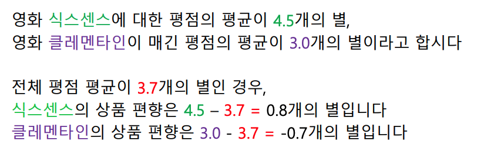
* 개선된 잠재 인수 모형에서는 평점을 전체 평균, 사용자 편향, 상품 편향, 상호작용으로 분리한다  
        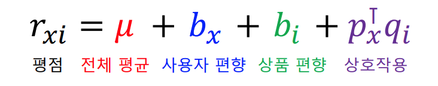
* 개선된 잠재 인수 모형의 손실 함수를 아래와 같다  
        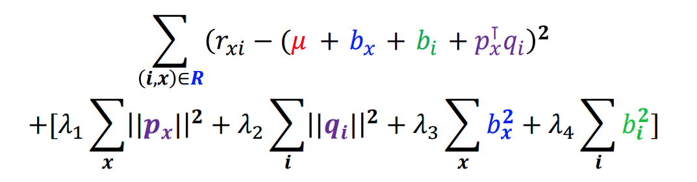

#### 시간에 따른 편향을 고려한 잠재 인수 모형

* 영화의 평점은 출시일 이후 시간이 지남에 따라 상승하는 경향이 있다  
        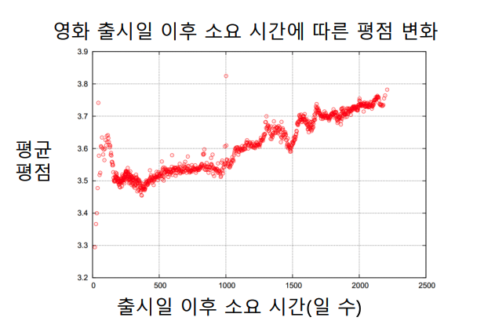

* 또는 영화 스트리밍 플랫폼의 시스템 변화로 평균 평점이 상승하거나 하락할 수도 있다  
        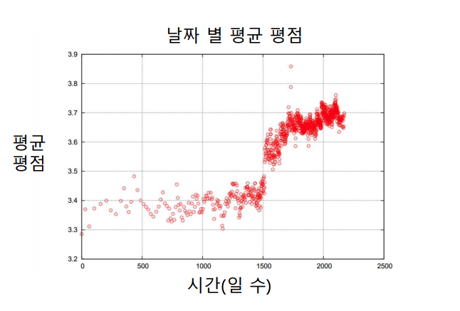

* 개선된 잠재 인수 모형에서는 이러한 시간적 편향을 고려한다  
        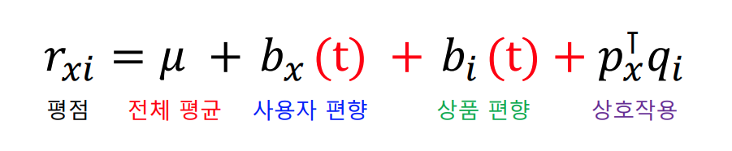

### 실습 - Surprise 라이브러리와 잠재 인수 모형의 활용

// TODO