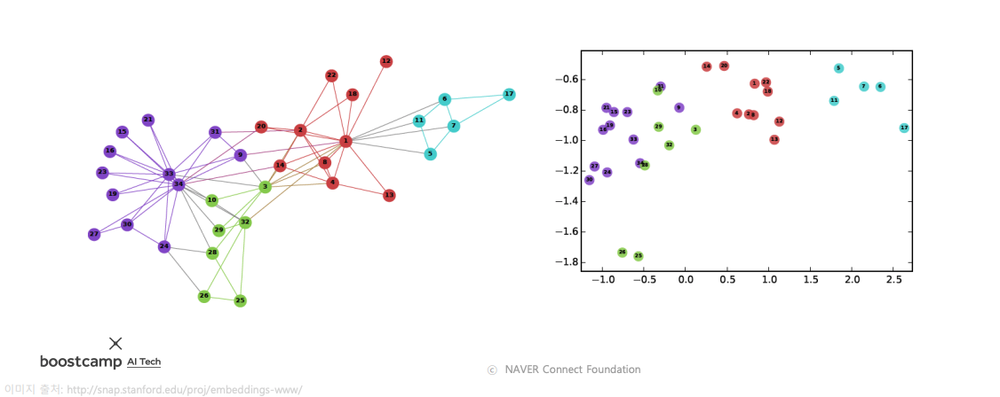

# Day 24 - 노드 임베딩, 추천 시스템 심화

- [Day 24 - 노드 임베딩, 추천 시스템 심화](#day-24---노드-임베딩-추천-시스템-심화)
  - [노드 임베딩 (그래프의 정점을 어떻게 백터로 표현할까?)](#노드-임베딩-그래프의-정점을-어떻게-백터로-표현할까)
    - [정점 표현 학습 (node embedding)](#정점-표현-학습-node-embedding)
    - [인접성 기반 접근법](#인접성-기반-접근법)
    - [거리/경로/중첩 기반 접근법](#거리경로중첩-기반-접근법)
      - [거리 기반 접근법](#거리-기반-접근법)
      - [경로 기반 접근법](#경로-기반-접근법)
      - [중첩 기반 접근법](#중첩-기반-접근법)
    - [임의보행 기반 접근법](#임의보행-기반-접근법)
      - [Node2Vec](#node2vec)
      - [손실 함수 근사](#손실-함수-근사)
    - [변환식 정점 표현 학습의 한계](#변환식-정점-표현-학습의-한계)
    - [실습 - Node2Vec을 사용한 군집 분석과 정점 분류](#실습---node2vec을-사용한-군집-분석과-정점-분류)
  - [추천 시스템 (심화)](#추천-시스템-심화)
    - [기본 잠재 인수 모형](#기본-잠재-인수-모형)
    - [고급 잠재 인수 모형](#고급-잠재-인수-모형)
      - [사용자와 상품의 편향을 고려한 잠재 인수 모형](#사용자와-상품의-편향을-고려한-잠재-인수-모형)
      - [시간에 따른 편향을 고려한 잠재 인수 모형](#시간에-따른-편향을-고려한-잠재-인수-모형)
    - [실습 - Surprise 라이브러리와 잠재 인수 모형의 활용](#실습---surprise-라이브러리와-잠재-인수-모형의-활용)

## 노드 임베딩 (그래프의 정점을 어떻게 백터로 표현할까?)

### 정점 표현 학습 (node embedding)

* 정점 표현 학습(정점 임베딩)이란 그래프의 정점들을 벡터의 형태로 표현하는 것이다
* 정점이 표현되는 벡터 공간을 임베딩 공간이라고 부른다  
    
* 정점 표현 학습의 입력은 그래프이다
* 정점 임베딩의 출력은 주어진 그래프의 각 정점 u에 대한 임베딩, 즉 벡터 표현 $Z_u$이다
* 정점 임베딩의 결과로, 벡터 형태의 데이터를 위한 도구들(기계학습 도구들)을 그래프에도 적용할 수 있다
* 정점 임베딩은 **그래프에서 정점간 유사도를 임베딩 공간에서도 보존**하는 것을 목표로한다  
      
* 임베딩 공간에서의 유사도 측정에는 내적(inner product)를 사용한다
* 내적은 두 벡터가 클 수록, 같은 방향을 향할 수록 큰 값(유사도)을 갖는다  
    

### 인접성 기반 접근법

* 인접성(adjacency) 기반 접근법 에서는 두 정점이 인접할 때 유사하다고 간주함
* 두 정점 u와 v가 인접하다는 것은 둘을 직접 연결하는 간선 (u, v)가 있음을 의미함
* 인접행렬의 u행 v열 원소는 정점 u와 v가 인접한 경우에 1, 아닌 경우 0
* 인접성 기반 접근법의 손실 함수 (loss function)은 다음과 같음  
    
* 인접성 기반 접근법의 한계는 다음과 같음
  1. 거리에 대한 정보가 누락됨
        * 인접성만을 고려할 경우 거리가 2인 정점, 거리가 10인 정점 모두 유사도는 0으로 같음
  2. 군집에 대한 정보가 없음
        * 아래 그림에서 파란 정점과 초록색 정점은 같은 군집에 속함
        * 파란 정점과 빨간 정점은 다른 군집에 속함
        * 하지만 두 경우 모두 유사도는 0으로 동일함  
  
    

### 거리/경로/중첩 기반 접근법

#### 거리 기반 접근법

* 거리 기반 접근법에서는 두 정점 사이의 거리가 충분히 가까운 경우 유사하다고 간주함

    

#### 경로 기반 접근법

* 경로 기반 접근법에서는 두 정점 사이의 경로가 많을수록 유사하다고 간주함
* 두 정점 u와 v 사이의 경로 중 거리가 k인 경로는 인접행렬의 곱으로 구할 수 있다 ($A^k_{uv}$)
* 따라서 경로 기반 접근법의 손실 함수는 다음과 같다

    

* 위 식에서는 거리가 k인 경로만 고려함. **거리가 k보다 짧은 경로는 고려되지 않음.** 
* 왜 이런 식을 사용하는가?
  1. 식이 잘못되었다. 시그마를 하나 더 사용하여 거리가 1~k인 경로를 모두 고려해야한다. -> 조교님 답변
  2. 방향성 없는 그래프의 경우 k제곱한 인접행렬에는 길이가 k보다 짧은 경로의 정보도 일부 포함되어 있음. 여기에 시그마를 사용한다면 이런 경로들이 중복으로 많이 들어가 정보의 왜곡이 생길것임. 위 수식을 그대로 사용하면 누락되는 경로도 일부 있겠지만 값이 중복되는 것은 줄일 수 있음. -> 피어세션에서 나온 의견
* 어차피 최근엔 이런 방법으로 정점을 embedding하는 경우는 별로 없으니 중요하지 않다.

#### 중첩 기반 접근법

* 중첩 기반 접근법에서는 두 정점이 많은 이웃을 공유할수록 유사하다고 간주함
* 아래 그림에서 빨간색 정점은 파란색 정점과 두 이웃을 공유하기 때문에 유사도는 2가 됨

    

* 중첩 기반 접근법의 손실 함수는 다음과 같다. ($S_{u,v}$는 정점 u와 v의 공통 이웃 수)
* 공통 이웃 수 대신 자카드 유사도(Jaccard similarity) 또는 Adamic Adar 점수를 사용할수도 있음
* Jaccard similarity는 공통 이웃의 수 대신 비율을 계산하는 방식

    

* Adamic Adar 점수는 공통 이웃 각각에 가중치를 부여하여 가중합을 계산하는 방식 ($d_w$)는 공통 이웃 w의 차수(degree)

    

* 수식에서 볼 수 있듯 Adamic Adar 점수는 degree가 높은 정점이 공통 이웃인 경우 패널티를 부여함
* 이렇게 하는 이유는 다음과 같은 예를 통해 설명할 수 있음
  * degree가 높은 공통 이웃을 가진 경우
    * 트와이스는 follower가 매우 많다
    * 트위터에서 사용자 u와 v가 트와이스를 follow했다고 하자
    * 트와이스의 계정을 함께 follow 했다는 것이 u와 v가 가까운 사이일 것이라는 signal이 되진 않는다
  * degree가 낮은 공통 이웃을 가진 경우
    * follower가 둘밖에 없는 홍길동의 계정이 있다
    * 사용자 u와 v가 follower를 follow하고있다
    * 이 때는 매우 높은 확률로 u와 v가 밀접한 관계를 맺고 있을 것이다
* Adamic Adar 점수의 부작용은 다음과 같음
  * 트위터에서 가수 비와 박진영이 서로를 follow했다면?
  * 둘 모두 follower수가 매우 많으므로 서로 낮은 유사도를 가질 것이다
  * 하지만 실제로는 둘이 매우 밀접한 관계이다
  * Adamic Adar 점수는 이런 관계는 잘 고려하지 못한다

### 임의보행 기반 접근법

* 임의보행 기반 접근법에서는 한 정점에서 시작하여 임의보행을 할 때 다른 정점에 도달할 확률을 유사도로 간주함
* 임의보행이란 현재 정점의 이웃 중 하나를 균일한 확률로 선택해 이동하는 과정을 반복하는 것을 의미
* 임의보행을 사용할 경우 시작 정점 주변의 지역적 정보와그래프 전역 정보를 모두 고려한다는 장점이 있다
* 임의보행 기반 접근법은 세단계를 거친다
  1. 각 정점에서 시작하여 임의보행을 반복 수행한다
  2. 임의보행 중 도달한 정점들의 리스트를 구성한다. 이때 정점 u에서 시작해 도달한 정점들의 리스트는 $N_R(u)$ 라고 한다. 한 정점에 여러번 도달한 경우, 해당 정점은 리스트에 중복돼서 들어가게 된다
  3. 다음의 손실함수를 최소화 하도록 학습한다
   
    

* 위 식에서는 확률에 -log를 취했다. 확률이 높아질수록 -log값은 작아지므로, 확률이 높을수록 손실함수는 작아지게 된다
* 어떻게 embedding으로부터 도달 확률을 추정할 수 있을까? 
   
    

* embedding의 내적 값이 클수록(유사도가 높을수록) 확률이 증가한다
   
    

* 이렇게 추정한 도달 확률을 사용해 손실함수를 완성하고, 이를 최소화하는 임베딩을 학습한다
* 위에서 살펴본 방법은 기본적인 임의보행 방법이었다
* 임의보행의 방법에 따라 DeepWalk와 Node2Vec으로 구분된다

#### Node2Vec

* Node2Vec은 2차 치우친 임의보행(second-order Biased Random Walk)을 사용한다
* 현재 정점과 직전에 머물렀던 정점을 모두 고려하여 다음 정점을 선택한다
* 직전 정점과의 거리를 기준으로 구분하여 차등적인 확률을 부여한다
   
    

* 이떄 부여되는 확률은 경우에 따라 다르게 설정할 수 있다
   
    

* 멀어지는 방향에 높은 확률을 부여한 경우에는 정점의 역할에 따라 비슷한 임베딩을 갖게 된다
  * 위 그림에서는 파란색 정점은 다리 역할을 하는 정점, 노란색 정점은 주변부의 정점, 빨간색 정점은 군집을 이루는 정점들이다
* 가까워지는 방향에 높은 확률을 부여한 경우에는 같은 군집에 속한 정점들끼리 유사한 임베딩을 갖게 된다.

#### 손실 함수 근사

* 임의보행 기법의 손실함수는 계산에 정점의 수의 제곱에 비례하는 시간이 소요됨
  
    

* 따라서 근사식을 사용한다
* 모든 정점에 대해서 정규화 하는 대신 몇 개의 정점을 뽑아서 비교하는 형태
* 이 떄 뽑힌 정점들을 negative sample이라고 부른다
* 연결성 (degree)에 비례하는 확률로 negative sample을 뽑는다
  * 이렇게 해야 random work가 더 원활하게 수행됨
* negative sample이 많을수록 학습이 안정적이다
  
    

### 변환식 정점 표현 학습의 한계

* 지금까지 공부한 정점 embedding 방법들은 모두 변환식(transductive) 방법들임
* **변환식 방법은 결과로 나올 embedding 자체를 학습시킨다**
* 이것은 정점을 embedding으로 변환시키는 encoder를 학습시키는 귀납식(inductive) 방법과 대조된다
  * 지난주 NLP 수업에서 봤던 word embedding 방법들이 귀납식 방법
* 변환식 embedding 방법은 여러 한계를 갖는다
  * 학습이 진행된 이후에 추가된 정점에 대해서는 embedding을 얻을 수 없음
  * 모든 정점에 대한 embedding을 미리 계산하여 저장해둬야 함
  * 정점이 속성(attribute) 정보를 가진 경우 이를 활용할 수 없음
* 위의 단점들은 모두 변환식 방법이 결과로 나올 embedding 자체를 학습시키는 방법이기 때문에 나오는 문제들임
* 25일차에서는 이런 단점들을 극복한 귀납식 임베딩 방법들을 배운다
* 그래프 신경망(GNN)이 바로 정점을 embedding으로 변환하는 encoder임

### 실습 - Node2Vec을 사용한 군집 분석과 정점 분류

// TODO

## 추천 시스템 (심화)

### 기본 잠재 인수 모형

* 잠재 인수 모형 (latent factor model)의 핵심은 사용자와 상품을 벡터로 표현하는 것
* 다음은 예시로 사용자와 영화를 임베딩한 그림이다  
        
* 잠재 인수 모형에서는 고정된 인수 대신 효과적인 인수를 학습하는 것을 목표로 한다
  * 학습한 인수를 잠재 인수(latent factor)라고 부른다
* 사용자와 상품을 임베딩하는 기준은 **사용자와 상품의 임베딩의 내적(inner product)이 평점과 최대한 유사하도록 하는 것**이다
* 행렬 차원에서 살펴보면 다음과 같다  
        
* 잠재 인수 모형의 손실 함수는 다음과 같다  
        
* 하지만 위 손실 함수를 사용할 경우 과적합(overfitting)이 발생할 수 있다
* 때문에 과적합을 방지하기 위하여 정규화 항을 손실 함수에 더해준다  
        
* 정규화는 다음의 그림과 같이 절댓값이 너무 큰 임베딩(벡터)를 방지하는 효과가 있다  
        
* 손실 함수를 최소화하는 P와 Q를 찾기 위해서는 확률적 경사하강법을 사용

### 고급 잠재 인수 모형

#### 사용자와 상품의 편향을 고려한 잠재 인수 모형

* 각 사용자/상품의 편향은 해당 사용자/상품의 평점 평균과 전체 평점 평균의 차이다  
        
        
* 개선된 잠재 인수 모형에서는 평점을 전체 평균, 사용자 편향, 상품 편향, 상호작용으로 분리한다  
        
* 개선된 잠재 인수 모형의 손실 함수를 아래와 같다  
        

#### 시간에 따른 편향을 고려한 잠재 인수 모형

* 영화의 평점은 출시일 이후 시간이 지남에 따라 상승하는 경향이 있다  
        

* 또는 영화 스트리밍 플랫폼의 시스템 변화로 평균 평점이 상승하거나 하락할 수도 있다  
        

* 개선된 잠재 인수 모형에서는 이러한 시간적 편향을 고려한다  
        

### 실습 - Surprise 라이브러리와 잠재 인수 모형의 활용

// TODO