# Day 25 - 그래프 신경망

- [Day 25 - 그래프 신경망](#day-25---그래프-신경망)
  - [그래프 신경망이란 무엇일까? (기본)](#그래프-신경망이란-무엇일까-기본)
    - [기본적인 그래프 신경망](#기본적인-그래프-신경망)
      - [그래프 신경망 구조](#그래프-신경망-구조)
      - [그래프 신경망의 학습](#그래프-신경망의-학습)
    - [그래프 신경망 변형](#그래프-신경망-변형)
      - [그래프 합성곱 신경망 (Graph Convolutional Network, GCN)](#그래프-합성곱-신경망-graph-convolutional-network-gcn)
      - [GraphSAGE](#graphsage)
    - [합성곱 신경망(CNN)과의 비교](#합성곱-신경망cnn과의-비교)
    - [실습 - DGL 라이브러리와 GraphSAGE를 이용한 정점 분류](#실습---dgl-라이브러리와-graphsage를-이용한-정점-분류)
  - [그래프 신경망이란 무엇일까? (심화)](#그래프-신경망이란-무엇일까-심화)
    - [그래프 신경망의 어텐션](#그래프-신경망의-어텐션)
      - [기본 그래프 신경망의 한계](#기본-그래프-신경망의-한계)
      - [그래프 어텐션 신경망](#그래프-어텐션-신경망)
    - [그래프 표현 학습과 그래프 풀링](#그래프-표현-학습과-그래프-풀링)
      - [그래프 표현 학습 (Graph Embedding)](#그래프-표현-학습-graph-embedding)
      - [그래프 풀링 (Graph Pooling)](#그래프-풀링-graph-pooling)
    - [지나친 획일화 문제 (Over-smoothing)](#지나친-획일화-문제-over-smoothing)
    - [그래프 데이터의 증강 (Data Augmentation)](#그래프-데이터의-증강-data-augmentation)
    - [실습 - GraphSAGE의 집계 함수 구현](#실습---graphsage의-집계-함수-구현)

## 그래프 신경망이란 무엇일까? (기본)

### 기본적인 그래프 신경망

* 그래프 신경망(graph neural network)은 귀납식 (정점 or 그래프) 임베딩 방법이다
* 출력으로 인코더를 얻는 귀납식 임베딩 방법은 여러 장점을 갖는다
* 학습이 진행된 이후에 추가된 정점에 대해서도 임베딩을 얻을 수 있다
* 모든 정점에 대한 임베딩을 미리 계산하여 저장해둘 필요가 없다
* 정점이 가진 속성 정보를 활용할 수 있다

#### 그래프 신경망 구조

* 그래프 신경망은 그래프(인접 행렬)와 정점의 속성 정보(속성 벡터, attribute vector)를 입력으로 받는다
* 정점 속성 벡터는 m차원 벡터이고, 여기서 m은 속성의 수를 의미한다
* 정점의 속성의 예시는 다음과 같다
  * sns 사용자(정점)의 성별, 연령, 사는 지역 등
  * 논문 인용 그래프에서 논문(정점)에 사용된 키워드에 대한 one-hot vector
  * pageRank등의 정점 중심성, 군집 계수 등

* 그래프 신경망은 이웃 정점들의 정보를 집계하는 과정을 반복하여 임베딩을 얻는다
* 대상 정점의 임베딩을 얻기 위해 이웃들 그리고 이웃의 이웃들의 정보... 를 집계한다
* 각 집계 단계를 layer로 구분하고, 각 layer의 각 정점마다 embedding을 얻는다  
        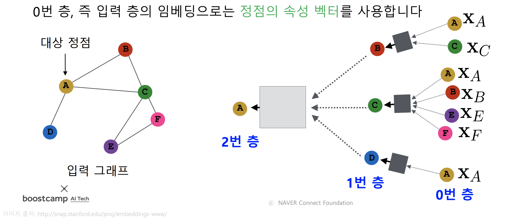
* 따라서 각 정점마다 집계되는 정보가 상이하다  
        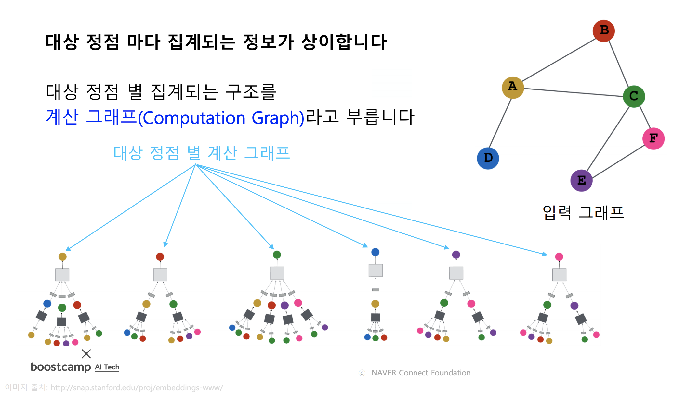
* layer 내의 정점들 간에는 집계 함수를 공유한다 **(하나의 layer 안에서는 동일한 가중치 사용)**  
        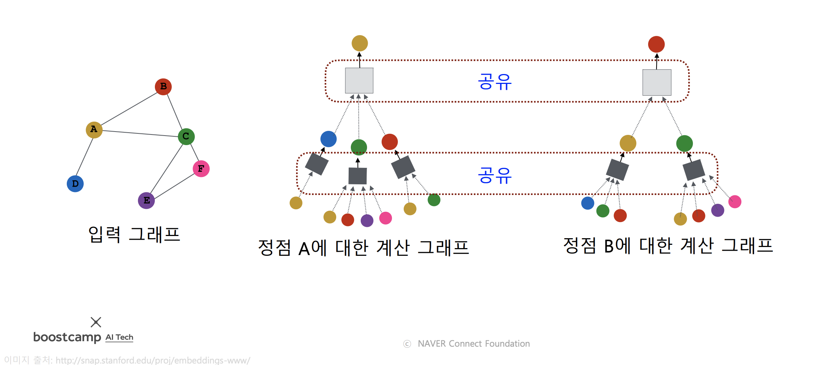
* 정점마다 degree가 다르므로 집계 함수는 가변적인 input을 처리할 수 있어야 한다
* 따라서 집계 함수는 이웃 정점들의 embedding vector의 평균을 이용한다  
        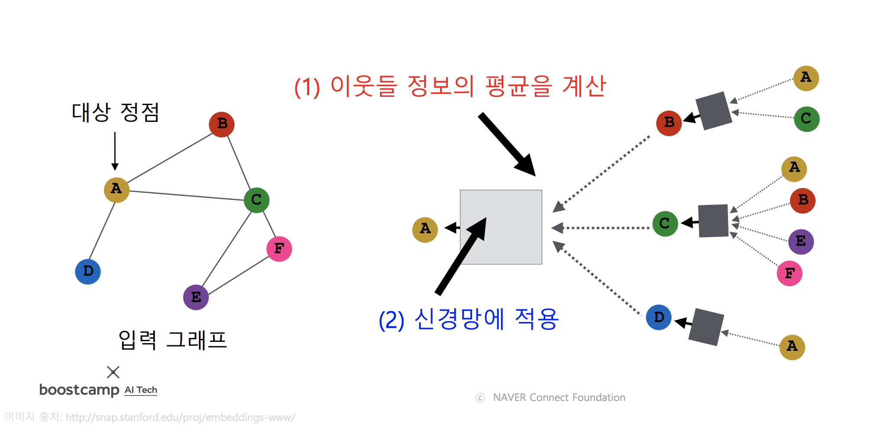
* 집계 함수의 수식은 다음과 같다  
        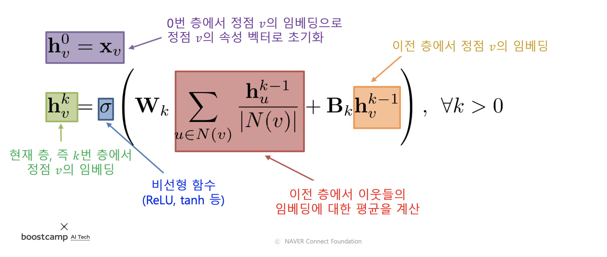
* 여기서 학습해야 하는 parameter는 $W_k$와 $B_k$이고, 이는 층 별 신경망의 가중치임
* 이전 층에서 정점 v의 임베딩을 추가로 더해주는 것은 residual connection과 유사한 역할일 것이라고 추측함
* 이웃의 이웃까지 고려한다고 가정한다면 위쪽의 그래프에서 A의 embedding vector를 구하는 과정은 다음과 같다
  * layer 0
    * A, B, C, E, F 정점의 attribute vector로 $h^0_A$, $h^0_B$, $h^0_C$, $h^0_E$, $h^0_F$를 초기화
  * layer 1
    * $h^1_B$ - $h^0_A$, $h^0_C$의 평균과 $h^0_B$를 이용하여 이용하여 구한다
    * $h^1_C$ - $h^0_A$, $h^0_B$, $h^0_E$, $h^0_F$의 평균과 $h^0_C$를 이용하여 구한다
    * $h^1_D$ - $h^0_A$와 $h^0_D$를 이용하여 구한다
  * layer 2
    * $h^2_A$ - $h^1_B$, $h^1_C$, $h^1_D$의 평균과 $h^1_A$을 이용하여 구한다. 이 때 $h^1_A$는 기존에 계산해놓지 않았으므로 $h^0_B$, $h^0_C$, $h^0_D$의 평균을 이용해서 추가적으로 구해야 한다.
  * 최종적으로 나온 $h^2_A$가 정점 A의 embedding vector가 된다  

#### 그래프 신경망의 학습

* 위 수식의 $W_k$와 $B_k$가 그래프 신경망의 parameter이다
* 학습을 위해 loss function을 정한다
* 변환식 정점 임베딩에서 처럼 그래프에서의 정점간 거리를 보존하는 것을 목표로 할 수 있다 (비지도 학습)
* 이 때 인접성을 기반으로 유사도를 정의한다면 손실 함수는 다음과 같다  
        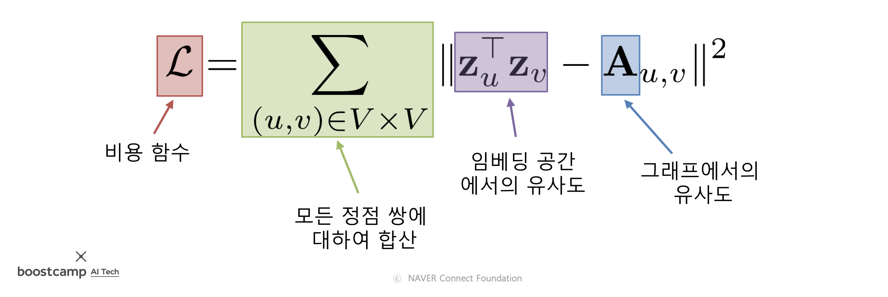
* 후속 과제(downstream task)의 loss function을 이용한 end to end 학습도 가능하다 (지도 학습)
* 정점 분류가 최종 목표인 경우를 예로 들면 다음과 같다
* 그래프 신경망을 이용하여 정점의 embedding을 구한 뒤, 정점의 embedding을 분류기(classifier)의 입력으로 넣고, 분류된 결과를 얻어야 한다
* 이 경우 classifier의 손실함수인 교차 엔트로피(cross entropy)를 전체 프로세스의 손실함수로 사용하여 end to end 학습을 할 수 있다
* 이 경우 loss function의 수식은 다음과 같다  
        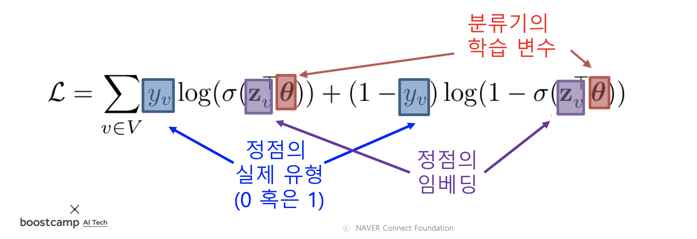
* 그래프 신경망을 학습할 때에는 그래프의 모든 정점을 사용하지 않아도 된다
* 학습에 사용할 대상 정점을 뽑아 학습 데이터를 구성한다
* 선택한 대상 정점들을 갖고 model을 학습한 후, 모든 정점에 대한 embedding vector들을 inference 하면 된다  
        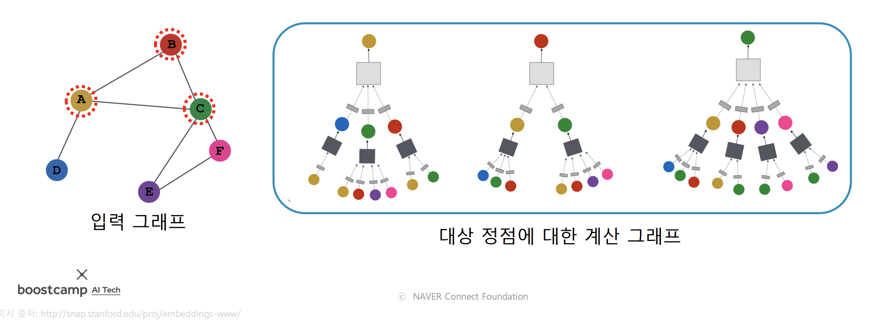  
        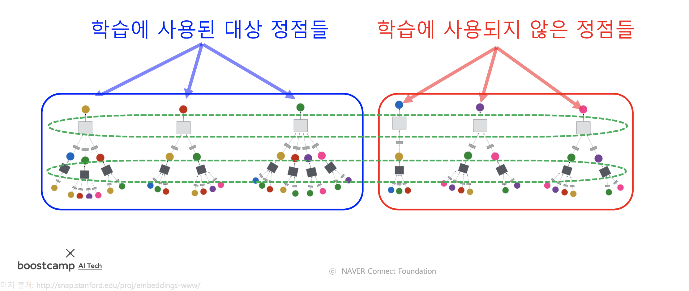
* 학습된 model만 있으면, 학습 이후에 추가된 정점의 embedding도 얻을 수 있다
* 학습된 그래프 신경망을 새로운 그래프에 적용할 수도 있다
  * (다만 이 경우엔 두 그래프의 정점들의 속성이 동일해야 할 것으로 보임)

### 그래프 신경망 변형

* 위에서 살펴본 집계함수 외에도 다양한 형태의 집계함수를 사용할 수 있다
* 지금부터 나오는 변형된 그래프 신경망들은 위의 기본적인 그래프 신경망에서 집계함수를 바꾼 것임

#### 그래프 합성곱 신경망 (Graph Convolutional Network, GCN)

* 이름에 convolutional이 들어가 있지만, CNN과 밀접한 관련이 있는건 아님. GNN의 일부임.
* 그래프 합성곱 신경망의 집계 함수를 기본적인 GNN의 집계함수와 비교해 보면 다음과 같다  
        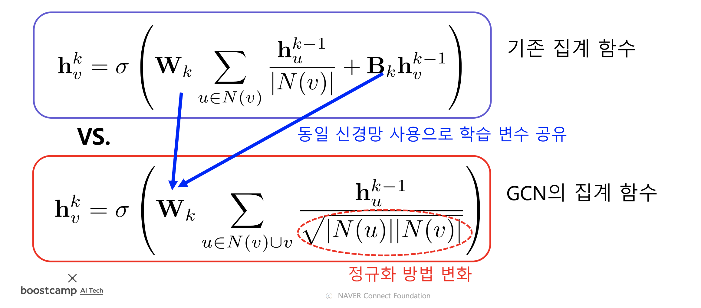

#### GraphSAGE

* GraphSAGE의 집계함수는 아래와 같다
* 이웃들의 embedding을 aggregation 함수를 이용해 합친 후, 이전 layer에서의 자신의 embedding과 concatenation 한다    
        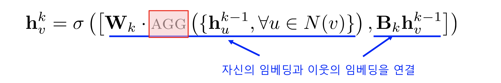  
* aggregation 함수로는 평균, 풀링, LSTM 등이 사용될 수 있다
        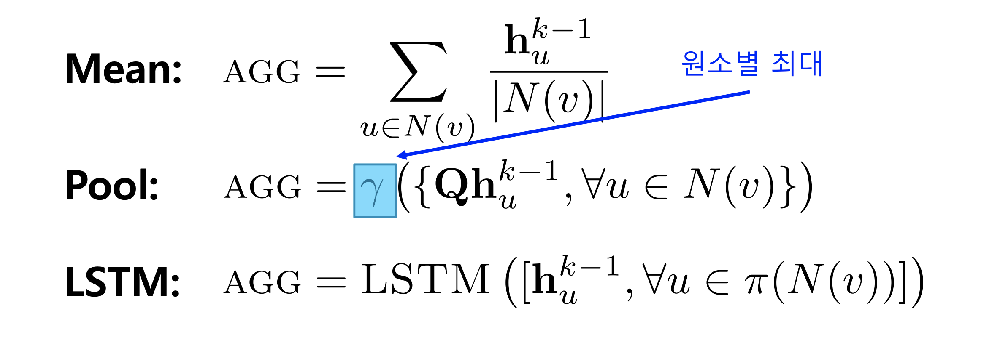

### 합성곱 신경망(CNN)과의 비교

* CNN과 GNN의 유사성
  * CNN과 GNN은 모두 이웃의 정보를 집계하는 과정을 반복함 (CNN에선 filter를 이용)

* *CNN과 GNN의 차이
  * CNN에서는 이웃의 수가 균일하지만 GNN에서는 아님
  * 그래프의 인접 행렬에서 인접한 행과 열이 이웃을 의미하지 않음

* 그래프의 인접 행렬에 합성곱 신경망을 적용하면 절대 안된다
* 그래프에는 CNN이 아닌 GNN을 적용해야 함 -> 많은 사람들이 실수하는 부분

### 실습 - DGL 라이브러리와 GraphSAGE를 이용한 정점 분류

// TODO

## 그래프 신경망이란 무엇일까? (심화)

### 그래프 신경망의 어텐션

#### 기본 그래프 신경망의 한계

* 기본 그래프 신경망에서는 이웃들의 정보를 동일한 가중치로 평균을 낸다
* 그래프 합성곱 신경망에서 역시 단순히 연결성을 고려한 가중치로 평균을 낸다

#### 그래프 어텐션 신경망

* 실제 그래프에서는 이웃 별로 미치는 영향이 다를 수 있다
* 이러한 관계를 고려하면 이웃 별로 서로 다른 가중치를 적용하여 계산해야 한다
* 이 가중치를 학습하기 위해서 self-attention이 사용된다  
        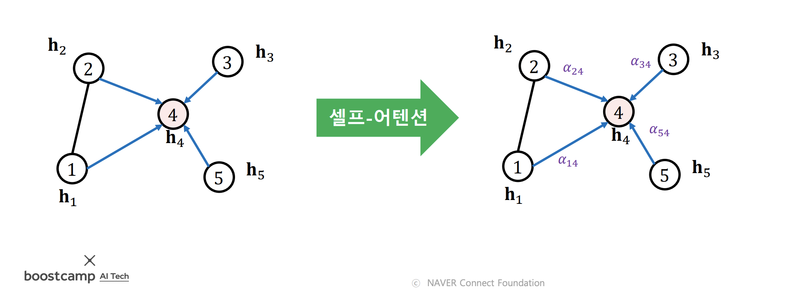
* 각 layer에서 정점 i로부터 이웃 j로의 가중치 $a_{ij}$는 다음의 과정을 거쳐 계산된다
  * t번째 layer의 정점 i의 embedding $h^t_i$에 matrix W를 곱해 새로운 embedding을 얻는다
  * 이웃 정점 j의 embedding $h^{t-1}_j$에도 위 방법을 사용해 새로운 embedding을 얻는다  
        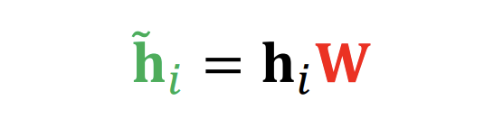
  * 정점 i와 정점 j의 새로운 embedding을 연결한 후(concat) 어텐션 계수 a를 내적한다
    * 어텐션 계수 a는 벡터임
    * 어텐션 계수 a는 모든 정점이 공유하는 parameter임  
  
    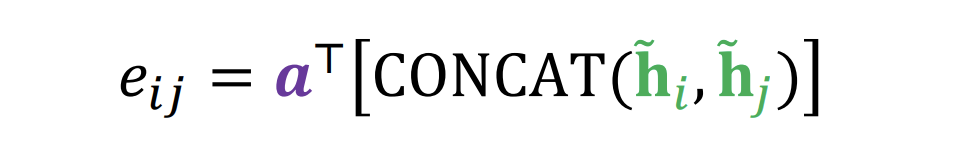
  * 위에서 나온 결과에 softmax를 적용한다  
        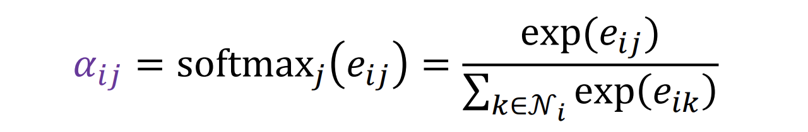
  * 위 과정을 동시에 여러번 수행(multi-head attention)하여, 결과를 concatenation하여 사용한다  
        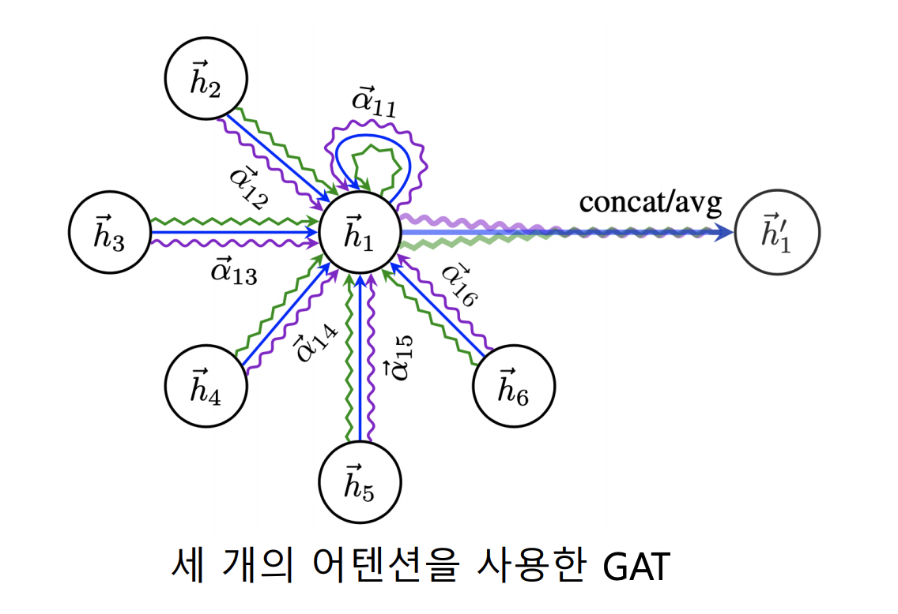

### 그래프 표현 학습과 그래프 풀링

#### 그래프 표현 학습 (Graph Embedding)

* 그래프 표현 학습 혹은 graph embedding이란 **그래프 전체**를 vector의 형태로 표현하는 것
* 개별 정점을 vector의 형태로 표현하는 정점 표현과는 다름
* 그래프 embedding은 그래프 분류 등에 활용됨
* 그래프 형태로 표현된 화합물의 분자 구조로부터 특성을 예측하는 것이 한가지 예시

#### 그래프 풀링 (Graph Pooling)

* 그래프 풀링이란 그래프 내의 정점들의 embedding들로 부터 그래프 embedding을 얻는 과정이다
* 평균 등을 이용하는 단순한 방법보다 그래프의 구조를 고려한 방법을 사용할 경우 더 높은 성능을 얻을 수 있다
* 미분 가능한 풀링(Differentiable Pooling, DiffPool)은 군집 구조를 활용하여 임베딩을 계층적으로 집계함
* 군집별로 정점 embedding을 합산 하여 군집 별로 하나의 embedding으로 표현
* 위 과정을 통해 생성된 군집을 표현하는 embedding들을 또 다시 group지어 묶음
* 이 과정을 반복하여 최종적으로 하나의 embedding vector가 남을 때까지 반복
* 최종적으로 나온 하나의 embedding vector가 그래프 embedding이 된다  

  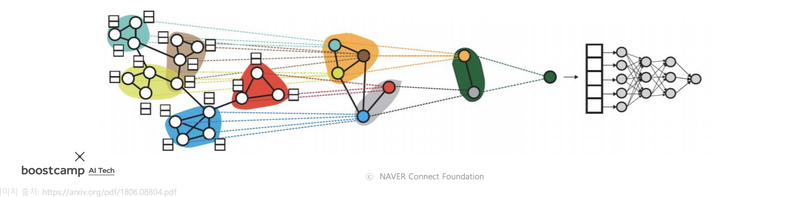

### 지나친 획일화 문제 (Over-smoothing)

* 지나친 획일화 (over smoothing) 문제란 그래프 신경망의 층의 수가 증가하면서 정점의 embedding이 서로 유사해지는 현상을 의미한다
* 이러한 문제는 작은 세상 효과와 관련이 있다
* 정점간 거리가 가깝기 때문에 layer가 깊어지면 그래프의 전반을 집계하는 효과가 발생한다
* 때문에 정점의 embedding들이 서로 유사해지게 된다 (모두 그래프의 전반을 집계했기 때문)  
        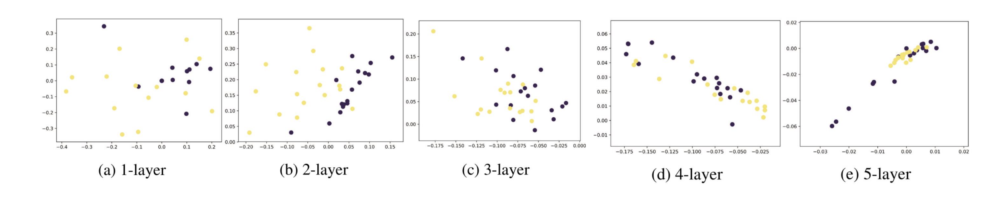

* 지나친 획일화 문제의 결과로 그래프 신경망의 layer 수를 늘렸을 때, 후속 과제에서의 정확도가 감소하는 현상이 발생한다
* 이것은 gradient vanishing과는 별개의 문제이므로 residual connection 등의 방법으로는 해결되지 않는다  
        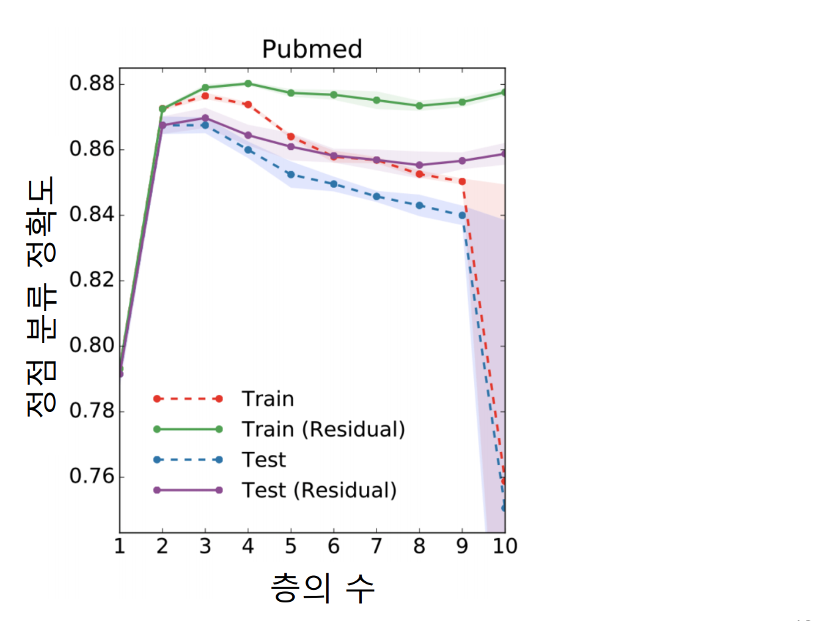

* 획일화 문제에 대한 대응 방법
  * JK 네트워크(Jumping Knowledge Network)
    * residual connection에 마지막 층의 embedding 뿐 아니라, 모든 층의 embedding을 함께 사용함  
  
    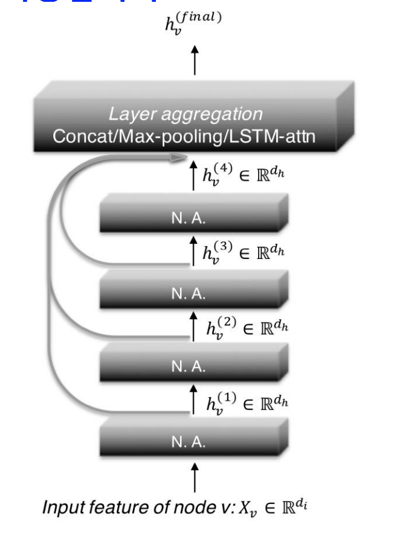
  * APPNP
    * 0번째 layer에서만 신경망을 사용. 0번째 layer 이외의 layer에서는 신경망 없이 단순화한 집계 함수를 사용함  
  
    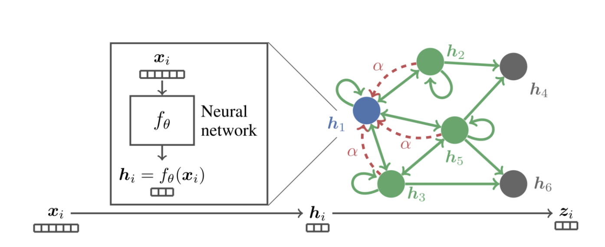

### 그래프 데이터의 증강 (Data Augmentation)

* 그래프에 누락되거나 부정확한 간선이 있을 수 있다
* 이러한 noise가 있어도 잘 학습될 수 있도록 data augmentation을 통해 그래프를 보완한다
* 대표적인 방법으로는 유사도가 높은 정점 간의 간선을 추가하는 방법이 있다
* 유사도가 높은 정점 사이의 간선을 추가하면 유사도가 더욱 증가한다
* 유사도가 증가하면 누락되거나 부정확한 간선에 의한 영향을 줄일 수 있다  
        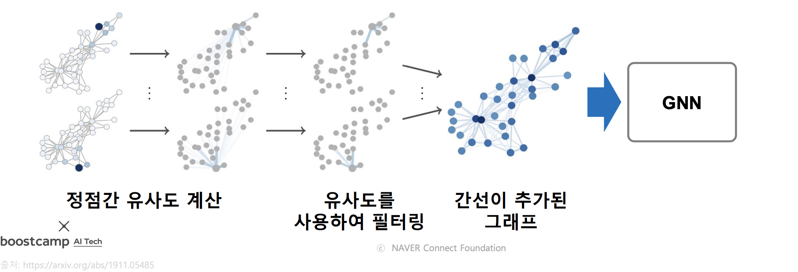

### 실습 - GraphSAGE의 집계 함수 구현

// TODO