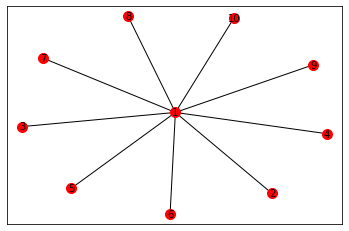

# Lab 1-1 : Graph Basic
- Instuctor : Kijung Shin
- Teaching Assistants : Deukryeol Yoon(main), Hyunju Lee, Shinhwan Kang 
- 본 실습에서는 그래프를 컴퓨터 상에서 다루는 기초적인 방법을 배운다.


```python
# 실습에 필요한 library를 임포트합니다.
import sys
import networkx as nx                           # NetworkX
import numpy as np                              # 선형대수를 위한 라이브러리
import matplotlib.pyplot as plt                 # 그림을 그리기 위한 라이브러리
np.set_printoptions(threshold=sys.maxsize)      
```


```python
print("###### Graph Init ######")               
G= nx.Graph()                                   # 방향성이 없는 그래프
DiGraph = nx.DiGraph()                          # 방향성이 있는 그래프
```

    ###### Graph Init ######


```python
print("###### Add Node to Graph ######")                    
print("# Add node 1")                                      
G.add_node(1)                                               # 정점 1 추가
print("Num of nodes in G : " + str(G.number_of_nodes()))    # 정점의 수 반환
print("Graph : " + str(G.nodes)+ "\n")                      # 정점의 목록 반환
```

    ###### Add Node to Graph ######
    # Add node 1
    Num of nodes in G : 1
    Graph : [1]
    


```python
print("# Add vertex 2 ~ 10")                                # 정점 2 ~ 10 추가
for i in range (1, 11):
    G.add_node(i) # 앞에서 정점 1 추가했는데, 여기서 한번 더 추가함 -> 중복 제거 되는듯
print("Num of nodes in G : " + str(G.number_of_nodes()))
print("Graph : " + str(G.nodes) + "\n")
```

    # Add vertex 2 ~ 10
    Num of nodes in G : 10
    Graph : [1, 2, 3, 4, 5, 6, 7, 8, 9, 10]
    


```python
print("###### Add Edge to Graph ######")                    
G = nx.Graph() # 새로운 그래프로 초기화
print(G.edges) # 초기화 된 것 확인
print("#Add edge (1, 2)")                                   
G.add_edge(1, 2)                                            # 정점 1과 2 사이에 간선 추가
print("Graph : " + str(G.edges) + "\n")                     # 간선의 목록 반환
```

    ###### Add Edge to Graph ######
    []
    #Add edge (1, 2)
    Graph : [(1, 2)]
    


```python
print("#Add edge (1, i) for i = 2 ~ 10")                    # 정점 1과 다른 정점 사이의 간선 추가
for i in range (2, 11):
    G.add_edge(1, i) # 기존에 없던 node에 대한 edge를 추가하면 자동으로 node도 추가된다
print("Graph : " + str(G.edges) + "\n")
```

    #Add edge (1, i) for i = 2 ~ 10
    Graph : [(1, 2), (1, 3), (1, 4), (1, 5), (1, 6), (1, 7), (1, 8), (1, 9), (1, 10)]
    


```python
# 그래프를 시각화
# 정점의 위치 결정 -> 간선들이 겹치지 않도록 정점의 위치를 정해준다
pos = nx.spring_layout(G)
# 색과 크기를 지정하여 정점으 그림
im = nx.draw_networkx_nodes(G, pos, node_color="red", node_size=100)    
# 간선을 그림
nx.draw_networkx_edges(G, pos)                                          
# 각 정점의 라벨을 그림
nx.draw_networkx_labels(G, pos, font_size=10, font_color="black")       
plt.show() # 위에서 그린 것들을 출력

```


    

    


```python

```
