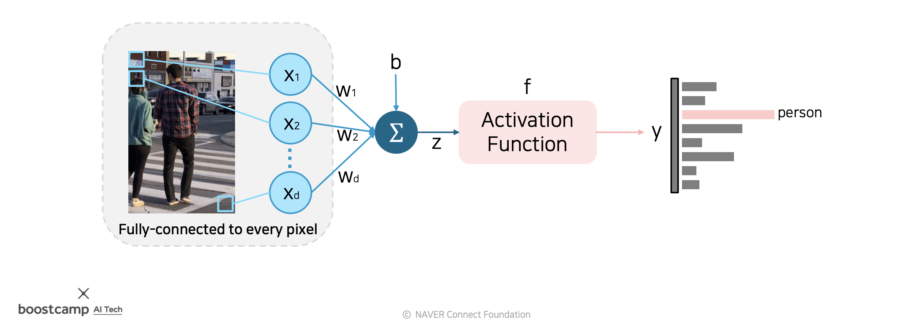
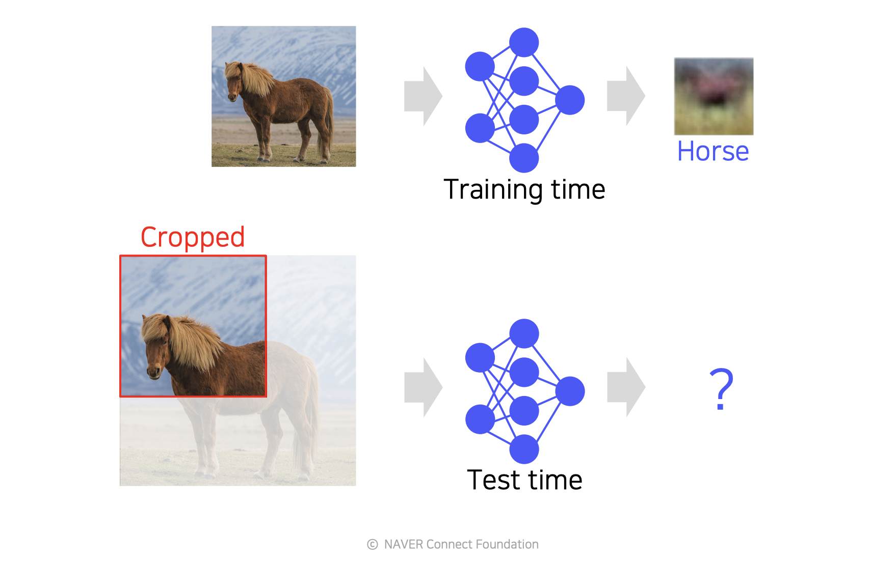
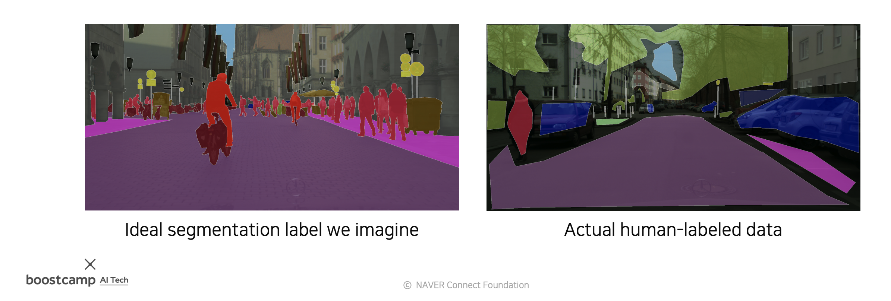
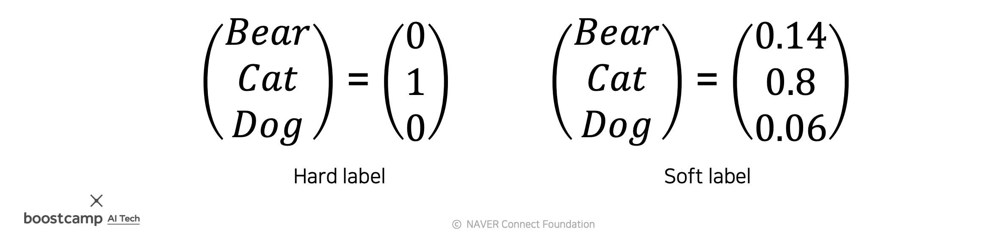

# Day 31 - Image Classification 1, Annotation data efficient learning

- [Day 31 - Image Classification 1, Annotation data efficient learning](#day-31---image-classification-1-annotation-data-efficient-learning)
  - [Image Classification 1](#image-classification-1)
    - [Image Classification](#image-classification)
    - [CNN architectures for image classification 1](#cnn-architectures-for-image-classification-1)
      - [LeNet-5](#lenet-5)
      - [AlexNet](#alexnet)
      - [VGGNet](#vggnet)
  - [Annotation data efficient learning](#annotation-data-efficient-learning)
    - [Data Augmentation](#data-augmentation)
    - [Leveraging Pre-Trained Information](#leveraging-pre-trained-information)
      - [transfer learning](#transfer-learning)
      - [Teacher-Student Learning](#teacher-student-learning)
      - [knowledge distillation](#knowledge-distillation)
    - [Leveraging Unlabeled Dataset For Training](#leveraging-unlabeled-dataset-for-training)
      - [Self-Training](#self-training)

## Image Classification 1

### Image Classification

* network를 이용한 image classification은 우리가 갖고있는 모든 image를 network에 압축해 넣은 후, 압축된 image들을 이용해 분류 작업을 하는 것이다.

    

* single fully-connected layer 구조의 network를 이용한 classifier는 다음과 같이 구성됨

    

    * 모든 픽셀에 각각의 가중치를 이용해 weighted sum을 한 뒤, non linear layer (activation function)을 거치는 형태로 분류 작업을 한다

* 이 network를 이용해 학습된 weight matrix의 모습은 아래와 같음

    

    * 학습된 weight matrix를 이미지로 표현해보면 해당 weight matrix가 check하는 class의 평균적인 모습의 image로 보이게 된다 (해당 class에 대한 정보를 담고 있는 것)

* 위와 같은 network는 잘 작동하지 않는다. 문제점은 크게 두가지가 있다.
  * single layer이기 때문에 하나의 평균적인 모습만 분별 가능하다
  * fully-connected network이기 때문에 image가 crop된 경우 잘못된 예측을 할 확률이 높음

    

* 이 문제를 해결하기 위해 fully-connected network가 아닌 locally-connected network를 사용한다

    

* locally-connected network는 image의 이곳 저곳을 나누어 분석하기 때문에 image 내에서 물체의 위치가 바뀌어도 제대로 분석할 수 있다
* 또한 fully-connected network에 비해 훨씬 적은 수의 parameter만으로 작업을 수행할 수 있다

    

* 이러한 CNN은 Computer Vision tasks에서 backbone network(base network)로 사용된다
* 각각의 task는 CNN 뒤에 각각의 task에 알맞은 head network를 덧붙여 작업을 수행한다

### CNN architectures for image classification 1

#### LeNet-5

* 최초의 CNN model
* Conv - Pool - Conv - Pool - FC(Fully-Connected) - FC 형태의 간단한 구조
* stride 1의 5x5 filter를 사용
* stride 2의 2x2 max pooling

#### AlexNet

* LeNet-5 와 유사하지만 더 커짐
* ReLU와 dropout을 사용
* 전체적인 구조는 다음과 같음

    

* CNN과 Fully-Connected network를 연결할 때 크게 두가지 방법이 있음
  * flatten
  * adaptive average pooling

* AlexNet에서는 Flatten을 사용
* Local Response Normalization (LRN) 사용
  * 요즘은 사용하지 않는 방법 (deprecate)
  * 최근엔 batch normalization을 주로 사용함

* 11x11 convolution filter 사용
  * 요즘은 작은 filter를 사용함 (3x3, 5x5...)

* Receptive field
  * 특정 element를 만들기 위해 참조한 input layer의 영역을 receptive field라고 지칭한다

    

#### VGGNet

* AlexNet보다 layer를 더 깊게 쌓음
* NLR normalization 사용 안함
* 3x3 filter만 사용 - layer를 많이 쌓으면 큰 filter를 사용했을 때와 동일한 효과
* better performance, better generalization than AlexNet
* 입력에서 RGB 값의 평균을 빼주는 형식으로 normalization

    

## Annotation data efficient learning

### Data Augmentation

* train data만으로는 실세계의 모든 상황을 cover할 수 없음
* 이 상황을 그림으로 표현해보면 다음과 같음

    

* train data에 없던 유형의 data가 들어오면 제대로 유추해내지 못함 (ex - 어두운 사진, 새로운 구도의 사진 등)
* augmentation을 이용해 새로운 상황에 대응할 수 있는 능력을 길러준다
* 이를 그림으로 표현해보면 다음과 같다 

    

  기존 data들 사이 사이의 빈 공간을 채워주는 역할을 하는 것으로 생각해볼 수 있음

* 다음과 같이 다양한 방법으로 image를 변형시킨다
  * brightness adjustment (명암 조절)

    

  * rotate, flip

    

  * crop

    

  * affine transformation

    
    

    변환의 기준이 될 점들을 선택해 이용한다

  * cut mix

    

    label도 같은 비율로 섞어준다

* randAugment

    

    위와 같이 다양한 augmentation 방법들이 존재한다. 하지만 이 중 어떤 것을 골라 사용해야 가장 좋은 결과를 얻을 수 있을지는 직접 해보기 전까지는 알지 못한다. RandAugment는 랜덤하게 몇가지 augmentation을 고른 뒤 학습시켜보는 것을 몇차례 반복한 뒤 가장 결과가 좋았던 조합을 최종적으로 골라 모델을 학습하는데 사용하는 방법이다.  
    이 방법을 사용하면 accuracy를 손쉽게 올릴 수 있다.

### Leveraging Pre-Trained Information

* model을 잘 학습시키려면 양질의 train data가 많이 필요하다
* 하지만 질 좋은 dataset은 구하기가 어렵다
* 따라서 적은 data로도 학습을 잘 시키는 방법이 필요하다

    

    좌측과 같은 이상적인 data를 많이 얻는 것은 힘든 일이다

#### transfer learning

* transfer learning을 이용하면 pre-train된 model을 이용하여 적은 양의 data로도 좋은 성능을 내는 model을 만들 수 있다
* pre-trained model에 적은 양의 data로 fine tuning을 하여 우리가 원하는 task를 잘 수행하도록 만들 수 있다
* 보통 CNN으로 이루어진 pre-trained model에 우리가 원하는 task를 위한 fully connected layer를 덧붙이는 형식으로 model을 만든다
* 여기에는 두가지 방법이 있다
  * 첫번째 방법은 pre-train된 convolution layers의 weight를 고정시키고,  fully connected layer만 학습시키는 방법이다
  * 두번째 방법은 pre-train model도 학습시키는 방법이다. 다만 pre-train model의 learning rate는 작게 설정해서 fully connected layer를 중점적으로 학습시킨다

    

#### Teacher-Student Learning

* pre-trained model (teacher model)이 학습한 내용을 또다른 student model로 전달하는 방법이다
* 이 때 student model은 teacher model보다 작은 model이다
* model compression(모델 압축, 경량화)을 위해 사용되는 방법이다
* teacher-student network의 구조는 다음과 같다

    

* student model이 teacher model과 동일한 output을 내도록 하는 것이 목표이다
* student model이 teacher model(pre-trained model)을 닮아가는 방향으로 학습이 진행된다
* student model의 output과 teacher model의 output을 비교하여 loss를 계산한다
* student model에만 back propagation을 수행한다
* 학습에 image의 label은 필요하지 않다
* 따라서 unsupervised learning이라고 볼 수 있다

#### knowledge distillation

* 두가지 loss를 함께 사용해 학습하는 방법이다
  * distillation loss - teacher와 student 사이의 loss
  * student loss - student network가 inference한 결과와 true label 사이의 loss

    

* hard label (one-hot vector)
  * one-hot vector의 형식으로 어떤게 정답인지만을 표시한 것을 hard label이라 한다
* soft label
  * 각각의 class에 속할 확률을 성분으로 갖는 vector를 soft label이라 한다. soft label에 argmax를 취하면 hard label이 된다

    

* hard prediction (normal softmax)
  * 기존에 사용했던 일반적인 softmax
  * 0과 1에 가깝게 치우친 값을 얻게될 확률이 높다
* soft prediction (softmax with temperature T)
  * temperature T를 사용하여 출력을 smooth하게 만들어주는 softmax
  * student model의 출력이 teacher model의 출력과 유사해지도록 만들어야 한다
  * 그냥 softmax를 사용하면 값이 0 or 1에 치우쳐있어 학습이 어렵다
  * soft prediction을 사용하여 출력을 smooth하게 만들어 주면 teacher model의 output에 더 가깝게 근사할 수 있다
* 최종적으로 학습시킬 때에는 distillation loss와 student loss를 적절하게 가중 합하여 back propagation 한다

### Leveraging Unlabeled Dataset For Training

* 전체 data 중 labeled data는 극히 일부이다
* unlabeled data를 어떻게 하면 학습에 이용할 수 있을까?

    

#### Self-Training

* self-training은 labeled data를 이용해 unlabeled data에 pseudo label을 붙여 학습에 이용한다
* label이 없는 data와 있는 data를 함께 사용하는 semi-supervised learning이다

    

* 학습 순서는 다음과 같다
  1. labeled data로 model(teacher model)을 학습시킨다
  2. 학습된 model로 label이 없는 data에 pseudo label을 붙인다
  3. 2번에서 생성된 pseudo labeled dataset과 labeled dataset을 이용해 student model을 학습시킨다 (augmentation도 사용)
  4. 학습된 student model을 teacher model로 사용해서 위 과정을 반복한다
* 이것을 2~4번 반복한다
* 경량화에 사용하는 teacher-student learning과 달리 self-training에서는 student model이 teacher model보다 크다
* 이 방법을 사용하면 label이 없어 학습에 사용하지 못한 data도 pseudo label을 만들어 학습에 사용할 수 있게 된다
* 훨씬 많은 data를 학습에 사용할 수 있게 되므로 성능이 향상된다