# Day 32 - Image Classification 2, Semantic Segmentation

- [Day 32 - Image Classification 2, Semantic Segmentation](#day-32---image-classification-2-semantic-segmentation)
  - [Image Classification 2](#image-classification-2)
    - [Problems with deeper layers](#problems-with-deeper-layers)
    - [CNN architectures for image classification 2](#cnn-architectures-for-image-classification-2)
      - [GoogLeNet](#googlenet)
      - [ResNet](#resnet)
      - [Beyond ResNet](#beyond-resnet)
  - [Semantic Segmentation](#semantic-segmentation)
    - [Semantic segmentation architectures](#semantic-segmentation-architectures)
      - [fully convolutional networks](#fully-convolutional-networks)
      - [downsampling](#downsampling)
      - [upsampling](#upsampling)
      - [skip connections](#skip-connections)
      - [U-Net](#u-net)

## Image Classification 2

### Problems with deeper layers

* layer를 깊게 쌓을수록 성능이 올라감. 그 이유는 아래와 같다
  * larger receptive field - 주변의 정보를 더 많이 활용할 수 있음
  * more capacity and non-linearity - network의 표현력 상승

* 하지만 몇몇 문제점 때문에 layer를 깊게 쌓기가 어려움
  * gradient vanishing/exploding - gradient가 사라지거나 매우 커져 역전파가 잘 되지 않음
  * computationally complex - 시간/공간 복잡도가 너무 커져 계산이 어려워짐
  * degradation problem - 특정 수준에 도달하면 더이상 accuracy가 증가하지 않음. gradient vanishing이 원인. over fitting 문제는 아님. ResNet에서 residual connection으로 해결

### CNN architectures for image classification 2

#### GoogLeNet

* inception module
  * depth가 아닌 width를 확장하는 형태
  * 1x1, 3x3, 5x5 크기의 filter 사용 - 다양한 크기의 filter를 이용해 image를 여러 측면에서 관찰, 분석한다
  * 3x3 pooling
  * 여러 filter를 이용해 구한 activation map들을 concatenation으로 합친다
  * 1x1 convolution을 사용하여 channel size를 줄이고 parameter 수를 줄여 비교적 적은 computational resources로 학습 가능하다

    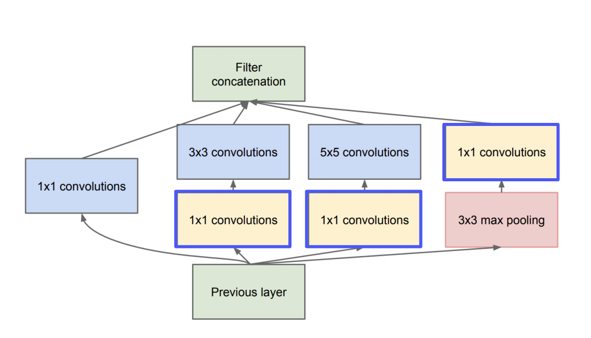
    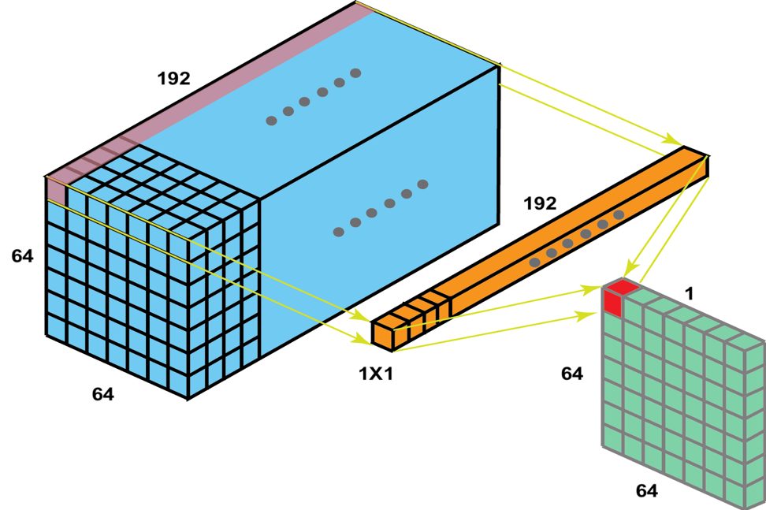

* Auxiliary classifiers
  * 맨 마지막에 나오는 최종 output만으로는 역전파가 제대로 되지 않음 (vanishing gradient problem)
  * 중간 결과를 이용해 loss를 계산하고, 여기서 나오는 gradient를 중간에서 주입한다
  * model을 학습시킬 때에만 사용하고 inference할 때는 사용하지 않는다

    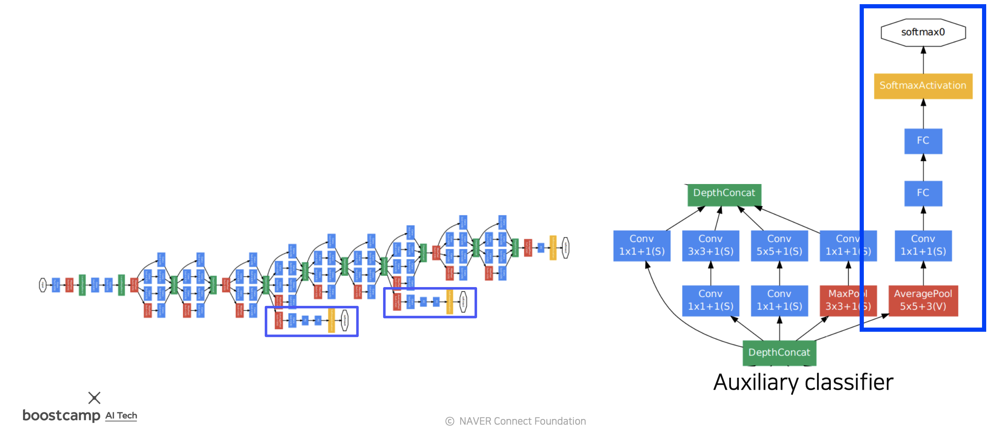

    파란색 박스로 표시한 부분이 Auxiliary classifier이다

#### ResNet

* layer를 깊게 쌓을수록 성능이 좋아진다는 것을 입증함
* 152개의 layer를 쌓음
* degradation problem
  * ResNet 이전의 model들에서는 layer를 깊게 쌓으면 성능이 좋지 않은 문제가 있었음
  * 이런 현상은 train data에서도 발생했기 때문에 over fitting이 원인은 아님
  * vanishing gradient problem 때문에 layer를 깊게 쌓은 network는 학습이 제대로 되지 않는 것

    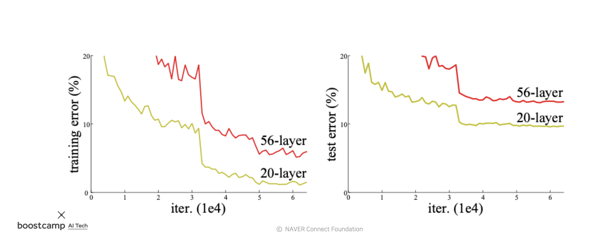

* 이 문제를 해결하기 위해 ResNet은 shortcut connection (skip connection)이라는 것을 도입함

    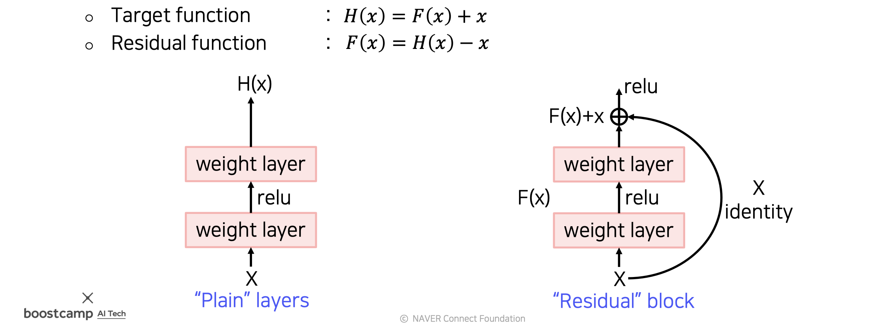

* skip connection은 다음과 같이 이해해볼 수 있음
  * 왼쪽 그림과 같이 x와 H(x) 사이의 관계를 바로 학습하는 것은 어려움
  * 대신에 오른쪽 그림처럼 x와 H(x)간의 차이 F(x)를 학습하면 학습에 드는 부담을 줄일 수 있음
* 이러한 구조를 이용하면 gradient가 전달되는 경로가 여러개가 됨
* residual block은 skip connection을 하나씩 갖고있음
* 따라서 경로의 개수는 $2^{n}$개 (n은 residual block의 수)
* 새로운 block을 추가하면 경로의 수는 2배가 됨
* backpropagation을 수행할 때 특정 경로에서 gradient가 vanishing 되더라도, 다른 경로를 통해서 아래쪽 layer에 전달될 수 있음
* 이렇게 skip connection을 이용하면 다양한 경로를 통해 복잡한 mapping을 학습시킬 수 있고, 이 방법으로 degradation problem을 해결했음

    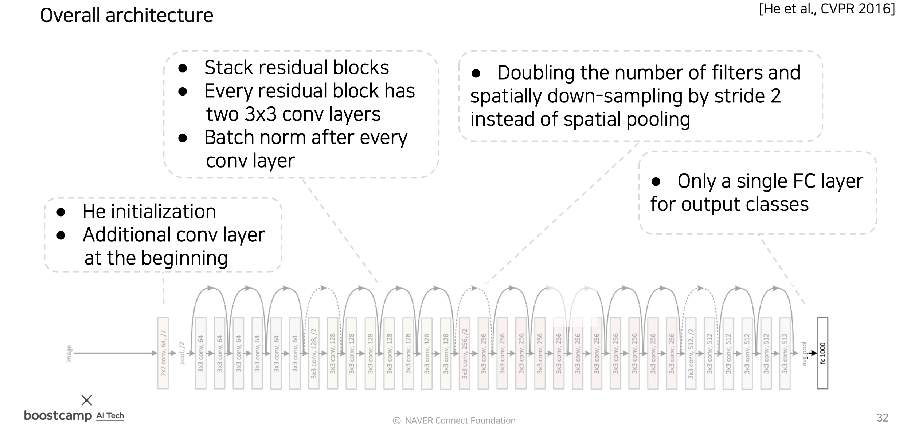

#### Beyond ResNet

* DenseNet
  * 상위 layer에서 모든 하위 layer의 정보를 참조한다
  * 하위 layer의 activation map을 상위 layer의 activation map과 합칠 때에는 concatenation을 사용한다
  * concat을 하면 정보가 그대로 보존되기 때문에 필요할 때 잘 꺼내서 사용할 수 있다

    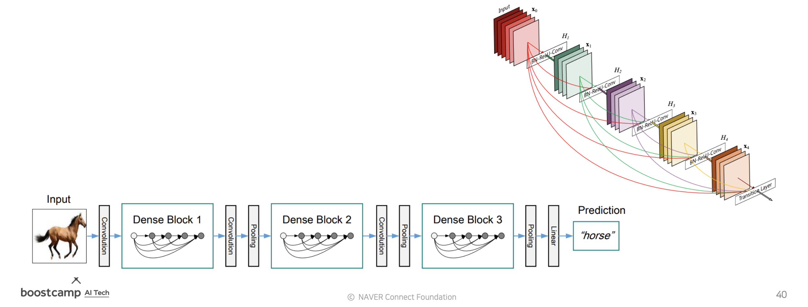

* SENet
  * 중요한 channel을 파악해 해당 channel에 attention한다
  * attention 수행 과정은 다음과 같다
    1. global average pooling으로 공간 정보의 크기를 1로 만든다
    2. 위 과정을 거치면 각 channel의 평균 정보가 1x1xc (c는 채널 개수) 크기의 vector에 담기게 된다
    3. 2의 vector를 full connected layer에 넣어 attention score를 계산해 channel별 가중치 vector를 구한다
    4. 3의 attention score를 이용해 attention을 적용한다 (중요한 channel은 강조, 중요하지 않은 channel은 forget)

    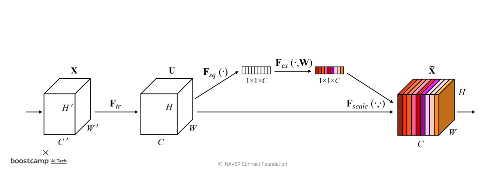

* EfficientNet
  * 이전에는 network를 설계하는 방식이 크게 세가지로 나뉘어있었다
    * width scaling - width 확장하는 방식 (GoogLeNet)
    * depth scaling - layer를 깊게 쌓음 (ResNet)
    * resolution scaling - 높은 해상도의 data를 input으로 사용
  * efficientNet은 위 세가지 방법을 적절히 조합하여 모두 사용

    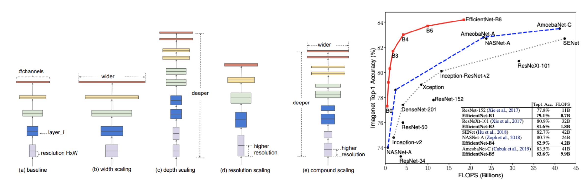

* Deformable convolution
  * 사람과 동물 등은 여러 자세를 취할 수 있다
  * 이러헌 특성을 고려해 filter를 적용할 영역을 유동적으로 결정하는 것이 deformable convolution이다
  * conv layer를 이용해 kernel의 offset을 구하고, 이 offset을 이용해 filter를 벌려준다 (irregular convolution)
  * 모양을 변형시킨 filter를 이용해 convolution 연산을 수행한다
  * 아래의 그림에서 deformable convolution을 보면 filter의 모양을 변형시켜, 동물에 해당하는 영역을 골라 filter를 적용하는 것을 볼 수 있다

    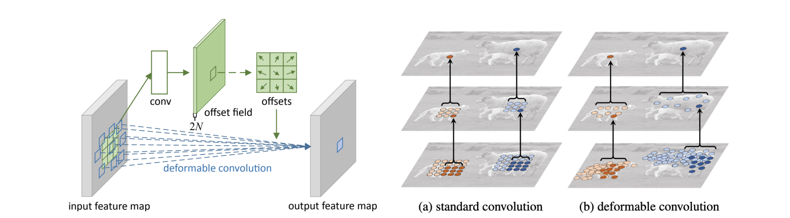

## Semantic Segmentation

* semantic segmentation은 image 내의 각각의 pixel을 class별로 분류하는 task
* instance 단위의 구분은 하지 않음. class로만 구분
  * 예를 들면 image 내에 자동차가 여러개 있을 때, 각각의 자동차가 서로 다른 물체임은 구분하지 않는다. 모두 묶어서 자동차 class라고만 구분함.

### Semantic segmentation architectures

#### fully convolutional networks

* fully connected layer를 사용하면 공간 정보가 사라져 픽셀 단위의 segmentation을 하기 어려움
* fully convolutional networks는 output이 공간의 정보를 그대로 담고있음
* network에 fully connected layer가 포함되어 있으면 동일한 크기의 input만 받을 수 있는데 반해 fully convolutional networks는 input size가 바뀌어도 됨.

    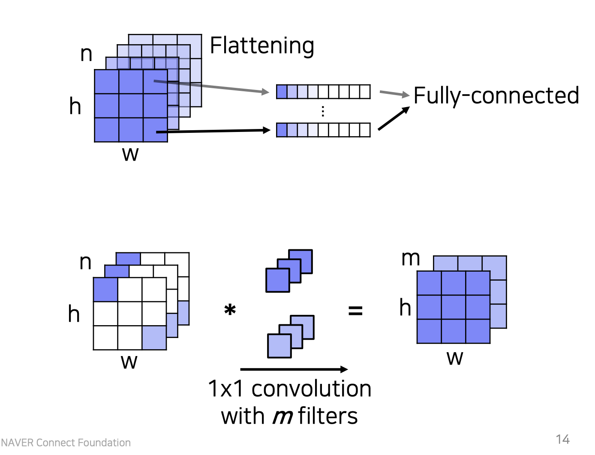

* fully convolutional network로 classification을 수행하는 것은 위의 그림과 같음
* 위쪽 그림과 같이 conv layer를 통과해 나온 activation map을 channel axis 기준으로 나누어 concat하는 방식으로 flatten을 한다면 channel의 수만큼 column이 생기고, 해당 column에는 해당 class에 대한 수치들이 들어가게 됨
* 1x1 conv layer를 이용해 classification 하는 것이 사실상 이것과 동일한 연산임
* 1 x 1 x channel_size 크기의 kernel을 n개 (n은 분류할 class의 총 개수) 사용하여 classification을 수행함
* 위 연산을 통해 n개의 (n은 분류할 class의 총 개수) feature map이 생기며, 각각의 feature map이 의미하는 것은 해당 픽셀(feature map의 성분)이 그 feature map과 연관된 class와 연관된 정도를 나타냄.

#### downsampling

* stride와 pooling을 사용해 feature map의 크기를 input의 크기보다 작게 만듦
* 이렇게 하면 receptive field가 커지게 됨
* receptive field가 크다는 것은 더 많은 주변 정보를 고려할 수 있게 된다는 것을 의미
* 더 많은 정보를 고려하기 때문에 정확도가 올라감

    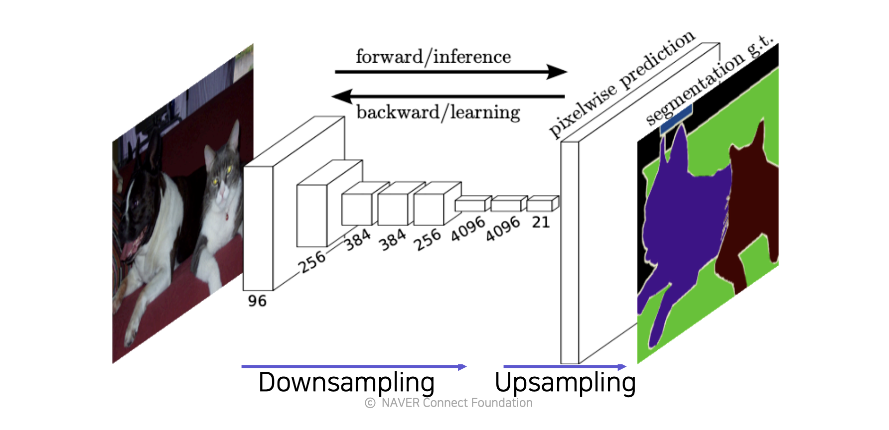

#### upsampling

* downsampling을 하면 output의 크기가 input에 비해서 작아지기 떄문에 의미있는 semantic segmentation 결과를 도출하지 못할 수 있다
* upsampling해서 output의 크기를 다시 키워준다
* Transposed convolution을 이용해 확장시킨다

    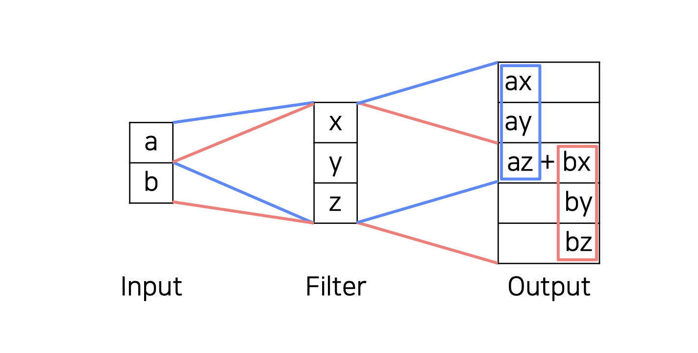

  * 위의 사진처럼 transposed convolution은 일반적인 convolution 연산과 반대되는 방향으로 각각의 값에 filter를 적용하여 activation map의 크기를 키우는 것이다
    * 이것을 deconvolution이라고 부르기도 하지만, deconvolution은 convolution 연산 이전의 값을 완벽히 복원해 내는 것을 의미한다. 하지만 transposed convolution을 이용해 기존의 값을 완벽히 복원해 내는 것은 사실상 불가능하기 떄문에 deconvolution은 아니다.
  * 사진의 az + bx 부분과 같이 겹치는 부분이 발생하는데, 이런 부분에 값이 중복되어 들어가기 떄문에 왜곡이 발생하는 문제가 있다
  * 이 문제를 해결하기 위해 NN-resize convolution이나 Bilinear-resize convolution을 이용한다

    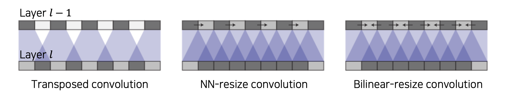  

    upsampling에 대한 자세한 내용은 [여기](https://distill.pub/2016/deconv-checkerboard/)를 참고하자

#### skip connections

* 초반부의 layer는 receptive field의 크기가 작음 -> local data를 고려하는 것
* 후반부의 layer는 receptive field의 크기가 큼 -> holistic, global data를 고려하는 것

    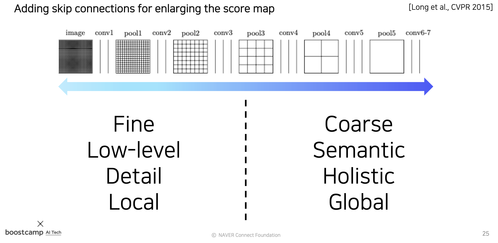

* local, global을 모두 고려하는 것이 더 좋은 성능을 낸다
* 이 두가지를 함께 고려하기 위해 skip connection을 사용한다
* 앞쪽 layer에서 나온 activation map을 skip connection을 이용해 뒤쪽 layer에 전달한다
* 전달된 activation map은 concat을 이용해 합친다

    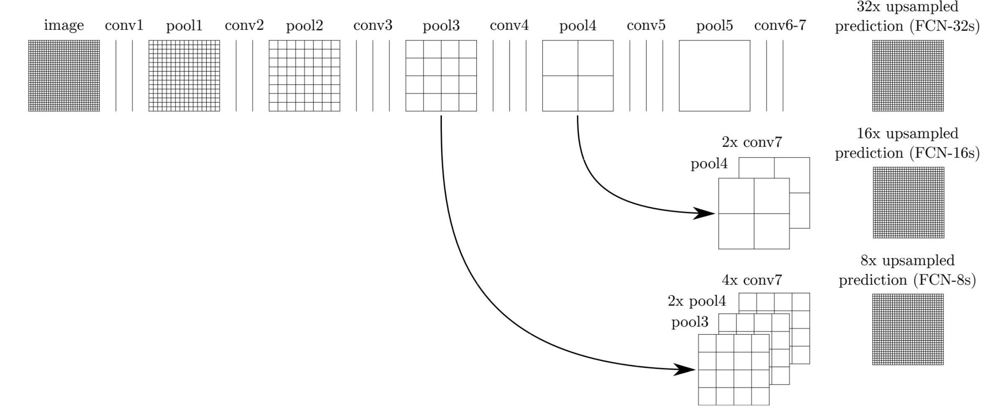
    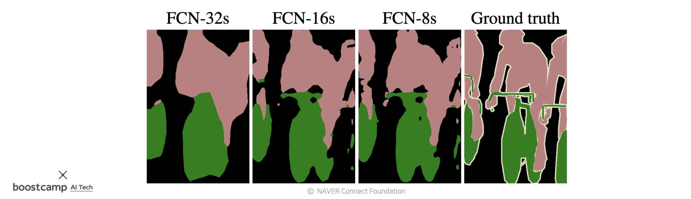

* 위의 사진과 같이 이전 layer의 중간 결과 (activation map)을 많이 참고할수록 더 좋은 output을 낸다

#### U-Net

* fully convolutional network
* concatenating feature maps from contracting path(similar to skip connections in FCN)
* yield more precise segmentation

* U-Net의 전체적인 구조는 다음과 같이 생겼다

    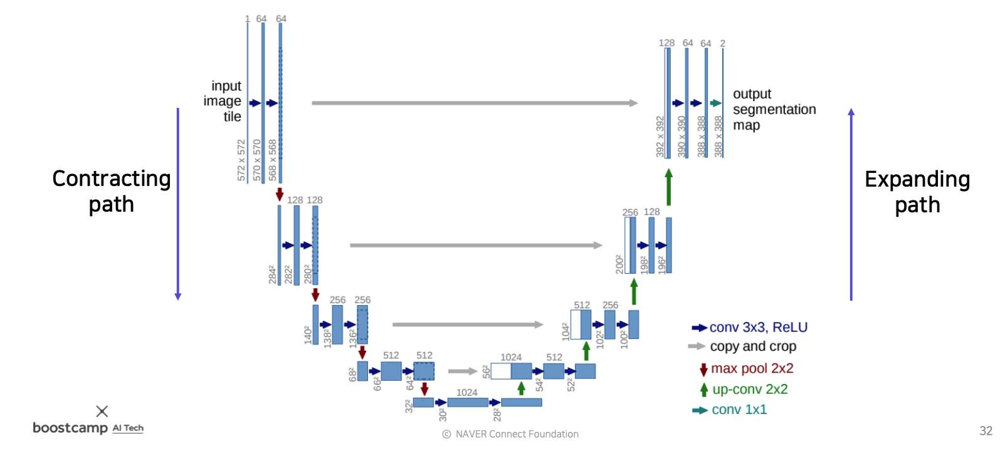

* U자 형태로 생겼기 때문에 U-Net이라는 이름이 붙었다
* U자 형태 중 왼쪽 절반을 contracting path, 오른쪽 절반을 expanding path라고 부른다
* contracting path
  * downsampling, encoding을 하는 layer들이다
  * pooling으로 receptive field의 크기를 키운다. (activation map이 점점 작아짐)
  * 대신 channel size는 늘어난다
  * downsampling을 반복해 최종적으로 작은 activation map을 만들고, 여기에 image에 대한 정보가 잘 녹아있다고 가정한다
* expanding path
  * upsampling, decoding을 하는 과정이다
  * contracting path에서와는 반대로 channel size를 반으로 줄인다
  * activation map의 해상도는 높인다
  * skip connection을 이용하여 contracting path에서 대응되는 layer의 activation map을 받아와 concat한다 - 이를 위하여 contracting path와 expanding path에서 일관된 양만큼 (절반씩 줄이고, 두배씩 늘림) upsampling, downsampling을 한다
  * 대칭되는 layer들은 concat을 위해 해상도와 channel이 호환 가능하도록 설계되었다
* U-Net에서 feature map(activation map)의 spatial size가 홀수가 되지 않도록 해야한다
* spatial size가 홀수가 되면 다음과 같은 문제가 발생한다

    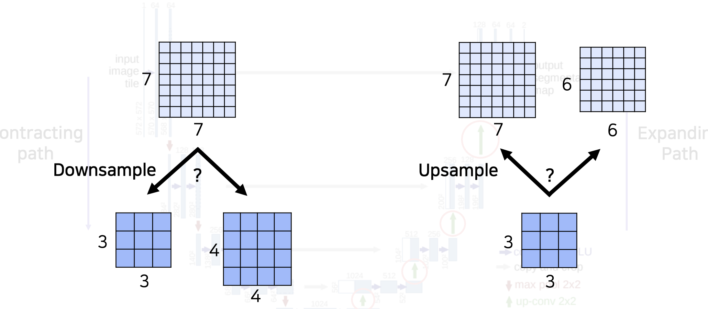

  * spatial size가 7인 feature map을 절반 크기로 downsampling 한다고 하면 downsampling된 feature map의 크기는 3(버림) or 4(반올림)가 된다
  * 이 feature map을 upsamping하면 크기가 6 or 8이 된다
  * spatial size가 7이었던 input과 다른 크기의 결과가 나오게 된다
  * 이와 같은 상황이 일어나면 skip connection을 이용해 feature map들을 concat할 때 문제가 발생한다
  * 이와 같은 상황을 방지하기 위해 feature map의 spatial size가 홀수가 되지 않도록 해야 한다
