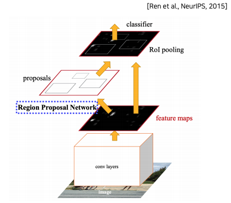

# Day 33 - Object detection, CNN Visualization

## Object detection

* object detection은 classification과 box localization을 동시에 수행하는 task
* image 상의 물체를 bounding box로 표시하고, 해당 물체가 무엇인지 classification 한다
* 자율주행, OCR 등 산업 분야에서의 가치가 큰 기술

### Two-stage detector

* Two-stage detector는 region proposal과 classification 두 단계로 분리되어있는 object detection 방법이다

#### Traditional methods - hand-crafted techniques

* selective search
  * image에서 bounding box를 찾는 알고리즘
    1. 영상을 잘게 쪼갠다
    2. 쪼갠 것들을 비슷한 것끼리 합친다
    3. 어느정도 합쳐질 때까지 1, 2번을 반복한다
    4. 남아있는 segmentation들이 bounding box가 된다
  * R-CNN과 Fast R-CNN에서도 이 알고리즘을 이용하여 bounding box의 후보군을 찾아낸다 (region proposal)

    

#### R-CNN

* 다음의 과정을 거쳐 object classification 수행
  * selective search로 bounding box 후보군을 생성한다
  * 제안된 bounding box 영역의 image를 정해진 크기로 wrapping한 뒤 pre-train되어 fix되어있는 CNN에 넣는다
  * CNN에서 나온 feature를 SVM에 넣어 classification을 수행한다
* 단점
  * 전체 network에서 SVM만 학습(fine tuning) 가능하다
    * network의 극히 일부분만 학습하기 때문에 학습을 통한 성능 향상에 한계가 있다
  * 모든 region proposal을 따로 따로 CNN에 넣기 때문에 매우 많은 연산이 필요하고, 속도가 매우 느리다

    

#### Fast R-CNN

* R-CNN에서 각각의 region proposal을 따로따로 CNN에 넣어 여러번 Network를 통과시켜야 했던 문제를 해결
* 다음의 과정을 거쳐 object classification 수행
  * image 전체에 대한 feature map(activation map)을 구한다
    * 이 때 image를 FCN에 넣어 feature map을 구하기 때문에 input image를 특정 크기로 wrapping할 필요가 없음
  * RoI(Region of Interest) pooling layer를 이용하여 앞에서 구해 놓은 feature map에서 region proposal 영역을 따로 떼어낸다
  * 뽑아낸 feature map을 가지고 bounding box regression과 classification 수행
    * 여기에선 FC layer만 사용한다

* 장점
  * 한번만 feature map을 구하도록 변경했기 떄문에 R-CNN에 비해 속도가 매우 빨라졌다
* 단점
  * 여전히 region proposal에 selective search(hand-crafted algorithm)를 사용하기 떄문에 성능 향상에 한계가 있다

    

#### Faster R-CNN

* 최초의 end-to-end object detection by neural region proposal
* NN 기반의 region proposal 사용
* 모든 component들이 nn 기반으로 되어있음
  * 전체 network가 학습 가능함

* IoU (Intersection over Union)
  * 두 영역이 잘 정합된 정도를 나타내는 지표
  * 두 영역이 overlap된 정도를 측정하는데 사용

    

* anchor box
  * boundary box의 후보군으로 사용
  * 어떤 anchor box가 ground truth에 잘 맞는지 확인하는데 IoU를 사용함
    * IoU with ground truth > 0.7 -> positive sample
    * IoU with ground truth < 0.3 -> negative sample
    * positive sample만 골라 학습 진행
  * anchor box는 다양한 크기, 비율로 미리 정의해 놓고 사용함
  * Faster R-CNN 논문에서는 3가지 비율, 3가지 크기를 정해 총 9개의 anchor box를 사용함
  * anchor box의 개수나 모양은 parameter임

    

* 다음의 과정을 거쳐 object detection을 수행함
  1. backbone CNN을 이용해 input image의 feature map을 뽑아냄
  2. feature map을 Region Proposal Network에 넣어 anchor box를 이용하여 RoI를 뽑아냄
  3. Region Proposal Network에서 나온 RoI를 이용하여 feature map에서 RoI 영역을 추출함
  4. 추출된 feature를 이용해 classification, bbox regression 수행

    

* 이 중 Region Proposal Network의 내부는 다음과 같이 동작함
  * 입력된 feature map 상에서 sliding window 방법으로 모든 pixel에서 k 개의 anchor box를 확인함 (논문에서 k는 9)
  * 각 pixel에서 각 anchor box에 대하여 해당 영역이 object인지, 아닌지에 대한 score와 box의 정교한 위치 를 추정함 (score 2개 (object score, non-object score), 위치를 위한 값 4개 (x, y, w, h))
  * score 계산(classification)을 학습하는데는 cross entropy가 사용됨
  * box 위치를 찾는데는 regression loss가 사용됨
  * 여기서 계산되는 loss는 전체 Faster R-CNN의 학습을 위한 loss와는 별개임
  * 전체 Faster R-CNN의 학습은 Faster R-CNN 말단의 classifier와 RPN의 학습이 번갈아가며 진행됨

    

* 위와 같은 과정을 거쳐 RPN에서는 매우 많은 bounding box가 결과로 나오게 되고, 이 중에는 중복된 것들도 많이 포함된다
* 이 중에서 object별로 가장 알맞는 bounding box를 하나 정해야 한다
* bounding box를 정하는 데에는 이 task에 standard한 algorithm인 NMS(Non-Maximum Supression)을 사용한다
* 이 algorithm을 수행하고 나면 그럴듯한 bounding box만 남고, 나머지는 모두 사라진다
* 알고리즘 수행 과정은 다음과 같다
  1. objectiveness score(RPN 수행 과정중 계산된 score)가 가장 높은 box를 선택한다
  2. 선택된 box와 다른 box들간의 IoU를 계산한다
  3. IoU >= 50%인 다른 box들을 제거한다 (objectiveness score가 가장 높은 박스와 겹쳐있는 box들을 제거)
  4. 모두 제거했으면 다음으로 높은 objectiveness score의 box를 찾는다
  5. 2~4 과정을 반복한다
* 위 과정을 반복하고 나면 각각의 물체에 가장 알맞는 bounding box 하나씩만 남아있게 된다

    

#### Summery of the R-CNN family

* 지금까지 나온 model들을 정리해보면 다음과 같다

    

### Single-stage detector

* single-stage detector에서는 region proposal과 classification이 동시에 한번에 수행된다
* 한번에 모든 과정이 수행되기 때문에 Two-stage detector보다 속도가 빠르다

#### YOLO (You Only Look Once)

* YOLO에서는 하나의 CNN model이 두가지 task를 동시에 수행한다
* input image를 grid로 나누어 각 grid별로 연산을 수행한다
* grid의 개수는 YOLO의 output feature map의 width x height이다
* output feature의 한 pixel이 하나의 grid를 나타내는 것이다 
* Faster R-CNN과 마찬가지로 anchor box를 사용한다
* 위에서 말한 두가지 task는 1. class probability 계산, 2. bounding box 범위 조정 + confidence score 계산이다
* 마지막에는 R-CNN과 마찬가지로 NMS 알고리즘으로 적당한 bounding box를 선택한다

    

* 위 두가지 task를 자세히 살펴보자
  1. class probability 계산
        * 각 gird는 해당 위치의 object를 담당한다.
        * grid가 담당하는 object가 어느 class에 속하는지 찾아내기 위해 class probability를 계산한다.
        * 따라서 class probability는 각 grid별로 하나씩 계산된되고, 이것이 이 grid에서 나오는 bounding box의 class probability가 된다
  2. bounding box 범위 조정 + confidence score 계산
       * 이 task 역시 각각의 grid별로 수행된다
       * 각각의 grid 위치에서 모든 anchor box를 고려해보며 확인한다
       * bounding box 범위 조정은 해당 grid에서 anchor box의 범위를 적절히 조정하는 것이다.
       * bounding box의 결과로 anchor box당 4개의 output(x, y, w, h)이 나온다
       * confidence score는 해당 anchor box에 object가 존재한다는 것에 얼마나 확신을 갖고 있는지에 따라 매겨지는 score이다
       * anchor box 내에 object가 있는 것이 확실할수록 높은 점수를 갖게 된다
       * 이 점수는 후에 NMS 알고리즘을 수행할 때 사용된다
* 위 과정을 거쳐 나오는 결과물의 size는 다음과 같다
  * s x s x ((num of class) + (num of anchor box) x (4 + 1))
  * height과 width가 s이고, channel의 수는 (num of class) + (num of anchor box) x (4 + 1)인 feature가 결과로 나온다
  * 여기에서 s x s는 grid의 개수를 의미한다. 각각의 grid에 대한 결과가 나오기 때문에 grid의 개수가 곱해진다
  * num of class는 모든 class의 개수이다. 각 grid 별로 class probability가 계산되기 때문에 s x s x (num of class)가 된다
  * 4 + 1은 위치 정보의 개수(4) + confidence score의 개수(1)이다
  * 각 anchor box별로 위치 정보와 confidence score가 계산되기 때문에 여기서는 s x s x (num of anchor box) x (4 + 1)개의 output이 나오게 된다

    

    위 그림에서는 2개의 anchor box, 20개의 class를 사용했다. 따라서 20 + 2 x (4 + 1) = 30개의 channel이 나온다.

#### SSD (Single Shot Multibox Detector)

* YOLO에서는 마지막에 output feature에서만 class probability와 anchor box 범위 조정 등의 inference를 했다
* SSD는 output feature뿐만 아니라 중간 중간에 나오는 중간 결과물 feature map에서도 class probability와 anchor box 범위 등을 뽑아낸다
* 이렇게 함으로서 다양한 scale의 input에서 object detection을 수행하게 된다
* 또 한가지 YOLO와의 차이점은 YOLO에서는 각각의 grid별 class probability를 계산했지만, SSD에서는 각각의 anchor box에서 class probability를 계산한다는 것이다. SSD의 confidence score는 YOLO의 class probability와 confidence score가 합쳐진 형태이다.

    

* 위의 그림을 보면 각 feature map에서 3 x 3 x ((num of anchor box) x ((num of class) + 4)) 크기의 결과가 나오는 것을 알 수 있다
* 여기서 3 x 3은 각 위치에 적용되는 filter의 width x height이다. feature map의 각 pixel에 filter를 적용하여 convolution 연산을 통해 output을 계산해 낸다. 이 때 모든 pixel에 3 x 3 filter를 적용해야 하므로 모서리 부분의 pixel들을 위해 크기 1의 padding을 줄 것으로 보인다. 각 pixel에 3x3 filter를 적용하여 confidence score와 anchor box 범위를 조정한다는 것은 해당 pixel 상하좌우, 대각선 방향의 pixel들을 참조하여 inference 한다는 것을 의미한다.
* num of anchor box는 미리 정해둔 anchor box의 개수이다. SSD에서는 각 gird에서 anchor box별로 inference를 수행한다. 중간 결과마다 사용하는 anchor box의 개수가 달라질 수 있는데, 이것이 서로 다른 해상도의 중간 결과(feature map)에 적절한 크기와 종류의 anchor box를 사용하는 SSD의 특징이다
* (num of class) + 4 는 class의 개수 + 위치정보 4개이다. 각 anchor box별로 confidence score를 계산하는데, 이것이 YOLO와는 달리 해당 anchor box가 각 class와 관련된 정도를 나타내는 score이기 때문에, anchor box마다 class 개수만큼의 output이 나오게 된다. 위치 정보 4개는 YOLO와 동일하다
* 이렇게 해서 위의 그림에서는 최종적으로 8732개의 anchor box가 나오게 된다. 매우 많아 보이지만, network의 단순한 구조 덕분에 매우 빠른 속도로 inference가 이루어져 Faster R-CNN보다 빠르고, 정확하다

### Two-stage detector vs one-stage detector

* focal loss
  * single stage 방법들은 RoI pooling 없이 image 내의 모든 곳에서 loss를 계산하게 됨
  * 이 때 object가 아닌 부분에서 loss를 계산하는 경우가 매우 많음
  * 이러한 특성 떄문에 object가 없는 영역일 때 gradient의 크기가 커지도록 해서 더 많이 학습되도록 하는 것이 focal loss임

    

  * focal loss는 cross entropy에 $(1 - p_t)^{\gamma}$를 곱해준 것임
  * 확률 $p_t$가 작을수록 기울기가 가팔라지게 되고, 이것은 object가 없는 영역에서 더 많이 학습된다는 것을 의미함
  * 반대로 정답일 때는 gradient가 작아 조금 학습됨

    

    이 그림을 볼 때 주의할 것은 loss 값의 크기가 아니라 gradient 값의 크기를 봐야 한다는 것임. 학습 시에 고려되는 것은 loss 값의 크기가 아니라 gradient 값임

* RetinaNet
  * RetinaNet은 U-Net과 유사하게 low level의 feature와 high level의 feature를 함께 사용하는 방법임. 다만 U-Net에서는 두 feature를 합칠 때 concat을 사용했지만, RetinaNet에서는 덧셈을 이용함.
  
    

### Detection with Transformer (DETR)

* DETR은 Transformer를 이용해 object detection을 수행하는 model임
* input image에 positional encoding을 사용하여 위치 정보를 갖도록 만듦
* decoder에서 object detection을 할 때에는 n개의 object queries를 집어넣음
* 이 때 집어넣는 query의 수가 image에서 찾아낼 수 있는 object의 최대 개수가 됨 (query의 수 이상 찾아내는 것은 불가능)
* query로 image 내의 각 위치에 대해 질의를 하고, 해당 위치에 object가 있다면 class와 box의 위치를 출력으로 내놓음
  
    

## CNN Visualization

### Visualizing CNN

* CNN visualization을 이용하여 블랙박스같은 CNN의 내부를 시각화해서 관찰할 수 있음
* 이를 이용하여 디버깅이나 성능 향상에 이용함
* 시각화에는 보통 앞쪽의 layer를 이용함. 뒤쪽 layer는 매우 고차원의 tensor로 이루어져 있어 인간이 직관적으로 관찰하고 이해하기 힘들기 때문.
* NN visualization에는 크게 두가지 종류가 있음
  1. model 자체를 이해하기 위한 분석 (analysis of model behaviors)
  2. 왜 이런 결과가 나왔는지를 분석 (model decision explanation)

### Analysis of model behaviors

#### embedding feature analysis

* image의 embedding feature를 구한 뒤, embedding feature를 이용하여 유사한 image를 검색
  
    

* 이 때 나오는 embedding feature는 매우 고차원의 vector 공간에 존재하기 때문에 시각화하기에는 어려움이 있음 
* dimensionality reduction (차원 축소)하여 사람이 이해하기 쉽게 변환하여 시각화 함
* t-SNE는 대표적인 차원 축소 방법 중 하나임
  
    

#### activation investigation

CNN에서 나오는 activation map을 분석해 CNN 내부를 시각화하는 방법

* Layer activation
  * mid, high layer에서 나오는 activation으로 mask를 만들어 해당 activation이 관찰하는 부분이 어디인지 확인하는 방법
  * 아래 사진은 AlexNet의 conv5의 138번째 channel과, 53번째 channel을 분석한 결과임
  
    

* Maximally activating patches
  * 이것 역시 activation을 분석하여 해당 activation이 관찰하는 영역이 어디인지 확인하는 방법임
  * 분석 방법은 다음의 순서로 진행됨
    1. 분석 할 activation을 선택한다
    2. input을 넣고 forward를 수행하며 해당 activation map을 기록해둔다
    3. 해당 activation map에서 값이 가장 큰 영역의 receptive field를 가져와 확인한다
  *  아래 사진을 보면 image에서 circle 형태를 찾는 hidden node, curved 형태를 찾는 hidden node, 잘린 circle을 찾는 hidden node 등이 있는 것을 알 수 있다
  *  각각의 hidden node가 담당하는 역할이 정해져 있음을 확인할 수 있다
  
    

* Class visualization
  * network가 기억하고있는 이미지가 어떤 것인지 분석
  * 특정 class에 대한 score가 높은 image를 찾아내는 것 (생성해 내는 것)
  * CNN에서 출력된 class score를 이용하여 model이 담고있는 image를 뽑아냄
  
    

    위와 같은 image가 결과물로 나온다

    
  
    

  * 분석을 원하는 class의 class score가 최대화 되는 방향으로 input을 학습시킴
  * 이렇게 input을 학습하면 특정 class에 대해 높은 score를 output으로 내는 input을 찾아낼 수 있음. 이것이 바로 model이 내부적으로 담고있는 해당 class에 대한 image라고 볼 수 있음
  * 다음의 loss function과 gradient ascent를 이용함
  
    
  
    

  * $argmax_if(I)$에서 f()는 CNN, I는 input image를 의미
  * class score가 높아지는 방향으로 학습해야 하기 때문에 gradient ascent를 사용함
  * (-) 부호만 붙이면 원래 학습에 사용하던 gradient descent가 되기 때문에 쉽게 학습할 수 있음
  * 왼쪽의 argmax term만 이용했을 떄에는 image가 아닌 것이 결과로 나올 수 있음 (value가 0~255 사이의 값 (색상 값)을 벗어나는 등)
  * 이렇게 잘못된 output이 나오는 것을 방지하고 우리가 해석할 수 있는 영상이 결과로 나오도록 유도하기 위해 $Reg(I)$ term이 필요함
  * regularization term은 앞에 (-) 부호를 붙여 input의 L2 norm이 작아지도록 하는 역할을 함 (L2 norm의 값이 작아질수록 output이 우리가 해석할 수 있는 영상이 됨)
  * regularization term의 $\lambda$는 값이 변경되는 정도를 control하는 역할 (learning rate와 유사한 역할)
  * input까지 gradient를 전달하는 backpropagation으로 입력 자체를 변화(학습)시켜 loss 값을 키운다
  * 학습 과정에서 input에만 학습이 진행되고, model 자체에는 변화가 없을 것으로 생각됨

### Model decision explanation

#### saliency test

#### backpropagate features

#### class activation mapping (CAM)