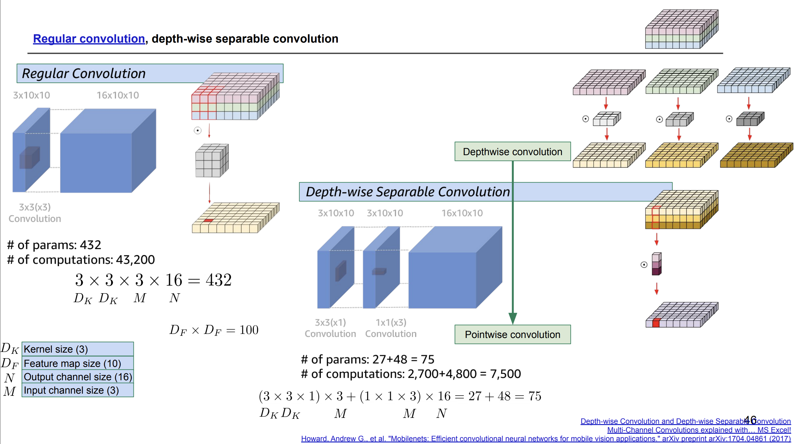
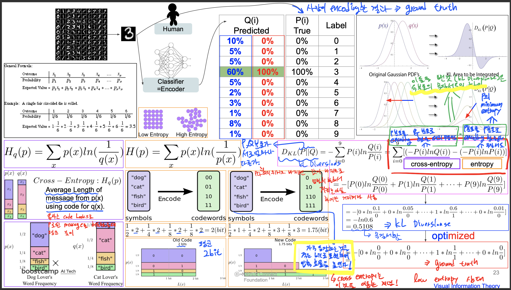
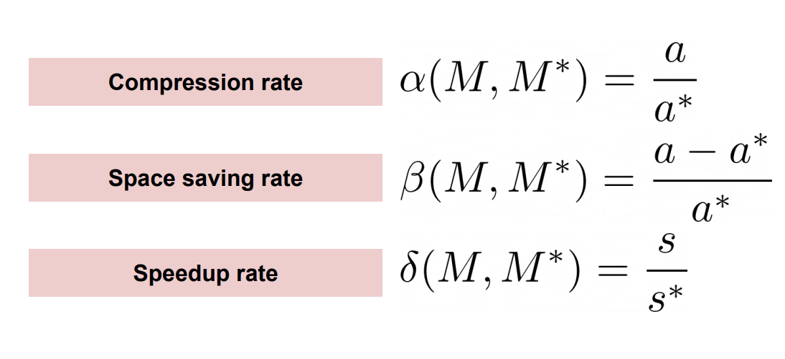
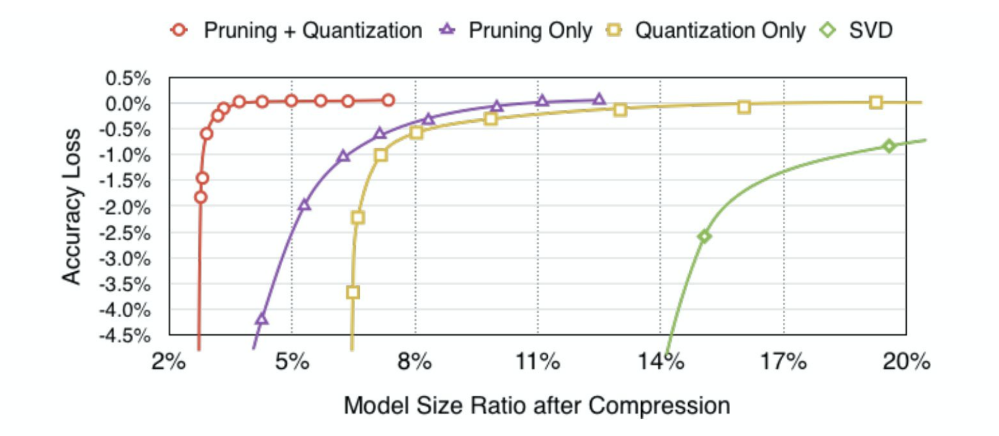

# Day 37 - 모델의 시공간, 알뜰히

## 모델의 시공간

* model이 하는 일은 high entropy 상태를 low entropy 상태로 되돌리는 것 (ex - 섞여있는 고양이, 개 사진을 종류별로 분류한다)
* KL Diversions와 Cross Entropy가 여기에 기반을 두고있다

### parameter search

* model의 적절한 parameter를 찾아가는 과정이 바로 model을 학습시키는 것

### hyper parameter search

* hyperparemeter를 바꿀 때마다 model이 바뀐다
* 수많은 hyperparameter들을 이리 저리 조합해보며 가장 성능이 좋은 hyperparateter set을 찾아내는 데는(hyperparameter search) 비용이 매우 많이 든다

#### Manual search

* 가장 직관적인 방법
* 대충 맞다 싶으면 search 종료

#### Grid search

* 균등하게 grid 형태로 hyperparameter를 변화시키며 search
* grid 사이에 최고점이 존재한다면 찾아내지 못함
* 불필요한 연산을 많이 수행함

#### Random Search

* 탐색 대상 구간 내에서 hyperparameter 값들을 임의로 선정함
* grid 사이의 값들도 찾아낼 수 있음
* 불필요한 연산은 grid search보다 적음. 하지만 여전히 존재
* Gaussian Precess로 최적의 hyperparameter 탐색

### Neural Architecture Search (NAS)

* 어떤 architecture를 사용할 지 탐색
* 성능 향상만이 목적이 아니라면 Model Compression이 된다
* 자동으로 model의 구조 등을 변경해가며 search

### NAS for edge devices

* MnasNet - model을 edge device에서 돌려보며 training
* PLOXYLESSNET - 사람이 설계한 model보다 NAS로 설계한 model의 성능이 더 좋음을 보인 paper
* ONCE-FOR-ALL - 학습된 ONCE-FOR-ALL Network을 retrain 없이 여러 edge device에서 사용.  
필요한 경우 다음의 순서로 model을 compresison하여 edge device에 올림
  1. resolution 줄임
  2. kernel size 줄임
  3. depth 줄임
  4. width 줄임

### regular convolution vs depth-wise separable convolution

* regular convolution에서 연산량과 parameter 수를 줄이기 위해 나온 방법이 depth-wise separable convolution

    

* depth-wise convolution은 각 채널에 동일한 filter를 적용해 feature map을 channel 개수만큼 만든 뒤 point-wise convolution을 통해 각 채널별 feature map에서 같은 위치의 성분들끼리 가중합 연산을 하여 다시 channel 1개의 feature map을 만든다
* depth-wise convolution에서 각 channel에 동일한 filter 하나를 이용해 convolution 연산을 하는 것이 parameter 수와 연산량을 줄이는데 핵심이 되는 부분이다
* depth-wise convolution은 regular convolution에 비해 parameter 수와 연산량이 적지만 비슷한 형태의 연산을 수행하기 때문에 accuracy는 regular convolution과 비슷하게 유지할 수 있다

## 알뜰히

### 압축

* 비손실 압축
  * 압축된 것을 다시 원본 상태로 되돌릴 수 있는 압축
  * ex - zip, wav, flac, png 등

* 손실 압축
  * 압축한 뒤 다시 원본으로 되돌릴 수 없는 경우
  * ex - jpg, mp3, mp4 등

* Huffman coding
  * 많이 등장하는 문자는 적은 bit로 압축하여 표현한다 (효율적, entropy)

### 부호

* coding = 부호화
* 원본을 encoding하여 부호화 된 형태로 표현
* 다시 decoding하면 원본으로 되돌릴 수 있음
* ML model도 encoding을 하는 기계임
  * input을 특정 vector 공간의 한 점으로 encoding하여 결과로 내보냄

### 부호화

* entropy란?

    

### 압축률

* 압축률은 다음과 같이 계산함

    

* model을 compression했을 때 compression rate가 높은 layer는 redundant한 parameter가 많이 포함되어 있던 layer였음을 추측해볼 수 있음

    

* 위 그래프를 보면 pruning과 quantization을 함께 사용했을 때 압축률 대비 성능이 가장 좋은 것을 확인할 수 있음