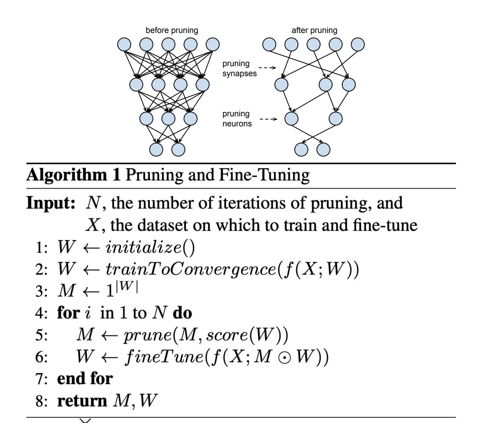
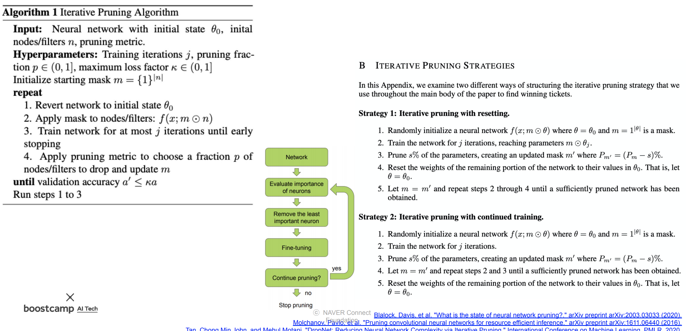

# Day 38 - 빠르게, 가지치기

## 빠르게

### Acceleration

* compression이 model에서 불필요한 부분들을 잘라내 model의 크기를 줄여 연산을 빠르게 하는 것이라면, acceleration은 연산 자체를 수행하는 속도를 빠르게 만드는 것
* 연산을 빠르게 처리하려면 software보다는 hardware 단에서 효율적인 처리가 필요함 (GPU를 이용한 병렬처리 등)
* software를 hardware에 맞춰 설계하면 더 좋은 성능을 낼 수 있다 (hardware-software co-design)
  
### deep learning compiler

* LLVM은 여러 언어와, 여러 플랫폼 사이의 통합된 중간언어를 이용해 필요한 컴파일러의 수를 줄여주는 개념
* MLIR은 LLVM 개념을 ML에 가져온 것 (sub-project of LLVM)
* 다른 컴파일 과정과 마찬가지로 Deep Learning 컴파일 과정에서도 여러가지 최적화가 이루어진다

    

## 가지치기 (Pruning)

### Pruning이란?

* 덜 중요한 parameter를 잘라내는 방식으로(가지치기) model을 경량화 한다
* parameter의 중요도를 판단할 때는 weighted sum을 사용한다
* pruning을 하면 inference speed가 빨라지고, 일반화 성능도 더 좋아질 수 있다
* 하지만 과도하게 pruning을 하는 경우 정보를 너무 많이 잃어 성능이 크게 떨어질 수 있다

    

    pruning algorithm

### Pruning의 종류

* pruning에도 여러 종류가 있음

    

    

#### Unstructured Pruning

* tensor의 특정 성분(보통 가장 끼치는 영향(weighted sum)이 적은 성분을 선택)만 0으로 만드는 방법
* 이 경우 GPU를 이용해 연산할 때는 Pruning을 통한 성능 향상을 얻지 못할수도 있음 (행렬 하나를 통째로 병렬처리하여 연산하기 떄문에)
* weighted sum이 가장 작은 element부터 하나씩 골라 pruning 한다는 점에서 structured pruning보다 더 좋은 성능을 기대할 수 있음

#### Structured Pruning

* 특정 channel, filter 등을 선택해 통째로 날려버리는 방법
* 이 경우 inference 시 행렬 하나에 대한 연산이 통째로 사라져버리기 떄문에 확실하게 inference speed 속도 향상을 기대할 수 있음
* 다만 비교적 중요한 가중치도 같이 pruning되기 떄문에 unstructured pruning보다는 정확도가 조금 떨어질 수 있음

#### Iterative Pruning

* Pruning을 할 떄는 fine tuning을 통해 다시 accuracy를 높여주는 작업이 필요함
* 하지만 fine tuning을 이용해 accuracy를 올리는 데는 한계치가 있음
* pruning을 했을 때 이 한계치보다 더 많이 accuracy가 떨어지도록 pruning을 하면 fine tuning을 해도 accuracy가 회복되지 않음
* 따라서 조금씩 pruning하고, fine tuning하여 다시 accuracy를 올리는 형식으로 iterative pruning을 해야 함

    

    

    iterative pruning 알고리즘

