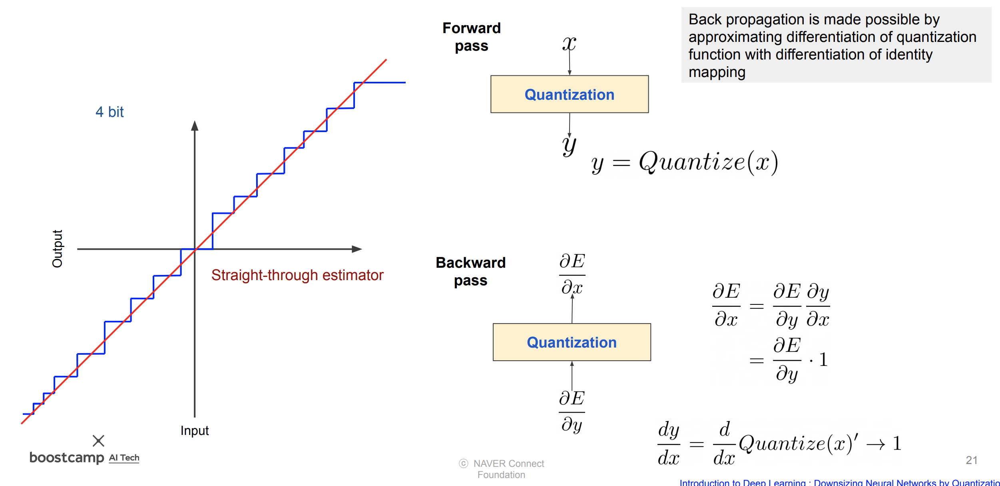
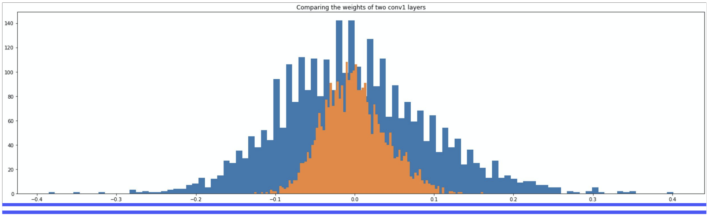
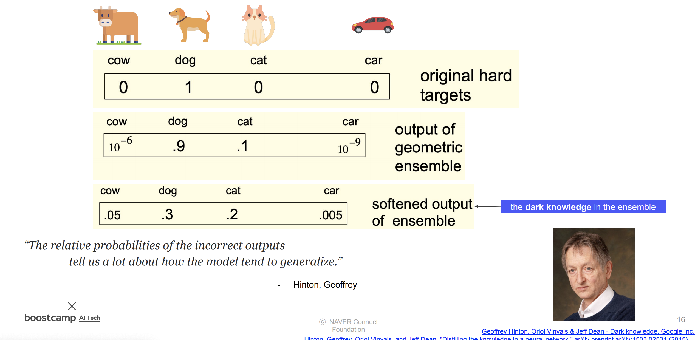
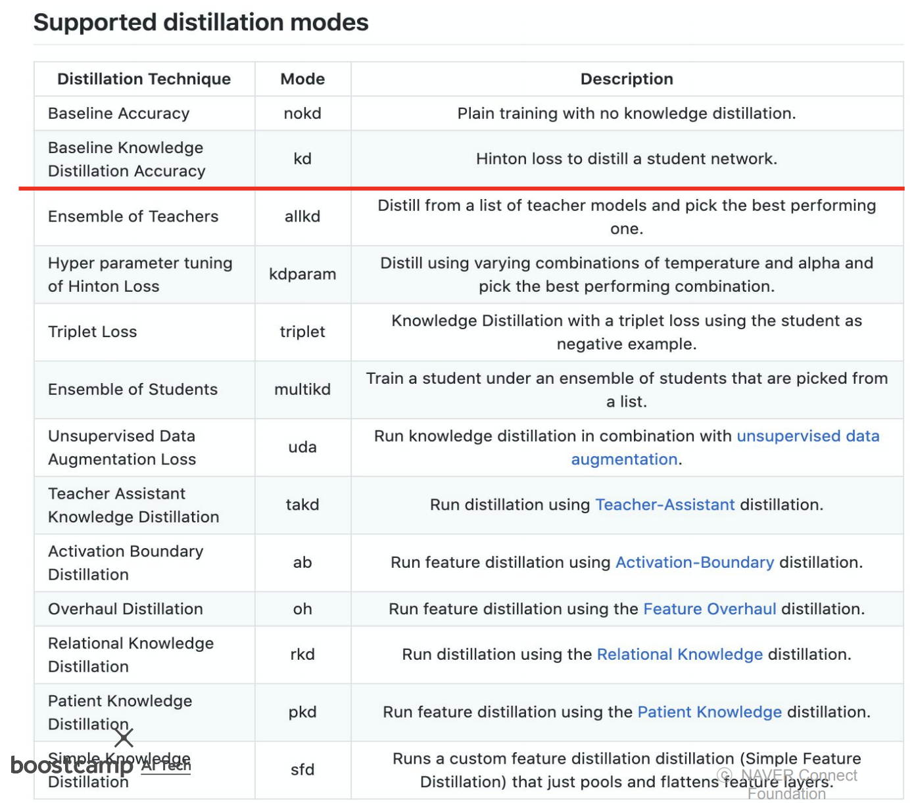

# Day 39 - 양자화, 지식 증류

## 양자화 (Quantization)

### 양자화란?

* float type의 parameter를 int8 등의 type으로 변환
* 특정 범위의 실수 값들을 다른 범위의 int 값들로 변환함 (정밀도를 낮추고, 낮은 bandwidth로도 빠르게 처리할 수 있도록)
* 연산 후에는 int값들을 다시 float 값으로 복원시킴
* 이 과정에서 조금의 data 손실이 발생함
* reduction in memory bandwidth requirements
* quantization is primarily a technique to speed up inference

    

### 양자화의 종류

* 양자화에도 여러 종류가 있음

    

* static/post training은 floating point model로 training한 후에 quantization은 하는 방법. parameter size가 큰 model에서는 accuracy 하락 폭이 작지만, parameter size가 작은 model에는 적합하지 않다 (이 경우에 quantization aware training)
* dynamic quantization은 inference 할 때만 잠시 quantize 됐다가 다시 원래대로 돌아감
* quantization-aware training은 quantization 한 상태로 training 하는 방법임. quantization되어 틀어진 결과를 미리 고려하여 학습을 진행하게 됨.

    

* quantization 된 상태를 고려하여 학습하는 quantization aware training이 accuracy가 더 높음 (다른 방법들에 비해  true model에 더 가까움)

    

* activation을 quantization 하면 미분을 못하기 때문에, quantization 하기 전의 값을 이용하는 방식으로 backward를 진행함

    

* 위 사진은 toy code 실행 결과임. 주황색이 quantization 이전의 parameter 값의 분포, 파란색이 quantization 이후의 분포임. 이와 같이 값들의 분포가 어느정도 유지되는 선에서 값을 float -> int8 로 변경하고, 값의 범위를 변경하는 것임. 이 과정에서 정밀도가 떨어지게 됨.

## 지식 증류

* 이전 주제들에서도 나왔던 teacher-student model이 knowledge distillation에 해당함
* teacher를 통해 학습하면, student 혼자 학습했을 때보다 accuracy가 더 높음

    

* student-teacher 사이의 loss와 student-ground truth 사이의 loss를 함께 고려하여 학습을 진행함
* 이 때 soft label 이라는 것을 사용함 (softmax(T = t))

    

* soft label을 사용하면 각 label 사이의 관계도 고려할 수 있음. 예를 들어 위 사진의 제일 아래쪽의 label을 보면 정답인 dog가 0.3 으로 가장 큰 값을 갖고, dog과 가장 유사한 cat이 0.2로 그 다음으로 큰 값을 가짐. 같은 동물이라는 관련성이 있는 cow는 0.05의 값을 갖고, 아예 관계가 없다고 볼 수 있는 car는 0.005의 매우 작은 값을 갖게 됨.
* 이렇게 각 label 사이의 관계를 학습함으로서 accuracy를 높일 수 있음

    

* 위의 방법 외에도 여러가지 distillation 방법들이 존재함
